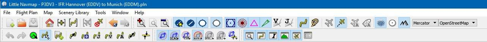
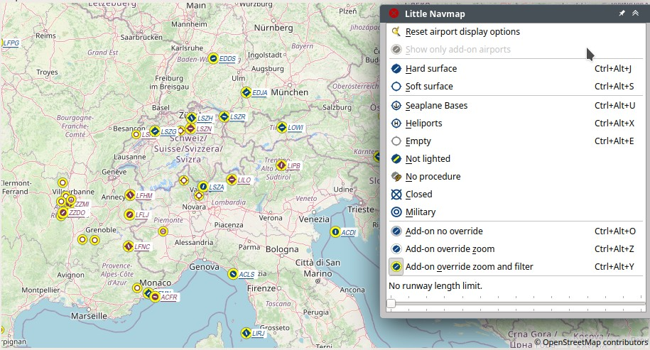
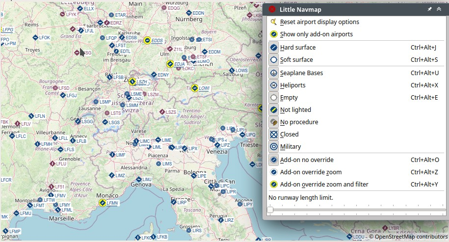
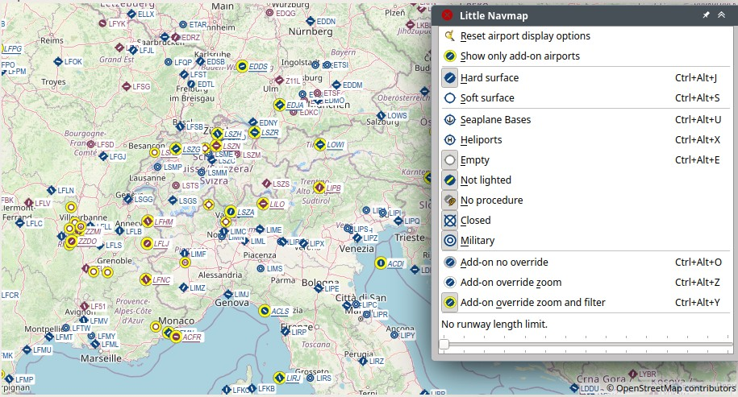
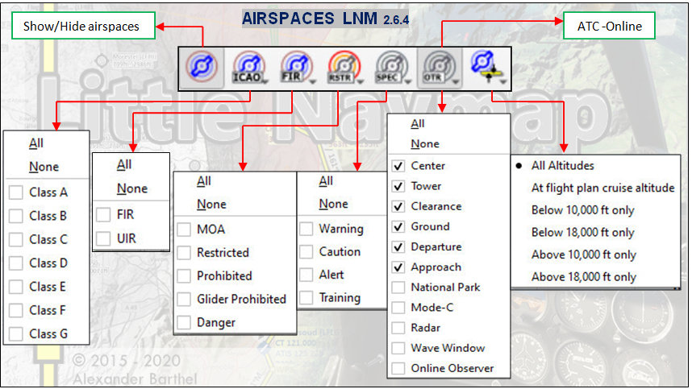
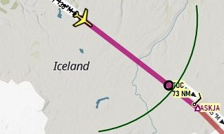
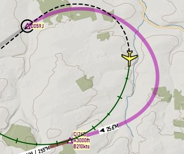
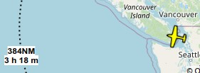
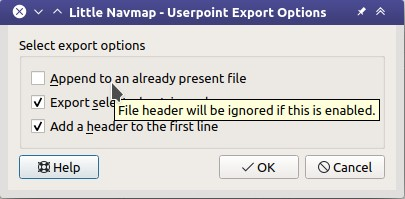
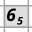

Main Menu and Toolbars
----------------------------

This chapter describes all the menu items of *Little Navmap*. You will
find some of this functionality on the toolbars as well which are not be
described separately. Keyboard shortcuts can be seen on the menu items.
See :doc:`SHORTCUTS` for a complete list.

All toolbar buttons have an equivalent function in the menu.

Drop down menus in the toolbar can be torn off by clicking on the dashed line on top of them. See
:ref:`tear-off-menu` for more information.

       Menu and toolbars docked in default positions. Screenshot based on *Little Navmap* 2.6.

.. tip::

   Look at the left side of this online user manual to see all the menus and menu items in a tree structure.

.. =======================================================================================================================
.. =======================================================================================================================
.. =======================================================================================================================

File Menu
~~~~~~~~~

.. _new-flight-plan:

|New Flight Plan| New Flight Plan
^^^^^^^^^^^^^^^^^^^^^^^^^^^^^^^^^

Clears the current flight plan and shows the flight plan table.

You have to use :ref:`search-result-table-view-context-menu`,
:ref:`map-context-menu` or
:doc:`ROUTEDESCR` dialog to create a new flight plan.

.. note::

      You can exit *Little Navmap* without saving the current plan. All will be restored on next startup.
      See :ref:`load-last-flight-plan` for more information and how to disable this behavior.

.. _open-flight-plan:

|Open Flight Plan| Open Flight Plan
^^^^^^^^^^^^^^^^^^^^^^^^^^^^^^^^^^^

Opens a flight plan with one of the following formats:

-  LNMPLN. This is the default format of *Little Navmap* which supports all flight plan features like remarks.
   See :ref:`flight-plan-formats-lnmpln` for information about this format.
-  PLN: FSX, FS9, FSC or MSFS.
-  FLP
-  FMS: X-Plane FMS 11 (used by X-Plane 11 and X-Plane 12) or FMS 3
-  FlightGear FGFP
-  Garmin FPL and GFP

The file type is determined by content and not file extension. See :doc:`FLIGHTPLANFMT` for more information.

An opened flight plan file will be reloaded on start up (reload and centering can be switched off
in the options dialog on page :ref:`options-startup-and-updates` and :ref:`user-interface`).

You can also drag and drop files from a file manager like Windows
Explorer or macOS Finder into the *Little Navmap* main window to load
them. Single flight plan files of all allowed formats as well as aircraft performance files
are accepted.

*Little Navmap* has to guess or correct the cruise altitude if it is invalid or cannot be read from the flight plan.
This is needed to avoid restriction violations and resulting error messages in the :ref:`flight-plan-table-err-footer`.

You will see a notification dialog if this is the case. Adjust the cruise altitude manually if needed (:ref:`flight-plan-altitude`).

This correction applies to all plans
which are loaded manually by an user. The change is stored in the undo/redo stack and can be
undone to revert to the previously invalid cruise altitude.
The corrected altitude depends on plan type (IFR or VFR), used procedures and used airways.

.. note::

    Keep in mind that most flight plan formats are limited and not all information is provided or can be
    loaded from a file. For example, cruise altitude might not be loaded from X-Plane FMS in some
    cases, airways and departure parking spots cannot restored for several formats, transitions cannot
    be loaded from MSFS PLN and more.

.. important::

    Always save a copy of the flight plan in LNMPLN format to be able to
    reload all information. Exporting to and reading from other formats like
    X-Plane FMS might result in information loss.

.. _append-flight-plan:

|Append flight plan| Append Flight Plan
^^^^^^^^^^^^^^^^^^^^^^^^^^^^^^^^^^^^^^^

Adds departure, destination and all waypoints to the current flight
plan.

Using ``Append Flight Plan`` allows to load or merge complete flight
plans or flight plan snippets into a new plan. All waypoints are added
at the end of the current flight plan. Then you can use the
``Delete selected Legs`` and ``Move selected Legs up/down`` context menu
items to arrange the waypoints and airports as required. See :ref:`flight-plan-table-view-context-menu`.

All current arrival procedures will be removed when appending a flight plan. The
new flight plan will use arrival and approach procedures from the loaded
plan, if any are present.

The appended legs are selected after loading the flight plan.

.. _recent-flight-plan:

Recent Flight Plans
^^^^^^^^^^^^^^^^^^^^^^^^^^^^^

Shows all recently loaded flight plans for quick access. You can clear
the list by selecting ``Clear Menu``.

*Little Navmap* will show an error message if you try to load a deleted file.

.. _save-flight-plan:

|Save Flight Plan| Save Flight Plan
^^^^^^^^^^^^^^^^^^^^^^^^^^^^^^^^^^^

Saves the flight plan into the current LNMPLN file. This format allows to store all flight plan attributes of *Little
Navmap*. Disabled if no flight plan has been loaded or created.

*Little Navmap* opens the ``Save as`` dialog (see below :ref:`save-flight-plan-as`) if departure,
destination or any other value used in the flight plan name has changed. This helps to avoid
overwriting LNMPLN files with wrong plans after reversing direction, for example.

You can disable this behavior in the options dialog on page :ref:`options-files` by deselecting
``Avoid overwriting Flight Plan with not matching departure and destination``.

.. tip::

    Enable the export option ``Little Navmap native flight plan format`` in the :ref:`multiexport-options` and adapt the export path.
    Then use ``Files`` -> :ref:`multiexport-flight-plan` to save your flight plan and all selected export formats with one click.
    See :ref:`multiexport-export-lnmpln` for more information.

.. note::

      *Little Navmap* will not ask to save the file on exit but will instead save the changes to a temporary file.
      The changes will be restored on next startup.
      See :ref:`load-last-flight-plan` for more information and how to disable this behavior.

.. _save-flight-plan-as:

|Save Flight Plan as LNMPLN| Save Flight Plan as LNMPLN
^^^^^^^^^^^^^^^^^^^^^^^^^^^^^^^^^^^^^^^^^^^^^^^^^^^^^^^^^^^

Saves the flight plan to a LNMPLN file. This format allows to save all flight plan attributes of *Little
Navmap*. Disabled if no flight plan has been loaded or created.

See :ref:`flight-plan-formats-lnmpln` for information about this format.

``Save Flight Plan as PLN`` changes the current file name in
*Little Navmap* which means that all further saves will go into the new
LNMPLN file.

*Little Navmap* proposes a new file name based on the pattern set in options on page :ref:`options-files`.

.. tip::

   You can save the flight plan files in any place. I recommend a directory in ``Documents`` like
   ``Documents\Little Navmap\Flight Plans``.

   You can also use the directory which is suggested by the dialog window :doc:`FOLDERS`.

.. important::

   Always save a copy of the flight plan in the default LNMPLN format to be
   able to reload all information. Writing to and reading from other
   formats like X-Plane FMS might result in information loss.
   See :doc:`FLIGHTPLANFMT` for more information.

.. _reset-for-new-flight:

|Reset all for a new Flight| Reset all for a new Flight
^^^^^^^^^^^^^^^^^^^^^^^^^^^^^^^^^^^^^^^^^^^^^^^^^^^^^^^^

Opens a dialog which allows to reset functions in *Little Navmap* for a
new flight. See :doc:`RESET` for more information.

.. _export-msfs-flight-plan:

|Export as PLN| Export Flight Plan as MSFS 2020 PLN
^^^^^^^^^^^^^^^^^^^^^^^^^^^^^^^^^^^^^^^^^^^^^^^^^^^^

Saves a flight plan for Microsoft Flight Simulator 2020. Disabled if no flight plan has been loaded or created.

*Little Navmap* can read and write this format.

This does not change the current file name and type. Further saves will still use the same LNMPLN file name and format as before.

The proposed file name can be defined in the :ref:`multiexport-options` for format ``Microsoft Flight Simulator 2020``.

MSFS flight plans can be saved to and loaded from any location but the default directories are:

- Microsoft Store installation: ``C:\Users\YOURLOGINNAME\AppData\Local\Packages\Microsoft.FlightSimulator_8wekyb3d8bbwe\LocalState``
- Steam installation: ``C:\Users\YOURLOGINNAME\AppData\Roaming\Microsoft Flight Simulator\LocalState``

See also :doc:`FLIGHTPLANFMT` and :ref:`flight-plan-formats-msfs-pln`.

.. _export-p3d-fsx-flight-plan:

|Export as PLN| Export Flight Plan as P3D or FSX PLN
^^^^^^^^^^^^^^^^^^^^^^^^^^^^^^^^^^^^^^^^^^^^^^^^^^^^^^

Saves a flight plan for FSX or Prepar3D. Disabled if no flight plan has been loaded or created.

*Little Navmap* can read and write this format.

This does not change the current file name and type. Further saves will still use the same LNMPLN file name and format as before.

The proposed file name can be defined in the :ref:`multiexport-options` for format ``FSX and Prepar3D``.

See also :doc:`FLIGHTPLANFMT`.

.. _save-flight-plan-as-fms11:

|Export Flight Plan as X-Plane FMS 11| Export Flight Plan as FMS for X-Plane 11 and 12
^^^^^^^^^^^^^^^^^^^^^^^^^^^^^^^^^^^^^^^^^^^^^^^^^^^^^^^^^^^^^^^^^^^^^^^^^^^^^^^^^^^^^^^^^^^^

Saves the flight plan using the new X-Plane FMS 11 format which is usable in X-Plane 11 and X-Plane 12. Disabled if no flight plan has been loaded or created.

*Little Navmap* can read and write this format.

See :doc:`FLIGHTPLANFMT` for more information on limitations.

This does not change the current file name and type. Further saves will still use the same file name and format as before.

The proposed file name can be defined in the :ref:`multiexport-options` for formats ``X-Plane 11``.
Note that the two export format entries for X-Plane 11 and 12 use the same file format but a different directory.

.. include:: include/LOADFMSTIP.rst

.. _save-flight-plan-as-fgfp:

|Save Flight Plan as FlightGear FGFP| Export Flight Plan as FlightGear FGFP
^^^^^^^^^^^^^^^^^^^^^^^^^^^^^^^^^^^^^^^^^^^^^^^^^^^^^^^^^^^^^^^^^^^^^^^^^^^^^

A flight plan format which can be loaded into the RouteManager of the free
flight simulator `FlightGear <http://www.flightgear.org>`__. Disabled if no flight plan has been loaded or created.

*Little Navmap* can read and write this format.

See :doc:`FLIGHTPLANFMT` for more information on limitations.

This does not change the current file
name and type. Further saves will still use the same file name and
format as before.

You can save the files into any directory and load it within FlightGear.

The proposed file name can be defined in the :ref:`multiexport-options` for format ``FlightGear``.

.. _open-from-simbrief:

Open Flight Plan from SimBrief
^^^^^^^^^^^^^^^^^^^^^^^^^^^^^^^^^^^^^^^^^^^^^^^^^^^^^^^^^^^^^^^^^^^^^^^^^^^^^

Opens a dialog that allows to import a flight plan from `SimBrief <https://www.simbrief.com/>`__.

See :doc:`LOADSIMBRIEF` for more information.

.. _export-to-simbrief:

Export Flight Plan to SimBrief
^^^^^^^^^^^^^^^^^^^^^^^^^^^^^^^^^^^^^^^^^^^^^^^^^^^^^^^^^^^^^^^^^^^^^^^^^^^^^

Opens a dialog that allows to export a flight plan to
`SimBrief <https://www.simbrief.com/>`__. Disabled if no flight plan has been loaded or created.

See :doc:`SENDSIMBRIEF` for more information.

.. _menu-gpx:

GPX Exchange Format (GPX)
^^^^^^^^^^^^^^^^^^^^^^^^^^^^^^^^^^^^^^^^^^^^^^^^^^^^^^^^^^^^^^^^^^^^^^^^^^^^^

This sub-menu allows to load and save the flow trail of the user aircraft.
See :doc:`AIRCRAFTTRAIL` for more information.

.. _load-gpx:

Load Aircraft Trail from GPX
'''''''''''''''''''''''''''''''

Loads and replaces the current aircraft trail after asking the user. Routes in the GPX file are ignored.
GPX track is centered after loading if enabled in options on page :ref:`options-files`.
See :doc:`AIRCRAFTTRAIL` for more information.

.. _append-gpx:

Append Aircraft Trail from GPX
'''''''''''''''''''''''''''''''

Loads and appends to the current aircraft trail. Routes in the GPX file are ignored.
GPX track is centered after loading if enabled in options on page :ref:`options-files`.
See :doc:`AIRCRAFTTRAIL` for more information.

.. _export-gpx:
.. _export-flight-plan-as-gpx:

Export Flight Plan and Trail as GPX
''''''''''''''''''''''''''''''''''''

Exports the current flight plan into a GPS Exchange Format file which
can be read by Google Earth and most other GIS applications. Disabled if no flight plan has been loaded or created.

The flight plan is exported as a route and the flown aircraft trail as a
track including simulator time and altitude.

The route has departure and destination elevation and cruise altitude
set for all waypoints. Waypoints of all procedures are included in the
exported file. Note that the waypoints will not allow to reproduce all
parts of a procedure like holds or procedure turns.

See :doc:`AIRCRAFTTRAIL` for more information.

.. note::

   Do not forget to clear the aircraft trail (:ref:`delete-aircraft-trail` or :ref:`reset-for-new-flight`)
   before a flight to avoid
   old trail segments in the exported GPX file. Or, disable the reloading
   of the trail in the options dialog on page :ref:`options-startup-and-updates`.

Export Flight Plan to Other Formats
^^^^^^^^^^^^^^^^^^^^^^^^^^^^^^^^^^^^^^^^^^^^^^^^^^^^^^^^^^^^^^^^^^^^^^^^^^^^^

.. _export-flight-plan-as-skyvector:

Show Flight Plan in SkyVector
'''''''''''''''''''''''''''''''

Opens the default web browser and shows the current flight plan in
`SkyVector <https://skyvector.com>`__. Procedures are not shown. Disabled if no flight plan has been loaded or created.

Note that the flight plan will not be shown if a small airport is
unknown to SkyVector.

Example: `ESMS NEXI2B NILEN L617 ULMUG M609 TUTBI Z101 GUBAV STM7C
ENBO <https://skyvector.com/?fpl=ESMS%20NILEN%20L617%20ULMUG%20M609%20TUTBI%20Z101%20GUBAV%20ENBO>`__.
Note missing SID and STAR in SkyVector.

.. _export-flight-plan-as-html:

Export Flight Plan as HTML Page
'''''''''''''''''''''''''''''''

Saves the flight plan table as shown to HTML file which can be viewed in
a web browser. Icons are embedded in the page. Disabled if no flight plan has been loaded or created.

The exported file will reflect changes of the flight plan table view like
column order. Columns which are hidden or shrunk to minimum width are excluded.

.. _flight-plan-export-vpilot:

Export Flight Plan for vPilot, xPilot or SWIFT
''''''''''''''''''''''''''''''''''''''''''''''''''''''

Export the flight plan for the VATSIM vPilot online network
client. Disabled if no flight plan has been loaded or created.

:doc:`ROUTEEXPORT` will appear before where you can add all needed information.

.. _flight-plan-export-ivap:

Export Flight Plan as IvAp FPL
''''''''''''''''''''''''''''''

.. _flight-plan-export-xivap:

Export Flight Plan as X-IvAp FPL
''''''''''''''''''''''''''''''''

Export flight plan format for IVAO online network clients `IvAp or
X-IvAp <https://www.ivao.aero/softdev/ivap.asp>`__. Disabled if no flight plan has been loaded or created.

:doc:`ROUTEEXPORT` will appear
before where you can add all needed information.

Export Options
^^^^^^^^^^^^^^^^^^^^^^^^^^^^^^^^^

Sub-menu with several actions that affect export to most flight plan formats. This does not affect the saving
of flight plans into the LNMPLN format.

.. warning::

      Note that saving flight plans with one or more of these methods has limitations:

      -  Several approach leg types like holds, turns and procedure turns
         cannot be displayed properly by using just waypoints or coordinates.
      -  Speed and altitude limitations are not included in the exported legs.

      **Normally you should not use these export options.**

See :ref:`convert-to-waypoints` for information about converting procedures to a list of waypoints in the flight plan.

.. _export-flight-plan-approach-waypoints:

Export Waypoints for Approaches
'''''''''''''''''''''''''''''''''''''''

Save procedure waypoints instead of procedure information if checked.
This affects all flight plan export formats except the native LNMPLN format.

Use this if your simulator, GPS or FMC does not support loading or
display of approach procedures, SID or STAR.

Procedure information is replaced with respective waypoints that allow
to display procedures in limited GPS or FMS units.

.. _export-flight-plan-sid-star-waypoints:

Export Waypoints for SID and STAR
'''''''''''''''''''''''''''''''''''''''

As above :ref:`export-flight-plan-approach-waypoints` but only for SID and STAR procedures.

.. _export-flight-plan-airway-waypoints:

Export Waypoints for Airways
'''''''''''''''''''''''''''''''''''''''

Enabling this function will omit all airway information in the exported flight plan formats.
A chain of waypoints will be exported instead of waypoint/airway/waypoint triplets.

.. _multiexport-flight-plan:

|Multiexport Flight Plan| Multiexport Flight Plan
^^^^^^^^^^^^^^^^^^^^^^^^^^^^^^^^^^^^^^^^^^^^^^^^^^

Exports all selected flight plan formats at once. You have to configure paths and select formats
for exporting before by selecting :ref:`multiexport-flight-plan-options` below. Also disabled if no flight plan has been loaded or created.

Disabled if no flight plan format is selected for export.

See :doc:`ROUTEEXPORTALL` for details.

.. _multiexport-flight-plan-options:

|Multiexport Flight Plan Options| Multiexport Flight Plan Options
^^^^^^^^^^^^^^^^^^^^^^^^^^^^^^^^^^^^^^^^^^^^^^^^^^^^^^^^^^^^^^^^^^^^^^^^^

Opens a dialog which allows to configure paths and select formats
for flight plan exports with the :ref:`multiexport-flight-plan` function above.

See :doc:`ROUTEEXPORTALL` for details.

.. note::

    Note that the multiexport dialog window is also used to define default file names for the export options
    :ref:`export-msfs-flight-plan`,  :ref:`export-p3d-fsx-flight-plan`,  :ref:`save-flight-plan-as-fms11` and :ref:`save-flight-plan-as-fgfp`.

.. _add-google-earth-kml:

|Add Google Earth KML| Add Google Earth KML
^^^^^^^^^^^^^^^^^^^^^^^^^^^^^^^^^^^^^^^^^^^

Allows addition of one or more Google Earth KML or KMZ files to the map
display. All added KML or KMZ files will be reloaded on start up. Reload
and centering can be switched off in the options dialog on
pages :ref:`options-startup-and-updates` and :ref:`options-files`.

Due to the variety of KML files it is not guaranteed that all files will
show up properly on the map.

Use GPX instead of KML to import a trail into *Little Navmap*. You can convert the KML to
GPX using one of the numerous online tools or Google Earth.

.. _clear-google-earth-kml-from-map:

|Clear Google Earth KML from Map| Clear Google Earth KML from Map
^^^^^^^^^^^^^^^^^^^^^^^^^^^^^^^^^^^^^^^^^^^^^^^^^^^^^^^^^^^^^^^^^

Removes all loaded KML files from the map.

.. _save-map-as-image:

|Save Map as Image| Save Map as Image
^^^^^^^^^^^^^^^^^^^^^^^^^^^^^^^^^^^^^^

Saves the current map view as an image file. Allowed formats are JPEG,
PNG and BMP. The image does not include the map overlays.

:doc:`IMAGEEXPORT` will show up before saving which allows to select the image size.

.. _save-map-as-avitab:

|Save Map as Image for AviTab| Save Map as Image for AviTab
^^^^^^^^^^^^^^^^^^^^^^^^^^^^^^^^^^^^^^^^^^^^^^^^^^^^^^^^^^^^^

Saves the current map view as an image file for
`AviTab <https://github.com/fpw/avitab>`__. Allowed formats are JPEG and
PNG.

:doc:`IMAGEEXPORT` will show up before saving which allows to select the image size.

The saved file is accompanied by a calibration file in
`JSON-Format <https://en.wikipedia.org/wiki/JSON>`__. It
has the same name as the image with an additional ``.json`` extension.

The files have to be saved to
``.../X-Plane 11/Resources/plugins/AviTab/MapTiles/Mercator`` or
``.../X-Plane 12/Resources/plugins/AviTab/MapTiles/Mercator``.

See here in the AviTab documentation for more information how to load
the map image: `Map App -
Mercator <https://github.com/fpw/avitab/wiki/Map-App#mercator>`__.

.. _save-map-to-clipboard:

Copy Map Image to Clipboard
^^^^^^^^^^^^^^^^^^^^^^^^^^^^^^^^^^^^^^^^^^^^^^^^^^^^^^^^^^^^^

Copies the current map image to the clipboard. The image does not
include the map overlays.

:doc:`IMAGEEXPORT` will show up before copying the image which allows to select the image size.

.. _print-map:

|Print Map| Print Map
^^^^^^^^^^^^^^^^^^^^^^^^^^^^^^^^^^^^^^^^^^^^^^^^^^^^^^^^^^^^^

Allows to print the current map view. See :ref:`printing-the-map` for more information.

.. _print-flight-plan:

|Print Flight Plan| Print Flight Plan
^^^^^^^^^^^^^^^^^^^^^^^^^^^^^^^^^^^^^^^^^^^^^^^^^^^^^^^^^^^^^

Opens a print dialog that allows you to select flight plan related
information to be printed. See :ref:`printing-the-flight-plan` for more information.

.. _file-quit:

|Quit| Quit
^^^^^^^^^^^^^^^^^^^^^^^^^^^^^^^^^^^^^^^^^^^^^^^^^^^^^^^^^^^^^

Exits the application. Will ask for confirmation if there are unsaved files.

.. =======================================================================================================================
.. =======================================================================================================================
.. =======================================================================================================================

Flight Plan Menu
~~~~~~~~~~~~~~~~

Flight Plan
^^^^^^^^^^^

Opens and raises the flight planning dock window and flight plan tab.
Also activates the flight plan table for quick navigation. Same as
``Window`` -> ``Shortcuts`` -> ``Flight Plan`` or pressing ``F7``.

See :ref:`shortcuts-main-window` for
a full list or shortcuts.

Fuel Report
^^^^^^^^^^^

Opens and raises the flight planning dock window and Fuel Report tab.
Same as ``Window`` -> ``Shortcuts`` -> ``Fuel Report`` or pressing
``F8``.

See :ref:`shortcuts-main-window` for
a full list or shortcuts.

.. _undo-redo:

|Undo| |Redo| Undo and Redo
^^^^^^^^^^^^^^^^^^^^^^^^^^^^

Allows undo and redo of flight plan changes. The last action is shown in the menu item like ``Add Waypoint``, for example.
The undo information is cleared when restarting *Little Navmap*.

.. _select-a-start-position-for-departure:

|Select a Start Position for Departure| Select a Start Position
^^^^^^^^^^^^^^^^^^^^^^^^^^^^^^^^^^^^^^^^^^^^^^^^^^^^^^^^^^^^^^^^^^^^^^

Select a parking spot (airport center, gate, ramp, fuel box), a runway or a helipad as a start position at the departure airport. A parking
position can also be selected in the map context menu item :ref:`set-as-flight-plan-departure`
when right-clicking on the center of a parking position. If no position is selected
the airport center is automatically selected as a start position.

See :doc:`PARKINGPOSITION` for more information.

.. _select-departure-runway:

|Select Departure Runway| Select Departure Runway or Procedure
^^^^^^^^^^^^^^^^^^^^^^^^^^^^^^^^^^^^^^^^^^^^^^^^^^^^^^^^^^^^^^^^^^^^^^

Same as :ref:`set-departure-runway-map` in the map context menu. Only active if the current flight plan has a departure airport.
See more about this in chapter :doc:`CUSTOMPROCEDURE`.

The button ``Show Departure Procedures`` jumps directly to :doc:`SEARCHPROCS`
where you can view and select a SID.

.. _select-destination-runway:

|Select Destination Runway| Select Destination Runway or Procedures
^^^^^^^^^^^^^^^^^^^^^^^^^^^^^^^^^^^^^^^^^^^^^^^^^^^^^^^^^^^^^^^^^^^^^^

Same as :ref:`set-destination-runway-map` in the map context menu. Only active if the current flight plan has a departure airport.
See more about this in chapter :doc:`CUSTOMPROCEDURE`.

The button ``Show Arrival Procedures`` jumps directly to :doc:`SEARCHPROCS`
where you can view and select a STAR or an approach.

.. _edit-flight-plan-on-map:

|Edit Flight Plan on Map| Edit Flight Plan on Map
^^^^^^^^^^^^^^^^^^^^^^^^^^^^^^^^^^^^^^^^^^^^^^^^^

Toggles the flight plan click-and-drag edit mode on the map. See :doc:`MAPFPEDIT`.

.. _calculate-flight-plan:

|Calculate Flight Plan| Flight Plan Calculation
^^^^^^^^^^^^^^^^^^^^^^^^^^^^^^^^^^^^^^^^^^^^^^^^

Opens the flight plan calculation dialog window which allows to automatically generate a flight plan by various criteria.
The window is pulled into foreground if already open.

The altitude from the current flight plan is transferred to the calculation window but not vice versa.

See chapter :doc:`ROUTECALC` for more information.

.. _generate-random-flight:

|Generate Random Flight| Generate Random Flight
^^^^^^^^^^^^^^^^^^^^^^^^^^^^^^^^^^^^^^^^^^^^^^^^

Shows the airport search tab and enables the controls for the random flight generation from the airport search result.

See :doc:`RANDOM` for more information.

.. _calculate-direct:

|Calculate Direct| Calculate Direct
^^^^^^^^^^^^^^^^^^^^^^^^^^^^^^^^^^^

Deletes all intermediate waypoints and connects departure and
destination using a great circle line.

This function does not delete procedures from the current flight plan but will connect procedure exit and entry directly, if any.

.. tip::

    You can calculate a flight plan between any kind of waypoints, even
    user defined waypoints (right-click on the map and select
    :ref:`add-position-to-flight-plan` to create one). This allows the creation
    of snippets that can be merged into flight plans.

.. _reverse-flight-plan:

|Reverse Flight Plan| Reverse Flight Plan
^^^^^^^^^^^^^^^^^^^^^^^^^^^^^^^^^^^^^^^^^

Swaps departure and destination and reverses order of all intermediate
waypoints. The departure airport will be assigned as start position.

Procedures are removed by this function.

This function also removes all airway references since the result would not be valid
due to one-way restrictions.

.. _adjust-flight-plan-alt:

|Adjust Flight Plan Altitude| Adjust Flight Plan Altitude
^^^^^^^^^^^^^^^^^^^^^^^^^^^^^^^^^^^^^^^^^^^^^^^^^^^^^^^^^

Changes the flight plan altitude according to a simplified East/West
rule and the current route type (IFR or VFR). Rounds the altitude up to
the nearest even 1,000 ft (or meter) for westerly flight plans or odd
1,000 ft (or meter) for easterly flight plans. Adds 500 ft for VFR
flight plans.

The rule can be changed in the options on page :ref:`options-flight-plan`.

.. _new-flight-plan-from-description:

|New Flight Plan from Route Description| Flight Plan Route Description
^^^^^^^^^^^^^^^^^^^^^^^^^^^^^^^^^^^^^^^^^^^^^^^^^^^^^^^^^^^^^^^^^^^^^^^^^^^^^^^

Opens a dialog with the ATS route description of the current flight plan
that also allows to modify the current flight plan or enter a new one.

:doc:`ROUTEDESCR` gives more information about this topic.

.. _flight-plan-route-clipboard:

|Copy Flight Plan Route to Clipboard| Copy Flight Plan Route Description to the Clipboard
^^^^^^^^^^^^^^^^^^^^^^^^^^^^^^^^^^^^^^^^^^^^^^^^^^^^^^^^^^^^^^^^^^^^^^^^^^^^^^^^^^^^^^^^^^^^^^

Copies the route description of the current flight plan to the clipboard
using the current settings from :doc:`ROUTEDESCR`.

.. _download-tracks-startup:

Download Oceanic Tracks on Startup
^^^^^^^^^^^^^^^^^^^^^^^^^^^^^^^^^^^^^^^^^^^^^^^^^^^^^^^^^

Downloads tracks immediately and instructs *Little Navmap* download tracks on startup.

See :doc:`TRACKS` for more information.

.. _download-tracks:

|Download Tracks| Download Oceanic Tracks
^^^^^^^^^^^^^^^^^^^^^^^^^^^^^^^^^^^^^^^^^^^^^^^^^^^^^^^^^

Downloads Oceanic or other tracks which are NAT, PACOTS and AUSOTS.

Tracks are shown on the map and a message is shown in the :doc:`STATUSBAR` once the download is finished.

Tracks are removed when closing the program. Use the function ``Download Tracks on Startup``
above to always have tracks available.

See :doc:`TRACKS` for more information.

.. _delete-tracks:

Delete Oceanic Tracks
^^^^^^^^^^^^^^^^^^^^^^^^^^^^^^^^^^^^^^^^^^^^^^^^^^^^^^^^^

Remove downloaded Oceanic and other tracks from the track database.

.. _track-sources:

Track Sources
^^^^^^^^^^^^^^^^^^^^^^^^^^^^^^^^^^^^^^^^^^^^^^^^^^^^^^^^^

NAT
'''''''''''''''''''''''''''''''''''''''
PACOTS
'''''''''''''''''''''''''''''''''''''''
AUSOTS
'''''''''''''''''''''''''''''''''''''''

Allows to select the track systems to download. The download is triggered automatically after changing one of these options.

See :doc:`TRACKS` for more information.

.. =======================================================================================================================
.. =======================================================================================================================
.. =======================================================================================================================

.. _search-menu:

Search Menu
~~~~~~~~~~~~~~~~

This provides a shortcut to jump to the respective search window and tabs.
See :doc:`SEARCH` for more general information about airport, navaid and other search functions.

Airport Search and Navaid Search
^^^^^^^^^^^^^^^^^^^^^^^^^^^^^^^^^^^^^^^^^

See :doc:`SEARCH` for general information about these two search tabs.

Procedure Search
^^^^^^^^^^^^^^^^^^^^^

See :doc:`SEARCHPROCS` for more information about procedure search and display as well as
:doc:`APPROACHES` for general information about SID, STAR and approaches.

Userpoint Search
^^^^^^^^^^^^^^^^^^^^^

See :doc:`USERPOINT` for more information about userpoints.

Logbook Search
^^^^^^^^^^^^^^^^^^^^^

See :doc:`LOGBOOK` for more information about the logbook.

.. =======================================================================================================================
.. =======================================================================================================================
.. =======================================================================================================================

Map Menu
~~~~~~~~

.. _goto-home:

|Goto Home| Go to Home
^^^^^^^^^^^^^^^^^^^^^^^^

Shows the home area that was set using :ref:`set-home` in the sub-menu ``More`` in the map context menu.
It will show the map using the saved position and zoom distance. The center of the home area is highlighted by a |Home Symbol| symbol.

Note that the symbol is only an indicator for the home view center position and does not have any context menu or mouse actions attached.

The symbol cannot be hidden. Set it at a remote position if you like to hide it.

.. _goto-user-aircraft:

|Goto User Aircraft| Go to User Aircraft
^^^^^^^^^^^^^^^^^^^^^^^^^^^^^^^^^^^^^^^^^^

Moves and zooms the map to the user aircraft. Disabled if not connected to a simulator.

.. _center-flight-plan:

|Center Flight Plan| Center Flight Plan
^^^^^^^^^^^^^^^^^^^^^^^^^^^^^^^^^^^^^^^

Centers the whole flight plan on the map.

.. _go-to-center-for-distance-search:

|Go to Center for Distance Search| Go to Center for Distance Search
^^^^^^^^^^^^^^^^^^^^^^^^^^^^^^^^^^^^^^^^^^^^^^^^^^^^^^^^^^^^^^^^^^^

Go to the center point used for distance searches. See :ref:`set-center-for-distance-search`.The
center for the distance search is highlighted by a |Distance Search
Symbol| symbol.

The center symbol cannot be hidden. Set it at a remote position if you like to hide it.

.. _jump-coordinates:

|Jump to Coordinates| Jump to Coordinates
^^^^^^^^^^^^^^^^^^^^^^^^^^^^^^^^^^^^^^^^^^

Opens a dialog allowing to place the map at the given coordinates at the given zoom distance.

See :doc:`JUMPCOORDINATE` about the dialog and :doc:`COORDINATES` about the accepted formats.

.. _center-aircraft:

|Center Aircraft| Map follows User Aircraft
^^^^^^^^^^^^^^^^^^^^^^^^^^^^^^^^^^^^^^^^^^^^^^^^^^^^^^

Zooms to the user aircraft if connected to a flight simulator or *Little Navconnect* and keeps the aircraft centered on the map.

See :doc:`AIRCRAFTCENTER` for general information about aircraft centering while flying.

.. _delete-aircraft-trail:

|Delete Aircraft Trail| Delete User Aircraft Trail
^^^^^^^^^^^^^^^^^^^^^^^^^^^^^^^^^^^^^^^^^^^^^^^^^^^^

The global aircraft trail is saved and will be reloaded on program startup.

This menu item and toolbar button removes the user aircraft trail from both the map and the
elevation profile.

See :doc:`AIRCRAFTTRAIL` for more information.

.. _map-position-back-forward:

|Map Position Back| |Map Position Forward| Map Position Back/Forward
^^^^^^^^^^^^^^^^^^^^^^^^^^^^^^^^^^^^^^^^^^^^^^^^^^^^^^^^^^^^^^^^^^^^

Jumps forward or backward in the map position history which is a result of all map movements or zoom actions.
Movements from the user or the program (like aircraft centering) are recorded.

The complete history is saved and restored when starting *Little Navmap*.

.. _remove-highlights:

|Remove all Highlights and Selections| Remove all Highlights and Selections
^^^^^^^^^^^^^^^^^^^^^^^^^^^^^^^^^^^^^^^^^^^^^^^^^^^^^^^^^^^^^^^^^^^^^^^^^^^

Deselect all entries in the flight plan table, all search result tables
and removes all highlight marks from the map. Also clears the procedure preview enabled with :ref:`preview-all-procs`
in the window :doc:`SEARCHPROCS`.

Use this to get a clean view of the map while flying.

.. _remove-range-rings:

|Remove all Range Rings| Remove all Range Rings
^^^^^^^^^^^^^^^^^^^^^^^^^^^^^^^^^^^^^^^^^^^^^^^^^^^^^^^^^^^^^^^^

Removes the respective user features which are range rings, navaid range rings,
measurement lines, airport traffic patterns, user placed MSA diagrams and user holdings from the map.

This cannot be undone.

A warning dialog is shown before removing the user features.

The options are disabled if the respective features are not present the map.

See also :doc:`RANGERINGS`.

.. _remove-measurement-lines:

|Remove all Measurement Lines| Remove all Measurement Lines
^^^^^^^^^^^^^^^^^^^^^^^^^^^^^^^^^^^^^^^^^^^^^^^^^^^^^^^^^^^^^^^^

See also :doc:`MEASURE`.

.. _remove-traffic-patterns:

|Remove all Traffic Patterns| Remove all Traffic Patterns
^^^^^^^^^^^^^^^^^^^^^^^^^^^^^^^^^^^^^^^^^^^^^^^^^^^^^^^^^^^^^^^^

See also :doc:`TRAFFICPATTERN`.

.. _remove-traffic-holdings:

|Remove all Holdings| Remove all Holdings
^^^^^^^^^^^^^^^^^^^^^^^^^^^^^^^^^^^^^^^^^^^^^^^^^^^^^^^^^^^^^^^^

See also :doc:`HOLD`.

.. _remove-traffic-msa-diagrams:

|Remove all MSA Diagrams| Remove all MSA Diagrams
^^^^^^^^^^^^^^^^^^^^^^^^^^^^^^^^^^^^^^^^^^^^^^^^^^^^^^^^^^^^^^^^

See also :doc:`MSA`.

.. _map-details:
.. _more-details:

|More Details| More Details
^^^^^^^^^^^^^^^^^^^^^^^^^^^^^^^^^^^^^^^^^^^^^^^^^^^^^^^^^^^^^^^^

.. _default-details:

|Default Details| Default Details
^^^^^^^^^^^^^^^^^^^^^^^^^^^^^^^^^^^^^^^^^^^^^^^^^^^^^^^^^^^^^^^^

.. _less-details:

|Less Details| Less Details
^^^^^^^^^^^^^^^^^^^^^^^^^^^^^^^^^^^^^^^^^^^^^^^^^^^^^^^^^^^^^^^^

Increases or decreases the detail level for the map. More details means
more airports, more navaids, more text information and bigger icons.

Map details have an equivalent button |Detail Menu| on the toolbar which allows to change the
detail level with a slider. The drop down menu of the toolbar button can be torn off by clicking on the dashed line in the menu (:ref:`tear-off-menu`).

The detail level is shown in the :doc:`STATUSBAR`. Range is -2 for least detail to +5 for most detail.

.. warning::

      Map information will be truncated if too much detail is
      chosen. A red warning message ``Too many objects`` will be shown in the :doc:`STATUSBAR` if this is
      the case.

.. tip::

     You can also quickly change the detail level with the mouse wheel using ``Ctrl+Wheel``
     or with the keyboard shortcuts ``Ctrl++``, ``Ctrl+-`` or ``Ctrl+0`` (default details).

.. =======================================================================================================================
.. =======================================================================================================================
.. =======================================================================================================================

.. _view-menu:

View Menu
~~~~~~~~~

.. _reset-display-settings:

|Reset Display Settings| Reset Display Settings
^^^^^^^^^^^^^^^^^^^^^^^^^^^^^^^^^^^^^^^^^^^^^^^

Resets all map display settings which can be changed in the menu ``View`` back to default.

.. _airports-menu:

Airports
^^^^^^^^^^^^^^^^^^^

This sub-menu has an equivalent button |Airport Menu| on the toolbar containing the same items as
this sub-menu. The toolbar buttons additionally allows to limit the display of airports to a minimum runway length.
The drop down menu of the toolbar button can be torn off by clicking on the dashed line in the menu (:ref:`tear-off-menu`).

Note that airports might be hidden on the map depending on zoom distance and airport type.

ILS and GLS/RNP feathers are hidden with the related airports too.

Display, labels and airport diagram features can be
changed in options on the pages :ref:`options-map-display` and :ref:`options-map-labels`.

.. _add-on:

Add-on Airports
''''''''''''''''''''''''''''''''''''''''''''''''''''''''''''''''''''''''''''''''

*Little Navmap* has several filter modes to keep add-on airports visible.
See :ref:`add-on-no-override`, :ref:`add-on-override-zoom`, :ref:`add-on-override-zoom-and-filter` and
:ref:`show-only-add-on-airports` for information and examples of the related functions.

Add-on airports are highlighted with a yellow ring which is independent of these filter functions.
You can disable the yellow ring in the options dialog on page :ref:`options-map-display` by deselecting ``Highlight add-on airports``.

You can also mark airports as add-on using the map context menu :ref:`mark-airport-addon-map` which will overlay an
userpoint over the airport. Note that this userpoint will not adhere to the filters mentioned here.

Further add-on related scenery library functions to exclude add-ons from recognition can be found in options on page
:ref:`options-scenery-library-database`.

.. _show-airports:

|Show Airports| Show Airports
''''''''''''''''''''''''''''''''''''''''''''''''''''''''''''''''''''''''''''''''

Disable or enable the display of all airports. This also covers add-on airports.

.. _reset-airport-display-options:

|Reset airport display options| Reset airport display options
''''''''''''''''''''''''''''''''''''''''''''''''''''''''''''''''''''''''''''''''

Reset airport display to default settings, i.e. display all airports.

.. _show-only-add-on-airports:

|Show only add-on airports| Show only add-on airports
''''''''''''''''''''''''''''''''''''''''''''''''''''''''''''''''''''''''''''''''

Disables all filters and enables :ref:`add-on-override-zoom-and-filter`
to show only add-on airports on the map. All other airports are hidden with this preset.

       ``Show only add-on airports`` preset clicked. Add-on airports are shown on all zoom levels
       and are not affected by filters.
       *Click image to enlarge.*

.. _hard-surface:

|Hard surface| Hard surface
''''''''''''''''''''''''''''''''''''''''''''''''''''''''''''''''''''''''''''''''

Show airports that have at least one runway with a paved surface.
Note that this affects the other map display airport filters as well.

.. _soft-surface:

|Soft surface| Soft surface
''''''''''''''''''''''''''''''''''''''''''''''''''''''''''''''''''''''''''''''''

Show airports that have only unpaved runways.
Note that this affects the other map display airport filters as well.

.. _seaplane-bases:

|Seaplane Bases| Seaplane Bases
''''''''''''''''''''''''''''''''''''''''''''''''''''''''''''''''''''''''''''''''

Show airports that have only water runways.

.. _heliports:

|Heliports| Heliports
''''''''''''''''''''''''''''''''''''''''''''''''''''''''''''''''''''''''''''''''

Show airports that have no runways but only helipads or are marked as a heliport.

.. _empty:

|Empty| Empty
''''''''''''''''''''''''''''''''''''''''''''''''''''''''''''''''''''''''''''''''

Show empty airports. This button or menu item might be disabled
depending on settings in the options dialog on page :ref:`options-map`.
The status of this button is combined with the other airport
buttons. This means, for example: You have to enable soft surfaced
airport display and empty airports to see empty airports having only
soft runways.

An empty airport is defined as one which has neither parking nor
taxiways nor aprons and is not an add-on. These airports are treated
differently in *Little Navmap*. Empty airports are drawn gray and behind all other
airports on the map.

This function helps the user to avoid airports that have no scenery elements.

Airports having only water runways are excluded from this definition to
avoid unintentional hiding.

**X-Plane and 3D airports**

The function can be extended to X-Plane airports which are not marked as
``3D``. This can be done by checking
``X-Plane 2D airports are shown as empty`` in the options
dialog on page :ref:`options-map`. All airports not being marked as
``3D`` will be shown in gray on the map and can be hidden like described
above if enabled.

An airport is considered 3D if its source file contains ``3D`` in the
``gui_label``.

The definition of ``3D`` is arbitrary, though. A ``3D`` airport may
contain just a single object, such as a light pole or a traffic cone or
it may be a fully constructed major airport.

.. _not-lighted:

|Not lighted| Not lighted
''''''''''''''''''''''''''''''''''''''''''''''''''''''''''''''''''''''''''''''''

Show airports which have no lighted runway.

.. _no-procedure:

|No procedure| No procedure
''''''''''''''''''''''''''''''''''''''''''''''''''''''''''''''''''''''''''''''''

Show airports which have no approach or other procedures.

.. _closed:

|Closed| Closed
''''''''''''''''''''''''''''''''''''''''''''''''''''''''''''''''''''''''''''''''

Show airports which are marked closed or have only closed runways.

.. _military:

|Military| Military
''''''''''''''''''''''''''''''''''''''''''''''''''''''''''''''''''''''''''''''''

Show military airports. Note that military airports are detected by name patterns like ``AB`` and therefore not all military airports can be detected. This also applies to airports with both military and civil use.

.. _add-on-no-override:

|Add-on no override| Add-on no override
''''''''''''''''''''''''''''''''''''''''''''''''''''''''''''''''''''''''''''''''

Add-on airports are highlighted on the map but show up like all other airports.
This means that they are affected by all airport filters above and disappear on higher zoom levels
like normal airports.

       Only large add-on airports are shown on the map with a yellow highlight if
       ``Add-on no override`` is selected. Filters and zoom distance affect add-ons like normal stock airports.

.. _add-on-override-zoom:

|Add-on override zoom| Add-on override zoom
''''''''''''''''''''''''''''''''''''''''''''''''''''''''''''''''''''''''''''''''

Add-on airports are always shown independently of the zoom level if this option is selected.

You can still use the type filters and runway length filter to limit the display of add-on airports.
This means you can hide all add-on airports having grass runways by deselecting :ref:`soft-surface`, for example.
You can also limit the display by selecting the minimum runway length.

Enabling this function allows to see even small add-on airstrips in large continental zoom levels.

       ``Add-on override zoom`` selected: All large add-on airports and additionally
       small add-on airstrips are shown on the map with a yellow highlight.
       Airports with soft surfaces, seaplane bases and heliports are hidden which affects
       add-ons too.
       *Click image to enlarge.*

.. _add-on-override-zoom-and-filter:

|Add-on override zoom and filter| Add-on override zoom and filter
''''''''''''''''''''''''''''''''''''''''''''''''''''''''''''''''''''''''''''''''

Add-on airports are shown independently of the zoom level if this option is selected. This function
also overrides the filters like :ref:`soft-surface` above and does not allow to hide add-on airports on the map.

The runway length limitation filter can still be used to limit the display add-on airports.

Click :ref:`show-only-add-on-airports` to select a preset which shows add-on airports only.

       ``Add-on override zoom and filter`` selected: All large add-on airports and additionally
       small add-on airstrips are shown on the map with a yellow highlight.
       Airports with soft surfaces, seaplane bases and heliports are shown since the filters
       ``Soft surface``, ``Seaplane bases`` and ``Heliports`` affect only stock airports.
       *Click image to enlarge.*

.. _navaids-menu:

Navaids
^^^^^^^^^^^^^^^^^^

Show or hide these navaids on the map. Navaids might be hidden on the map depending on zoom distance.

Display and labels can be changed in options on the pages :ref:`options-map-display` and :ref:`options-map-labels`.

.. note::

   Navaids related or being part of a flight plan and its procedures are always shown together with the flight plan.
   You can disable the display of all VOR, NDB, waypoints and ILS to get a more clean display when flying.

.. _show-vor-stations:

|Show VOR Stations| Show VOR Stations
'''''''''''''''''''''''''''''''''''''

Toggle display of VOR, VORDME, VORTAC, DME and TACAN stations.

.. _show-ndb-stations:

|Show NDB Stations| Show NDB Stations
'''''''''''''''''''''''''''''''''''''

Toggle display of NDB navaids.

.. _show-waypoints:

|Show Waypoints| Show Waypoints
'''''''''''''''''''''''''''''''

Show or hide intersections or waypoints.

.. _show-ils-feathers:

|Show ILS Feathers| Show ILS Feathers
'''''''''''''''''''''''''''''''''''''

Toggles the display of ILS, localizer, IGS, LDA and SDF feathers.

Note that this setting also affects the ILS glideslope display in the elevation profile and can be used to force the display of the ILS slope for all approach types. The feathers are hidden if the related airport is not shown.
See :ref:`show-ils` for more information.

.. _view-show-gls-approach-paths:

|Show GLS Approach Paths| Show GLS/RNP Approach Paths
''''''''''''''''''''''''''''''''''''''''''''''''''''''''''''''''''''''''''''''''

Toggles the display feathers for GLS, RNP and other approach types.

Note that this setting also affects the GLS/RNP glidepath display in the elevation profile and can be used to force the display of a glidepath for all approach types. The feathers are hidden if the related airport is not shown.
See :ref:`show-ils` for more information.

.. note::

    GLS/RNP approach paths are not available when using the setting :ref:`navigraph-none` in the
    menu ``Scenery Library`` -> ``Navigraph`` with FSX, P3D or MSFS. See also :doc:`SCENERY`, :doc:`NAVDATA`
    and :ref:`scenery-library-menu`.

.. _view-show-holdings:

|Show Holdings| Show Holdings
''''''''''''''''''''''''''''''''''''''''''''''''''''''''''''''''''''''''''''''''

Show or hide en-route holdings. Note that these are a part of the navdata and do not cover
user placed holdings which can be added from the map display context menu using :ref:`add-holding-map`.

.. note::

    En-route holdings are not available when using the setting :ref:`navigraph-none` in the
    menu ``Scenery Library`` -> ``Navigraph`` with FSX, P3D or MSFS. See also :doc:`SCENERY`, :doc:`NAVDATA`
    and :ref:`scenery-library-menu`.

.. _view-show-msa-sectors:

|Show MSA Sectors| Show MSA Sectors
''''''''''''''''''''''''''''''''''''''''''''''''''''''''''''''''''''''''''''''''

Toggle display of MSA (minimum sector altitude) icons. This does not cover the user placed MSA sector diagrams.

See :doc:`MSA` for more information.

.. note::

    MSA sectors are not available when using the setting :ref:`navigraph-none` in the
    menu ``Scenery Library`` -> ``Navigraph`` with FSX, P3D or MSFS. See also :doc:`SCENERY` and :doc:`NAVDATA`.

.. _show-victor-airways:

|Show Victor Airways| Show Low Airways
'''''''''''''''''''''''''''''''''''''''''

Toggles display of low airways (also Victor) and the attached waypoints.

.. _show-jet-airways:

|Show Jet Airways| Show High Airways
'''''''''''''''''''''''''''''''''''''''''''''''''''

Toggles display of high airways (also Jet) and the attached waypoints.

.. _show-tracks:

|Show Tracks| Show Oceanic Tracks
'''''''''''''''''''''''''''''''''''

Show or hide Oceanic or other tracks which are NAT, PACOTS and AUSOTS.

This function is disabled if no tracks are downloaded.

See :doc:`TRACKS` for more information.

.. _menu-airspaces:

Airspaces
^^^^^^^^^^^^^^^^^^^^

This sub-menu and toolbar button allow the selection of individual airspace categories.

Airspace data sources can be selected in menu ``Scenery Library`` -> :ref:`airspace-source`.

The dropdown menu of the toolbar buttons can be torn off (:ref:`tear-off-menu`).

Airspace display and labels can be changed in options on the pages :ref:`options-map-display` and :ref:`options-map-labels`.

      Airspace selection toolbar with all drop down menus. *Click image to enlarge.*

.. _show-airspaces:

|Show Airspaces| Show Airspaces
'''''''''''''''''''''''''''''''

Allows to enable or disable the display of all airspaces with one click.
Use the menu items below this one or the toolbar buttons to display or
hide the various airspace types.

The airspaces toolbar contains buttons each having a drop down menu that
allows to configure the airspace display like showing or hiding certain
airspace types. Each drop down menu also has ``All`` and ``None``
entries to select or deselect all types in the menu.

The previous selection state is restored by clicking the ``All`` or ``None`` items a second time in
the toolbar button dropdown menu.

Additionally a minimum and maximum altitude can be selected in the toolbar button |Airspace Altitude|. Only airspaces
overlapping with these limits are shown.

.. _all-altitudes:

All altitudes
''''''''''''''''''''''''''''''''''''''''''''''''''''''''''''''''''''''''''''''''

Show airspaces for all altitudes.

.. _at-flight-plan-cruise-altitude:

At flight plan cruise altitude
''''''''''''''''''''''''''''''''''''''''''''''''''''''''''''''''''''''''''''''''

Show only airspaces touching the flight plan cruise altitude (set in :ref:`flight-plan-altitude`).

.. _for-minimum-and-maximum-altitude:

For minimum and maximum altitude
''''''''''''''''''''''''''''''''''''''''''''''''''''''''''''''''''''''''''''''''

Show only airspaces touching the altitude range set in the toolbar button |Airspace Altitude|.

.. _icao-airspaces:

|ICAO Airspaces| ICAO Airspaces
'''''''''''''''''''''''''''''''

Allows selection of Class A to Class E airspaces.

.. _fir-airspaces:

|FIR Airspaces| FIR Airspaces
'''''''''''''''''''''''''''''

Allows selection of the Class F and Class G airspaces or flight
information regions.

.. _restricted-airspaces:

|Restricted Airspaces| Restricted Airspaces
'''''''''''''''''''''''''''''''''''''''''''

Show or hide MOA (military operations area), restricted, prohibited and
danger airspaces.

.. _special-airspaces:

|Special Airspaces| Special Airspaces
'''''''''''''''''''''''''''''''''''''

Show or hide warning, alert and training airspaces.

.. _other-airspaces:

|Other Airspaces| Other Airspaces
'''''''''''''''''''''''''''''''''

Show or hide center, tower, mode C and other airspaces.

.. _user-features:

User Features
^^^^^^^^^^^^^^^^^^^^^^^^

The menu item has an equivalent button |User Features| on the map options toolbar.
The dropdown menu of the toolbar button can be torn off (:ref:`tear-off-menu`).

The previous selection state is restored by clicking the ``All User Features`` or ``No User Features`` items a second time in
the toolbar button dropdown menu.

.. _user-range-rings:

|Range Rings| Range Rings
''''''''''''''''''''''''''''''''''''

See also :doc:`RANGERINGS`.

.. _user-measurement-lines:

|Measurement Lines| Measurement Lines
''''''''''''''''''''''''''''''''''''''

See also :doc:`MEASURE`.

.. _user-traffic-patterns:

|Traffic Patterns| Traffic Patterns
''''''''''''''''''''''''''''''''''''''

See also :doc:`TRAFFICPATTERN`.

.. _user-holdings:

|Holdings| Holdings
''''''''''''''''''''''''''''''''''''''

See also :doc:`HOLD`.

.. _user-msa:

|Show MSA Sectors| MSA Diagrams
''''''''''''''''''''''''''''''''''''''

See also :doc:`MSA`.

Hides or shows the respective user features.

The respective option is automatically enabled after an user feature is added to the map.

User features can also be toggled with the toolbar button |User Features|.

The previous selection state is restored by clicking the ``All Userpoints`` or ``No Userpoints`` items a second time in
the toolbar button dropdown menu.

.. _map-userpoints:

Userpoints
^^^^^^^^^^^^^^^^^^^^^

Allows to hide or show user defined waypoints by type.

The menu item ``Unknown Types`` shows or hides all types which do not belong to a known type.

The type ``Unknown`` |Unknown| shows or hides all userpoints which are exactly of type ``Unknown``.

User features can also toggled with the toolbar button |Userpoint|.

You can tear off the drop down menu from the toolbar by clicking on the dashed line on top of it.

The previous selection state is restored by clicking the ``All Userpoints`` or ``No Userpoints`` items a second time in
the toolbar button dropdown menu.

The respective type is automatically enabled after an userpoint is added to the map.

Custom userpoint categories show up in this menu too.

See :doc:`USERPOINT` for more information on user defined waypoints.

.. _show-flight-plan:

|Show Flight Plan| Show Flight Plan
^^^^^^^^^^^^^^^^^^^^^^^^^^^^^^^^^^^

Show or hide the flight plan. The flight plan is shown independently of
the zoom distance.

Note that the flight plan is also hidden in the elevation profile if you switch it off here.

Related navaids for procedures are forced with the flight plan display. All navaids needed for
procedures are still shown if you disable the display of VOR, NDB and waypoints. This helps to keep
an uncluttered map display.

.. _show-alternate-airports:

|Show Alternate Airports| Show Alternate Airports
^^^^^^^^^^^^^^^^^^^^^^^^^^^^^^^^^^^^^^^^^^^^^^^^^^^^

Alternate airports and the related flight plan legs can be hidden on the map using this option.

The alternate airport symbols might disappear depending on airport filter settings.

.. _show-toc-and-tod:

|Show Top of Climb and Top of Descent| Show Top of Climb and Top of Descent
^^^^^^^^^^^^^^^^^^^^^^^^^^^^^^^^^^^^^^^^^^^^^^^^^^^^^^^^^^^^^^^^^^^^^^^^^^^^

Hides the climb and descent slopes as well as the top of climb and top of descent indicators when disabled.
This affects the map and elevation profile display but not the altitude calculation in the fuel report or elevation profile.

.. _show-missed-approaches:

|Show Missed Approaches| Show Missed Approaches
^^^^^^^^^^^^^^^^^^^^^^^^^^^^^^^^^^^^^^^^^^^^^^^

Show or hide the missed approaches of the current flight plan or the procedure preview (:ref:`procedure-preview`).

.. note::

       This function changes the active flight plan leg
       sequencing: Sequencing the active leg will stop if the destination is
       reached and missed approaches are not displayed. Otherwise sequencing
       will continue with the missed approach and the simulator aircraft
       progress will show the remaining distance to the end of the missed
       approach instead.

.. _show-aircraft:

|Show Aircraft| Show User Aircraft
^^^^^^^^^^^^^^^^^^^^^^^^^^^^^^^^^^^^^^

Shows the user aircraft and keeps it centered on the map if connected to
the simulator. The user aircraft is always displayed regardless of the zoom distance.

The icon color and shape indicates the aircraft type and whether the
aircraft is on ground (gray border on ground).

|User Aircraft| User aircraft in flight.

A click on the user aircraft shows more information in the
``Simulator Aircraft`` dock window.

More settings to change the map behavior while flying can be found on page :ref:`options-simulator-aircraft` in options.

.. _show-aircraft-trail:

|Show Aircraft Trail| Show User Aircraft Trail
^^^^^^^^^^^^^^^^^^^^^^^^^^^^^^^^^^^^^^^^^^^^^^^

Show the user aircraft trail. The trail is always displayed regardless of the zoom distance. It is saved and will be reloaded on program startup.
You can clear the trail using :ref:`delete-aircraft-trail`.

See :doc:`AIRCRAFTTRAIL` for more information.

.. _show-aircraft-altitude-range-map:

|Show Selected Altitude Range| Show Selected Altitude Range Arc
^^^^^^^^^^^^^^^^^^^^^^^^^^^^^^^^^^^^^^^^^^^^^^^^^^^^^^^^^^^^^^^^^^^^

Shows a distance arc that predicts reaching the selected autopilot altitude.
This is shown for descent and climb.

The option :ref:`show-vertical-track-profile` in the elevation profile provides similar functionality.

The selected autopilot altitude value can be seen in :ref:`progress-info` when enabling ``Autopilot Selected`` in :ref:`progress-configuration`.

Note that some add-on aircraft do not provide an useful autopilot altitude and use the value for their own purposes.

   A jet aircraft climbing and about to reach the top of climb before waypoint ``ASKJA``.

.. _show-aircraft-turn-path-map:

|Show Turn Flight Path| Show Turn Flight Path
^^^^^^^^^^^^^^^^^^^^^^^^^^^^^^^^^^^^^^^^^^^^^^^^^^^^^^^^^^^^^^^^^^^^

Enables a turn indicator which shows the predicted path if the given turn rate of the aircraft is kept.
The arc is limited to 5 NM length and a turn maximum of 180°. Tick marks show distance in 1 NM steps.

    An aircraft turning in a procedure about to intercept the ILS after waypoint ``CI26B``

.. _show-aircraft-endurance-map:

|Show Aircraft Endurance| Show Aircraft Endurance
^^^^^^^^^^^^^^^^^^^^^^^^^^^^^^^^^^^^^^^^^^^^^^^^^^^^^^^^^^^^^^^^^^^^

A dotted circle showing the maximum endurance is shown around the user aircraft if enabled. A label display endurance in NM and hours/minutes.
The label turns orange if the endurance is below 45 minutes and to red if endurance is below 30 minutes.
The endurance can be seen in :ref:`progress-info` when enabling ``Endurance`` in :ref:`progress-configuration`.

The endurance is based on fuel on board, current fuel flow and groundspeed considering reserves and contingency as set in the :doc:`AIRCRAFTPERF` file.
It is only shown if the user aircraft is airborne. You will see limited endurance if climbing to cruise altitude since the range depends on the current fuel flow and speed.

Running below fuel reserves might also result in zero endurance shown even with fuel on board.

Note that you will see red or orange endurance warnings if the wrong aircraft performance file is used.

    Aircraft endurance shown with label. 384 NM and 3 hours and 18 minutes to go.

.. _show-compass-rose:

|Show Compass Rose| Show Compass Rose
^^^^^^^^^^^^^^^^^^^^^^^^^^^^^^^^^^^^^

Show a compass rose on the map which indicates true north and magnetic
north. Aircraft heading and aircraft trail are shown if connected to a
simulator.

The rose is centered around the user aircraft if connected to a simulator.
Otherwise it is centered on the map view.

See :doc:`COMPASSROSE` for details.

.. _show-compass-rose-attach:

|Attach Compass Rose to Aircraft| Attach Compass Rose to Aircraft
^^^^^^^^^^^^^^^^^^^^^^^^^^^^^^^^^^^^^^^^^^^^^^^^^^^^^^^^^^^^^^^^^^^^

The compass rose is centered in the current view if not connected to a simulator.

Once connected, the compass rose will be attached to the user aircraft and follow its position.

This can be disabled with this menu item which detaches the rose from the user aircraft and keeps it centered on the screen.

AI and Online Aircraft
^^^^^^^^^^^^^^^^^^^^^^^^

.. _show-ai-and-multiplayer-aircraft:

|Show AI and Multiplayer Aircraft| Show AI and Multiplayer Aircraft
''''''''''''''''''''''''''''''''''''''''''''''''''''''''''''''''''''''''''
Shows AI and multiplayer aircraft on the map. Multiplayer
vehicles can be displayed from e.g. FSCloud, VATSIM or Steam sessions.

The icon color and shape indicates the aircraft type and whether the
aircraft is on ground (gray border).

Two types of traffic are shown:

AI or multiplayer aircraft from the simulator:
    |AI or Multiplayer Aircraft| This includes aircraft traffic that is injected by
    online network clients. A click on the AI aircraft or ship shows more
    information in the ``Simulator Aircraft`` dock window in the tab
    :ref:`ai-info`.

Multiplayer aircraft/client from an online network:
    |Online Multiplayer Aircraft|  A click on the
    online aircraft shows information in the ``Information`` dock window in
    the separate tab ``Online Clients``. See also :doc:`ONLINENETWORKS`.

The displayed vehicles are limited by the used multiplayer system if
*Little Navmap* is not connected to an online network like VATSIM or
IVAO. Multiplayer aircraft will disappear depending on distance to user
aircraft.

*Little Navmap* limits the display of AI vehicles depending on size and type.
Zoom close to see small aircraft or boats.

Aircraft labels are forced to show independently of zoom level for the
next five AI/multiplayer aircraft closest to the user that are within 20
NM distance and 5,000 ft elevation. Other labels appear depending on zoom distance.

On the lowest zoom distance all aircraft and ships are drawn to scale on
the map.

All aircraft icons can be customized: :ref:`customize-aircraft-icons`.

.. note::

    Currently MSFS multiplayer traffic cannot be shown since MSFS is lacking the required programming interfaces.

.. _show-online-aircraft:

|Show Online Aircraft| Show Online Aircraft
''''''''''''''''''''''''''''''''''''''''''''''''''''''''''''''''''''''''''

As :ref:`show-ai-and-multiplayer-aircraft` but shows online network aircraft on the map if enabled. This setting affects all traffic from online
networks like IVAO, VATSIM or custom networks which can be enabled in the options dialog on page
:ref:`options-online-flying`.

See :doc:`ONLINENETWORKS` for an overview and :ref:`vehicles-legend` for information on aircraft colors and symbols.

.. _show-ai-and-multiplayer-ships:

|Show AI and Multiplayer Ships| Show AI and Multiplayer Ships
''''''''''''''''''''''''''''''''''''''''''''''''''''''''''''''''''''''''''

As :ref:`show-ai-and-multiplayer-aircraft` but enables or disables AI or multiplayer ships on the
map. ``Fetch AI or multiplayer ships`` has to be enabled in the :ref:`connect-options` to see AI ships.

This option also affects the frigate and carrier ships from X-Plane.

See also :ref:`vehicles-legend` for information on ship colors and symbols.

.. _show-map-grid:

|Show Map Grid| Show Map Grid
^^^^^^^^^^^^^^^^^^^^^^^^^^^^^

Show a latitude/longitude grid as well as the
`Meridian <https://en.wikipedia.org/wiki/Prime_meridian>`__ and
`180th Meridian or Anti-meridian <https://en.wikipedia.org/wiki/180th_meridian>`__ (near
the date line) on the map.

A 30, 5 or 1 degree grid is shown depending on zoom distance.

.. _show-map-grid-options:

|Show Map Grid Options| Show Map Grid Options
^^^^^^^^^^^^^^^^^^^^^^^^^^^^^^^^^^^^^^^^^^^^^^^^^

Shows a dialog window which allows to configure the map grid colors and labels.

.. _show-country-and-city-names:

|Show Country and City Names| Show Country and City Names
^^^^^^^^^^^^^^^^^^^^^^^^^^^^^^^^^^^^^^^^^^^^^^^^^^^^^^^^^

Show country, city and other points of interest. Availability of these
options depends on the selected map theme. See :ref:`map-themes` and :ref:`layers-map` for details.

.. _show-mora-grid:

|Show Minimum Altitude| Show Minimum off-route Altitude Grid
^^^^^^^^^^^^^^^^^^^^^^^^^^^^^^^^^^^^^^^^^^^^^^^^^^^^^^^^^^^^^^^^^

Toggles the display of minimum off-route altitude grid on the map.

The minimum off-route altitude grid provides an obstacle clearance
altitude within an one degree grid. The altitudes clear all terrain and
obstructions by 1,000 ft in areas where the highest elevations are 5,000
ft MSL or lower. Where the highest elevations are above 5,000 ft MSL
or higher terrain is cleared by 2,000 ft.

The large number is 1,000 ft and small number 100 ft minimum
altitude.

.. note::

    The MORA grid is not available when using the setting :ref:`navigraph-none` in the
    menu ``Scenery Library`` -> ``Navigraph`` with FSX, P3D or MSFS.

    See also :doc:`SCENERY` and :doc:`NAVDATA`.

.. figure:: ../images/legend_map_mora.png

       MORA grid: 3,300, 4,400, 6,000, 9,900 and 10,500 ft.

.. _show-airport-weather:

|Show Airport Weather| Show Airport Weather
^^^^^^^^^^^^^^^^^^^^^^^^^^^^^^^^^^^^^^^^^^^

Shows icons for airport weather where a weather station is available.
Select source for display with :ref:`airport-weather-source` below.

See :ref:`airport-weather-legend` for an
explanation of the symbols and :ref:`airport-weather` for more information.

.. _wind-levels-menu:

Wind levels
^^^^^^^^^^^^^^^^^^^^^^

Enables or disables wind aloft display for different layers as well as
at flight plan waypoints. Select wind data source for display with :ref:`wind-source` below.

See :ref:`high-alt-wind` for an
explanation of the wind symbols and :ref:`wind` for more information.

.. _show-sun-shading:

|Show Sun Shading| Show Sun Shading
^^^^^^^^^^^^^^^^^^^^^^^^^^^^^^^^^^^

Enables the display of sun shading on the globe. This works in both
projections ``Mercator`` and ``Spherical``.

You can change the time source with the ``Sun Shading Time`` menu below.
The shadow darkness can be changed in the options dialog on page
:ref:`options-map`.

Note that offline maps cannot display a sun shadow.

See :doc:`SUNSHADOW` for more information.

.. _show-sun-shading-time:

Sun Shading Time
^^^^^^^^^^^^^^^^

You can choose between three time sources for the sun shadow.

Simulator Time
'''''''''''''''''''''''

Uses the time of the connected flight simulator and falls back to real
time if not connected. Updates the shadow if the simulator time changes.

Real UTC Time
'''''''''''''

Use real time.

User defined Time
'''''''''''''''''

Allows to use the user defined time as set by using
``Set User defined Time`` below.

Set User defined Time
'''''''''''''''''''''

Opens a dialog to set an user defined time in UTC as a source for the
sun shading.

See :ref:`sun-shadow-user-defined` for more information.

.. _projection-menu:

Projection
^^^^^^^^^^

See :ref:`map-projection` for details.

.. _theme-menu:

Theme
^^^^^

Selects the map background theme. See :ref:`map-themes` and :ref:`layers-map` for details.

.. =======================================================================================================================
.. =======================================================================================================================
.. =======================================================================================================================

.. _weather-menu:

Weather Menu
~~~~~~~~~~~~

This sub-menu allows to change or enable weather source.

Note that some weather sources depend on the selected scenery library. For example:

- **X-Plane 11 scenery selected:** X-Plane 11 ``METAR.rwx`` weather file and ``global_winds.grib`` wind file in the X-Plane 11 base path are loaded.
- **X-Plane 12 scenery selected:** The directory ``Output/real weather`` in the X-Plane 12 base bath is checked for METAR and wind files.

The same applies to ActiveSky weather files for X-Plane where the files are selected automatically.
This does not apply to FSX, P3D and MSFS where the weather is loaded using the simulator connection.

See also on options page :ref:`options-weather-files` for configuration of download addresses and file paths.

.. _airport-weather-source:

Airport Weather Source
^^^^^^^^^^^^^^^^^^^^^^^^^^^^^^^^^

Selects the source for the airport weather symbol display on the map.
See also :ref:`airport-weather` and options page :ref:`options-weather`.

The selection in this menu also determines the source for runway and procedure
wind display in :doc:`CUSTOMPROCEDURE` and :doc:`SEARCHPROCS`.

See :ref:`airport-weather-legend` for an explanation of the symbols

The following options are available:

Disabled
''''''''''''''''

Disables the weather source which also disables all file accesses and online downloads. The menu item
:ref:`show-airport-weather` and the toolbar button will disabled if this is selected.

Flight Simulator
''''''''''''''''

FSX, Prepar3D or X-Plane. Display for FSX/Prepar3D and on remote
connections is slower and might cause stutters when scrolling.

Display for X-Plane remote connections is not supported except by
sharing the X-Plane 11 ``METAR.rwx`` weather file or the X-Plane 12 directory ``Output/real weather`` on the network.

Active Sky
''''''''''

Use Active Sky as source for weather display.

NOAA
''''

Most up-to-date option for weather (`National Oceanic and Atmospheric
Administration <https://www.noaa.gov/>`__).

VATSIM
''''''

Use this for online flying in the VATSIM network.

IVAO
''''

Use this for online flying in the IVAO network.

.. _wind-source:

Wind source
^^^^^^^^^^^^^^^^^^^^^^

Choose the source for winds aloft forecast data here. This affects the
calculation of top of descent, top of climb and fuel planning as well as display of wind barbs on the map.
See also :ref:`wind` and options on page :ref:`options-weather`.

A manual wind setting on :ref:`fuel-report` for cruise altitude can also be used. See
:ref:`aircraft-performance-buttons` on tab ``Fuel Report``.

The selected wind source is shown in the :ref:`fuel-report` in the
``Average wind`` line as well as in all tooltips on wind barbs.

This is the same function as the ``Manual Wind`` menu button |Wind| in the :ref:`fuel-report`.

Manual Wind
'''''''''''''

This menu item allows
to set the average wind direction and speed manually. Three input
fields for direction, speed and level altitude are shown in the :ref:`fuel-report` if this is checked.

Note that the wind is set for given altitude and is interpolated down to zero for MSL.
Placing a flight plan cruise level below the wind layer will result in lower winds.
Placing the cruise level above will result in the same wind.

Disabled
''''''''

No wind will be downloaded and processed and no files are checked for updates.

Flight Simulator (X-Plane only)
'''''''''''''''''''''''''''''''

Uses the ``global_winds.grib`` file which is downloaded and used by
X-Plane 11 or checks the X-Plane 12 directory ``Output/real weather`` for changes. The files use less
wind layers and are therefore not as accurate and not as recent as the NOAA option.

Display for X-Plane remote connections is not supported except by
sharing the X-Plane 11 ``global_winds.grib`` weather file or the X-Plane 12 directory ``Output/real weather`` on the network.

NOAA
''''

Downloads weather files from `National Oceanic and Atmospheric
Administration <https://www.noaa.gov/>`__. This is the most accurate and most recent
option since it downloads data for several wind layers as well as the ground level.

.. =======================================================================================================================
.. =======================================================================================================================
.. =======================================================================================================================

Userpoint Menu
~~~~~~~~~~~~~~~

See :doc:`USERPOINT` for more information on user defined waypoints.

.. _userdata-menu-show-search:

Userpoint Search
^^^^^^^^^^^^^^^^

Raise the dock window ``Search`` and the tab ``Userpoints`` where you
can edit, add delete and search user-defined waypoints.

.. _undo-userpoint:

|Undo| |Redo| Undo and Redo Userpoint
^^^^^^^^^^^^^^^^^^^^^^^^^^^^^^^^^^^^^^^^^^^^^^^^^^^^^^

Same as :ref:`undo-userpoint-search` in the context menu of the userpoint table.

.. _userpoint-cleanup-menu:

Cleanup Userpoints
''''''''''''''''''''''''''''''''''''''''

Same as :ref:`userpoint-cleanup` in the context menu of the userpoint table.

.. _userdata-menu-import-csv:

Import CSV
^^^^^^^^^^

Import a CSV file that is compatible with the widely used format from
Plan-G and adds all the content to the database.

Note that the CSV format is the only format which allows to write and
read all supported data fields.

See :ref:`userpoints-csv` for a more
detailed description.

.. _userdata-menu-import-user-fix:

Import X-Plane user_fix.dat
^^^^^^^^^^^^^^^^^^^^^^^^^^^

Import user defined waypoints from the file ``user_fix.dat``. The file
does not exist by default in X-Plane and has to be created either
manually or by exporting from *Little Navmap*.

The default location is ``Custom Data/user_fix.dat`` in the X-Plane base directory.

The imported userpoints are of type ``Waypoint`` |Waypoint| which can be
changed after import using the bulk edit functionality.

For additional information see :ref:`userpoints-xplane`.

.. _userdata-menu-import-garmin-gtn:

Import Garmin GTN
^^^^^^^^^^^^^^^^^

Reads user defined waypoints from the Garmin ``user.wpt`` file. Refer to
the manual of the Garmin unit you are using for more information about
format and file location.

The imported userpoints are of type ``Waypoint`` |Waypoint| which can be
changed after import using the bulk edit functionality.

See :ref:`userpoints-garmin` for
more information.

.. _userdata-menu-export-csv:

Export CSV
^^^^^^^^^^

Create or append user defined waypoints to a CSV file. A dialog asks if
only selected userpoints should be exported, if the userpoints should
be appended to an already present file or if a header should be added.

Note that the exported file contains extra columns compared
to the Plan-G format. The description field supports more than one line
of text and special characters. Therefore, not all programs might be
able to import this file. If needed, adapt the file in *Microsoft Excel* or *LibreOffice Calc*.

       Userpoint export dialog with tooltip help on first option.

.. _userdata-menu-export-user-fix:

Export X-Plane user_fix.dat
^^^^^^^^^^^^^^^^^^^^^^^^^^^

Only selected userpoints or all can be exported. The exported data can
optionally be appended to an already present file.

Not all data fields can be exported to this format. The ident field is
required for export.

Also, you have to make sure that the user waypoint ident is unique
within the ``user_fix.dat``.

See :ref:`userpoints-xplane` for more information about
limitations.

.. _userdata-menu-export-garmin-gtn:

Export Garmin GTN
^^^^^^^^^^^^^^^^^

Only selected userpoints or all can be exported. The exported data can
optionally be appended to an already present file.

Not all data fields can be exported to this format. The ident field is
required for export. Some fields like the name are adapted to
limitations.

See :ref:`userpoints-xplane` for more information about
limitations.

.. _userdata-menu-export-bgl:

Export XML for FSX/P3D BGL Compiler
^^^^^^^^^^^^^^^^^^^^^^^^^^^^^^^^^^^

This export options creates an XML file which can be compiled into an
BGL file containing waypoints.

The region and ident fields are required for this export option.

See the Prepar3D SDK documentation for information on how to compile the
BGL and how to add this to the simulator.

.. =======================================================================================================================
.. =======================================================================================================================
.. =======================================================================================================================

Logbook Menu
~~~~~~~~~~~~

Logbook Search
^^^^^^^^^^^^^^

Raise the dock window ``Search`` and the tab ``Logbook`` where you can
edit, add delete and search logbook entries.

See :doc:`LOGBOOK` for more information.

.. _undo-logbook-entry:

|Undo| |Redo| Undo and Redo Logbook Entry
^^^^^^^^^^^^^^^^^^^^^^^^^^^^^^^^^^^^^^^^^^^^^^^^^^^^^

Same as :ref:`undo-logbook-search` in the context menu of the logbook table.

.. _logbook-cleanup-main:

Cleanup Logbook Entries
^^^^^^^^^^^^^^^^^^^^^^^^^^^^^^^^^

Same as :ref:`logbook-cleanup` in the context menu of the logbook table..

.. _logbook-statistics:

Show Statistics
^^^^^^^^^^^^^^^

Shows the logbook statistics dialog. See :ref:`statistics`.

.. _logbook-import-csv:

Import CSV
^^^^^^^^^^

Import logbook entries from a CSV file. The entries are added to the logbook database.

.. _logbook-export-csv:

Export CSV
^^^^^^^^^^

Allows to export the full logbook or the selected entries to a CSV (comma separated
value) text file which can be loaded in *LibreOffice Calc* or *Microsoft
Excel*. See :ref:`import-export`.

.. _logbook-import-xplane:

Import X-Plane Logbook
^^^^^^^^^^^^^^^^^^^^^^

Import the X-Plane logbook file
``.../X-Plane 11/Output/logbooks/X-Plane Pilot.txt`` into the *Little
Navmap* logbook database. Note that the X-Plane logbook format is
limited and does not provide enough information to fill all *Little
Navmap* logbook fields.

See :ref:`import-xplane`.

.. _logbook-convert-userdata:

Convert Log Entries from Userpoints
^^^^^^^^^^^^^^^^^^^^^^^^^^^^^^^^^^^^^

Automatically converts all legacy log entries that were collected as
userpoints and copies them to the new logbook.

.. _logbook-create-entries:

Create Logbook entries
^^^^^^^^^^^^^^^^^^^^^^

Enables automatic logbook entry creation for takeoff and landing.

See also :ref:`logbook-create`.

.. =======================================================================================================================
.. =======================================================================================================================
.. =======================================================================================================================

.. _aircraft-menu:

Aircraft Menu
~~~~~~~~~~~~~

This menu contains functionality for aircraft performance profiles which
allow fuel planning and traveling time estimation.

See :doc:`AIRCRAFTPERF` and :doc:`AIRCRAFTPERFEDIT` for more information.

.. _aircraft-menu-new:

|New Aircraft Performance| New Aircraft Performance
^^^^^^^^^^^^^^^^^^^^^^^^^^^^^^^^^^^^^^^^^^^^^^^^^^^

Creates a new performance profile with default values, shows the fuel
report and opens the edit dialog. A simple default profile for a Cessna C172 is default.

.. _aircraft-menu-load:

|Open Aircraft Performance| Open Aircraft Performance
^^^^^^^^^^^^^^^^^^^^^^^^^^^^^^^^^^^^^^^^^^^^^^^^^^^^^

Loads a LNMPERF aircraft performance profile and shows the fuel
report. You can also load a profile by dragging the file from a file
manager like Windows Explorer into the main window of *Little Navmap*.

.. _aircraft-menu-save:

|Save Aircraft Performance| Save Aircraft Performance
^^^^^^^^^^^^^^^^^^^^^^^^^^^^^^^^^^^^^^^^^^^^^^^^^^^^^

Saves the current profile. Opens a file dialog if not saved before.

.. _aircraft-menu-save-as:

|Save Aircraft Performance as| Save Aircraft Performance as
^^^^^^^^^^^^^^^^^^^^^^^^^^^^^^^^^^^^^^^^^^^^^^^^^^^^^^^^^^^

Allows to save the current profile using a new filename.

.. _aircraft-menu-recent:

Recent Aircraft Performance Files
^^^^^^^^^^^^^^^^^^^^^^^^^^^^^^^^^^^

Shows all recently loaded aircraft performance files for quick access.
You can clear the list by selecting the sub-menu item ``Clear Menu``.

.. _aircraft-menu-edit:

|Edit Aircraft Performance| Edit Aircraft Performance
^^^^^^^^^^^^^^^^^^^^^^^^^^^^^^^^^^^^^^^^^^^^^^^^^^^^^

Opens :doc:`AIRCRAFTPERFEDIT` for
the current performance profile.

.. _aircraft-menu-open-merge:

|Open Aircraft Performance and Merge| Open Aircraft Performance and Merge
^^^^^^^^^^^^^^^^^^^^^^^^^^^^^^^^^^^^^^^^^^^^^^^^^^^^^^^^^^^^^^^^^^^^^^^^^

Opens a file loading dialog and subsequently :doc:`AIRCRAFTPERFMERGE` which allows to merge or copy
data from the opened file to the current aircraft performance.

.. _aircraft-menu-merge:

|Merge collected Aircraft Performance| Merge collected Aircraft Performance
^^^^^^^^^^^^^^^^^^^^^^^^^^^^^^^^^^^^^^^^^^^^^^^^^^^^^^^^^^^^^^^^^^^^^^^^^^^

Opens :doc:`AIRCRAFTPERFMERGE`
which allows to merge or copy data from the collected aircraft
performance to the currently loaded aircraft performance.

See also :doc:`AIRCRAFTPERFCOLL`.

.. _aircraft-menu-restart:

|Restart Aircraft Performance Collection| Restart Aircraft Performance Collection
^^^^^^^^^^^^^^^^^^^^^^^^^^^^^^^^^^^^^^^^^^^^^^^^^^^^^^^^^^^^^^^^^^^^^^^^^^^^^^^^^

Resets all collected values for aircraft performance to zero and starts
the performance collection over.

See also :doc:`AIRCRAFTPERFCOLL`.

.. _aircraft-menu-warning:

Warning for Aircraft Type Mismatch
^^^^^^^^^^^^^^^^^^^^^^^^^^^^^^^^^^^^^^^^^^^^^^^^^^^^^^^^^^^^^^^^^^^^^^^^^^^^^^^^^

A warning in the fuel report and the flight plan table footer will be shown if this is enabled and
the simulator aircraft type does not match the loaded performance file.

See :ref:`aircraft-type-edit` for more information on changing the type in the aircraft performance edit dialog window.

.. note::

     Note that MSFS delivers wrong values for the ICAO designator through the SimConnect interface. Keep this warning disabled if you use MSFS.

.. =======================================================================================================================
.. =======================================================================================================================
.. =======================================================================================================================

.. _scenery-library-menu:

Scenery Library Menu
~~~~~~~~~~~~~~~~~~~~

See :doc:`NAVDATA` for general information about navigation and simulator data.

.. _flight-simulators-menu:

Flight Simulators
^^^^^^^^^^^^^^^^^

One menu item is created for each flight simulator installation or
database found. These menu items allow switching of databases on the
fly.

The menu shows the simulator name as a disabled menu item as an indicator if only one flight simulator was found.

.. note::

        The selection in the scenery library menus also affects the selection of weather files for ActiveSky and X-Plane.

.. note::

      While *Little Navmap* tries to keep all information and search results when switching simulators,
      some information in the information window :doc:`INFO` and the :doc:`SEARCHPROCS` windows may be lost when
      switching.

The loaded AIRAC cycle is only shown for X-Plane and Navigraph data
since the information is not available for FSX, P3D and MSFS.

**The menu items are suffixed with the following depending on status:**

-   ``prev. version - reload advised``: The found database was created with a previous version of
    *Little Navmap* and should be reloaded to benefit from bug fixes or improvements.
-   ``99 days old - reload advised``: The scenery library database was loaded 99 days ago. Scenery changes in the simulator are very likely
    (installed add-on airports, simulator updates and more) and might not be reflected in the database.
-   ``no simulator``: A scenery library database was found but no related simulator
    installation. This database cannot be loaded but can be updated by manual copying from another computer, for example. This will be shown
    for a :doc:`NETWORK` where the simulator is not available on the remote computer.
    See :ref:`files-databases` for file locations if you wish to remove a database.

This menu is synchronized with simulator selection in :doc:`SCENERY`. Once a
database is successfully loaded, the display, flight plan and search
will switch over to the newly loaded simulator data.

.. role:: error-style
.. role:: warning-style

.. important::

      *Little Navmap* does not keep you from using a X-Plane scenery
      database while being connected to FSX/Prepar3D/MSFS or vice versa, for example. You will
      get unwanted effects like wrong weather information if using such a
      setup.

      An :warning-style:`orange warning message` is shown in the connect dialog (:doc:`CONNECT`) if a mismatch is detected.

      Some functions like access to weather source files depend on the selected scenery library database.
      X-Plane 11 weather files are read if enabled and the X-Plane 11 scenery library is selected, for example.

.. note::

      The program might change a loaded flight plan if you switch between
      different databases. This can happen if a departure position is set in
      the plan which does not exist in the other database. Select
      :ref:`new-flight-plan` in the menu ``File`` before switching to avoid this.

Navigraph
^^^^^^^^^^^^^^^^^^^^^^^^^

This sub-menu also shows the AIRAC cycle if a Navigraph
database is found in the database directory. Use this indication to verify if an database update was successful.
See `Little Navmap - Install Navigraph Updates <https://albar965.github.io/littlenavmap_navigraph.html>`__ for installation options if you run into issues..

The right navdata mode is selected automatically per default. See below for more information.

The recommended selection depends on the simulator setup. *Little Navmap* will show dialog windows
describing the recommended modes after loading a scenery library database or after selecting :ref:`validate-scenery-library`
if ``Select automatically`` is not enabled.

.. note::

       Note that the Navigraph selection in this menu is remembered separately for each simulator selection. This means that
       the Navigraph selection is automatically changed when switching between simulators if ``Select automatically`` is not enabled.

       Use the menu item `Scenery Library` -> :ref:`validate-scenery-library` to check your settings.

See the chapter :doc:`NAVDATA` for more information about scenery databases and the three different display modes below.

Note that airspaces are not affected by this selection. See :ref:`airspace-source` below.

.. _navigraph-auto:

Select automatically
''''''''''''''''''''''''''''''

Selects the right mode of the Navigraph navdata library database automatically, if checked.
This function is enabled per default and it is recommended to keep it enabled.
The selection of the right mode depends on the following criteria:

#.  Selected simulator (X-Plane, MSFS, etc.)
#.  Simulator database status (empty or not)
#.  Navdata AIRAC cycle
#.  Navdata update installed in MSFS or not
#.  Simulator data AIRAC cycle (if available)

The navdata mode is applied when switching between simulators or after compiling a database.

The automatically selected mode can be seen in the disabled menu items in menu ``Navigraph`` or in the :ref:`window-title`.

The mode ``Use Navigraph for all Features`` is enabled if the simulator database is empty to have airports available for planning.
This mode is selected after a fresh installation, for example. It is independent of the AIRAC cycle.

.. _navigraph-all:

Use Navigraph for all Features
''''''''''''''''''''''''''''''

Completely ignores the simulator database and takes all information from
the Navigraph database.

This mode is automatically selected if the simulator navigation database is empty.

.. note::

      Airport information is limited in this mode.
      This means that aprons, taxiways, parking positions, runway surface
      information and other information is not available.
      Also, smaller airports will be missing.
      Runway layout might not match the runway layout in the simulator if you use stock or older airport scenery.

      The *Little Navmap* window shows a ``(N)`` in the title bar and white runway surfaces if this is selected.

.. _navigraph-navaid-proc:

Use Navigraph for Navaids and Procedures
''''''''''''''''''''''''''''''''''''''''

This mode blends navaids from the Navigraph database with airports from the
simulator database. This affects the map display, all information and
all search windows.

.. _navigraph-none:

Do not use Navigraph Database
'''''''''''''''''''''''''''''

Ignores the Navigraph database and shows only information read from the
simulator scenery.

.. note::

     Navdata read from FSX, P3D or MSFS has limitations. The airway network might not be correct
     and procedures can have errors.

.. _airspace-source:

Airspace Libraries
^^^^^^^^^^^^^^^^^^^^^^^^^^

Enables or disables various airspace databases for display.

Simulator
'''''''''

Toggles display of simulator airspaces. These also change when changing
the simulator database in the ``Scenery Library`` menu.

See also :ref:`load-scenery-library-xplane-airspaces` and
:ref:`load-scenery-library-p3d-fsx-airspaces`.

.. _navigraph:

Navigraph
'''''''''

Shows the airspaces from the included or updated Navigraph database.
This is independent of the selected simulator.

User
''''

Selects user airspaces for display. This source is independent of the
selected simulator.

See also :doc:`AIRSPACELOAD` and :ref:`load-user-airspaces`.

Online
''''''

Selects the online centers for display.
Only enabled if connected to an online service like VATSIM or IVAO.

.. _load-user-airspaces:

|Load User Airspaces| Load User Airspaces
^^^^^^^^^^^^^^^^^^^^^^^^^^^^^^^^^^^^^^^^^

Shows a dialog window where user airspaces can be loaded.

See :doc:`AIRSPACELOAD` for information about loading airspaces into the *Little Navmap* database and :ref:`airspace-source` for information how to select airspace sources to display.

.. _validate-scenery-library:

|Validate Scenery Library| Validate Scenery Library Settings
^^^^^^^^^^^^^^^^^^^^^^^^^^^^^^^^^^^^^^^^^^^^^^^^^^^^^^^^^^^^^^^^^^^

Tests if the currently selected scenery library selection corresponds to the recommended modes.
Shows a dialog window describing the recommended selection if changes are required.

See the chapter :doc:`NAVDATA` and :doc:`SCENERY` for more information.

.. _load-scenery-library-menu:

|Load Scenery Library| Load Scenery Library
^^^^^^^^^^^^^^^^^^^^^^^^^^^^^^^^^^^^^^^^^^^

Open the ``Load Scenery Library`` dialog which loads all files from a simulator scenery library like navaids, airports and more into an internal database. See :doc:`SCENERY` for more information.

.. =======================================================================================================================
.. =======================================================================================================================
.. =======================================================================================================================

Tools Menu
~~~~~~~~~~

.. _flight-simulator-connection:

|Flight Simulator Connection| Connect to Flight Simulator
^^^^^^^^^^^^^^^^^^^^^^^^^^^^^^^^^^^^^^^^^^^^^^^^^^^^^^^^^

Opens the ``Connect`` dialog allowing *Little Navmap* to connect directly
to a flight simulator, the *Little Xpconnect* X-Plane plugin, or
remotely using the *Little Navconnect* agent.
See :doc:`CONNECT` for more
information.

.. _toggle-flight-simulator-connection:

Toggle Flight Simulator Connection
^^^^^^^^^^^^^^^^^^^^^^^^^^^^^^^^^^^^^^^^^^^^^^^^^^^^^^^^^

Switches the simulator connection on and off without opening the connection dialog.

.. _create-dir-structure:

Create Directory Structure for saving Files
^^^^^^^^^^^^^^^^^^^^^^^^^^^^^^^^^^^^^^^^^^^^^

*Little Navmap* creates a recommended directory structure when selecting this menu item.

See chapter :doc:`FOLDERS` for more information.

Note that *Little Navmap* does not require a fixed directory structure for its files.
You can always save and load all files to and from arbitrary places.

.. _install-xpconnect:

Install Little Xpconnect in X-Plane Plugins
^^^^^^^^^^^^^^^^^^^^^^^^^^^^^^^^^^^^^^^^^^^^^^^^^^^

This function installs or updates the X-Plane plugin *Little Xpconnect* which is needed
for *Little Navmap* to connect to the simulator.

You can use this to avoid the manually copying. Additionally the function checks for wrongly installed plugins.

See chapter :doc:`XPCONNECT` for more information.

.. _run-webserver:

Run Web Server
^^^^^^^^^^^^^^^

Starts the internal web server of *Little Navmap* using the first valid IPv4 address. Access the web page
using the menu item ``Open Web server Page in Browser`` below.

See chapter :doc:`WEBSERVER` for detailed information and options page :ref:`options-web-server` for configuration options.

.. _open-webserver:

Open Web Server Page in Browser
^^^^^^^^^^^^^^^^^^^^^^^^^^^^^^^^^

Only enabled if the web server is running. Opens the web server page in
your default browser. The default address is like
``http://YOUR_COMPUTER_NAME:8965`` or ``http://localhost:8965``.

This function might not work depending on your network setup.
Enter the computer name as above manually in your browser if this is the case.

.. _reset-messages:

Reset all Messages
^^^^^^^^^^^^^^^^^^

Re-enable all dialog windows that were disabled by selecting ``Do not show this dialog again`` or similar messages.

All warning and notification dialogs will show up again after selecting this menu item. Hide the dialog windows
manually again by selecting the ``Do not show this dialog again`` buttons.

Note that a few important messages are enabled again when updating *Little Navmap*.

.. _reset-and-restart:

Reset all Settings and Restart
^^^^^^^^^^^^^^^^^^^^^^^^^^^^^^

This will reset all options, window layout, dialog layout, aircraft
trail, map position history and file histories back to default values
and restart *Little Navmap* after showing a warning dialog.

User features like range rings, traffic patterns, holds as well as
scenery, logbook and userpoint databases are not affected.

A backup copy of the settings file ``little_navmap.ini`` is created in
the configuration directory. See :ref:`configuration`.

Use this function instead of deleting the settings directory if you see
crashes or other issues with the program.

.. _save-state:

Save Options and Application State
^^^^^^^^^^^^^^^^^^^^^^^^^^^^^^^^^^^^^^^^^^

Saves all options, dialog settings, tab arrangements and the window
layout. This is normally only done when exiting *Little Navmap*.

.. _create-issue-report:

Create Issue Report
^^^^^^^^^^^^^^^^^^^^^^^^^^^^^^^^^^^^^^^^^^

Manually creates an issue report Zip archive containing all needed files to reproduce a problem.

See chapter :doc:`ISSUEREPORT` for more information.

.. _files-and-directories:

Files and Directories
^^^^^^^^^^^^^^^^^^^^^^^^^

.. _files-and-directories-log:

Open Log File
'''''''''''''''''''''''''''''''''''''''

Shows the log file ``abarthel-little_navmap.log`` in the default text editor.
This can be used to track down errors or crashes.

See also :ref:`files-log` for details.

.. note::

   **This file combined with** :ref:`files-and-directories-ini` **below is the best way to report an issue.**

   Immediately save this log to another file if you'd like to report problems with *Little Navmap*.
   The log file might be overwritten if you continue your flight.
   See :ref:`report-bug` for more information about reporting bugs.

.. _files-and-directories-ini:

Open Configuration File
'''''''''''''''''''''''''''''''''''''''

Shows the main ``little_navmap.ini`` configuration file in the default text editor.

See also :ref:`configuration` for details about the used files.

.. warning::

   There is usually no need to edit this file directly.
   Editing this file the wrong way might crash *Little Navmap*.

.. _files-and-directories-cache:

Show Map Cache
'''''''''''''''''''''''''''''''''''''''

Opens the file manager with the disk cache directory that is used to store all the downloaded online map tile
images.

See also :ref:`disk-cache` for details.

.. _files-and-directories-theme:

Show Map Theme Installation
'''''''''''''''''''''''''''''''''''''''

Opens the file manager with the installation directory for additional map themes.

See also :ref:`installing-map-themes` for more information about additional map themes.

.. _files-and-directories-db:

Show Database Files
'''''''''''''''''''''''''''''''''''''''

Open *Little Navmap*'s database directory in a file manager. See :doc:`RUNNOSIM`
for more information on copying database files between different computers.

See also :ref:`files-databases` for details about the different database files.

.. _files-and-directories-globe:

Show GLOBE offline elevation Data Installation
'''''''''''''''''''''''''''''''''''''''''''''''''

Opens the installation directory of the offline elevation data.
See :doc:`GLOBE` for installation instructions.

.. _flight-plan-table-display-options:

|Flight Plan Table Display Options| Flight Plan Table Display Options
^^^^^^^^^^^^^^^^^^^^^^^^^^^^^^^^^^^^^^^^^^^^^^^^^^^^^^^^^^^^^^^^^^^^^^^^^^^^^^^^^^

See :ref:`flight-plan-table-columns-select`.

.. _aircraft-progress-display-options:

|Aircraft Progress Display Options| Aircraft Progress Display Options
^^^^^^^^^^^^^^^^^^^^^^^^^^^^^^^^^^^^^^^^^^^^^^^^^^^^^^^^^^^^^^^^^^^^^^^^^^^^^^^^^^

See :ref:`progress-configuration`.

.. _elevation-profile-display-options:

|Elevation Profile Display Options| Elevation Profile Display Options
^^^^^^^^^^^^^^^^^^^^^^^^^^^^^^^^^^^^^^^^^^^^^^^^^^^^^^^^^^^^^^^^^^^^^^^^^^^^^^^^^^

See also :ref:`display-options-profile`.

.. _options:

|Options| Options
^^^^^^^^^^^^^^^^^

Opens the dialog window :doc:`OPTIONS` which allows to change the user interface, map display, weather and more.

.. note::

     The menu entry which is referenced as ``Tools`` -> ``Options`` in this manual for Windows and Linux
     can be found in the application menu at ``Little Navmap`` -> ``Preferences`` on macOS.

.. =======================================================================================================================
.. =======================================================================================================================
.. =======================================================================================================================

.. _window-menu:

Window Menu
~~~~~~~~~~~

.. _shortcuts:

Shortcuts
^^^^^^^^^^^^^^^^^^^^

A list of menu items that open and raise the respective dock window and
tab. See :ref:`shortcuts-main-window` shortcuts for a full list.

Some shortcuts also activate search fields or tables like the airport
ICAO search when using ``Airport Search`` or pressing ``F4``. This
allows to quickly look for an airport or other feature by just pressing
a function key and entering the ICAO code.

.. _map-overlays:

Map Overlays
^^^^^^^^^^^^^^^^^^^^^^^

Show or hide floating map overlays, like the overview on the top left or
the compass on the top right corner of the map window.

You can also right click on a map overlay to hide it from the context menu.

See also :ref:`overlays-map` for more information about map overlays.

.. _window-styles:

Style
^^^^^^^^^^^^^^^^

Allows to switch the style of the graphical user interface on the fly. A
restart is not needed.

The user interface styles contain a mode ``Dark`` which can be used for
flights in a dark environment. You can also dim the map and elevation
profile display for this style in the options dialog on page
:ref:`options-map` (scroll down to ``Map dimming in dark style`` at the bottom of the dialog).

The colors for the styles ``Fusion`` and ``Dark`` can be changed by
editing configuration files. See :doc:`CUSTOMIZE` for more
information.

The available styles depend on the operating system except for
``Fusion`` and ``Dark`` which are always available.

.. _window-layout-open:

Open Window Layout
^^^^^^^^^^^^^^^^^^^^^^^^^

Opens a LNMLAYOUT file and applies the changes like visibility, position and floating status directly to the
dock windows. Size and position of the main window is also restored.

Fullscreen and normal layouts are both loaded from this file.

See :doc:`LAYOUT` for more information.

.. _window-layout-save-as:

Save Window Layout as
^^^^^^^^^^^^^^^^^^^^^^^^^

Saves visibility, position and floating status of all dock windows as well as the size and position
of the main window to a LNMLAYOUT file.

Note that the layout for the fullscreen and normal view are save together in this file.

See :doc:`LAYOUT` for more information.

.. _window-layout-recent:

Recent Window Layouts
^^^^^^^^^^^^^^^^^^^^^^^^^

List of recently saved or loaded window layout files. Select one to load and apply the layout.

.. _reset-layout-menu:

Reset Window Layout to Default
^^^^^^^^^^^^^^^^^^^^^^^^^^^^^^^^^

Reset the main window layout back to default. This involves visibility,
position and state of all dock windows as well as the :ref:`ui-toolbars` and the :doc:`STATUSBAR`.

Tabs are not affected by this.
Use :ref:`reset-tabs-menu` below to reset all tabs.

This function can be helpful if a dock window gets lost on multi monitor setups or other issues.

Note that the dock windows ``Search`` and ``Simulator Aircraft`` are stacked in the default layout.
You can access both using the tabs at the lower right position of the main window.

See :doc:`LAYOUT` for more information on window layouts.

.. include:: include/WINDOWTIP.rst

.. _reset-tabs-menu:

Reset Tabs to Default
^^^^^^^^^^^^^^^^^^^^^^^^^^^^

Resets all tabs to default. Opens all closed tabs, unlocks the tab layout and restores the default order.

This is the same as clicking ``Reset Tab Layout`` in each tab context menu.

See :doc:`TABS` for more information on tabs.

.. _fullscreen-menu:

|Fullscreen Map| Fullscreen Map
^^^^^^^^^^^^^^^^^^^^^^^^^^^^^^^^^

Maximizes the map window and hides all dock windows as well as the toolbars.

See :ref:`fullscreen` for more information on fullscreen mode.

.. _keep-foreground-menu:

Keep in Foreground
^^^^^^^^^^^^^^^^^^^^^^^^^

Forces the main window of *Little Navmap* to remain in foreground of all other applications.

.. _show-all-floating:

Show all floating Dock Windows
^^^^^^^^^^^^^^^^^^^^^^^^^^^^^^^^^^^^^^

Raises all undocked (i.e. floating) windows before the main window. This
can be helpful if a window got lost. See :doc:`DOCKWINDOWS` for more information about floating dock
windows.

.. _allow-window-docking:

Allow Window docking
^^^^^^^^^^^^^^^^^^^^^^^^^

This is enabled per default. Disable this if you do not want floating (i.e. undocked) dock windows to
snap back into the main window while moving them around. See also :doc:`DOCKWINDOWS`.

.. _allow-window-moving:

Allow Dock Window moving
^^^^^^^^^^^^^^^^^^^^^^^^^

Enabled per default. Disable this to avoid moving dock windows around when accidentally clicking
and dragging the title bar which can mess up the window layout. Disabling this function still
allows to move floating (i.e. undocked) windows around.

You can still resize the docked windows at the border between them and you can still turn a docked
window into a floating window by double clicking on the title bar. See also :doc:`DOCKWINDOWS`.

.. _show-dock-title-bars:

Show Dock Window Title Bars
^^^^^^^^^^^^^^^^^^^^^^^^^^^^

Hides the title bars of all docked (i.e. not floating) windows to save screen space if not checked.
You can still resize the docked windows at their borders but you cannot drag them around. Dock
windows can still be opened from the toolbar or using keyboard shortcuts.

Enable this if you'd like to undock windows or drag them around. See :doc:`DOCKWINDOWS` for more information.

.. _main-statusbar-options:

Statusbar
^^^^^^^^^^^^^^^^^^^^^^^^^^^^^^^^^^^^^^^^^^^^^^^^^^^^^^^^^^^^^^^^^^^^^^

Show or hide the statusbar. See :doc:`STATUSBAR` for more on the shown information.

.. _main-toolbar-options:

Toolbars
^^^^^^^^^^^^^^^

File, Map, Map Options, Map Options Other, Flight Plan, Map Options Flight Plan and Aircraft, Map Airspaces, Dock Windows and Tools and Options
''''''''''''''''''''''''''''''''''''''''''''''''''''''''''''''''''''''''''''''''''''''''''''''''''''''''''''''''''''''''''''''''''''''''''''''''''''''''''''

Show or hide these :ref:`ui-toolbars`.

You can also hide toolbars in the context menu that appears when right clicking on them.

Dock Windows
^^^^^^^^^^^^^^^^^^^^^^^^^^^^^^

Open or close these dock windows. The map dock window cannot be closed.
The whole dock window stack is closed if a dock window is part of a
stack. See :doc:`DOCKWINDOWS` for more information about
stacked dock windows.

Note that the windows ``Flight Plan Calculation`` (:doc:`FLIGHTPLAN`),
``Flight Plan Route Description`` (:doc:`ROUTEDESCR`) and ``Logbook Statistics`` (:ref:`statistics`)
cannot be docked into the main window and are independent and do not block the main application.

.. _window-flight-plan:

|Flight Plan| Flight Planning
'''''''''''''''''''''''''''''''''''''''''''''''''''''''''''''''''''''''''''''

.. _window-search:

|Search| Search
'''''''''''''''''''''''''''''''''''''''''''''''''''''''''''''''''''''''''''''

.. _window-simulator-aircraft:

|Simulator Aircraft| Simulator Aircraft
'''''''''''''''''''''''''''''''''''''''''''''''''''''''''''''''''''''''''''''

.. _window-flight-plan-elevation-profile:

|Flight Plan Elevation Profile| Flight Plan Elevation Profile
'''''''''''''''''''''''''''''''''''''''''''''''''''''''''''''''''''''''''''''

.. _window-information:

|Information| Information
'''''''''''''''''''''''''''''''''''''''''''''''''''''''''''''''''''''''''''''

.. =======================================================================================================================
.. =======================================================================================================================
.. =======================================================================================================================

Help Menu
~~~~~~~~~

.. _help-contents:

|Help Icon| User Manual (Online)
^^^^^^^^^^^^^^^^^^^^^^^^^^^^^^^^^^^^^^^^^^^^^^^^^^^^^^^^^

Show the online user manual in the default web browser. The English user manual is shown if it is
not available in your language.

You can install additional language packs for *Little Navmap* which can include a translated manual.

.. _help-chapters:

Helpful Chapters (Online)
^^^^^^^^^^^^^^^^^^^^^^^^^^^^^^^^^^^^^^^^^^^^^^^^^^^^^^^^^

.. _start-and-first-steps:

|Help Icon| Start and first Steps
''''''''''''''''''''''''''''''''''''''''''''''''''''''''''''''''''''''''''''''''

Shows the page :doc:`START`
which opens automatically in your browser after updating or first installation of *Little Navmap*
and is a part of the *Little Navmap* online manual.

It gives valuable links and information for first time users and provides a list of first steps.

.. _tutorials:

|Help Icon| Tutorials
''''''''''''''''''''''''''''''''''''''''''''''''''''''''''''''''''''''''''''''''

Shows the online tutorials in the default web browser.

.. _user-interface:

|Help Icon| User Interface
''''''''''''''''''''''''''''''''''''''''''''''''''''''''''''''''''''''''''''''''

Opens chapter :doc:`INTRO`
which provides information about the user interface of *Little Navmap* in general.

.. _main-menu-and-toolbar-items:

|Help Icon| Main Menu and Toolbar Items
''''''''''''''''''''''''''''''''''''''''''''''''''''''''''''''''''''''''''''''''

Opens this chapter :doc:`MENUS` which describes all the menu items of *Little Navmap*.

.. tip::

   Look at the left side of this online user manual to see all the menus and menu items in a tree structure.

.. _flight-planning:

|Help Icon| Flight Planning
''''''''''''''''''''''''''''''''''''''''''''''''''''''''''''''''''''''''''''''''

Opens chapter :doc:`FLIGHTPLAN` describing the flight plan table and context menu.

.. _aircraft-performance:

|Help Icon| Aircraft Performance
''''''''''''''''''''''''''''''''''''''''''''''''''''''''''''''''''''''''''''''''

Opens chapter :doc:`AIRCRAFTPERF` which gives information about aircraft performance management in *Little Navmap*.

.. _map-display-and-context-menu:

|Help Icon| Map Display and Context Menu
''''''''''''''''''''''''''''''''''''''''''''''''''''''''''''''''''''''''''''''''

Opens chapter :doc:`MAPDISPLAY` which provides information about the map display and the context menu.

.. _navmap-legend-map-legend:

|NavMap Legend| User Manual - NavMap Legend (Online)
''''''''''''''''''''''''''''''''''''''''''''''''''''''''''''''''''''''''''''''''

Show the navigation related map legend in the default web browser.

.. _help-contents-offline:

|Help Icon| User Manual (Offline, PDF)
^^^^^^^^^^^^^^^^^^^^^^^^^^^^^^^^^^^^^^^^^^^^^^^^^^^^^^^^

Show the included PDF user manual in the default PDF viewer.

You can install additional language packs for *Little Navmap* which can include a translated PDF manual.

This menu item is only shown if the PDF user manual is present in the directory ``help`` in the installation directory.

You can download the user manual for offline user here: `Little Navmap - User Manuals <https://albar965.github.io/manuals.html>`__

.. _help-faq:

|Help Icon| Frequently asked Questions (Online)
^^^^^^^^^^^^^^^^^^^^^^^^^^^^^^^^^^^^^^^^^^^^^^^^^^^^^^^^^^^^^^^^^^^^^^^^^

Shows the page `Little Navmap - Frequently asked Questions <https://albar965.github.io/littlenavmap-faq.html>`__ in the web browser.

.. tip::

   Look at the frequently asked questions first if you have a question or problem.

.. _help-downloads:

|Help Icon| Downloads (Online)
^^^^^^^^^^^^^^^^^^^^^^^^^^^^^^^^^^^^^^^^^^^^^^^^^^^^^^^^^^^^^^^^^^^^^^^^^

Opens the page `Little Navmap Downloads <https://www.littlenavmap.org/downloads/>`__ in the default
web browser where you can get
aircraft performance files, airspace boundaries,
flight plans, map themes or userpoints provided by the community.

.. _help-download-manual:

|Help Download Manual| Download User Manuals
^^^^^^^^^^^^^^^^^^^^^^^^^^^^^^^^^^^^^^^^^^^^^^^^^^^^^^^^^^^^^^^^^^^^^^^^^

Opens the page `Little Navmap - User Manuals <https://albar965.github.io/manuals.html>`__ in the default
web browser. You can download the user manual in formats usable for printing and offline reading
like PDF, ePUB, MOBI and a Zip archive of the HTML user manual.

.. _help-changelog:

|Help Icon| Changelog (Offline, Text)
^^^^^^^^^^^^^^^^^^^^^^^^^^^^^^^^^^^^^^^^^^^^^^^^^^^^^^^^^^^^^^^^^^^^^^^^^

Opens the included file ``CHANGELOG.txt`` in a text editor.
This file lists all changes made for each release. Refer to this file if you think that a function is missing or has been moved.

.. _about-little-navmap:

|About Little Navmap| About Little Navmap
^^^^^^^^^^^^^^^^^^^^^^^^^^^^^^^^^^^^^^^^^

Show version and revision number for *Little Navmap*, also contains
links to the database directory, configuration file, log file and the
author's contact address.

.. _about-marble:

|About Marble| About Marble
^^^^^^^^^^^^^^^^^^^^^^^^^^^

Display information about the `Marble widget <https://marble.kde.org>`__
that is used to download and show the maps.

.. _about-qt:

|About Qt| About Qt
^^^^^^^^^^^^^^^^^^^

Display information about the `Qt application
framework <https://www.qt.io>`__ that is used by *Little Navmap*.

.. _donate:

|Donate for this Program| Donate for this Program
^^^^^^^^^^^^^^^^^^^^^^^^^^^^^^^^^^^^^^^^^^^^^^^^^

Opens the donation web page in your default browser.

If you would like to show your appreciation you can donate using PayPal.

Donations are purely optional but greatly appreciated.

|Donate|

.. _check-updates:

|Check for Updates| Check for Updates
^^^^^^^^^^^^^^^^^^^^^^^^^^^^^^^^^^^^^

Allows to manually check for updates. This will also show updates that
were recently ignored by pressing the ``Ignore this Update`` on the
notification dialog.

See :doc:`UPDATE` for more information.

.. _statusbar:

.. |New Flight Plan| image:: ../images/icon_filenew.png
.. |Open Flight Plan| image:: ../images/icon_fileopen.png
.. |Append flight plan| image:: ../images/icon_fileappend.png
.. |Reset all for a new Flight| image:: ../images/icon_reload.png
.. |Save Flight Plan| image:: ../images/icon_filesave.png
.. |Save Flight Plan as LNMPLN| image:: ../images/icon_filesaveas.png
.. |Export Flight Plan as X-Plane FMS 11| image:: ../images/icon_saveasfms.png
.. |Save Flight Plan as FlightGear FGFP| image:: ../images/icon_saveasfg.png
.. |Save Flight Plan FLP| image:: ../images/icon_saveasflp.png
.. |Export as PLN| image:: ../images/icon_filesaveas.png

.. |Offline| image:: ../images/icon_offline.png

.. |Print Map| image:: ../images/icon_printmap.png
.. |Print Flight Plan| image:: ../images/icon_printflightplan.png

.. |Undo| image:: ../images/icon_undo.png
.. |Redo| image:: ../images/icon_redo.png

.. |Select a Start Position for Departure| image:: ../images/icon_parkingstartset.png
.. |Select Departure Runway| image:: ../images/icon_runwaydepart.png
.. |Select Destination Runway| image:: ../images/icon_runwaydest.png

.. |Remove all Range Rings| image:: ../images/icon_rangeringsoff.png
.. |Remove all Measurement Lines| image:: ../images/icon_distancemeasureoff.png
.. |Remove all Traffic Patterns| image:: ../images/icon_trafficpatternoff.png
.. |Remove all Holdings| image:: ../images/icon_holdoff.png

.. |Edit Flight Plan on Map| image:: ../images/icon_routeedit.png

.. |Copy Flight Plan Route to Clipboard| image:: ../images/icon_routestring.png

.. |Adjust Flight Plan Altitude| image:: ../images/icon_routeadjustalt.png
.. |Goto Home| image:: ../images/icon_home.png
.. |Goto User Aircraft| image:: ../images/icon_aircraft.png
.. |Home Symbol| image:: ../images/icon_home.png
.. |Jump to Coordinates| image:: ../images/icon_zoomin.png

.. |Distance Search Symbol| image:: ../images/icon_distancemark.png

.. |Remove all Highlights and Selections| image:: ../images/icon_clearselection.png
.. |Remove all Ranges, Measurements, Patterns and Holdings| image:: ../images/icon_rangeringsoff.png
.. |Center Aircraft| image:: ../images/icon_centeraircraft.png

.. |Map Position Back| image:: ../images/icon_back.png
.. |Map Position Forward| image:: ../images/icon_next.png
.. |Reset Display Settings| image:: ../images/icon_centeraircraft.png

.. |Show MSA Sectors| image:: ../images/icon_msa.png

.. |Show Selected Altitude Range| image:: ../images/icon_altrange.png

.. |Reset airport display options| image:: ../images/icon_clear.png
.. |Show only add-on airports| image:: ../images/icon_airportaddon.png

.. |Add-on| image:: ../images/icon_airportaddon.png

.. |Add-on override zoom and filter| image:: ../images/icon_airportaddonall.png

.. |Show Victor Airways| image:: ../images/icon_airwayvictor.png

.. |Show Airspaces| image:: ../images/icon_airspace.png

.. |Range Rings| image:: ../images/icon_rangerings.png
.. |Measurement Lines| image:: ../images/icon_distancemeasure.png
.. |Traffic Patterns| image:: ../images/icon_trafficpattern.png
.. |Holdings| image:: ../images/icon_hold.png
.. |Unknown| image:: ../images/icon_userpoint_Unknown.png
.. |Show Flight Plan| image:: ../images/icon_route.png

.. |Show Missed Approaches| image:: ../images/icon_missed.png
.. |Show Aircraft| image:: ../images/icon_aircraft.png
.. |User Aircraft| image:: ../images/icon_aircraft_small_user.png
.. |Show Aircraft Trail| image:: ../images/icon_aircrafttrail.png
.. |Show Compass Rose| image:: ../images/icon_compassrose.png

.. |AI or Multiplayer Aircraft| image:: ../images/icon_aircraft_small.png
.. |Online Multiplayer Aircraft| image:: ../images/icon_aircraft_online.png

.. |Show Map Grid Options| image:: ../images/icon_mapgridconfig.png
.. |Map| image:: ../images/icon_map.png

.. |Show Hillshading| image:: ../images/icon_hillshading.png

.. |Show Airport Weather| image:: ../images/icon_weather.png

.. |Waypoint| image:: ../images/icon_userpoint_Waypoint.png
.. |New Aircraft Performance| image:: ../images/icon_aircraftperfnew.png
.. |Open Aircraft Performance| image:: ../images/icon_aircraftperfload.png
.. |Save Aircraft Performance| image:: ../images/icon_aircraftperfsave.png
.. |Save Aircraft Performance as| image:: ../images/icon_aircraftperfsaveas.png
.. |Edit Aircraft Performance| image:: ../images/icon_aircraftperfedit.png
.. |Open Aircraft Performance and Merge| image:: ../images/icon_aircraftperfload.png
.. |Merge collected Aircraft Performance| image:: ../images/icon_aircraftperfmerge.png
.. |Restart Aircraft Performance Collection| image:: ../images/icon_aircraftperfreset.png

.. |Load Scenery Library| image:: ../images/icon_database.png

.. |Flight Simulator Connection| image:: ../images/icon_network.png
.. |Options| image:: ../images/icon_settings.png
.. |Search| image:: ../images/icon_searchdock.png
.. |Flight Plan| image:: ../images/icon_routedock.png

.. |Information| image:: ../images/icon_infodock.png

.. |Simulator Aircraft| image:: ../images/icon_aircraftdock.png
.. |Help Icon| image:: ../images/icon_help.png

.. |NavMap Legend| image:: ../images/icon_help.png
.. |Map Legend for current Map Theme| image:: ../images/icon_help.png
.. |About Little Navmap| image:: ../images/icon_littlenavmap.png

.. |Check for Updates| image:: ../images/icon_revert.png

.. |Calculate Flight Plan| image:: ../images/icon_routecalc.png

.. |Userpoint| image:: ../images/icon_userpoint_POI.png

.. |Fullscreen Map| image:: ../images/icon_fullscreen.png
.. |Wind| image:: ../images/icon_wind.png

