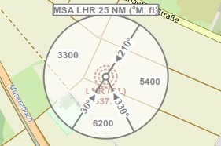
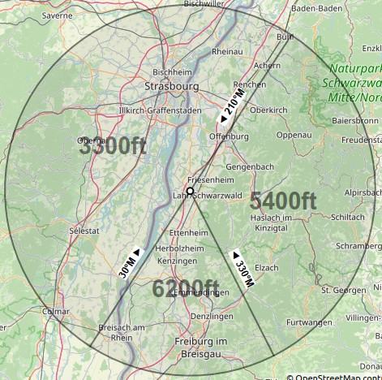

|MSA Icon| Minimum Sector Altitude
-------------------------------------------

Minimum Sector Altitude (MSA) is the lowest altitude which will provide a minimum
clearance of 1,000 feet above all objects located within a sector of a
circle of mostly 25 NM radius. The sector can be centered on an airport, a runway end or a navaid.

*Little Navmap* shows the MSA sectors are symbols attached to an airport, a runway end or a navaid.
These MSA symbols are also shown in the :ref:`navaids` and in tooltips on the map.
Labels shows ``MSA``, navaid ident and radius in NM.
Sector bearings are shown in degree magnetic and sector safe altitudes shown in feet.
Disable MSA symbols in menu ``View`` -> ``Navaids`` -> :ref:`view-show-msa-sectors`.

Right click on the MSA symbol and select :ref:`add-msa-map` from the map context menu to show
a to scale MSA diagram. The display of user MSA diagrams is automatically enabled in menu ``View`` -> ``User Features`` ->
:ref:`user-msa` after using this function.
Remove MSA diagrams by clicking on the center and selecting :ref:`remove-user-map`.

See also :ref:`navaids-legend` in the map legend.

.. note::

    MSA sectors are not available when using the setting :ref:`navigraph-none` in the
    menu ``Scenery Library`` -> ``Navigraph`` with FSX, P3D or MSFS. See also :doc:`SCENERY` and :doc:`NAVDATA`.

    An 25 NM MSA symbol at NDB LHR having three sectors. Sectors denoted by magnetic bearing to navaid and altitudes in feet.

    To scale MSA diagram after selecting :ref:`add-msa-map`.

.. |MSA Icon| image:: ../images/icon_msa.png
