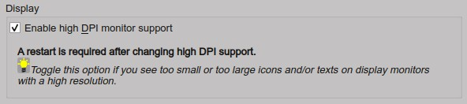
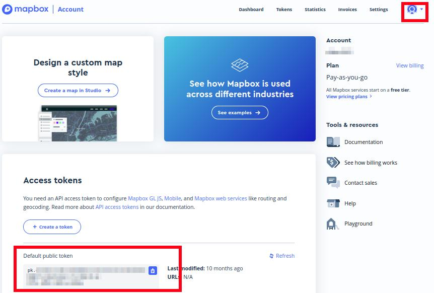
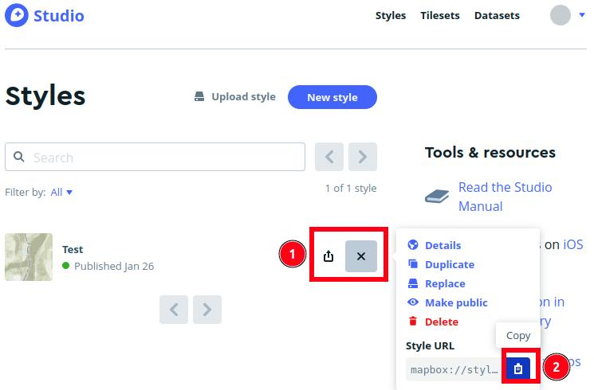
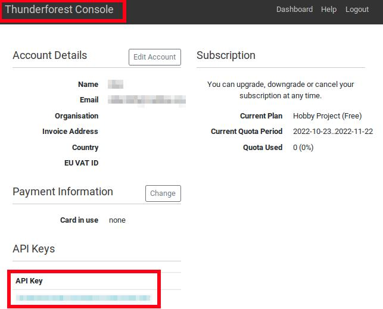
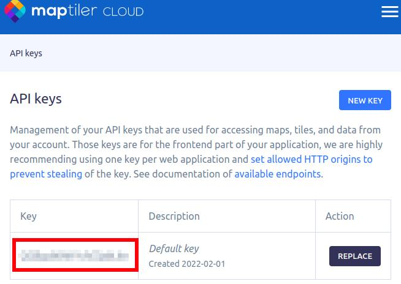
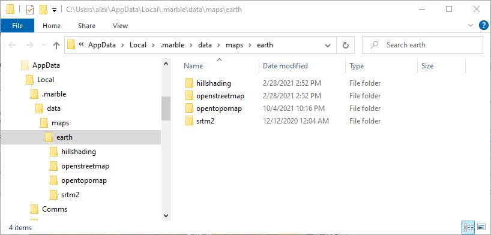

|Options| Options
------------------------

This options dialog contains the most important settings to change program behavior, map display and more.

Further customization for tables and information displays can be done in menu ``Tools`` using the items
:ref:`elevation-profile-display-options`, :ref:`aircraft-progress-display-options` and
:ref:`flight-plan-table-display-options`.

The button ``Restore Defaults`` restores only the options of this dialog
back to default. Other settings like map display, table views or dock
window positions are not affected. You can press ``Cancel`` to close the
dialog and undo this action.

To reset all saved settings completely see :ref:`reset-and-restart`.

The following chapters give a brief description of each page.

Using the help button in the options dialog window jumps directly to the related chapter for a page.

.. tip::

   Most options are self-explaining and tooltips contain more information in most cases.
   Hover the mouse over a button or input field for a more detailed description.

.. tip::

   You can immediately check the effect of your changes on the map display
   by moving the options dialog to the side and pressing ``Apply``.

.. note::

     If you use Apple macOS:

     The menu entry which is referenced as ``Tools`` -> :doc:`OPTIONS` in this manual for Windows and Linux
     can be found in the application menu at ``Little Navmap`` -> ``Preferences`` on macOS.

.. _options-pages:

Options Pages
~~~~~~~~~~~~~~~~~~~~~~~~~~~~~~~~~~~

This dialog consists of several pages with configuration options that
can be selected in the list on the left side. Each entry in the page
list has a tooltip for easier navigation.

.. note::

     Note that scroll bars can show up at the right or the bottom of an options page.
     Scroll down or resize the dialog window to see hidden options.

.. _options-search:

Options Search
~~~~~~~~~~~~~~~~~~~~~~~~~~~~~~~~~~~

You can search through all options pages using the input field on the top left.
Searching reduces the visible pages to the
ones containing the search text. Matching labels and buttons are highlighted on each page.

Up to three words can be searched for. Partial matches are highlighted.

.. figure:: ../images/optionssearch.jpg
    :scale: 70%

    Searching for term ``user aircr`` finding all fields containing ``user aircraft``. *Click image to enlarge.*

.. _options-hints:

Options Hints
~~~~~~~~~~~~~~~~~~~~~~~~~~~~~~~~~~~

Added hints prefixed with a light bulb in the options dialog pointing to other related settings.
Some hints contain a link which directly opens the related page. Bold text is still an important
note like ``Restart required``.

    An important message in **bold text** plus a hint.

.. _options-startup-and-updates:
.. _page1:

|Startup Icon| Startup and Updates
~~~~~~~~~~~~~~~~~~~~~~~~~~~~~~~~~~~

Allows to customize what should be loaded and shown on startup of
*Little Navmap*.

Disable options to have a clean user interface after startup or leave options checked to
be able to continue where you left the program.

.. _load-last-flight-plan:

Load last used flight plan
^^^^^^^^^^^^^^^^^^^^^^^^^^^^^^^^^^^^^^^^^^^^^^^^^^^^

This function allows to restore the last saved or edited flight plan on startup.

Selected
      The last saved flight plan file or the last edited flight plan will be reloaded on startup.

      You can exit *Little Navmap* without saving a new plan. All changes will be saved to a
      temporary file and are restored on next startup.

      *Little Navmap* will not ask to save an already saved but changed plan on exit.
      The changes and the last saved file will be restored on next startup.

Not selected
      The last saved flight plan will not be reloaded on startup.

      *Little Navmap* will ask to save a plan on exit if it has been changed.

.. _update-check:

Update Check
^^^^^^^^^^^^^^^^^^^^^^^^^^^^^^^^^^^^^^^^^^^^^^^^^^^^

You can also configure the frequency of the automatic update check and
channels. See chapter :doc:`UPDATE` for more information.

.. important::

    Always update *Little Navmap* to the latest version which usually contains many improvements and bug fixes.
    Older versions are not supported.

.. _options-ui:
.. _page2:

|User Interface Icon| User Interface
~~~~~~~~~~~~~~~~~~~~~~~~~~~~~~~~~~~~~~~

This page contains options to force the program language and locale
settings (number, date and time formats) to English if you do not want
to use a translated user interface.

Language
^^^^^^^^^^^^^^^^^^^^^^^^^^^^^^^^^^^^^^^^^^^^^^^^^^^^

Allows to choose the language freely among the supported translations. Note that some translations
are incomplete which might result in a mix of English and translated phrases in the user interface.

You have to restart *Little Navmap* for this change to take effect.

.. _raise-on-related:

Raise related windows on actions. Show flight plan after opening file, for example.
^^^^^^^^^^^^^^^^^^^^^^^^^^^^^^^^^^^^^^^^^^^^^^^^^^^^^^^^^^^^^^^^^^^^^^^^^^^^^^^^^^^^^^^^^^^^

This will open related windows and raise tabs on actions like
opening files, modifying the flight plan and other operations.

This can he helpful for new users.

Raise and activate docking windows when moving the mouse over it
^^^^^^^^^^^^^^^^^^^^^^^^^^^^^^^^^^^^^^^^^^^^^^^^^^^^^^^^^^^^^^^^^^^^^^^^^^^^^^^^^^^^^^^^^^^^

Raises dock windows when hovering the mouse over it. This can be helpful if you have multiple floating
dock windows opened.

See also :doc:`DOCKWINDOWS`.

Raise and activate the main program window when moving the mouse over it
^^^^^^^^^^^^^^^^^^^^^^^^^^^^^^^^^^^^^^^^^^^^^^^^^^^^^^^^^^^^^^^^^^^^^^^^^^^^^^^^^^^^^^^^^^^^

Raises the main window of *Little Navmap* when hovering the mouse over it.
This will steal the focus of other programs and activate *Little Navmap* which might cause unwanted effects.
Therefore, try this out before using it.

See also :doc:`DOCKWINDOWS`.

.. _options-display-and-text:
.. _page3:

|Display and Text Icon| Display and Text
~~~~~~~~~~~~~~~~~~~~~~~~~~~~~~~~~~~~~~~~~

Various user interface related settings.

User Interface Font
^^^^^^^^^^^^^^^^^^^^^^^^^^^^^^^^^^^^^^^^^^^^^^^^^^^^

You can change the font for the whole user interface of *Little Navmap*.

The setting is applied immediately. Press ``Cancel`` or ``Reset Font to Default`` to revert back to previous.

The font for map display is not affected by this value and can be set separately on page :ref:`options-map-display`.

.. note::

   *Little Navmap* remembers the size of dialog windows. In some cases you have to resize dialog windows
   after changing to a larger font to see all content.

.. warning::

      Keep in mind that using a wrong or too large font can result in display issues.

.. tip::

        Try out the `B612 Font family <https://b612-font.com/>`__ which is an
        open source font family designed and tested to be used on aircraft cockpit screens.

.. _options-high-dpi:

Enable high DPI monitor support
^^^^^^^^^^^^^^^^^^^^^^^^^^^^^^^^^^^^^^^^^^^^^^^^^^^^

Toggle this is you have problems with scaled fonts or symbols on Windows,
cannot shrink the main window or other issues.

You have to restart *Little Navmap* after changing.

.. _options-freetype:

Use FreeType font engine on Windows
^^^^^^^^^^^^^^^^^^^^^^^^^^^^^^^^^^^^^^^^^^^^^^^^^^^^

This option is only available on Windows.

Disable this if you think the overall appearance of text in *Little Navmap* on Windows is blurry.
Enabling this option results in better and faster text display on the map, especially for rotated labels.

But as a result, the text will appear slightly blurred throughout the whole application.
Deselect this to avoid the slightly blurred text in menus and application windows.

.. note::

     A restart is required after changing the font engine.

.. _options-tooltips:

Show tooltips in whole application
^^^^^^^^^^^^^^^^^^^^^^^^^^^^^^^^^^^^^^^^^^^^^^^^^^^^

Disables tooltips for the whole application if deselected except for the map window which
has separate settings on page :ref:`options-map-tooltips-and-clicks`.

Text Size
^^^^^^^^^^^^^^^^^^^^^^^^^^^^^^^^^^^^^^^^^^^^^^^^^^^^

Change default text size for various information displays and tables.

.. tip::

   You can temporarily resize the text in information windows by using ``Ctrl+Wheel``.
   This change is temporary and not saved.

.. _options-units:
.. _page4:

|Units Icon| Units
~~~~~~~~~~~~~~~~~~

You can change all units that are used by *Little Navmap* on this page
between nautical, imperial and metric. Mixed settings like Meter for
altitude and Nautical Miles for distance are possible.

-  ``Show other fuel units too``: Shows kilogram and liter as small text
   besides main units if lbs and gallon are selected and vice versa.
   This is applied only to the most important fuel values like block and
   trip fuel, for example.
-  ``Show true course and heading besides magnetic course in information displays``:
   Add true heading as small text besides magnetic heading displays.
   This applies to information, progress as well as map display (traffic
   patterns and holds).

.. note::

       See :ref:`signed-decimal-coordinates` for more information when using ``Latitude and Longitude with sign``
       or ``Longitude and Latitude with sign`` since these modes also affect coordinate input.

       The format ``Degree, Decimal Minutes for Google`` is useful for input into Google Maps or Google Earth.

.. warning::

      Note that any numbers used in the program are not converted when
      changing units.

      That means that you will get a minimum altitude buffer
      of 1,000 meter after changing the setting ``Altitude and Elevation`` from
      feet to meter. This also applies to flight plan altitude. Therefore, do
      not forget to adapt these numbers after changing units.

.. _options-files:
.. _page5:

|Files Icon| Files
~~~~~~~~~~~~~~~~~~~~~~~~

Various settings for loading and saving files.

Center flight plan or aircraft trail on the map after loading
^^^^^^^^^^^^^^^^^^^^^^^^^^^^^^^^^^^^^^^^^^^^^^^^^^^^^^^^^^^^^^^^^^^^^^^^^^^^^^

Zooms to the loaded plans or trails after loading from the menu ``File`` or after using
drag and drop from a file manager like Windows Explorer.

.. _flight-plan-avoid-overwrite:

Avoid overwriting Flight Plan with not matching departure and destination
^^^^^^^^^^^^^^^^^^^^^^^^^^^^^^^^^^^^^^^^^^^^^^^^^^^^^^^^^^^^^^^^^^^^^^^^^^^^^^

Check this option to avoid overwriting LNMPLN files with wrong flight plans after changing,
departure, destination or any other parameter used in the flight plan file.

The dialog :ref:`save-flight-plan-as` will show up instead of overwriting
the current flight plan when you reverse the route, for example.

.. _flight-plan-pattern:

Pattern for default LNMPLN flight plan names
^^^^^^^^^^^^^^^^^^^^^^^^^^^^^^^^^^^^^^^^^^^^^^^^^^^^^^^^^^^^^^^^^^^^^^^^^^^^^^

Allows to customize the default file name which is proposed on first save
of LNMPLN files (:ref:`save-flight-plan` and :ref:`save-flight-plan-as`).

See :doc:`ROUTEEXPORTALL` for more information about how to customize the default
file names for other flight plan formats which can be exported.

Error messages and an example is shown below the input field.

This pattern applies to new filenames when saving LNMPLN flight plans.
The file suffix ``.lnmpln`` is added automatically.

The default value is ``PLANTYPE DEPARTNAME (DEPARTIDENT) to DESTNAME (DESTIDENT)``.

The input field falls back to the default if it is left empty or has errors.

The following variables are recognized:

-  ``PLANTYPE``: Text ``IFR`` or ``VFR`` depending on :ref:`flight-plan-type`.
-  ``DEPARTIDENT``: Departure airport ident
-  ``DEPARTNAME``: Departure airport name
-  ``DESTIDENT``: Destination airport ident
-  ``DESTNAME``: Destination airport name
-  ``CRUISEALT``: Cruise altitude in selected unit (meter or feet).

All variables have to be entered in upper case letters. Other characters are used as entered.

Short
'''''''''''''''

This button sets the flight plan file pattern to the short name ``DEPARTIDENT DESTIDENT``.

Example: ``EDDF LIRF.lnmpln``.

Long
'''''''''''''''''''

This button sets the flight plan file pattern to the long name ``PLANTYPE DEPARTNAME (DEPARTIDENT) to DESTNAME (DESTIDENT)``.

Example: ``IFR Frankfurt am Main (EDDF) to Fiumicino (LIRF).lnmpln``.

.. _options-map:
.. _page6:

|Map Icon| Map
~~~~~~~~~~~~~~~~~

Has map related customization options.

Hover the mouse above buttons and input fields to see more information.

.. _options-map-undock:

Allow to undock the map window
^^^^^^^^^^^^^^^^^^^^^^^^^^^^^^^^^^^^^^^^

Allows to undock and put the map window into a floating state which also results in more
flexibility when positioning other dock windows.

This can cause several unwanted effects when arranging dock windows.
Deselect this if you do experience problems when resizing dock windows.

You have to restart the program after changing this option.

See :doc:`LAYOUT` for more information about window layouts which might be affected by this option.

.. important::

      You need to reset the window layout in case the map window is missing after a restart.
      Use menu ``Window`` -> :ref:`reset-layout-menu` in the main menu to clean up the layout.

.. _options-map-tooltips-and-clicks:
.. _page7:

|Map Tooltips and Clicks Icon| Map Tooltips and Clicks
~~~~~~~~~~~~~~~~~~~~~~~~~~~~~~~~~~~~~~~~~~~~~~~~~~~~~~~~~~

Allows to set the clicks/tooltips for various map features as well as the click/tooltip sensitivity.
Hove the mouse over the buttons for more information.

.. _options-map-navigation:
.. _page8:

|Map Navigation Icon| Map Navigation
~~~~~~~~~~~~~~~~~~~~~~~~~~~~~~~~~~~~~~

Contains all options for moving and zooming around in the map as well as zoom distances.

Three navigation modes are available. Tooltips give more information about these.

.. _options-map-display:
.. _page9:

|Map Display Icon| Map Display
~~~~~~~~~~~~~~~~~~~~~~~~~~~~~~~~

This page contains options for symbol sizes, text sizes, flight plan and more for airports, navaids,
airways, airspaces and aircraft.

Shown labels and airport diagram features can be changed on page :ref:`options-map-labels`.

Use the scroll bar on the right to see more hidden options at the bottom of the window.

``Symbol`` allows to adjust icon size of a feature type, ``Text`` can be used to adjust label size
independent of the symbol, ``Text Background`` places the labels in a white rectangle if
selected and ``Line Width`` adjusts flight plan and other line thickness.

Change colors by clicking on the colored buttons.

The option ``Hide aircraft on ground`` can be used to avoid hiding aircraft on ground at higher zoom levels. Disabling this can help
to avoid hidden AI if traffic tools do not update the on-ground status of aircraft properly.

The option ``Hide multiple code "Z" airspaces and FBZ areas`` allows to hide redundant airspaces and
flight buffer zones which are usually not used in flight planning. These are hidden by default

Map and Elevation Profile Font
^^^^^^^^^^^^^^^^^^^^^^^^^^^^^^^^^^^^^^^^

You can change the font for the map display separately from the whole application (page :ref:`options-display-and-text`).
The font will also be used in the elevation profile.

.. _options-map-flight-plan:
.. _page10:

|Map Display Flight Plan Icon| Map Flight Plan
~~~~~~~~~~~~~~~~~~~~~~~~~~~~~~~~~~~~~~~~~~~~~~~~~~~~~~~~~

Change display options affecting flight plan display on the map and in the elevation profile.

Input fields are the same types as on page :ref:`options-map-display` above.

Shown labels can be changed on page :ref:`options-map-labels`.

.. _options-map-aircraft-trail:
.. _page11:

|Map Aircraftt Trail Icon| Map Aircraft Trail
~~~~~~~~~~~~~~~~~~~~~~~~~~~~~~~~~~~~~~~~~~~~~~~~~~~~~~~~~

This page contains an option to use colored or black and white gradients for aircraft trail indicating flown altitude.
The gradient is also used in the elevation profile.

You can also enable a tooltip for the aircraft trail on page :ref:`options-map-tooltips-and-clicks`.

Maximum number of aircraft trail points
^^^^^^^^^^^^^^^^^^^^^^^^^^^^^^^^^^^^^^^^

Limits the number or aircraft trail to avoid performance issues when showing a too large number of
trail points.

See :doc:`AIRCRAFTTRAIL` for more information.

.. _options-map-user:
.. _page12:

|Map Display User Icon| Map User
~~~~~~~~~~~~~~~~~~~~~~~~~~~~~~~~~~~~~~~~~~~~~~~~~~~~~~~~~

More display options for user features like range rings, measurement lines, highlights, userpoints, compass rose and more.

Input fields are the same types as on page :ref:`options-map-display`.

.. _options-map-labels:
.. _page13:

|Map Display Labels Icon| Map Labels
~~~~~~~~~~~~~~~~~~~~~~~~~~~~~~~~~~~~~~~~~~~~~~~~~~~~~~~~~

This page contains a tree view that allows to select
the text labels that should be shown at airports, navaids, airspaces, airways, user aircraft,
AI/multiplayer aircraft and other map features.

Besides text labels airport details like aprons or taxiways can be enabled or disabled in the branch ``Airport Details``.

The dialog uses a tree. See :ref:`ui-tree` for more information about this type of input element.

Note that some labels have a ``…`` appended if label texts are suppressed due to higher
zoom distances or lower detail levels.

.. _options-map-keys:
.. _page14:

|Map Display Keys Icon| Map Keys
~~~~~~~~~~~~~~~~~~~~~~~~~~~~~~~~~~~~~~~~~~~~~~~~~~~~~~~~~

On this page you can enter login information, tokens or API keys for map services which need an user account.

The required keys shown are extracted from the installed map themes. See :doc:`MAPTHEMES` for more information about map themes.

The following map themes requiring an account come with *Little Navmap*:

-  `Mapbox <https://account.mapbox.com>`__ also allows user customized maps in Mapbox Studio. See the Mapbox page for help.
   Click ``Add Mapbox User Map`` to add an user styled map to *Little Navmap*.
-  `Thunderforest <https://www.thunderforest.com/>`__
-  `Maptiler <https://www.maptiler.com/>`__
-  `Stadia StamenTerrain <https://stadiamaps.com/stamen/onboarding/create-account/>`__

A restart might be needed after changing keys.

Click one of the following links to go directly to the account pages of the respective map services. You need to sign in.

.. note::

    All services are free to use at the time of writing these instructions. You do not have to enter
    you credit card, account or other payment information to use these.
    Simply ignore these sections when signing in or creating an account.

.. note::

   Clear the map cache when changing configurable maps like ``MapBox User`` to see the changes. Map tiles are
   images which are stored in the local disk cache and are kept for two weeks in most maps.

   You can open the cache using the menu item ``Tools`` -> ``Files and Directories`` -> :ref:`files-and-directories-cache`.
   See also :ref:`disk-cache` for details.

.. warning::

   Do not show these keys publicly in forums on screenshots.

Map Web Service Configuration
^^^^^^^^^^^^^^^^^^^^^^^^^^^^^^^^^^^^^^^^

*Click the images to enlarge.*

Mapbox
'''''''''''''''''''''''''''''''''''''''''''''''''''''''''''''''''''''''''

    Location of the Mapbox access token on the `Mapbox Account page <https://account.mapbox.com/>`__.
    Use this as ``Value`` for ``Mapbox Token``. *Click image to enlarge.*

    Location of the Mapbox Studio URL on the `Mapbox Studio page <https://studio.mapbox.com/>`__
    Insert this URL into the ``Add Mapbox User Map`` dialog window to add an user styled map to *Little Navmap*. *Click image to enlarge.*

Thunderforest
'''''''''''''''''''''''''''''''''''''''''''''''''''''''''''''''''''''''''

    `Thunderforest Console <https://manage.thunderforest.com/dashboard>`__ with API key.
    Use this as ``Value`` for ``Thunderforest API Key``. *Click image to enlarge.*

Maptiler
'''''''''''''''''''''''''''''''''''''''''''''''''''''''''''''''''''''''''

    `Maptiler Cloud Account API key page <https://cloud.maptiler.com/account/keys/>`__.
    Use this as ``Value`` for ``MapTiler API Key``. *Click image to enlarge.*

.. _options-map-online:
.. _page15:

|Map Display Online Icon| Map Online
~~~~~~~~~~~~~~~~~~~~~~~~~~~~~~~~~~~~~~~~~~~~~

This page allows to change the default center circle sizes for online
centers.

Two options below ``Online Center Boundary Lookup in User Airspaces``
can be used to assign OpenAir airspaces from the user airspace database
to centers by matching filename or airspace name with the callsign of
the center.

-  ``By airspace name vs. callsign``: Use the airspace name within a
   file to assign the geometry to a center by callsign.
-  ``By airspace file name vs. callsign``: Use the airspace filename
   minus the ``.txt`` extension to assign the geometry to a center by
   callsign.

See chapter :doc:`AIRSPACELOAD` for more information.

.. _options-simulator-aircraft:
.. _page16:

|Simulator Aircraft Icon| Simulator Aircraft
~~~~~~~~~~~~~~~~~~~~~~~~~~~~~~~~~~~~~~~~~~~~~

Allows to change various aspects around the display of the user aircraft

Simulator Aircraft Updates
^^^^^^^^^^^^^^^^^^^^^^^^^^^^^^^^^^^^^^^^^^^^^^^^^^^^

Settings resulting in a more fluid aircraft display
will use more CPU and can potentially induce stutters in the simulator.

.. _aircraft-center-options:

Aircraft Centering Options
^^^^^^^^^^^^^^^^^^^^^^^^^^^^^^^^^^^^^^^^^^^^^^^^^^^^

This chapter explains the various options to modify the map updates while flying.
The idea is to reduce manual scrolling or zooming as much as possible while piloting the aircraft.

Read the chapters below if you find the behavior confusing (i.e. map jumping
unexpectedly). Otherwise leave the default values.

See :doc:`AIRCRAFTCENTER` for general information about aircraft centering while flying.

.. _simulator-aircraft-center-wp:

Center map on aircraft and next flight plan waypoint
'''''''''''''''''''''''''''''''''''''''''''''''''''''''''''''''''''''''''

The map is zoomed to show both the aircraft and the next active waypoint
on the flight plan if this is enabled while flying. *Little Navmap* uses
several criteria to minimize map updates in this mode.

The map will fall back to the default mode of simply centering the
aircraft if one of the conditions below is true:

-  No flight plan loaded.
-  Aircraft is on ground (no active magenta leg).
-  Aircraft distance to flight plan is more than 40 NM (active magenta leg disappears).

You can change the zoom freely if the fall back is active.

.. _simulator-aircraft-move-constantly:

Do not use box mode for following the aircraft. Move the map constantly.
'''''''''''''''''''''''''''''''''''''''''''''''''''''''''''''''''''''''''

Map will follow the aircraft constantly when checked. This is also used
for ``Center map on aircraft and next flight plan waypoint``.

This option will cause *Little Navmap* to consume more CPU resources
while flying.

.. _simulator-aircraft-scroll-box:

Simulator aircraft scroll box size (percent of map window size)
'''''''''''''''''''''''''''''''''''''''''''''''''''''''''''''''''''''''''

Smaller values keep the aircraft centered and will move the map more
often. Larger values will update the map only when aircraft reaches map
boundary.

This setting is only applicable if :ref:`simulator-aircraft-center-wp` above is disabled.

Allow scrolling and zooming in the map and jump back to aircraft after
'''''''''''''''''''''''''''''''''''''''''''''''''''''''''''''''''''''''''

This setting allows an user to move around in the map without the need to manually disable the
aircraft centering.

Time until aircraft following is activated again after any manual map
interaction like scrolling or zooming.

You cannot move the user aircraft out of view if this option is disabled. The map will jump back immediately.

This option is also used in the :doc:`PROFILE`.

Allow scrolling enabled:
   The map will stop following the aircraft for the given time if the user
   does any interaction with the map like scrolling or zooming. You can
   quickly check out the destination or your overall progress, and after
   you stop moving around, *Little Navmap* will return to following your
   aircraft.

   This option is also used in :doc:`PROFILE`.

   Toggle |Center Aircraft| ``Center Aircraft`` on and off if you find that
   the map jumps back to the wrong position.

Allow scrolling disabled:
   Map will constantly follow the aircraft and will not allow moving away from it.

   The aircraft centering will be switched off only when using one of the
   following functions:

   -  Double-click into a table view or map display to zoom to an airport or a navaid.
   -  Context menu item ``Show on map``.
   -  ``Go to Home`` or ``Go to Center for Distance Search``.
   -  ``Map`` link in ``Information`` dock window.
   -  ``Show Flight Plan``, when selected manually, or automatically after loading a flight plan.
   -  Centering a Google Earth KML/KMZ file after loading

   This allows a quick inspection of an airport or navaid during flight. To
   display the aircraft again use ``Map Position Back`` (:ref:`map-position-back-forward`) or enable
   :ref:`center-aircraft` again.

Zoom out on takeoff
'''''''''''''''''''''''''''''''''''''''''''''''''''''''''''''''''''''''''

Zooms out to a fixed zoom distance when a takeoff is detected.

This setting is only applicable if :ref:`simulator-aircraft-center-wp` above is disabled.

Zoom in on touchdown
'''''''''''''''''''''''''''''''''''''''''''''''''''''''''''''''''''''''''

Zooms in to a fixed zoom distance to show airport details when a takeoff is detected.

Scroll flight plan table back to active leg after
'''''''''''''''''''''''''''''''''''''''''''''''''''''''''''''''''''''''''

The active (magenta) leg will be moved to the top of the flight plan table
when a new leg is activated or there is no interaction with the table for the given time period.

Clear selection in flight plan table after
'''''''''''''''''''''''''''''''''''''''''''''''''''''''''''''''''''''''''

The selection in the flight plan table and highlights on the map will be cleared
after there is no interaction with the table for the given time period.

Highlight active flight plan legs
'''''''''''''''''''''''''''''''''''''''''''''''''''''''''''''''''''''''''

Shows active flight plan legs in magenta color (default) on the map and in the flight plan table.

.. _options-flight-plan:
.. _page17:

|Flight Plan| Flight Plan
~~~~~~~~~~~~~~~~~~~~~~~~~

Here you can set preferences for flight plan cruise altitude assignment.

.. _options-weather:
.. _page18:

|Weather| Weather
~~~~~~~~~~~~~~~~~

Choose which weather services should be used to fetch and show METAR for airports in information
window and map tooltips.

The weather type ``Flight Simulator`` will either display weather from
the FSX or P3D connection or from X-Plane's weather files.

The weather for a service is downloaded or read on demand when you enable the corresponding service
for tooltips or information panels.

Online weather is downloaded and updated every ten minutes.

.. note::

       Simulator weather is not supported for Microsoft Flight Simulator 2020 since this simulator
       lacks the needed programming interfaces.

.. _options-weather-files:
.. _page19:

|Weather Files| Weather Files
~~~~~~~~~~~~~~~~~~~~~~~~~~~~~~

*Active Sky* can only be selected if either *Active Sky Next*, *AS16*,
*Active Sky for Prepar3D v4* or *Active Sky XP* are installed or the
weather file is selected directly. Selecting the *Active Sky* weather
file directly can be useful if you run a networked setup. Use Windows
shares or a cloud service to get access to the file on the remote
computer.

The URLs of various weather services can be modified if you like to use
another source. Usually there is no need to change these values.

Note that leading and trailing spaces are removed from the web addresses.

You can change the path to the X-Plane weather files if you'd like to
load it on a remote computer using a network share.

The buttons ``Test`` for the online weather services can also be used to
find out if *Little Navmap* can connect to Internet. Check your firewall
settings if these fail.

Use ``Reset`` to set a value back to default if you change something accidentally.

.. note::

     While this happens rarely, some public services like NOAA might be interrupted for hours.
     *Little Navmap* will show error messages if this is the case.

     You might want to check you internet access but otherwise ignore these if
     it does not happen for a longer time.

.. _options-online-flying:
.. _page20:

|Online Flying| Online Flying
~~~~~~~~~~~~~~~~~~~~~~~~~~~~~

This page allows to change settings for online networks.

VATSIM, IVAO and PilotEdge provide preconfigured options to connect to the services.

Use ``Custom with status file`` if you have a status file pointing to ``whazzup.txt`` files.
Use ``Custom`` if you'd like to load a ``whazzup.txt`` file directly.

See :doc:`ONLINENETWORKS` for an overview.

Online Service
^^^^^^^^^^^^^^

.. _online-service-none:

None
''''

Disables all online services and hides all related window tabs, menu
items and toolbar buttons. No downloads will be done.

.. _online-service-vatsim:

VATSIM
''''''

Uses the predefined configuration for the
`VATSIM <https://www.vatsim.net>`__ network. No other settings are
needed.

The update rate depends on configuration and is typically three minutes.

.. _online-service-ivao:

IVAO
''''

Uses the predefined configuration for the `IVAO <https://ivao.aero>`__
network. No other settings are needed.

The update rate depends on configuration and is typically three minutes.

.. _online-service-pilotedge:

PilotEdge
'''''''''

Configuration for the `PilotEdge <https://www.pilotedge.net/>`__
network.

.. _online-service-custom-status:

Custom with Status File
'''''''''''''''''''''''

This option allows to connect to a private network and will download a
``status.txt`` file on startup which contains further links to e.g. the
``whazzup.txt`` file.

.. _online-service-custom-whazzup:

Custom
''''''

This option allows to connect to a private network and will periodically
download a ``whazzup.txt`` file which contains information about online
clients/aircraft and online centers/ATC.

.. _online-service-settings:

Web Addresses
^^^^^^^^^^^^^^

.. _online-service-settings-status-url:

Status File URL
'''''''''''''''

Web address of the ``status.txt`` file. You can also use a local path like
``C:\Users\YOURUSERNAME\Documents\status.txt``.

This file is downloaded only on startup of the *Little Navmap*.

A button ``Test`` allows to check if the URL is valid and shows the
first few lines from the downloaded text file. This does not work with
local paths.

The status file format is explained in the IVAO documentation library:
`Status File
Format <https://doc.ivao.aero/apidocumentation:whazzup:statusfileformat>`__.

Note that leading and trailing spaces are removed from the web address.

.. _online-service-settings-whazzup-url:

Whazzup File URL
''''''''''''''''

Web address of the ``whazzup.txt`` file. You can also use a local path like
``C:\Users\YOURUSERNAME\Documents\whazzup.txt``.

This file is downloaded according to the set update rate.

A button ``Test`` allows to check if the URL is valid. The test
does not work with local paths.

The whazzup file format is explained in the IVAO documentation library:
`Whazzup File
Format <https://doc.ivao.aero/apidocumentation:whazzup:fileformat>`__.

Note that leading and trailing spaces are removed from the web address.

.. code-block:: none
   :caption: ``whazzup.txt`` example:
   :name: whazzup-example

    !GENERAL
    VERSION = 1
    RELOAD = 1
    UPDATE = 20181126131051
    CONNECTED CLIENTS = 1
    CONNECTED SERVERS = 41

    !CLIENTS
    :N51968:N51968:PILOT::48.2324:-123.1231:119:0:Aircraft::::::::1200::::VFR:::::::::::::::JoinFS:::::::177:::

    !SERVERS
    ...

.. _online-service-settings-update:

Update Every
''''''''''''

Sets the update rate that defines how often the ``whazzup.txt`` file is
downloaded.

Allowed values are 1 to 1,800 seconds.

You can use smaller update rates for private online networks to improve
map display updates.

.. warning::

        Do not use update rates smaller than two minutes for official online
        networks. They might decide to block the application or block you based
        on your internet address if downloads are excessive.

.. _online-service-settings-format:

Format
''''''

``IVAO`` or ``VATSIM``. Depends on the format used by your private
network. Try both options if unsure or you see strange effects like all aircraft pointing to the north.

.. _options-web-server:
.. _page21:

|Web Server| Web Server
~~~~~~~~~~~~~~~~~~~~~~~

Configuration options for the internal web server of *Little Navmap*.

-  ``Document root directory``: The root directory of the web server
   pages. Change this only if you would like to run a customized web
   server using your own style sheets and you own HTML templates.
-  ``Select Directory ...``: Select root directory. *Little Navmap* will
   show a warning if no ``index.html`` file is found in the root
   directory.
-  ``Port number``: Default 8965. That means you have to use the address
   ``http://localhost:8965/`` or similar in your browser to access the web page of
   *Little Navmap*, for example. Change this value if you get errors
   like ``Unable to start the server. Error: The bound address is already in use.``.
-  ``Use encrypted connection (HTTPS / SSL)``: Encrypted connections use
   a precomputed self-signed certificate which comes with *Little
   Navmap*. A browser will show an error message if using this
   certificate and requires to add a security exception. The encrypted
   address is ``https://localhost:8965/``, for example. Creating a self
   signed certificate is quite complex. Look at the various web articles
   by searching for ``How to create a self signed certificate``.
-  ``Start Server``: Start or stop the server to test the changes above.
   The server status (running or not running) is reverted to the
   previous state when pressing ``Cancel`` in the options dialog.
-  Label ``Web Server is running at http://my-computer:8965 (IP address http://192.168.1.1:8965)``:
   Shows a list of valid links using the IP address and the host name (your computer name) of the web server.
   Clicking on either one opens the page in your default browser. You can always try the IP addresses if the
   computer names does not work. Some addresses might not work depending on network configuration.

   Note that the IP address of a computer can change for every reboot depending on network or router configuration.
   Try to use the host name which is stable.

   The list contains all computer addresses for `IPv4 <https://en.wikipedia.org/wiki/Internet_Protocol_version_4>`__
   (like ``my-computer:8965 (192.168.1.1:8965)``) and
   `IPv6 <https://en.wikipedia.org/wiki/IPv6>`__ (like ``my-computer:8965 (fe80::c0b9:1832:abc5:d5a1:8965)``).

   You might see more than one IPv4 address (e.g. one for WIFI and one for Ethernet) and several addresses for IPv6 if enabled.

See :doc:`WEBSERVER` for detailed information.

.. _options-cache-and-files:
.. _page22:

|Cache and Files| Cache and Files
~~~~~~~~~~~~~~~~~~~~~~~~~~~~~~~~~

.. _cache-map-display:

Map Display
^^^^^^^^^^^

Here you can change the cache size in RAM and on disk. These caches are
used to store the downloaded images tiles from the online maps like the
*OpenStreetMap* or *OpenTopoMap*.

All image tiles expire after two weeks by default and will be reloaded from the
online services then.

You can delete the files manually using your file manager.
You can also open the cache directory from menu ``Tools`` -> ``Files and Directories`` -> :ref:`files-and-directories-cache` or by
clicking on the button ``Show Disk Cache in File Manager``.

The RAM cache has a minimum size of 100 MB and a maximum size of 2 GB.

The disk cache has a minimum size of 500 MB and a maximum size of 8 GB.

See chapter :ref:`disk-cache` for information on cache locations.

       The map cache directory on Windows showing caches for four map themes. Delete all or any of these to save space.
       *Click image to enlarge.*

.. _options-mapthemes:

Map Display Themes
^^^^^^^^^^^^^^^^^^^^^^^^^^^^^^^^^^^^^^^^^^^^^^^^^^^^^^^^^^^^^^^^^^

You can select a directory to lookup additional map themes for the background map layer.
Each map theme has to consist of a directory containing the related ``.dgml`` and other files.
See :doc:`MAPTHEMES` for installation instructions.

External map themes are ignored if this field is empty.

.. warning::

    Do not use the path ``.../data/maps/earth`` in the installation directory do install maps.
    This location is deprecated.

.. _cache-elevation:

Install GLOBE elevation data
^^^^^^^^^^^^^^^^^^^^^^^^^^^^^^^^^^^^^^^^^^^^^^^^^^^^^^^^^^^^^^^^^^

See :doc:`GLOBE` for more information about the offline elevation data and how to download and install it.

.. _options-scenery-library-database:
.. _page23:

|Scenery Library Database Icon| Scenery Library Database
~~~~~~~~~~~~~~~~~~~~~~~~~~~~~~~~~~~~~~~~~~~~~~~~~~~~~~~~

Allows to configure the loading of the scenery library database.

Note that these paths apply to all Flight Simulators, FSX, P3D, MSFS and X-Plane.

You have to reload the scenery database in order for the changes to take effect.

*Little Navmap* supports linked scenery which is linked by symbolic links (all operating systems),
Windows shortcuts, Windows junctions and  macOS aliases. Note that this functionality is limited to
the MSFS ``Community`` and X-Plane ``Custom Scenery`` directories. Other combinations are not tested.

.. _scenery-library-database-include:

Scenery library directories to include when loading
^^^^^^^^^^^^^^^^^^^^^^^^^^^^^^^^^^^^^^^^^^^^^^^^^^^^^^^^^^^^^^

This list shows extra directories which are loaded additionally when reading the simulator scenery library.
Add-on airports in the extra directories extending MSFS ``Community``, X-Plane ``Custom Scenery`` or FSX/P3D ``Addon Scenery`` are
read when loading the simulator scenery library database.

Note that airport files in this list are always read last which can affect the display in MSFS, FSX or P3D.

.. tip::

        The add-ons in the selected directory and will be read recursively which means you can use sub-directories to organize your add-ons.

.. _scenery-library-database-exclude:

Scenery library directories or files to exclude from loading
^^^^^^^^^^^^^^^^^^^^^^^^^^^^^^^^^^^^^^^^^^^^^^^^^^^^^^^^^^^^^^^^^^^^

All directories including sub-directories as well as files in this list will be omitted
when loading the scenery library into the *Little Navmap* database. You
can also use this list to speed up database loading if you exclude
directories that do not contain airports or navaids (landclass,
elevation data and others).

You can also exclude FSX, P3D, MSFS BGL or X-Plane apt.dat files if needed.

Select one or more entries in the list and click on ``Remove`` to delete
then from the list.

.. tip::

      Note that you can select more than one entry in the file
      dialog to add several entries at once.

.. _scenery-library-database-exclude-add-on:

Scenery library directories to exclude from add-on recognition
^^^^^^^^^^^^^^^^^^^^^^^^^^^^^^^^^^^^^^^^^^^^^^^^^^^^^^^^^^^^^^^^^

**FSX/P3D:** All scenery data that is found outside of the base flight
simulator ``Scenery`` directory is considered an add-on and will be
highlighted on the map as well as considered during search for add-ons.

**X-Plane:** All airports in the ``Custom Scenery`` directory are
considered add-on airports and will be highlighted accordingly.

**Microsoft Flight Simulator 2020**: All airports located in the ``Community``
directory and the ``Official\OneStore`` or ``Official\Steam`` are considered to be add-on airports.
Exceptions are ``fs-base``, ``fs-base-genericairports`` and ``fs-base-nav``.

You can use this list to modify this behavior.

Add-ons, like *Orbx FTX Vector* or *fsAerodata* add scenery files that
correct certain aspects of airports like elevation, magnetic declination
or others. All these airports will be recognized as add-on airports
since all their files are not stored in the base flight simulator
``Scenery`` directory.

Insert the corresponding directories or files into this list to avoid
unwanted highlighting of these airports as add-ons.

.. figure:: ../images/optionscenery.jpg

       Page ``Scenery Library Database`` with three
       directories and three files excluded from loading and two directories
       excluded from add-on recognition.

Examples
^^^^^^^^

The examples are based on a simulator installed in ``C:\Games\FSX``.

ORBX Vector
'''''''''''

Exclude the directories below from add-on recognition. Do not exclude
them from loading since you will see wrong airport altitudes.

-  ``C:\Games\FSX\ORBX\FTX_VECTOR\FTX_VECTOR_AEC``
-  ``C:\Games\FSX\ORBX\FTX_VECTOR\FTX_VECTOR_APT``

Flight1 Ultimate Terrain Europe
'''''''''''''''''''''''''''''''

Exclude these directories from loading to speed up the process:

-  ``C:\Games\FSX\Scenery\UtEurAirports``
-  ``C:\Games\FSX\Scenery\UtEurGP``
-  ``C:\Games\FSX\Scenery\UtEurLights``
-  ``C:\Games\FSX\Scenery\UtEurRail``
-  ``C:\Games\FSX\Scenery\UtEurStream``
-  ``C:\Games\FSX\Scenery\UtEurWater``

ORBX Regions
''''''''''''

Exclude these directories from loading:

-  ``C:\Games\FSX\ORBX\FTX_NZ\FTX_NZSI_07_MESH``
-  ``C:\Games\FSX\ORBX\FTX_NA\FTX_NA_CRM07_MESH``
-  ``C:\Games\FSX\ORBX\FTX_NA\FTX_NA_NRM07_MESH``
-  ``C:\Games\FSX\ORBX\FTX_NA\FTX_NA_PNW07_MESH``
-  ``C:\Games\FSX\ORBX\FTX_NA\FTX_NA_PFJ07_MESH``

.. |Startup Icon| image:: ../images/icon_littlenavmap.png
.. |User Interface Icon| image:: ../images/icon_statusbar.png
.. |Display and Text Icon| image:: ../images/icon_copy.png
.. |Units Icon| image:: ../images/icon_units.png
.. |Map Icon| image:: ../images/icon_mapsettings.png

.. |Map Navigation Icon| image:: ../images/icon_mapnavigation.png
.. |Map Display Icon| image:: ../images/icon_mapdisplay.png

.. |Map Display User Icon| image:: ../images/icon_mapdisplay2.png

.. |Map Display Online Icon| image:: ../images/icon_airspaceonline.png
.. |Simulator Aircraft Icon| image:: ../images/icon_aircraft.png
.. |Map Tooltips and Clicks Icon| image:: ../images/icon_mapnavigation.png

.. |Flight Plan| image:: ../images/icon_route.png
.. |Weather| image:: ../images/icon_weather.png

.. |Online Flying| image:: ../images/icon_aircraft_online.png
.. |Web Server| image:: ../images/icon_web.png
.. |Cache and Files| image:: ../images/icon_filesave.png
.. |Scenery Library Database Icon| image:: ../images/icon_database.png

.. |Center Aircraft| image:: ../images/icon_centeraircraft.png
.. |Options| image:: ../images/icon_settings.png

