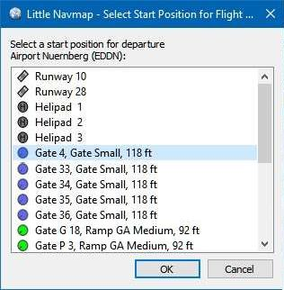

|Select a Start Position for Departure| Select Start Position
------------------------------------------------------------------

A parking spot (gate, ramp, fuel box), airport center, runway or helipad can be
selected as a start position at the departure airport. A parking
position can also be selected in the map context menu item :ref:`set-as-flight-plan-departure`
when right-clicking on the center of a parking position. If no position is selected
the airport center is automatically selected as start.

The start position is highlighted on the map and saved with flight plans. Note that only a
few flight plan formats allow to load the position and place the aircraft at the ramp. For X-Plane
you have to select the start position manually before loading the situation. See :doc:`FLIGHTPLANFMT` for details.

Note that the start position might be lost when switching between scenery library databases since
positions often do not match between simulators.

The start position selection dialog has a search field which allows to filter the entries by name,
type, airline codes or facilities.

     The start position selection dialog for EDDN.

