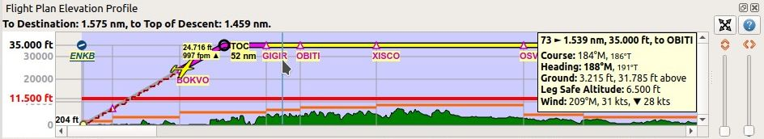
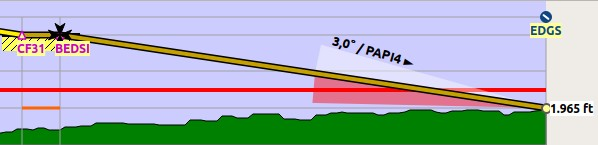
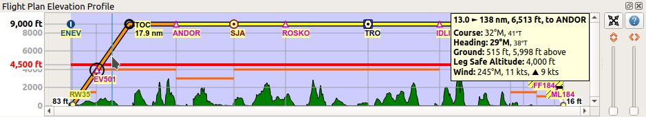
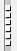

|Flight Plan Elevation Profile Icon| Elevation Profile
-------------------------------------------------------------------------------

This dock window shows the ground elevation, flight plan with cruise,
climb, descent legs and altitude restrictions together with all flight
plan waypoints. It is only available when a valid flight plan is loaded. The
user aircraft will be shown if *Little Navmap* is connected to the
simulator.

The elevation profile does not cover missed approaches and legs to
alternate airports. Create a new flight plan from the destination to the
alternate airport if you wish to use the elevation profile.

Movement of the aircraft and the trail in the elevation profile is tied to the active
flight plan leg and will not be correct if flying away from the active
leg.

.. note::

     The elevation display covers only the flight plan and will not
     change the depiction if you get off the flight plan with your simulator
     aircraft. You need a valid flight plan (i.e. a departure and
     destination airport) and a valid aircraft performance file
     to see the elevation profile.

.. _top-label:

Top Label
~~~~~~~~~~~~~~

Following information is shown in the top label if connected to a flight
simulator with a valid flight plan:

-  Distance from user aircraft to flight plan destination
-  Estimated time en-route in hours and minutes
-  Distance from user aircraft to the top of descent
-  Estimated time to top of descent in hours and minutes

**Example:** ``Destination: 47 NM (0 h 28 m). Top of Descent: 26 NM (0 h 15 m).``

The label is hidden if not connected to a simulator.

.. _tooltip-label:

Tooltip Label
~~~~~~~~~~~~~~

Additional information is shown in a tooltip label at the right or left side in the window if the
mouse is hovered over the diagram. The corresponding position is
highlighted on the map with a black/cyan circle. The label changes the side depending on mouse position.

The label shows the following information for the mouse position:

-  Distance from departure and to destination plus calculated altitude and next waypoint.
-  ``Course`` for the flight plan leg at the cursor position.
-  ``Heading`` for this flight plan leg at the position. This is calculated based on wind conditions and omitted if it is the same as course.
-  The ``Flight path angle`` is only shown in the descent phase and shows the vertical angle.
   The label changes to ``Required flight path angle`` if a descent path is reqired by a procedure.
-  ``Ground`` altitude and calculated altitude above ground.
-  ``Leg safe altitude`` of the flight plan leg at the cursor position (orange line).
-  ``Wind`` direction and speed as well as head- (``▼``) or tailwind (``▲``) component.

    Information for position between waypoints ``GIGIR`` and ``OBITI``.
    Indicating a headwind of 28 kts at this position.
    User aircraft still climbing.
    Note the image showing German number format with dot as thousands separator.

.. _profile-options:

Zoom Sliders
~~~~~~~~~~~~

The right side of the elevation profile contains the zoom sliders. The
following controls are available:

-  |Splitter| ``Splitter``: You can resize the right part of the
   elevation profile window using this splitter button. The part
   containing the sliders will be collapsed if you drag it to the far
   right. You can open the collapsed part again by dragging the splitter
   to the left. The look of the splitter might be different on another operating system.
-  |Expand to Window| ``Expand to Window``: Resets the view back to 100
   percent showing the whole flight plan.
-  |Settings| ``Display Options``: See :ref:`display-options-profile`.
-  |Help| ``Help``: Opens this online help page.
-  |Zoom Vertically| ``Zoom Vertically``: Move the slider up to zoom in
   vertically. Maximum zoom results in 500 ft height for the whole
   profile window.
-  |Zoom Horizontally| ``Zoom Horizontally``: Move the slider up to zoom
   in horizontally. Maximum zoom results in about 4 NM distance for the
   whole profile window.

.. _mouse:

Mouse Movement
~~~~~~~~~~~~~~

-  Hover: The corresponding position within the flight plan is
   highlighted on the map with a black/cyan circle.
-  ``Wheel``: Zoom in and out horizontally.
-  ``Shift+Wheel``: Zoom in and out vertically.
-  ``Left Click and drag``: Move map up, down, left or right.
-  ``Left Double Click``: Zoom to position on main map.
-  ``Right Click``: Show context menu.

.. _keyboard:

Keyboard Movement
~~~~~~~~~~~~~~~~~

Click on the elevation profile window to activate it before using the
keyboard.

-  Cursor keys: Move map up, down, left or right.
-  ``+`` and ``-``: Also on numpad. Zoom in and out horizontally.
-  ``*`` and ``/``: Also on numpad. Zoom in and out vertically.
-  ``0`` or ``Ins`` : Reset view to 100 percent and show the whole
   flight plan.
-  ``Home`` and ``End``: Jump to departure or destination.
-  ``PageUp`` and ``PageDown``: Move forward or backward one page.

.. _display-options-profile:

|Settings| Elevation Profile Display Options
~~~~~~~~~~~~~~~~~~~~~~~~~~~~~~~~~~~~~~~~~~~~~~~

Choose ``Elevation Profile Display Options`` from the elevation profile context
menu to customize labels and other display features.

The dialog uses a tree. See :ref:`ui-tree` for more information about this type of input element.

Same as main menu ``Tools`` -> :ref:`elevation-profile-display-options`.

.. _context-menu-profile:

Context Menu Elevation Profile
~~~~~~~~~~~~~~~~~~~~~~~~~~~~~~~~~~

.. _show-pos-on-map:

|Show Position on Map| Show Position on Map
^^^^^^^^^^^^^^^^^^^^^^^^^^^^^^^^^^^^^^^^^^^

Zooms to the corresponding position on the map. This is the same as
double clicking into the elevation profile.

.. _expand-to-window:

|Expand to Window| Expand to Window
^^^^^^^^^^^^^^^^^^^^^^^^^^^^^^^^^^^

Resets the view back to 100 percent showing the whole flight plan.

.. _center-aircraft-profile:

|Center Aircraft| Keep User Aircraft Centered
^^^^^^^^^^^^^^^^^^^^^^^^^^^^^^^^^^^^^^^^^^^^^^^^

If this option is selected, the aircraft remains centered on the left of
the altitude profile during flight.

The aircraft will be kept on the upper part of the window if the
aircraft is descending and on the lower part if climbing.
You can move around the profile manually.
After a time without manual movements it will jump back to the aircraft.

The vertical and horizontal zoom distances set by the user are not changed while *Little Navmap* keeps the aircraft visible.

See also for more information on jump back in the options dialog on :ref:`simulator-aircraft` which partially affects this function.
See the related tooltips for more information.

This function is independent of the related :ref:`center-aircraft`.

.. _zoom-aircraft-profile:

|Zoom Aircraft| Center on Aircraft and Destination
^^^^^^^^^^^^^^^^^^^^^^^^^^^^^^^^^^^^^^^^^^^^^^^^^^^^^^^^

Same as :ref:`center-aircraft-profile` above but additionally
zooms the elevation profile to keep aircraft and destination visible when checked. This hides the
unneeded passed flight plan legs.

The vertical and horizontal zoom distances set by the user are not changed while *Little Navmap* keeps the aircraft visible
until the destination is visible on the right side of the map.
The elevation profile starts to zoom in horizontally and vertically as much as possible to keep the destination and the user aircraft visible then.

The function :ref:`center-aircraft-profile` has to be enabled to use this function.

Note that the elevation profile starts zooming fairly late after at least half of the flown flight distance.

.. _delete-aircraft-trail-profile:

|Delete Aircraft Trail| Delete Aircraft Trail
^^^^^^^^^^^^^^^^^^^^^^^^^^^^^^^^^^^^^^^^^^^^^

The aircraft trail is saved and will be reloaded on program startup.

This menu item removes the user aircraft trail from the elevation
profile only. It does not remove the trail from the map. Use this if the
trail appears in the wrong place or shape after creating of modifying a
flight plan.

The trail in the elevation profile is of no relevance for the GPX
file export.

.. _show-vasi:

|Show VASI| Show VASI
^^^^^^^^^^^^^^^^^^^^^

Shows a VASI slope if an approach procedure with a runway (not
circle-to-land) is selected in the flight plan and if the runway has a
VASI.

The slope is drawn with the correct angle to be usable as an approach
guide. The vertical opening angle is only meant for depiction and has no
relation to the real VASI accuracy.

      Display of VASI slope at destination airport. Slope
      is 3 degrees and VASI type is PAPI4. Final approach fix is marked with a
      Maltese cross.

.. _show-ils:

|Show ILS| Show ILS or GLS/RNP
^^^^^^^^^^^^^^^^^^^^^^^^^^^^^^^^^

Shows an ILS glideslope or GLS/RNP approach paths if an approach with a runway is selected in the
flight plan and if the runway has the related navaid or approach type.

Drawing of approach guidance depends on selected approch procedure type. An ILS approach will show the ILS
feathers while a localizer approch without vertical guidance will not.
Note that no vertical navaid guidance is shown for circle-to-land approaches.

The slope is drawn with the correct angle to be usable as an approach
guide. The vertical opening angle is only meant for depiction and has no
relation to the real ILS accuracy.

A label on top shows name, frequency, heading, glideslope angle and DME
indicator if available

.. figure:: ../images/profile_ils.jpg

        Display of ILS at destination airport. Final approach fix is marked with a Maltese cross.

.. _show-toc-and-tod-profile:

|Show Top of Climb and Top of Descent| Show Top of Climb and Top of Descent
^^^^^^^^^^^^^^^^^^^^^^^^^^^^^^^^^^^^^^^^^^^^^^^^^^^^^^^^^^^^^^^^^^^^^^^^^^^^

Hides the climb and descent slopes as well as the top of climb and top of descent indicators when disabled.
This affects the map and elevation profile display but not the altitude calculation in the fuel report or elevation profile.

This is the same function as :ref:`show-toc-and-tod` in the menu ``View``.

.. _show-vertical-track-profile:

|Show Vertical Track| Show Vertical Track
^^^^^^^^^^^^^^^^^^^^^^^^^^^^^^^^^^^^^^^^^^^^^^^^^^^^^^^^^^^^^^^^^^^^^^^^^^^^

Shows a vertical track line indicating the flight path based on current descent or climb rate as
well as ground speed.

Use this to aim at the right altitude at the next flight plan waypoint. This is especially useful at descent.

Related function for the map is :ref:`show-aircraft-altitude-range-map` in the map context menu.

.. figure:: ../images/legend_profile_path.png

    Vertical track line in elevation profile window indicating climb rate.

Follow on Map
^^^^^^^^^^^^^

The map view will be centered - not zoomed in - on the position below
the cursor if hovering above the elevation profile when this option is
selected.

Show Zoom Sliders
^^^^^^^^^^^^^^^^^

Show or hide the zoom sliders and buttons at the right side of the
elevation profile. You can still zoom using the mouse or the keyboard.

Show Scrollbars
^^^^^^^^^^^^^^^

Show or hide the scroll bars at the bottom and the right side of the
elevation profile. You can still use the mouse or keyboard to navigate.

.. _profile-display-options:

|Settings| Elevation Profile Display Options
''''''''''''''''''''''''''''''''''''''''''''''''''''''''''''''''''''''''''''''''

See :ref:`display-options-profile` above.

Profile Display
~~~~~~~~~~~~~~~

The colors, symbols and font of the elevation profile follow the style of the
main map as set in the options dialog. Colors,
patterns and symbols for airports, navaids, procedures, active and
passed flight plan legs are the same. The profile display also follows
other map settings like visibility of flight plan line, aircraft and
aircraft trail.

Display options for the flight plan can be changed in :ref:`map-display-flight-plan`.
Not all of the flight plan options affect the elevation profile which is noted in the related tooltips.

Aircraft heading will turn if a backward movement relative to the active
flight plan leg is detected.

For more information see the :ref:`elevation-profile-legend` in the map legend.

The elevation profile uses actual altitude for display of restrictions,
slope and cruise.

The aircraft icon is shown using indicated altitude to ensure matching to cruise altitude line
at the higher flight levels.

You might see vertical aircraft movement of the aircraft symbol and jumps in the trail when adjusting
barometric pressure in the simulator altimeter.

.. include:: include/ALTCORRECTION.rst

      Flight plan elevation profile with line indicating
      the mouse hovering position. Orange lines show minimum safe altitude for
      flight plan segments. Red line shows overall minimum safe altitude. Top
      of climb and top of descent points shown including slope. Orange flight
      plan lines show procedure legs. Waypoint ``EV501`` has an overfly
      condition and there are several altitude restrictions shown for the
      approach procedure below the tooltip.

.. _toc-and-tod-paths:

Top of Climb and Top of Descent Paths
~~~~~~~~~~~~~~~~~~~~~~~~~~~~~~~~~~~~~

The elevation profile also displays the top of climb and top of
descent which are calculated based on the current :doc:`AIRCRAFTPERF` profile and :ref:`wind` situation.

Note that the TOC and TOD calculation is influenced by altitude
restrictions in procedures. *Little Navmap* will calculate a climb or
descent path always adhering to these restrictions. The resulting path might
use a higher or lower climb or descent speed than expected.

The path is also forced to the lowest allowed altitude at the final
approach fix (``FAF``) and the final approach course fix (``FACF``) to avoid arriving above
the ILS glide slope or too high at the destination runway.

You can safely follow the descent path as shown by *Little Navmap*,
provided you can manage your aircraft speed at the same time. For large
aircraft you might want to descent around 10 nm earlier to reduce speed
to 250 knots below 10,000 ft.

I recommend to make the descent path manually more shallow (i.e. use a lower sink rate) to take the deceleration phases into account.

The climb and descent paths are affected by wind and are moved
accordingly for strong head- or tailwinds. The climb path will be
steeper in the elevation profile if you climb in a strong headwind, for
example.

See chapter :ref:`wind` for more information.

The plan will switch to a flat display showing only a flight plan line
at cruise altitude if the TOC and/or TOD cannot be calculated or if the
plan violates altitude restrictions. A red warning message is shown in the :ref:`flight-plan-table-err-footer` on the flight plan tab
if this is the case. Click the message for more information.

.. figure:: ../images/profile_descent.jpg

      An approach procedure which requires the aircraft to descent early due to a restriction between 7,000 and 10,000 ft at ``ARTIP``.

Elevation Data
~~~~~~~~~~~~~~

Elevation processing is done in the background since online data has to be
downloaded and computation is CPU intensive. Therefore, the update of
the elevation display can take from a few seconds up to half a minute.
This background update is started after creating or changing the flight
plan or when new elevation data was downloaded. The display will be
updated accordingly whenever new data is available.

.. _flight-plan-elevation-profile-online:

Online Elevation Data
^^^^^^^^^^^^^^^^^^^^^

Note that the third party online elevation data does not cover all countries and
currently ends at 60 degrees north. The data contains several known
errors which cannot be fixed.

The calculation of online elevation points is limited to flight plan
segments not longer than 2,000 NM to avoid overloading. Add
more waypoints or calculate a flight plan to avoid this limitation.

.. _flight-plan-elevation-profile-offline:

Offline Elevation Data
^^^^^^^^^^^^^^^^^^^^^^

Using the recommended freely downloadable `GLOBE - Global Land One-km
Base Elevation Project <https://ngdc.noaa.gov/mgg/topo/globe.html>`__
elevation data has several advantages:

-  Faster updates
-  World wide coverage
-  No known errors
-  Display of altitude below the cursor in the status bar
-  Correct altitude if using non-airport departure and destination points

Resolution is a bit lower than the one for the online data, though.

See :ref:`cache-elevation` in the
options dialog for instructions how to download and install the GLOBE elevation
data.

.. |Center Aircraft| image:: ../images/icon_centeraircraft.png
.. |Delete Aircraft Trail| image:: ../images/icon_aircrafttraildelete.png

.. |Flight Plan Elevation Profile Icon| image:: ../images/icon_profiledock.png
.. |Show ILS| image:: ../images/icon_ils.png
.. |Show Position on Map| image:: ../images/icon_showonmap.png

.. |Show Top of Climb and Top of Descent| image:: ../images/icon_routetoctod.png

.. |Help| image:: ../images/icon_help.png
.. |Settings| image:: ../images/icon_settings.png

