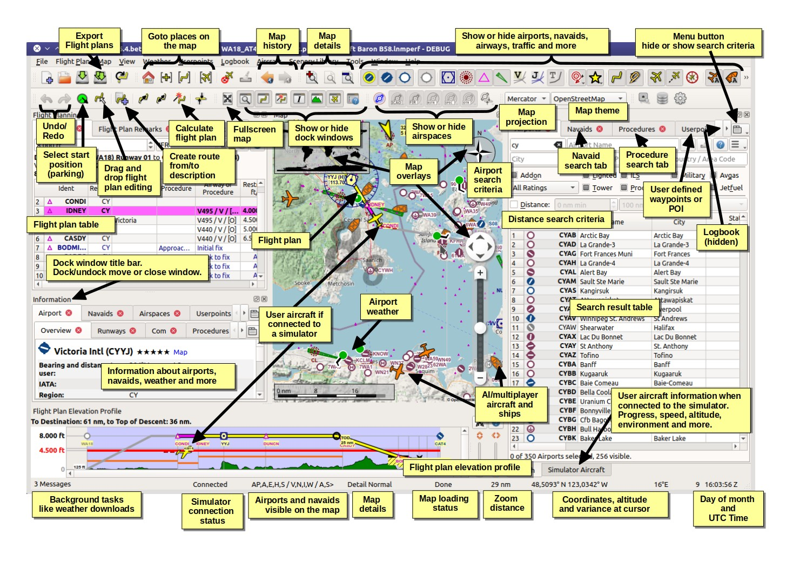
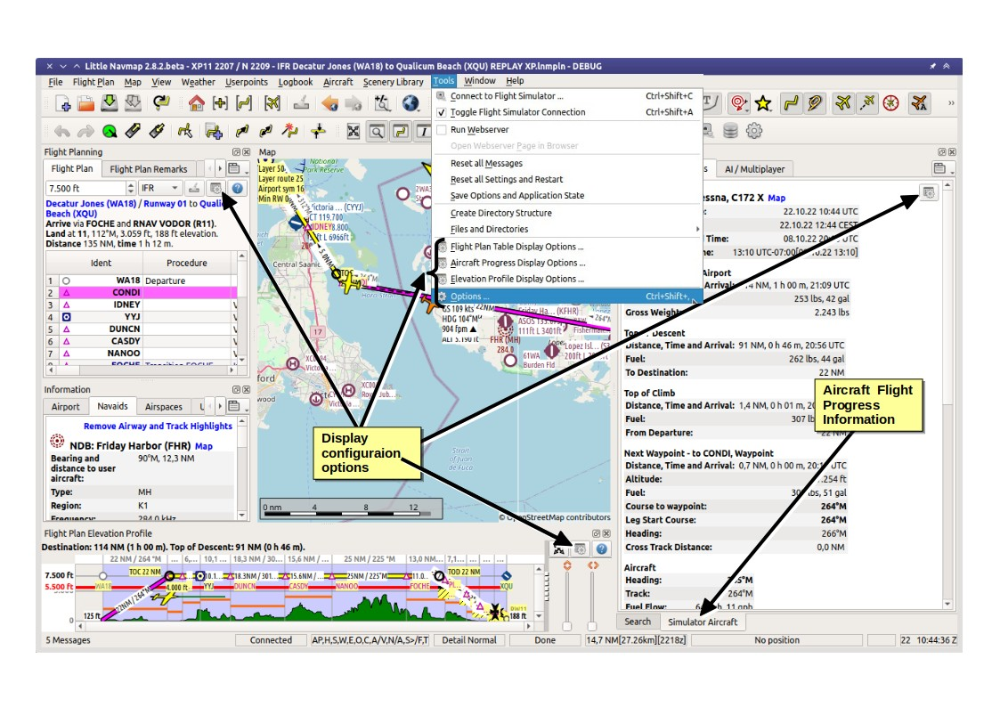
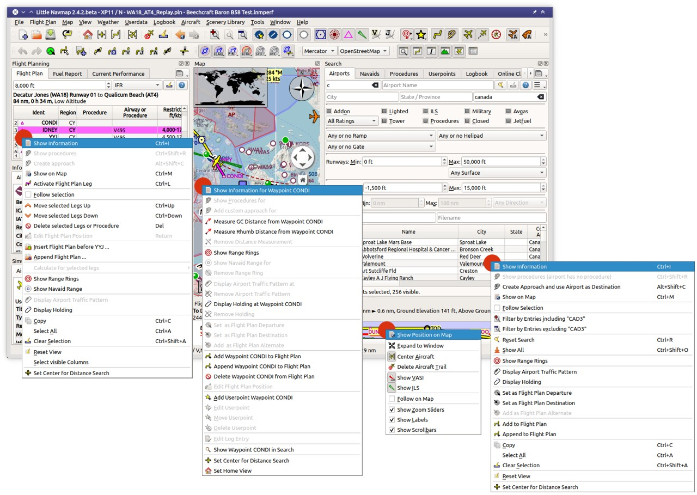

Quick Overview
--------------

Click images to enlarge.

Functions
~~~~~~~~~~~~~~~~~~~~~~~~

  A quick overview of *Little Navmap* showing the most important functions. *Click image to enlarge.*

  A quick overview of *Little Navmap* showing configuration options and aircraft progress. *Click image to enlarge.*

Context Menus
~~~~~~~~~~~~~~~~~~~~~~~~

*Little Navmap* makes extensive use of context menus, which are used on the map, on the flight plan table and search result tables.

See also :ref:`ui-contextmenus`.

  The most important context menus which are can be used to build a flight plan, navigate the map or show information.
  Image based on *Little Navmap* 2.4.5. *Click image to enlarge.*

Help
~~~~~~~~~~~~~~~~~~~~~~~~

There are many ways to get help in *Little Navmap*. The help menu links to the most important
online pages as well as the included user manual.

Hove the mouse cursor above a button or input field to get help in form of tooltips (small pop up windows).

See also :ref:`help`.

.. figure:: ../images/help.jpg
  :scale: 50%

  Where to get help and more information. Tooltips, status bar and help buttons marked red.
  Image based on *Little Navmap* 2.4.5. *Click image to enlarge.*

