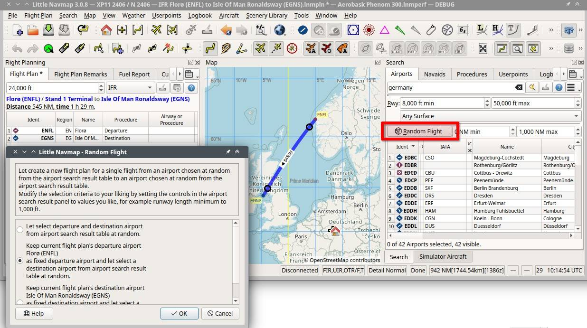

Random Flight Generation
-------------------------------------

This function is a part of the airport search tab and can be started from the menu item ``Flight Plan`` -> :ref:`generate-random-flight`.
See :doc:`SEARCH` for more information about the airport search.

This allows to select a random departure and destination based on the current airport search result and
the departure and destination airport in the flight plan.

A progress dialog allowing to cancel the selection is shown if the process takes longer.
Once done the user can accept the departure/destination pair or start a new calculation.

Adjust the airport search to get appropriate airports for your random flight.
You can select a minimum runway length or procedures required, for example.

A dialog window is shown where you can select either a fixed departure or a fixed destination
airport for the random flight generation. Add at least one airport to your flight plan to enable this
function.

The random flight generation puts the change on the undo/redo stack once you accept a
generated flight. This is the same behavior as used in the flight plan route description which
allows to restore a previous flight plan and its changes by clicking the item :ref:`undo-redo` in the menu ``Flight Plan``.

Note that the maximum distance for random flight plan is 10.800 NM.

You can refine the flight plan further by running the :doc:`ROUTECALC` to get airways or intermediate navaids,
selecting procedures (:doc:`SEARCHPROCS`) or :doc:`PARKINGPOSITION`.

  Generating a random flight from a search result showing all airports in Germany, having 8,000
  feet minimum runway length. The selection will generate a random flight from the current departure
  airport Florø (ENFL) with a maximum lenght of 1,000 NM.
  *Click image to enlarge.*

.. figure:: ../images/randomflight.jpg
  :scale: 50%

  Generating a random flight from a search result showing all airports in Germany, having 5,000
  feet minimum runway length and are neither closed nor military. *Click image to enlarge.*
