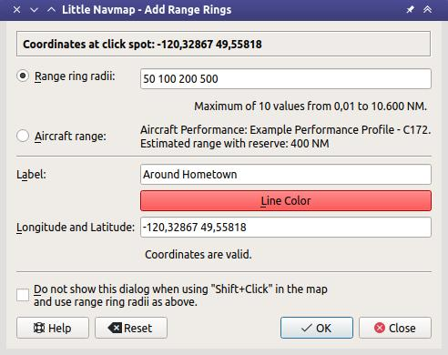
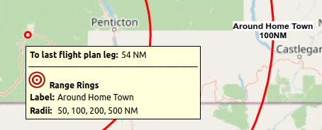

|Add Range Rings| Range Rings
---------------------------------------------

Opens a dialog which allows to set the parameters for one or more range rings.

The dialog window contains the following input fields:

-  ``Range ring radii``: Radii for the ranges. A ring and an attached label is drawn for each number.
   A maximum of 10 values from 0.01 to 10,600 NM can be entered.
-  ``Aircraft range``: Displays one range ring for the aircraft endurance based on the current aircraft performance profile.
   The endurance is static and does not change with current user aircraft parameters.
   It is calculated from usable fuel, cruise fuel flow, true airspeed at cruise, reserve fuel and contingency fuel as set in the :doc:`AIRCRAFTPERF` file.
   See also :ref:`show-aircraft-endurance-map` for another way to display a dynamic range based on actual user aircraft parmeters like fuel on board.
-  ``Label``: An additional label which is attached to the rings.
-  ``Line Color``: Color for range rings and labels.
-  ``Latitude and Longitude``: Pre-filled with the coordinates at the click spot but can be changed freely.
   See :doc:`COORDINATES` for supported formats. The label below shows the translated coordinates as selected in the
   options dialog on page :ref:`options-units` or an error message.
-  ``Do not show this dialog when using "Shift+Click" in the map and use range ring radii as above.``: Places a range ring with the given
   parameters at the click position ``Shift+Click`` without showing this dialog when checked.
   Use the map context menu item :ref:`show-range-rings` to force the dialog to show up.
-  ``Help``: Shows this help page in the online user manual.
-  ``Reset``: Resets all options like numbers and color back to default.
-  ``Ok``: Closes dialog and adds one or more range rings. The dialog keeps all settings.
-  ``Close``: Closes the dialog without adding range rings but keeps all settings.

*Little Navmap* shows a tooltip with information about the range ring when hovering the mouse above the hotspot (white filled circle)
in the center.

The width of all range ring lines can be changed in the dialog ``Options`` on page :ref:`options-map-user`.

The display of range rings is automatically enabled in menu ``View`` -> ``User Features`` -> :ref:`user-range-rings` after using this function.

Remove a ring by doing a second ``Shift+Click`` at the center or right click on the center and select :ref:`remove-user-map`.

   Range rings dialog.

   A label indicates the radius of each ring and tooltip shown at center hotspot.

.. |Add Range Rings| image:: ../images/icon_rangerings.png
