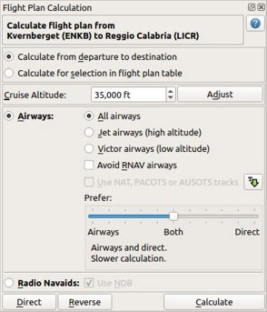
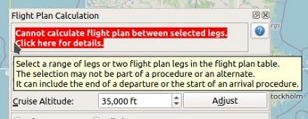

|Calculate  Flight Plan| Flight Plan Calculation
----------------------------------------------------

The route calculation is done in a window which is opened from
menus -> ``Flight Plan`` -> :ref:`calculate-flight-plan`.

The window can be put behind the *Little Navmap* main window. Click the toolbar button
|Calculate  Flight Plan| again to bring it into front.

The window can be used to calculate the following:

-  Whole flight plans from start to destination.
-  Routes between selected waypoints in the flight plan table.

You have to build the route again by pressing the button :ref:`routecalc-calculate` after changing any parameters.

.. important::

      Although this happens rarely: Always check the flight plan for reversals or zig-zag guidance,
      especially when using procedures.
      Delete waypoints manually if you find such cases.

.. tip::

     Select departure and arrival procedures like SID and STAR before calculating a flight plan.
     This allows *Little Navmap* to calculate the shortest plan between SID exit and STAR entry points.

     Enable airspace display (:ref:`show-victor-airways` and :ref:`show-jet-airways`) to see which SID and STAR
     end or start at airways.

    Flight Plan calculation floating window. Flight plan is valid for calculation.

Window Header
~~~~~~~~~~~~~~~~~~~~~~~~~~~~~~~~~~~~~~

Shows departure and destination as well as the direct Great Circle distance and the flight plan distance.

An error message is shown if the plan cannot be calculated.
Click on the tooltip or hover the mouse cursor above to see more details.

    Error message with tooltip showing details.

.. _routecalc-departure-to-destination:

Calculate from departure to destination
~~~~~~~~~~~~~~~~~~~~~~~~~~~~~~~~~~~~~~~~

Calculates a flight plan between departure and destination.

The dialog header will show a red error message if the flight plan is not valid for calculation.
Hover the mouse cursor over the message or click it for details.

Procedures are not affected by this calculation method. The route will be built from SID exit to
STAR or approach entry, if present.

The selected cruise altitude will be used to find airways with suitable restrictions.

.. _routecalc-selection:

Calculate for selection in flight plan table
~~~~~~~~~~~~~~~~~~~~~~~~~~~~~~~~~~~~~~~~~~~~~

This button is only valid when more than one flight plan leg is selected
and neither the first nor the last selected leg is part of a procedure.

A selection is also valid for the last leg of a departure procedure or for the first leg of an arrival procedure.

The dialog header will show an error message if the selected range is not valid for calculation.

You can either select the first and the last leg (``Ctrl+Click``) in the :ref:`flight-plan-table`
or you can select a whole range of legs (``Shift+Click`` and drag) for route calculation.

The route will be calculated in a way that the first and last selected navaids are not modified.

The new calculated range will be selected in the table once calculation is done.

.. _routecalc-cruise-alt:

Cruise altitude for calculation
~~~~~~~~~~~~~~~~~~~~~~~~~~~~~~~~~~~~~~~~~~~~~

Sets the cruise altitude which will be used to select airways based on their lower and
upper altitude limits when calculating the route.
Changing cruise altitude for calulation can result in shorter or better airway routes.

The value will be assigned to the flight plan (:ref:`flight-plan-altitude`) after calculation.

This field is updated from the current flight plan when opening the window or changing the cruise altitude in the field
:ref:`flight-plan-altitude` in the flight plan window.

.. important::

    The calculation might fail if using too low or too high values for the cruise altitude. Make sure that you use a
    sufficiently high altitude which matches the selected airway type (High or Low).

.. _routecalc-adjust:

Adjust
~~~~~~~~~~~~~~~~~~~~~~~~~~~~~~~~~~~~~~~~~~~~~

Changes the flight plan altitude according to a simplified East/West
rule and the current route type (IFR or VFR).

Same as :ref:`adjust-flight-plan-alt`.

.. _routecalc-airways:

Airways
~~~~~~~~~~~~~~~~~~~~~~~~~~~~~~~~~~~~~~~~~~~~~

Selects the airway calculation method and enables all fields to the right of this button.

This method uses airways and/or direct waypoint connections to build a route.
Which connection type is selected depends on settings in :ref:`routecalc-prefer`.

Criteria for airway selection are always direction for one-way airways and altitude restrictions.

.. note::

   Changing cruise altitude for calulation can result in shorter or better airway routes. Try to adjust this
   if the result of the calculation is not satisfying.

   You can also put the slider :ref:`routecalc-prefer` more to the right to ignore airways or use direct routing between
   waypoints for regions void of suitable airways.

All Airways
^^^^^^^^^^^^^^^^

Calculation will select any appropriate high or low airways for the route.

High airways (Jet)
^^^^^^^^^^^^^^^^^^^^^^^^^^^^^^^^^^^^^

Limit calculation to Jet or high altitude airways. Calculation might fail if using a too low cruise altitude.

Low airways (Victor)
^^^^^^^^^^^^^^^^^^^^^^^^^^^^^^^^^^^^^

Limit calculation to Victor or low altitude airways. Calculation might fail if using a too high cruise altitude.

.. _routecalc-rnav:

Avoid RNAV airways
^^^^^^^^^^^^^^^^^^^^^^^^^^^^^^^^^^^^^

Check this for non-RNAV equipped aircraft. This will select only airways which can be followed by using
radio navaids like VOR or NDB.

Calculation might fail or give unexpected results if this is selected unintentionally.

.. _routecalc-use-tracks:

Use NAT, PACOTS or AUSOTS tracks
^^^^^^^^^^^^^^^^^^^^^^^^^^^^^^^^^^^^^

The calculation will also consider tracks like NAT, PACOTS or AUSOTS, if selected. This button is
disabled if no tracks were downloaded.

See :doc:`TRACKS` for more information.

.. important::

        You have to use the correct cruise flight altitude in your flight plan.
        This has to match the track levels shown in the information window. Otherwise, tracks will not be used.

|Download Tracks| Download Tracks
^^^^^^^^^^^^^^^^^^^^^^^^^^^^^^^^^^^^^

Downloads Oceanic or other tracks which are NAT, PACOTS and AUSOTS. Download tracks first before
using the option above.

Same as :ref:`download-tracks`.

.. _routecalc-prefer:

Prefer
^^^^^^^^^^^^^^^^^^^^^

This slider allows to adjust the preference of the calculation method between airways and direct waypoint connections.

Putting the slider on the leftmost position
    instructs the route calculation to use only airways. The
    calculation might fail or give not optimal routes if the region between departure and destination has
    no airways or no appropriate airways for the given cruise altitude.

    This is the fastest calculation method which gives instant results.

    .. figure:: ../images/routecalcairways.jpg

        A flight plan calculated using airways only.
        The flight plan is longer since the region above Austria is void of airways
        due to European airway restructuring.

Putting the slider on an intermediate position
    uses more or fewer airways or direct waypoint connections depending on position.
    Move the slider step by step and calculate again if you're not satisfied with the result.
    Note that not every slider movement will result in a changed route.

    This calculation method is slower depending on the covered region. A progress dialog might pop
    up which allows to cancel the process.

    .. figure:: ../images/routecalcairwaysdirect.jpg

        A flight plan calculated using airways and direct waypoints. The plan uses mostly airways and
        skips the airway void above Austria with direct waypoint connections.

Putting the slider on the rightmost position
    instructs the route calculation to use only direct
    waypoint connections. The calculation ensures that the selected waypoints are not too close
    together and have a distance of around 200 NM where possible.
    Cruise altitude is not relevant for calculation since no airways are used.

    This calculation method is slower depending on the covered region. A progress dialog might pop
    up which allows to cancel the process.

    Note that waypoints are added to the flight plan using certain selection criteria.
    Waypoints being part of a SID or STAR and terminal waypoints will be excluded, for example.

    .. figure:: ../images/routecalcdirect.jpg

        Same plan as above but calculated with the slider on the far right.
        The plan is shorter and uses direct waypoint connections only.

Radio Navaids
~~~~~~~~~~~~~~~~~~~~~~~~~~~~~~~~~~~~~~~~~~~~~

Selects the radio navaid calculation method and enables the field to the right of this button.

Creates a flight plan that uses only VORDME, VORTAC, VOR and optionally NDB stations as waypoints.
This method tries to ensure reception of at least one station along the whole
flight plan.

Note that VOR stations are preferred before NDB stations. Calculation can fail if not
enough radio navaids can be found between departure and destination.
Build the flight plan manually if this is the case.

Use NDB
^^^^^^^^^^^^^^^^^^^^^

Use NDB stations too when selecting navaids for the route when checked. Otherwise, only VORDME, VORTAC and VOR.

Direct
~~~~~~~~~~~~~~~~~~~~~~~~~~~~~~~~~~~~~~~~~~~~~

Deletes all intermediate waypoints and connects departure and
destination using a great circle line.

Does not delete procedures.

Same function as :ref:`calculate-direct`.

Reverse
~~~~~~~~~~~~~~~~~~~~~~~~~~~~~~~~~~~~~~~~~~~~~

Swaps departure and destination and reverses order of all intermediate
waypoints. Deletes airway references and procedures.

Same as :ref:`reverse-flight-plan`.

.. _routecalc-calculate:

Calculate
~~~~~~~~~~~~~~~~~~~~~~~~~~~~~~~~~~~~~~~~~~~~~

Calculates the route considering all the parameters given above.

Airway restrictions quite often do not allow optimal routes. You might have to change the cruise
altitude to get better results.

You might also have to change the slider ``Prefer`` to adjust for airway and direct waypoint connection usage
if not satisfied with the result.

In any case check your flight plan before using it.
Remove wrongly selected waypoints near departure and destination manually.

.. _routecalc-close:

Close
~~~~~~~~~~~~~~~~~~~~~~~~~~~~~~~~~~~~~~~~~~~~~

Closes the window.

|Help| Help
~~~~~~~~~~~~~~~~~~~~~~~~~~~~~~~~~~~~~~~~~~~~~

Opens this chapter in the browsers.

.. |Download Tracks| image:: ../images/icon_airwaytrackdown.png
.. |Adjust Flight Plan Altitude| image:: ../images/icon_routeadjustalt.png
.. |Calculate Flight Plan| image:: ../images/icon_routecalc.png
.. |Help| image:: ../images/icon_help.png
