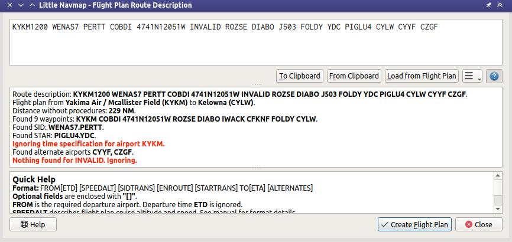

Flight Plan Route Description
-----------------------------

This dialog allows you to create a flight plan from a route description string consisting of airport and navaid idents
as generated or provided by various online services.

Click ``Load from Flight Plan`` to generate the route string from the currently loaded flight plan.

The top of the dialog holds the route description input field,
while the center half shows any messages, warnings or errors that occur
during reading. The string is read automatically while entering it into the input field.
The lower part provides a quick help.

The menu button |Menu Button| provides a dropdown menu than can be used
to customize the generated route string.

*Little Navmap* tries to use as much of the route as possible
even if parts of the flight plan like waypoints or airways cannot be
found or names are ambiguous. You will see warnings in the center output field
if that is the case.

If a route covers a long distance and contains a waypoint name which is
not unique, a wrong waypoint might be added to the flight plan. Correct
or remove this waypoint manually.

Many waypoints and airways will not be found if route descriptions from
the latest AIRAC sources are used together with the old FSX, P3D or MSFS stock data.
It is recommended to use a navigation data update for the stock
scenery or *Little Navmap* when reading route descriptions from online sources like
`RouteFinder <http://rfinder.asalink.net/>`__, `Online Flight Planner <http://onlineflightplanner.org/>`__,
`SimBrief <https://www.simbrief.com>`__ or `SkyVector <https://skyvector.com>`__.

If a navdata update is not an option, pick the online service's AIRAC
cycle that is closest to the cycle the navigation data of your flight
simulator is based on.

Note that even flight plans calculated in *Little Navmap* cannot be
converted back exactly in some cases. This happens due to navaid
ambiguities like NDB and VOR stations having the same names or errors in
the source data.

The cruise altitude is used to create the flight plan, if
given. Otherwise the cruise altitude is automatically determined by the
flight plan type (IFR or VFR) and the minimum altitude of the used
airway segments.

The cruise speed is ignored when reading and produces a warning if found since it is taken from the aircraft performance.
Generating a description from a present flight plan uses the cruise speed from the loaded aircraft
performance file (:doc:`AIRCRAFTPERF`) and the cruise altitude as set in :ref:`flight-plan-altitude`.

Note that you can modify the flight plan in parallel on the map or in the flight plan table. Move
the ``Flight Plan Route Description`` aside to do so.
You have to transfer the plan to the dialog by clicking ``Load from Flight Plan`` after doing changes in the background.
Click ``Create Flight Plan`` before doing changes on the map or in the flight plan table.

          A route description that was read successfully with
          a few warnings about ignored elements. The waypoint ``INVALID`` could not be
          found. Altitude, SID and STAR were recognized.

Buttons
~~~~~~~

-  ``To Clipboard``: Copy the current description as plain text to the clipboard.
-  ``From Clipboard``: Insert text from clipboard into the input field.
   The inserted text is converted to upper case and all invalid
   characters are removed from the text before reading.
-  ``Load from Flight Plan``: Create the route string from the current
   flight plan. Use this after changing settings with drop down
   menu button or after modifying the flight plan on the map or in the flight plan table.
-  Menu Button |Menu Button|: ``Write`` denotes flight plan to
   description and ``Read`` denotes description to flight plan.
   You can tear off the drop down menu from the button by clicking on the dashed line on top of it.

   -  ``Write departure and destination airport``: Note that disabling
      this option will result in an invalid route description which cannot be read
      back into a flight plan.
   -  ``Write DCT (direct) instructions``: Add ``DCT`` for any direct
      waypoint connections in the flight plan.
   -  ``Write cruise speed and altitude instruction``: Add cruise
      altitude from flight plan and speed as set in the aircraft performance.
   -  ``Write waypoints instead of Airways``: Does not include airway names in the string
      but expands it and inserts the waypoints names only.
   -  ``Write Alternates``: Appends all alternate airports to the end of
      the description.
   -  ``Write SID and STAR``: Add SID and STAR names, if any are used for
      departure or arrival.
   -  ``Write generic SID and STAR``: Add the generic ``SID`` and
      ``STAR`` keywords if no real SID and/or STAR were selected.
   -  ``Write no SID and STAR``: Do not include any SID and STAR information at all.
   -  ``Write STAR and transition reversed``: Write ``TRANS.STAR`` instead of ``STAR.TRANS`` if selected.
   -  ``Write SID/STAR and transition space separated``: Write ``SID TRANS`` and
      ``STAR TRANS`` instead of ``SID.TRANS`` and ``STAR.TRANS`` if selected.
   -  ``Read trailing Airports as Alternates``:

      -  Enabled: A list of airports at the end of the description will
         be read as alternate airports except the first in the chain of
         consecutive airports which will be used as destination. Any
         airport with a valid STAR in the chain will be treated as
         destination too.
      -  Disabled: Reading simply creates a flight plan with the
         airports as intermediate waypoints and the last one as
         destination. See example below.

   -  ``Read first and last item as navaid``: Does not require airports as start and destination and will
      resolve the first and last item to navaids. Useful for reading snippets.
   -  ``Read: Match coordinates to waypoints``: Tries to matches coordinates to nearby waypoints.
      ``EICK 5000N00760W EDDF`` will result in ``EICK GAPLI EDDF`` if this is enabled, for example.

-  ``Create Flight Plan``: Closes the dialog and creates a new flight
   plan for the parsed route description and replaces the current plan.
   You have to click ``Read Route Description`` before you can create a
   flight plan.

.. tip::

   In any case you can use Undo and Redo to change the input field (right click context menu in the input field)
   as well as in the flight plan table (:ref:`undo-redo`).

.. _routedescr-airport-ident:

Airport idents
~~~~~~~~~~~~~~~~~

ICAO, FAA, IATA and local codes are shown and the internal ident is avoided for display if possible.
Note that IATA codes are only read for departure and destination since they can be easily confused
with navaids en-route.

X-Plane internal codes like ``XPA000B`` are recognized despite being avoided for display.

Format
~~~~~~

The route description has to follow the format rules below:

``FROM[ETD] [SPEEDALT] [SIDTRANS] [ENROUTE] [STARTRANS] TO[ETA] [ALTERNATES]``

All elements in square brackets are optional.

-  ``FROM`` and ``TO``: These are the required 3 or 4 letter idents for departure and destination airports. Departure time ``ETD`` or arrival time ``ETA`` is ignored.  Examples: ``KEAT``, ``CYPU``, ``S16``.
-  ``ALTERNATES``: Alternate airports are optional and are added to the flight plan when reading depending on the option ``Read trailing Airports as Alternates`` as described above.
-  ``SPEEDALT``: An optional entry that contains the cruise speed and altitude. See below for a details. Speed is ignored when reading since it is part of the aircraft performance profile.
-  ``ENROUTE``: This is a list of either ``WAYPOINT`` or an ``AIRWAYWAYPOINT`` forming the actual flight plan. The first entry has to be an airport, waypoint, VOR or NDB.
-  ``WAYPOINT``: A waypoint, VOR, NDB, airport or user defined coordinates. See below for a details about coordinates. A waypoint can be prefixed with ``DCT`` to indicate a direct connection not using an airway. Waypoints can be suffixed with an optional ``/SPEEDALT`` value although this is ignored. Examples: ``TAU``, ``BOMBI``, ``AST``, ``CL``, ``EDDF``.
-  ``AIRWAYWAYPOINT``: Airway and end waypoint on the airway separated by a space.  Examples: ``V495 CONDI``, ``V338 YVR``, ``V330 TRENA``.
-  ``SIDTRANS``: Either the word ``SID`` or real SID, STAR and transition names where the optional transition is separated by a dot ``.`` or a space `` ``. The generic keyword ``SID`` creates a direct connection to the en-route part.  Examples: ``RDHK2.HOLLE``, ``OHIO3 LFK``, ``RDHK2``, ``OHIO3``.
-  ``SIDTRANS``: Either the word ``SID`` or real SID and transition names where the optional transition is separated by a dot ``.`` or a space `` ``. The generic keyword ``SID`` creates a direct connection to the en-route part.  Examples: ``RDHK2.HOLLE``, ``OHIO3 LFK``, ``RDHK2``, ``OHIO3``.
-  ``STARTRANS`` is either the word ``STAR`` or a read STAR and an optional transition which can be given as ``STAR.TRANS``, ``STAR TRANS``, ``TRANS.STAR`` or ``TRANS STAR``. The generic keyword ``STAR`` creates a direct connection from the en-route part to the airport.

Features not supported
^^^^^^^^^^^^^^^^^^^^^^

``ETD`` and ``ETA``: Four digit departure and arrival time attached to
the airport or waypoint ident are ignored.

``WAYPOINT.SPEEDALT``: For example ``BOMBI/N0090A060``. Altitude changes
at waypoints are not supported and ignored when reading.

Further extensions like runway and approaches are not supported.

Alternates
^^^^^^^^^^

**Example when reading** ``Read trailing Airports as Alternates`` **enabled:**

-  ``KPWA N0169F190 MUDDE3 ATOKA J25 FUZ J33 CRIED J50 LFK BAYYY3.SJI KHOU KCLL KVCT``
-  ``KPWA ATOKA J25 FUZ J33 CRIED J50 LFK KHOU KCLL KVCT``

``KHOU`` is read as destination, ``KCLL`` and ``KVCT`` are alternates
for both examples.

**Example when reading** ``Read trailing Airports as Alternates`` **disabled:**

-  ``KPWA N0169F190 MUDDE3 ATOKA J25 FUZ J33 CRIED J50 LFK BAYYY3.SJI KHOU KCLL KVCT``

Not valid. Error message ``BAYYY3.SJI not found`` printed. ``KVCT`` is
read as destination, ``KHOU`` and ``KCLL`` are intermediate waypoints.

-  ``KPWA ATOKA J25 FUZ J33 CRIED J50 LFK KHOU KCLL KVCT``

``KVCT`` is read as destination, ``KHOU`` and ``KCLL`` are intermediate
waypoints.

Speed and Altitude
^^^^^^^^^^^^^^^^^^

Cruising ground speed and cruising level not separated by a space.

Speed is prefixed with:

-  ``K``: Kilometers per hour followed by a four digit value.
-  ``N``: Knots followed by a four digit value.
-  ``M``: Mach followed by a three digit value. The mach value is converted to knots ground speed assuming standard atmosphere conditions at the given flight altitude.

Altitude is prefixed with:

-  ``F`` :Flight level in three digits.
-  ``S``: Metric flight level in three digits of tens of meters.
-  ``A``: Altitude in hundreds of feet in three digits.
-  ``M``: Altitude in tens of meter in four digits.

Examples:

``N0410F310`` 410 knots at flight level 310.

``M071F320`` Mach 0.71 at flight level 320.

``K0790M0710`` 790 kilometers per hour at 7,100 meters.

Coordinates
^^^^^^^^^^^

Coordinates can be supplied in different formats:

**Degrees** only (7 characters): Two digits and north/south indicator
plus three digits and east/west indicator.

Example: ``51N010E``

**Degrees and minutes** (11 characters): Two digits degrees, two digits
for minutes and north/south indicator. Then three digits for degrees,
two digits for minutes and east/west indicator.

Example: ``4010N03822W``.

**Degrees, minutes and seconds** (15 characters): Two digits degrees,
two digits for minutes, two digits for seconds and north/south
indicator. Then three digits for degrees, two digits for minutes, two
digits for seconds and east/west indicator. This format is used by
`SkyVector <https://skyvector.com>`__ for example.

Example: ``481200N0112842E``.

**ARINC 424 Code Convention**: All full degree waypoints either a part of the navigation database or not.

Examples: ``57N30`` (N57 W130) or ``5730S`` (S57 W030).

**North Atlantic track points** (NAT). Two digits degrees north and two
digits degrees west followed by character ``N``.

Example: ``5010N``.

**Coordinate waypoint pairs** with degrees and minutes as above and
prefixed with north/south and east/west indicator.

Examples: ``N4200 W02000`` or ``N4200/W02000``.

**Garmin GFP format** (13 characters) north/south indicator, two digits
degrees, three digits for minutes by 10. Then east/west indicator, three
digits degrees, three digits minutes by 10. This format is used by the
*Flight1 GTN 650/750*.

Example: ``N48194W123096``

.. _examples:

Flight Plan Description Examples
~~~~~~~~~~~~~~~~~~~~~~~~~~~~~~~~

Frankfurt Main (EDDF) to Fiumicino (LIRF):

**Direct connection:**

``EDDF LIRF`` or ``EDDF DCT LIRF``.

**VOR to VOR:**

``EDDF FRD KPT BOA CMP LIRF``.

**Same as above with departure time (** ``ETD`` **) and arrival time
(** ``ETA`` **) which both will be ignored:**

``EDDF1200 FRD KPT BOA CMP LIRF1300``.

**Same as above on flight level 310 at 410 knots:**

``EDDF N0410F310 DCT FRD DCT KPT DCT BOA DCT CMP DCT LIRF``

**Using Jet airways:**

``EDDF ASKIK T844 KOVAN UL608 TEDGO UL607 UTABA UM738 NATAG Y740 LORLO M738 AMTEL M727 TAQ LIRF``

**Same as above on flight level 310 at mach 0.71 with an additional
speed and altitude at** ``NATAG`` **which will be ignored:**

``EDDF M071F310 SID ASKIK T844 KOVAN UL608 TEDGO UL607 UTABA UM738 NATAG/M069F350 Y740 LORLO M738 AMTEL M727 TAQ STAR LIRF``

**User defined waypoints with degree/minute notation and an alternate
airport** ``LIRE`` **:**

``EDDF N0174F255 4732N00950E 4627N01019E 4450N01103E LIRF LIRE``

**Flight plan using SID and STAR procedures with transitions:**

``KPWA RDHK2.HOLLE ATOKA J25 FUZ J33 CRIED J50 LFK OHIO3.LFK KHOU``

**Flight plan using the generic SID and STAR keywords:**

``KPWA SID ATOKA J25 FUZ J33 CRIED J50 LFK STAR KHOU``

**Flight plan using SID and STAR procedures with transitions and two
alternate airports:**

``KPWA N0169F190 MUDDE3 ATOKA J25 FUZ J33 CRIED J50 LFK BAYYY3.SJI KHOU KCLL KVCT``

.. |Menu Button| image:: ../images/icon_menubutton.png

