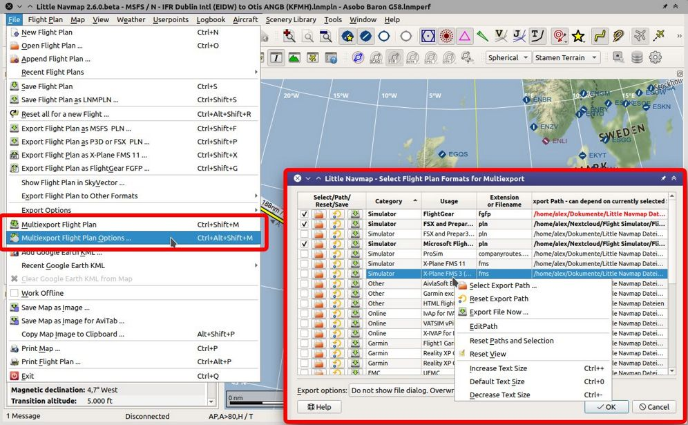
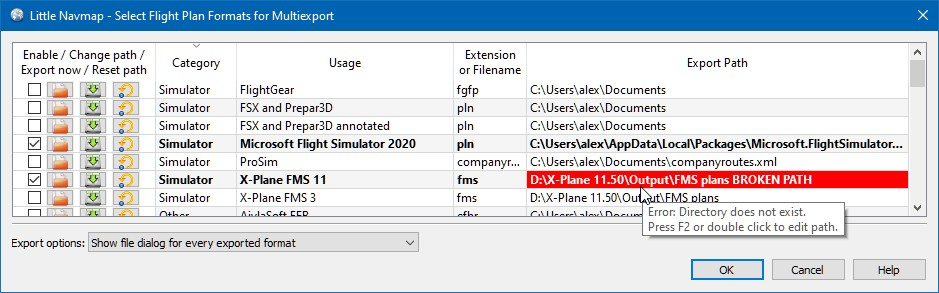

Flight Plan Multiexport
-------------------------

Multiexport simplifies flight plan export and enables saving to several formats at once with a
single click into the toolbar, a click into the menu (``File`` -> |Multiexport Flight Plan|
:ref:`multiexport-flight-plan`) or using the keyboard shortcut ``Ctrl+Shift+M``.

The dialog makes use of tooltips. Hover the mouse cursor above rows and buttons for more information.

    Overview of the multiexport features with the related menu items highlighted. Screenshot based on *Little Navmap* 2.6. *Click image to enlarge.*

.. _multiexport-quick-setup:

Quick Setup
~~~~~~~~~~~~~~~~~~~~~~~~~~~~~~~~~~~~~~~~~~~~~~~~~~~~~

The export function is disabled initially until at least one format is enabled for export in ``File`` ->
|Multiexport Flight Plan Options| :ref:`multiexport-flight-plan-options`.

Export paths are pre-filled where known. This is done when first opening the dialog
and considers the current simulator selection (:ref:`scenery-library-menu`). A best guess is used if not applicable.

Adapt the default paths if needed. You can edit a path by double clicking on it or using the
button |Select Export Path| which will open a file dialog for selection.

The footer line below the table shows error messages and an example export file name and path.

Check the box on the left of a row or use the context menu to enable for a format for export.
The row text will be shown bold if enabled.

Adjust the selection in :ref:`multiexport-export-options` and choose if you like to overwrite files or if you would like
to see a file dialog for each saved format.

Click ``Ok`` when done.

The flight plan will be exported when using menu ``File`` -> :ref:`multiexport-flight-plan` if a correct path is
entered and the box is checked.

.. tip::

    You can also export flight plans manually from the multiexport options dialog by clicking on the button |Export
    Flight Plan now| :ref:`multiexport-menu-export`.

.. note::

    Note that *Little Navmap* does not clean up the exported directories. All old flight plans remain
    and have to be removed manually from time to time.

    Consider exported flight plan files as disposable since almost all the export formats have limitations
    resulting in data loss. Remember that you can always restore them by loading the original LNMPLN
    file and exporting again.

See also :doc:`FLIGHTPLANFMT` for more information on the supported flight plan formats.

.. _multiexport-file-names:

File Names
~~~~~~~~~~~~~~~~~~~~~~~~~~~~~~~~~~~~~~~~~~~~~~~~~~~~~

Saving LNMPLN
    The default file name used when saving LNMPLN files using the functions :ref:`save-flight-plan` or :ref:`save-flight-plan-as` can be set in the options dialog on page ``Flight Plan``. See :ref:`flight-plan-pattern`.

Export other Formats
     *Little Navmap* always uses file names based on the pattern set in the column ``File Name Pattern and Extension`` when running an multiexport or starting an export from the menu ``File``.

.. _multiexport-export-lnmpln:

Exporting Little Navmap native flight plan format
~~~~~~~~~~~~~~~~~~~~~~~~~~~~~~~~~~~~~~~~~~~~~~~~~~~~~

Exporting the ``Little Navmap native flight plan format``  with file extension LNMPLN via multiexport is a special
case compared to the other formats. Enabling this for export saves you a few extra clicks for storing the file.

The following happens if LNMPLN is saved with multiexport:

-  The file name is automatically assigned by using the selected pattern in the options dialog on page :ref:`flight-plan` (:ref:`flight-plan-pattern`).
   If the file was already saved with another name when doing :ref:`save-flight-plan-as` or :ref:`save-flight-plan` then this name is used.
-  *Little Navmap* saves the file into the path set in the multiexport options dialog.
-  The current file is marked as clean. This means that the ``*`` is cleared from the window title
   and *Little Navmap* will not ask to save the file once exiting or creating a new plan.
-  Further saves (menu ``File`` -> :ref:`save-flight-plan`) will use the automatically assigned file name and path.

See also :ref:`flight-plan-formats-lnmpln`.

.. note::

   Always save a copy in the default LNMPLN format before exporting to other
   formats. This allows *Little Navmap* to restore all flight plan
   properties like procedures, alternate airports and remarks.

   Note that the LNMPLN format is only understood by *Little Navmap*.
   Do not try to load it into simulators or add-ons.

.. _multiexport-errors:

Path Errors
~~~~~~~~~~~~~~~~~~~~~~~~~~~~~~~~~~~~~~~~~~~~~~~~~~~~~

The path is highlighted red once a format is enabled for export with a non existing directory or
file. Hover the mouse above the path to see more detailed error messages.

Directories (files for some export formats) have to exist for the export to work.

      Error message in tooltip for X-Plane FMS export. Hover mouse cursor above red text to see this.
      Also selected is the MSFS flight plan export without path errors.

.. _multiexport-running:

Running Multiexport
~~~~~~~~~~~~~~~~~~~~~~~~~~~~~~~~~

A dialog is shown, if any unsupported features are detected in the
current flight plan when trying to save a plan. You can disable this
dialog for future saves.

Pressing ``Cancel`` in this dialog stops the export. No files will be exported.

Depending on the setting in the :ref:`multiexport-export-options` button *Little Navmap* will also show a file dialog for each exported file.

You can enable saving of waypoints by checking the menu items
:ref:`export-flight-plan-approach-waypoints`,
:ref:`export-flight-plan-sid-star-waypoints` or
:ref:`export-flight-plan-airway-waypoints`.
These three options affects all flight plan export formats except the native LNMPLN format.

.. _multiexport-options:

Multiexport Options Dialog
~~~~~~~~~~~~~~~~~~~~~~~~~~~~~~~~~

Export Format Table
^^^^^^^^^^^^^^^^^^^^^^^^^^^^^^^^^^^^

You can click on the table headers to sort the content. Tooltips as well as the footer line below the table give more information on
formats and path errors.

Columns can be moved and resized by clicking and dragging the table header.
The table layout is saved and can be reset by choosing :ref:`multiexport-menu-reset-view` in
the context menu of the table.

See :ref:`ui-tables` for general information on tables.

Enable / Change Path / Export Now / Reset Path
'''''''''''''''''''''''''''''''''''''''''''''''''''

The first column contains several buttons which provide the same functions as the context menu.

.. _multiexport-enable:

Checkbox
==============================================================

The checkbox on the far left enables the respective format for export and highlights the row in
bold text. Path errors are only shown if the format is enabled.

.. _multiexport-select-path:

|Select Export Path| Select Export Path
==============================================================

Opens a file or directory selection dialog to enter the path. Some export formats need a file to
append flight plan information instead of a directory to save a file.

.. _multiexport-export-now:

|Export Flight Plan now| Export Flight Plan now
==============================================================

Opens a file dialog for immediate export of the current flight plan.
You can also export formats which are not enabled.

.. _multiexport-export-reset:

|Reset Export Path| Reset Export Path
==============================================================

Resets the path back to default.
The default path is determined by the current scenery library or simulator selection.
If not applicable, the best estimate from installed simulators and :ref:`scenery-library-menu` selection is used.

Category
'''''''''''''''''''''''''''''''''''''''''''''

Category for the export format.

Usage
'''''''''''''''''''''''''''''''''''''''''''''

Short description of the export format and the product for which it is used.

Filename Pattern and Extension
'''''''''''''''''''''''''''''''''''''''''''''

The pattern is used to build filenames when exporting flight plans.
The file suffix like ``.lnmpln``, ``.pln`` or ``.fgfp`` is a part of the pattern.

The following keywords are recognized:

-  ``PLANTYPE``: ``IFR`` or ``VFR``
-  ``DEPARTIDENT``: Departure airport ident.
-  ``DEPARTNAME``: Departure airport name.
-  ``DESTIDENT``: Destination airport ident.
-  ``DESTNAME``: Destination airport name.
-  ``CRUISEALT``: Cruise altitude.

Keywords are case sensitive and have to be entered in upper case. All other characters are are used as entered.

Double click or press the key ``F2`` to edit the file pattern directly.

An example filename and error messages are shown in the dialog footer below the table.

**Examples** (``Filename Pattern and Extension``, ``Export Path`` and result):

``DEPARTIDENT-DESTIDENT.fms``, ``X-Plane 11/Output/FMS plans``:
  ``X-Plane 11/Output/FMS plans/EDDF-LIRF.fms``

``DEPARTIDENT-DESTIDENT X-Plane 12 Beta at CRUISEALT.fms``, ``X-Plane 12/Output/FMS plans``:
  ``X-Plane 12/Output/FMS plans/EDDF-LIRF X-Plane 12 Beta at 10000.fms``

Export Path
'''''''''''''''''''''''''''''''''''''''''''''

Target directory for the exported files.
Double click or press the key ``F3`` to edit the path directly.
You can copy and paste paths from the Windows Explorer into this field, for example.

An example and error messages are shown in the dialog footer below the table.

.. _multiexport-export-options:

Export Options
^^^^^^^^^^^^^^^^^^^^^^^^^^^^^^^^^^^^

Three options can be selected in the drop down box. These apply to all export formats.

Show file dialog for every exported format
'''''''''''''''''''''''''''''''''''''''''''''

Opens a file or directory selection dialog for each enabled export format once
:ref:`multiexport-flight-plan` is used. The dialog allows to cancel an export or change the file
name or path.

Pressing cancel in this dialog does not stop the export process for further formats.

Do not show file dialog. Backup existing files in case of conflict
''''''''''''''''''''''''''''''''''''''''''''''''''''''''''''''''''''''''''''

Present files are backed up to a maximum of four files and the new file is saved in place.
*Little Navmap* does not check for changed files. You might see backups which are equal if you save too often.

**Example:** Saving the plan from ENKB to LICR several times in X-Plane FMS format:

-  Latest plan: ``ENKB-LICR.fms``
-  Backups: ``ENKB-LICR_1.fms``, ``ENKB-LICR_2.fms``, ``ENKB-LICR_3.fms``, ``ENKB-LICR_4.fms``

Do not show file dialog. Overwrite files without warning
''''''''''''''''''''''''''''''''''''''''''''''''''''''''''''''''''''''''''''

Present files with the same name are overwritten. Be careful with this option, especially when
using the :ref:`multiexport-export-lnmpln` option.

This helps to reduce clutter in the output directories but may overwrite flight plan files.

.. warning::

         No backup will be created when saving with this option enabled.

Help
^^^^^^^^^^^

Opens this chapter in the online help.

Ok
^^^^^^^^^^^

Takes over all changes and closes the dialog.

Export Selected Formats
^^^^^^^^^^^^^^^^^^^^^^^^^^^^^

Export all formats without closing the dialog. This is the same as selecting :ref:`multiexport-flight-plan` in the main menu ``File``.

Cancel
^^^^^^^^^^^

Discards all changes except table formatting and closes the dialog.

.. _multiexport-menu:

Context Menu
~~~~~~~~~~~~~~~~~~~~~~~~~~~~~~~~~

Right click into the flight plan format table to open the context menu.

Enable Export
^^^^^^^^^^^^^^^^^

Selects format for multiexport. Same as the :ref:`multiexport-select-path` button.

.. _multiexport-menu-export:

|Export Flight Plan now| Export Flight Plan now
^^^^^^^^^^^^^^^^^^^^^^^^^^^^^^^^^^^^^^^^^^^^^^^^^^

Save the format now. Same as the :ref:`multiexport-export-now` button.

.. _multiexport-menu-select:

|Select Export Path| Select Export Path
^^^^^^^^^^^^^^^^^^^^^^^^^^^^^^^^^^^^^^^^^^^^

.. _multiexport-menu-edit:

Edit Path
^^^^^^^^^^^^^^^^^^^^^^^^^^^

Allows to edit the path directly. This is the same as double clicking into the path field or pressing ``F3``.

.. _multiexport-menu-reset:

|Reset Export Path| Reset Export Path
^^^^^^^^^^^^^^^^^^^^^^^^^^^^^^^^^^^^^^^^^^^^^^

Reset path back to default. Same as the :ref:`multiexport-export-reset` button.

.. _multiexport-menu-edit-pattern:

Edit Filename Pattern
^^^^^^^^^^^^^^^^^^^^^^^^^^^

Edit the filename pattern directly. This is the same as double clicking into the path field or pressing ``F2``.

.. _multiexport-menu-reset-pattern:

Reset Filename Pattern
^^^^^^^^^^^^^^^^^^^^^^^^^^^^^^^^^^^^^^^^^^^^^^

Reset the filename pattern back to default.

.. _multiexport-menu-reset-path-and-selection:

Reset all Paths, Filename Patterns and Selection Stated
^^^^^^^^^^^^^^^^^^^^^^^^^^^^^^^^^^^^^^^^^^^^^^^^^^^^^^^^^^^^^^

Resets all paths and filename patterns back to defaults also considering the current simulator selection.
This is the same as clicking :ref:`multiexport-export-reset` in each row.

Also disables all flight plan formats for export.

.. _multiexport-menu-reset-view:

|Reset View| Reset View
^^^^^^^^^^^^^^^^^^^^^^^^^^^

Resets column size and column order back to default.

.. _multiexport-menu-text-size:

Increase, Decrease and Default Text Size
^^^^^^^^^^^^^^^^^^^^^^^^^^^^^^^^^^^^^^^^^^^

Changes the text size in the table. The size is saved.

.. |Reset View| image:: ../images/icon_cleartable.png
.. |Select Export Path| image:: ../images/icon_fileopen.png
.. |Export Flight Plan now| image:: ../images/icon_filesaveas.png

.. |Multiexport Flight Plan| image:: ../images/icon_filesaveall.png
.. |Multiexport Flight Plan Options| image:: ../images/icon_filesaveallopts.png
