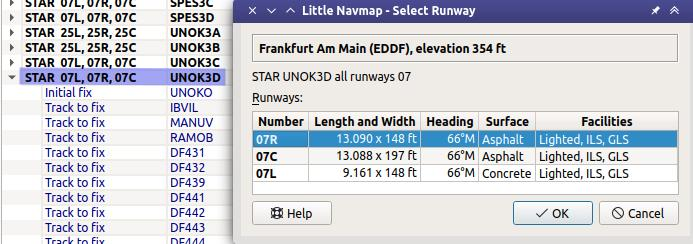

Runwayselection
---------------------------------------------

This dialog shows up after selecting a SID or STAR applicable for parallel runways or all runways.
Parallel runways are indicated in the :ref:`procedure-tree` by a list of runways like ``STAR  07L, 07R, 07C``.
The suffix ``All`` is added if a procedure applies to all runways of an airport.

The dialog header shows airport name and its ICAO ident as well as field elevation.

The list ``Runways`` shows available runways for the SID or the STAR. Columns are runway
name, length, width, magnetic heading, surface, lighting status and other attributes.

Note that the shown runway numbers might differ compared to procedure runways.
This happens when an add-on airport and the navigation data have different runway numbers because the
runways have been renumbered due to changes in magnetic declination (magnetic pole drift).
*Little Navmap* resolves these mismatches internally and still allows to work with procedures.
You might expect issues when loading flight plans containing such discrepancies into add-on aircraft or simulators.

    Runway selection dialog after choosing the STAR ``UNOK3D`` which applies to the three parallel runways ``07R``, ``07C``, and ``07L``.

