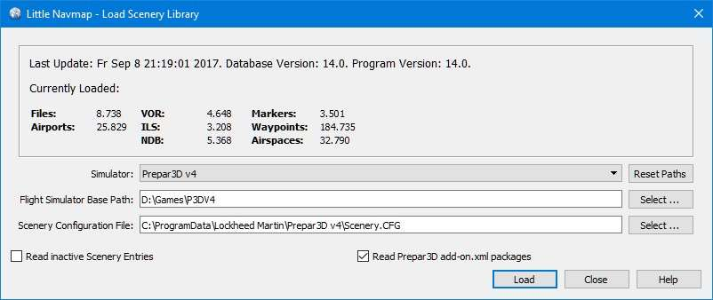
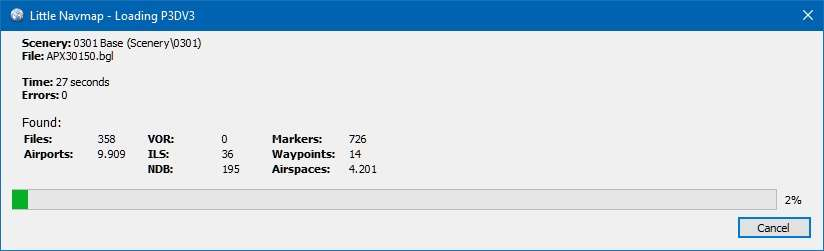

|Load Scenery Library| Load Scenery Library
--------------------------------------------------

This dialog allows loading of the scenery library data from all
supported flight simulators into the *Little Navmap* internal database.
The scenery library to load can be selected in the ``Simulator:`` drop
down box.

The dialog shows information about the currently selected database
including the number of loaded airports, database version and more.

**FSX and Prepar3D:** The base path and the ``scenery.cfg`` path will be
shown in two text edit fields for the currently selected simulator.
These fields are populated automatically, but can be changed to any
other valid location. All values are saved individually for each flight
simulator type.

**Microsoft Flight Simulator 2020:** The base path of the MSFS installation and its
directories ``Community`` and ``Official``
is detected automatically. You can change the path manually if needed.

**X-Plane:** The base path of the first X-Plane installation is
added. Select the base path manually if you like to read the scenery
library of another X-Plane installation. On Windows that can be a path
like ``C:\Simulators\X-Plane 11``, the executable being
``C:\Simulators\X-Plane 11\X-Plane.exe``.

Loading a scenery library can take from 2 to 10 minutes depending on
your setup and amount of scenery add-ons. You can speed this up by
excluding directories containing neither airport nor navigation data in
the ``Options`` dialog on the :ref:`scenery-library-database` tab.

For **FSX and Prepar3D**, all airports that are not located in the default
``Scenery`` directory of FSX/P3D are considered to be add-on airports.

For **X-Plane**, all airports located in the ``Custom Scenery`` directory of
X-Plane are considered to be add-on airports. An exception is ``...\X-Plane 11\Custom Scenery\Global Airports\Earth nav data\apt.dat``

**Microsoft Flight Simulator 2020**: All airports located in the ``Community``
directory and the ``Official\OneStore`` or ``Official\Steam`` are considered to be add-on airports.
Exceptions are ``fs-base`` and ``fs-base-nav``.

Add-on airports are highlighted on the map with a yellow ring which can be disabled
in the options dialog on page :ref:`map-display`.

Using emphasized (bold and underlined) text highlights add-on airports in the search result table,
flight plan table, information windows and map tooltips.

If an add-on only corrects airport elevations or navigation data, it
might be undesirable to display the updated airports as add-on airports
on the map. You can exclude directories populated by this add-on from
the add-on recognition in the ``Options`` dialog on the
page :ref:`scenery-library-database`.

If you cancel the loading process or if the loading process fails, the
previous scenery library database is restored immediately.

The menu ``Scenery Library`` -> :ref:`flight-simulators-menu` is synchronized
with the simulator selection in the dialog. Once a database is
successfully loaded, the display, flight plan and search switch
instantaneously to the newly loaded simulator data.

.. note::

     The final number of airports, navaids and other objects shown
     in the ``Load Scenery Library`` dialog are lower than the counts shown
     in the progress dialog. After the data has been loaded, a
     separate process removes duplicates and deletes stock airports that were
     replaced by add-ons.

**FSX or P3D only:** The program tries to find the base paths and
``Scenery.cfg`` files automatically. The typical locations of the
``Scenery.cfg`` for Windows 7/8/10 are:

-  **Flight Simulator X:** ``C:\ProgramData\Microsoft\FSX\Scenery.cfg``
-  **Flight Simulator - Steam Edition:**
   ``C:\ProgramData\Microsoft\FSX-SE\Scenery.cfg``
-  **Prepar3D v2:**
   ``C:\Users\YOUR_ACCOUNT_NAME\AppData\Roaming\Lockheed Martin\Prepar3D v2\Scenery.cfg``
-  **Prepar3D v3:**
   ``C:\ProgramData\Lockheed Martin\Prepar3D v3\Scenery.cfg``
-  **Prepar3D v4:**
   ``C:\ProgramData\Lockheed Martin\Prepar3D v4\Scenery.cfg``

An error dialog is shown after loading, if any files could not be read or
directories were not found. In this case you should check if the
airports of the affected sceneries display correctly and show the
correct information. The error dialog allows copy and paste of formatted
text which is useful for error reporting.

The ``Load Scenery Library`` dialog shows the last time of loading
(``Last Update:``), the program and the database version. Major database
version differences indicate incompatible databases. The program will
ask if the incompatible databases can be erased on startup before the
scenery database can be reloaded. Minor database differences indicate
compatible changes where a reload is recommended but not required.

.. warning::

    Close *Little Navmap* when updating, copying or replacing its databases
    manually or using other programs. *Little Navmap* might crash or show
    wrong data otherwise.

.. _load-scenery-library-dialog-msfs-apt-navdata:

Microsoft Flight Simulator 2020  Airports and Navdata
~~~~~~~~~~~~~~~~~~~~~~~~~~~~~~~~~~~~~~~~~~~~~~~~~~~~~~~~~~

*Little Navmap*  has the following limitations due to MSFS BGL restrictions:

-  *Little Navmap* cannot read SID and STAR from MSFS. This is planned for a future version.
-  MSFS seems to have no clear concept of scenery order (``Content.xml`` is unreliable).
   Add-ons are loaded by alphabetical order by *Little Navmap*.
   To put an add-on to the end of the loading list prefix the folder name with a ``z_``,
   for example.
-  Country names are missing in MSFS translation tables and are not available in *Little Navmap*,
   therefore.
-  Add-ons using the `.fsarchive` encrypted format are not supported. *Little Navmap* will show only
   the stock airport instead of the add-on.
-  Some airports files like ``LEMG.bgl`` cannot be read due to unknown format. *Little Navmap* reports
   ``Error: readInt for file "...OMITTED.../LEMG.bgl" failed. Reason 1``.
   Exclude the airport file from reading in options on page :ref:`scenery-library-database` or simply
   ignore the message. The stock LEMG and all other airports are not affected by this.

.. _load-scenery-library-dialog-xp-apt-navdata:

X-Plane Airports and Navdata
~~~~~~~~~~~~~~~~~~~~~~~~~~~~

*Little Navmap* reads airport and navaid data from X-Plane's ``*.dat``
files. To check a version of a file you can open it in a text editor
that is capable of dealing with large files. The first lines of the file
will look like:

.. code-block:: none

    A
    1100 Generated by WorldEditor 1.6.0r1

    1   1549 0 0 0A4 Johnson City STOLport
    ...

*Little Navmap* can read the following X-Plane scenery files:

-  **Airports (** ``apt.dat`` **):** Version 850 up to 1100. This
   covers X-Plane 10 airports and older add-on scenery. Newer files than
   1100 might work but are not tested.
-  **Navdata (** ``earth_awy.dat`` **,** ``earth_fix.dat`` **and**
   ``earth_nav.dat`` **):** Version 850 up to 1100. This excludes
   X-Plane 10 navdata files. Newer files than 1100 might work but are
   not tested.
-  **Procedures (** ``ICAO.dat`` **in the**
   ``CIFP`` **directory):** All procedures from X-Plane 11.
-  **Airspaces (** ``*.txt`` **):** The included ``usa.txt`` and all
   files in OpenAir format. See next chapter for more information.

Additionally the files ``user_fix.dat`` and ``user_nav.dat`` in the
X-Plane directory ``Custom Data`` are read.

.. _load-scenery-library-p3d-fsx-airspaces:

FSX, Prepar3D and MSFS Airspaces
^^^^^^^^^^^^^^^^^^^^^^^^^^^^^^^^

*Little Navmap* reads all airspaces from the scenery library of FSX
based simulators. These airspaces are added in the airspace source
``Simulator``.

.. _load-scenery-library-openair-airspaces:

OpenAir Airspaces
^^^^^^^^^^^^^^^^^

*Little Navmap* can read OpenAir airspaces (`OpenAir airspace
format <http://www.winpilot.com/UsersGuide/UserAirspace.asp>`__) from
X-Plane or an user defined directory.

Note that the publicly available airspace files can contain errors which
may prevent the loading of an airspace file. These hard errors are
reported after loading the scenery library. Other errors only affecting
single airspaces or the geometry are reported in the log file only.

Additional airspace files can be downloaded from the `OpenAirspace
Directory <http://www.winpilot.com/openair/index.asp>`__, `Soaring
Services <http://soaringweb.org/>`__,
`openAIP <https://www.openaip.net/>`__ or `Luftraumdaten
Deutschland <https://www.daec.de/fachbereiche/luftraum-flugbetrieb/luftraumdaten>`__,
for example.

Airspace files must have a ``.txt`` extension and are loaded from the
following directories by *Little Navmap*:

The files can be encoded in any
`UTF <https://en.wikipedia.org/wiki/Unicode#UTF>`__ format but must have
a `BOM <https://en.wikipedia.org/wiki/Byte_order_mark>`__ to be
recognized properly. Otherwise Windows ANSI coding (``Windows-1252``) is
used. Special characters like umlauts or accents are not displayed
correctly in names if the encoding is not correct. All other
functionality is unaffected.

You can convert the files using any advanced editor like
`Notepad++ <https://notepad-plus-plus.org/>`__ for example.

Airspaces will appear as duplicates in the map if an airspace file is
found in more than one of these directories or sources.

See :ref:`airspace-source` for more information
on airspace sources.

.. _load-scenery-library-xplane-airspaces:

X-Plane Airspaces
'''''''''''''''''

X-Plane 11 comes with a single airspace file that can be found in
``YOUR_XPLANE_DIRECTORY/Resources/default data/airspaces/usa.txt``.

*Little Navmap* reads X-Plane airspaces from the following locations:

-  ``YOUR_XPLANE_DIRECTORY/Resources/default data/airspaces``
-  ``YOUR_XPLANE_DIRECTORY/Custom Data/Airspaces``

These airspaces are added to airspace source ``Simulator``.

.. _load-scenery-library-user-airspaces:

User Airspaces
''''''''''''''

These airspaces are added in the airspace source ``User``. You can load
them by selecting ``Scenery Library`` -> ``Load User Airspaces`` (:ref:`load-user-airspaces`).

A directory selection dialog will show up when running this function the
first time. Select a directory containing OpenAir airspace files with
file ending ``.txt``. All files in the directory will be read
recursively.

Airspaces read with this function will be added to the airspace source
``User`` and are stored in a database independent of flight simulator
databases.

You can change the directory and file extensions to read in the options
dialog: :ref:`cache-user-airspaces`.

.. _load-scenery-library-online-airspaces:

Online Airspaces
''''''''''''''''

Online centers are displayed as circular airspaces in *Little Navmap*
per default and provide the same functionality as the other airspaces
(tooltips, information and more). They are loaded with the online data
when connected and are only stored in a temporary database which is
deleted on exit.

*Little Navmap* can use real center boundaries instead of the circular
airspaces. First you have to enable one or both options in :ref:`map-display-online` under
``Online Center Boundary Lookup in User Airspaces``. These are enabled
per default.

There are two options:

#. Create an OpenAir airspace file which contains a single boundary for
   a center. Give the file the same name as the callsign for the center,
   i.e. name the file ``EDDB_TWR.txt`` for the center with the callsign
   ``EDDB_TWR``.
#. Create an OpenAir airspace containing the boundaries for all the
   centers you need. Give the file any name but name the boundaries
   according to the callsign of the centers. You need a line in the file
   containing ``AN EDDF_TWR`` (``AN`` = airspace name) to use the
   boundary for a center with the callsign ``EDDB_TWR``.

Now place the file or files into you user airspace directory and reload
the user airspaces. See above :ref:`load-scenery-library-user-airspaces` how to do
this.

Once done the center should show the correct boundary.

Load Scenery Library Options
~~~~~~~~~~~~~~~~~~~~~~~~~~~~~~~~~~~

-  ``Simulator``: Select the simulator to load, show database statistics
   in the label above.
-  ``Reset Paths``: Reset all paths back to default values.
-  ``Flight Simulator Base Path`` and ``Select ...``: The path to the
   base directory of the selected flight simulator. This usually the
   directory containing the ``FSX.exe`` or ``Prepar3D.exe``. This is the
   base for all relative paths found in the ``scenery.cfg`` file.
-  ``Scenery Configuration File`` and ``Select ...`` (only FSX and P3D):
   The file ``scenery.cfg`` of the simulator. You can also create copies
   of the original file, modify them by removing or adding sceneries and
   select them here for loading.
-  ``Read inactive Scenery Entries``: This will read all scenery
   entries, also the inactive/disabled ones. This is helpful if you use
   a tool to disable scenery before flying but still want to see all
   add-on sceneries in *Little Navmap* without reloading. This applies
   to the FSX/P3D ``scenery.cfg`` as well as X-Plane's
   ``scenery_packs.ini`` which both allow to disable scenery entries.
-  ``Read Prepar3D add-on.xml packages`` (only P3D v3 and v4): If
   enabled, reads P3D v4 or v3 ``add-on.xml`` packages. These are read
   from sub directories of
   ``C:\Users\YOURUSERNAME\Documents\Prepar3D v4 Files\Add-ons`` and
   ``C:\Users\YOURUSERNAME\Documents\Prepar3D v4 Add-ons``.
-  ``Load``: Starts the database loading process. You can stop the
   loading process at any time and the previous database is restored.
   The dialog is closed and the program will switch to show the loaded
   database once it is successfully loaded.
-  ``Close``: Keep all settings and changes in the dialog and close it
   without loading anything.

.. note::

  Note regarding  ``Read inactive Scenery Entries`` and X-Plane:
  You either have to enable this option or start X-Plane after adding an
  airport. X-Plane will update the ``scenery_packs.ini`` when
  starting. Otherwise your new scenery will not appear in *Little
  Navmap*.

        Load Scenery Dialog. Scenery data is already loaded for FSX.

        Progress dialog shown while loading the scenery library into *Little Navmap*'s internal database.

.. _magnetic-declination:

Magnetic Declination
~~~~~~~~~~~~~~~~~~~~

*Little Navmap* reads the `magnetic
declination <https://en.wikipedia.org/wiki/Magnetic_declination>`__ from
different sources or calculates it using the world magnetic model
(`WMM <https://en.wikipedia.org/wiki/World_Magnetic_Model>`__) depending
on simulator and navaid.

The data is updated when loading the scenery library and is also stored
in the scenery library database for each simulator.

See chapter :ref:`flightplan-magnetic-declination` for information how
this impacts flight plans.

FSX, Prepar3D and Microsoft Flight Simulator 2020
^^^^^^^^^^^^^^^^^^^^^^^^^^^^^^^^^^^^^^^^^^^^^^^^^^^^^^^^^

The magnetic declination (or variation) used to calculate the magnetic
course is taken from the ``magdec.bgl`` file in the scenery database of
FSX or Prepar3D.

Updates for this file are available here: `FSX/P3D Navaids
update <http://www.aero.sors.fr/navaids3.html>`__.

*Little Navmap* falls back to the world magnetic model if the file
``magdec.bgl`` is not available for some reason.

X-Plane
^^^^^^^

The magnetic declination values for X-Plane (airports and all navaids
except VORs) are calculated using the world magnetic model based on the
real current year and month. This is calculated while loading the
scenery library and saved in X-Plane scenery library database.

VOR stations come with their own declination values which might differ
from the calculated declination values in their environment as mentioned
above.

.. |Load Scenery Library| image:: ../images/icon_database.png

