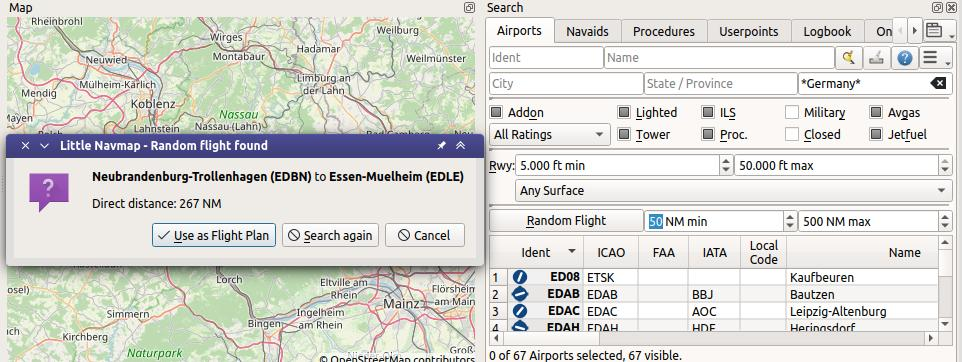

|Search| Search
---------------------------

The search dock window contains several tabs with similar functionality
that allows to search for objects by name, ident or other criteria.

Filters are defined by various controls which are mostly self
explaining. Only text filters and the tri-state checkboxes like
``Lighted``, ``Approach`` or ``Closed`` need a few extra remarks below.

All filters can be used together where all conditions have to be met
(``and`` operator). All filters except the distance search filter are
applied immediately. The distance search is applied after a short delay
for each change.

**Entering three or four characters in the** ``ICAO Code`` **field of the
airport search tab will trigger a quick search which ignores all other
filters.**

A tooltip on the blue help button on the top right shows information
about searching.

See :ref:`ui-tables` for more information how to rearrange columns in tables.

.. tip::

     You can use the cursor key ``Down`` to jump from the input fields into the result table.

     Using keyboard shortcuts like ``Ctrl+I`` for ``Show Information`` or ``Ctrl+M`` for ``Show on map``
     are usable directly from the input fields and will apply to the topmost airport in the result table.

     The same applies to other tabs like navaid and logbook search as well.

.. _text-filters:

Text filters
~~~~~~~~~~~~

The standard is to search for entries that start with the entered text.

The placeholder ``*`` stands for any text. Once a ``*`` is included in
the term, the standard search (match start of text) is no longer used.
In that case you might have to add a ``*`` at the end of the search term
as well to get the expected result.

The search is negated (i.e. find all entries that do **not** match) if the first
character in a search box is a ``-``.

Note that all of the above does not apply to numeric fields like
``Runways: Min`` or ``Altitude: Max``.

.. _text-filters-ident:

Airport and Navaid Ident Text filters
~~~~~~~~~~~~~~~~~~~~~~~~~~~~~~~~~~~~~~~~~~~~

The fields ``Ident`` for the airport and navaid search allow more functionality besides the
one described above:

-  Put an ident in double quotes ``"`` to force an exact search (i.e. avoid partial matches).
   Example: ``SEA`` finds two airports one being ``SEAM`` while ``"SEA"`` finds only ``KSEA`` because
   of the matchin IATA code.
-  Separate several idents by space to do a search for each ident. ``EDDF EDDM`` find the two airports Frankfurt and Munich, for example.

Tri state checkboxes
~~~~~~~~~~~~~~~~~~~~

These are used to filter airports by presence of certain facilities or
properties.

Below are the states as they are shown in Windows 10:

-  **Black Box:** Condition is ignored.
-  **Checked:** Condition must match.
-  **Empty Box:** Condition must not match.

Colors and look of these checkboxes vary with theme and operation
system. So instead of gray another color might be used (red fill on
Linux or a ``-`` for macOS).

.. _menu-button-search:

|Menu Button| Menu Button
~~~~~~~~~~~~~~~~~~~~~~~~~~~~~~

Airport, navaid, userpoint and online search tabs contain multiple rows
of search filters. These rows can be switched on and off with the drop
down menu on the menu button |Menu Button| on the top right.

The drop down menu prefixes menu items with a change indicator ``*`` to
show that the related filter row has modifications. You can use this to
find out why a search does not give the expected results.

.. tip::

      If you do not get the expected results or no results at all use the
      :ref:`reset-search` menu item, the button ``Reset Search`` |Reset Search| or press ``Ctrl+R`` to
      clear all search criteria.

.. _distance-search:

Distance search
~~~~~~~~~~~~~~~

This function is only available in the airport and navaid search.

This function allows you to combine all other search options with a
simple spatial search.

The checkbox ``Distance`` has to be selected to enable this search. The
result will include only airports or navaids that are within the given
minimum and maximum range of NM from the search center. This
allows you to quickly search for a destination that is within the range
of your aircraft and fulfills other criteria like having lighted runways
and fuel.

The center for the distance search is highlighted by a |Distance Search
Symbol| symbol.

To restrict the search further you can select a direction (North, East,
South and West).

Check the drop down menu for the change indicator ``*`` and the search
fields for any remaining text if the distance search does not give any
or unexpected results. Use the
:ref:`reset-search` menu item, the button ``Reset Search`` |Reset Search| or press ``Ctrl+R`` to
clear all search criteria.

.. figure:: ../images/complexsearch.jpg
    :scale: 50%

    A complex distance search: Find all airports within
    a distance between 200 and 400 NM from Frankfurt (EDDF).
    Airports should have a rating greater than 0 and should have at least
    one lighted runway. Military and closed airports are excluded. The
    resulting airports are highlighted on the map by selecting them in the
    search result table. *Click image to enlarge.*

.. figure:: ../images/complexsearch2.jpg
    :scale: 50%

    A complex search for scenery: This example shows how
    to find specific add-on scenery by using the ``Scenery Path`` search
    field. This shows all airports of the Orbx New Zealand South Island
    add-on scenery that have lighted runways. *Click image to enlarge.*

.. _random-flight:

Random Flight in Airport Search
~~~~~~~~~~~~~~~~~~~~~~~~~~~~~~~~~~~

Selects a random departure and destination based on the current airport search result.
A progress dialog allowing to cancel the selection is shown if the process takes longer.
Once done the user can accept the departure/destination pair or start a new calculation.

You might want to refine the flight plan further by running the :doc:`ROUTECALC` to get airways or intermediate navaids,
selecting procedures (:doc:`SEARCHPROCS`) and :doc:`PARKINGPOSITION`.

    Generating a random flight from a search result showing all airports in Germany, having 5,000
    feet minimum runway length and are neither closed nor military. *Click image to enlarge.*

.. _airport-search-ident:

Ident in Airport Search
~~~~~~~~~~~~~~~~~~~~~~~~~~~~~~~~~~

The input field ``Ident`` in the airport search tab searches for all available airport identifiers.
These are:

-  ``Ident``: Mostly equal to ICAO code but can be differnt especially for small airfields. X-Plane
   uses partially an unofficial code in this field like ``XPA000B``. Available for all simulators and
   Navigraph navdata.
-  ``ICAO``: Four letter `ICAO code <https://en.wikipedia.org/wiki/ICAO_airport_code>`__. Only
   available in X-Plane.
-  ``FAA``: Airport code used in the United States given by the `Federal Aviation Administration <https://www.faa.gov/>`__.
   The FAA code is only available in X-Plane.
-  ``IATA``: Three letter `IATA airport code <https://en.wikipedia.org/wiki/IATA_airport_code>`__.
   Available in X-Plane and Navigraph navdata.
-  ``Local Code``: Official local airport code mostly used for small airfields. Only available in
   X-Plane.

The airport codes are also shown in the information windows, tooltips and in the map
labels as well as in :doc:`ROUTEDESCR`. ICAO, FAA, IATA, and local codes are shown and the internal
ident is avoided if possible.

**Example:**

``Akutan`` is shown as ``Akutan (PAUT)`` with its official ICAO code ``PAUT`` instead of the
internal X-Plane code ``XPA000B``.

**Search Example:**

Searching for ident ``KOI`` gives the airports ``Oberlin Muni (KOIN)``, ``Lt Warren Eaton (KOIC)``
and ``Kirkwall (EGPA)`` where ``EGPA`` has the IATA code ``KOI``.

.. tip::

    Hide the additonal airport codes if you do not use X-Plane or if you are not interested in
    these columns. You can do this by moving the columns to the rightmost position or by shrinking them
    to minimum size. See :ref:`table-view`.

.. _airport-search-admin:

Country, State/Province and City in Airport Search
~~~~~~~~~~~~~~~~~~~~~~~~~~~~~~~~~~~~~~~~~~~~~~~~~~~

Note that quality and availability for administrative data depends on the selected simulator.

MSFS provides names in the local language as selected in ``Options`` on page :ref:`user-interface` but country names are not available.

X-Plane airports are community work and therefore administrative names have varying quality if set at all. Country names are often used in several variants like ``USA``, ``U.S.A.``, ``United States`` and more.

.. _airport-search-override:

Override in Airport Search
~~~~~~~~~~~~~~~~~~~~~~~~~~~~~~~~~~

Entering an airport ident using three letters or more ignores all other search options and shows only airports matching this ident.

This is indicated by the message ``Ident overriding other search options.`` in the search window footer.

.. _table-view:

Search Result Table View
~~~~~~~~~~~~~~~~~~~~~~~~

All selected elements in the table view will be highlighted on the map
using a black/yellow circle. See
:ref:`highlights-legend` in the map legend for more information.

Use ``Shift+Click`` or ``Ctrl+Click`` to select two or more elements
(multi-selection).

See :ref:`ui-tables` for more information how to rearrange columns in tables.

.. figure:: ../images/airportsearchtable.jpg

          Airport search result table. All additional search
          options are hidden by using the drop down menu of the menu button on the
          top right.

.. figure:: ../images/navaidsearchtable.jpg

         Navaid search limited to ICAO region ``LI`` (Italy)
         and VOR, VORTAC and TACAN stations that have a range of 100 or more NM.

Footer
^^^^^^^^^^^^^^^^^^^^^^^^^^^^^^^^^^^^^^^^^^^^^

The footer shows the number of selected, loaded and visible entries considering search and filter criteria.

Note that you to select :ref:`show-all` from the table context menu or have to scroll down to see all entries:

.. _mouse-clicks-0:

Mouse Clicks
^^^^^^^^^^^^

A double-click on an entry in the table view shows either an airport
diagram or zooms to the navaid or other feature. Additionally, details
are shown in the ``Information`` dock window. Single click selects an
object and highlights it on the map using a black/yellow circle.

Top Buttons
~~~~~~~~~~~

Available buttons and menu items depend on search tab. This chapter explains common buttons and menu items.

.. _reset-search-button:

|Reset Search| Reset Search
^^^^^^^^^^^^^^^^^^^^^^^^^^^

Same as :ref:`reset-search` in the context menu.

.. _clear-selection-button:

|Clear Selection| Clear Selection
^^^^^^^^^^^^^^^^^^^^^^^^^^^^^^^^^

Same as :ref:`clear-selection` in the context menu.

.. _search-help:

|Help| Help
^^^^^^^^^^^

Display a quick help in the tooltip. Click to open this chapter of the
manual in the default browser.

.. _menu:

|Menu Button| Menu Button
^^^^^^^^^^^^^^^^^^^^^^^^^

Drop down menu button that allows to hide or show search options.

The drop down menu prefixes menu items with a change indicator ``*`` to
show that the related filter row has modifications. You can use this to
find out why a search does not give the expected results.

.. _search-result-table-view-context-menu:

Context Menu Search
~~~~~~~~~~~~~~~~~~~~~~~~~~~~~~~~~~~~~

Available menu items depend on search tab.

Many menu items are mirrored from the :ref:`map-context-menu` and provide the same functionality
for the selected item below the cursor or the selected rows in the result tables.
These are omitted here.

.. _show-on-map-search:

|Show on Map| Show on Map
^^^^^^^^^^^^^^^^^^^^^^^^^

Show either the airport diagram or zooms to the navaid, userpoint or
other features on the map. The
zoom distance can be changed in the dialog ``Options`` on the tab
:ref:`map-navigation`.

.. _mark-airport-addon-search:

|Mark Airport as addon| Mark Airport as Add-on
^^^^^^^^^^^^^^^^^^^^^^^^^^^^^^^^^^^^^^^^^^^^^^^^^^^^^^^^^^

Marks an airport with a yellow circle as add-on.
Same as :ref:`mark-airport-addon-map`. Enabled for all airports at the clicked position.

.. _filter-by-entries-including-excluding:

|Filter by Entries including| |Filter by Entries excluding| Filter by Entries including/excluding
^^^^^^^^^^^^^^^^^^^^^^^^^^^^^^^^^^^^^^^^^^^^^^^^^^^^^^^^^^^^^^^^^^^^^^^^^^^^^^^^^^^^^^^^^^^^^^^^^^

Use the field under the cursor to set a search filter that includes or
excludes the text of the field. This is only enabled for text columns.

.. _reset-search:

|Reset Search| Reset Search
^^^^^^^^^^^^^^^^^^^^^^^^^^^

Clear search filters and revert to showing all entries in the search
result table view.

.. _show-all:

|Show All| Show All
^^^^^^^^^^^^^^^^^^^

The table view does not show all entries initially for performance
reasons. This menu item allows to load and show the whole search result.
The view switches back to the limited number of entries after a search
filter is modified or the sort order is changed. The number of all,
visible and selected entries is shown at the bottom of the tab.

Be aware that showing all navaids and airports can take some time
especially if they are highlighted on the map when selecting all entries
in the search result. The program does not crash but needs a few seconds
to highlight all the objects on the map.

.. _follow-selection:

Follow Selection
^^^^^^^^^^^^^^^^

The map view will be centered, but not zoomed in, on the selected feature
if this function is enabled.

.. _copy:

|Copy| Copy
^^^^^^^^^^^

Copy the selected entries in CSV format to the clipboard. This will
observe changes to the table view like column order and sort order. The
CSV includes a header line. Columns which are hidden or shrinked to minimum width are excluded.

Import the CSV-Text into spreadsheed programs using UTF-8 encoding and a semicolon as a separator.

See :ref:`ui-tables` for more information how to rearrange or hide columns in tables.

Select All
^^^^^^^^^^

Select all visible entries. To select all available entries the function
``Show All`` has to be used first.

.. _clear-selection:

|Clear Selection| Clear Selection
^^^^^^^^^^^^^^^^^^^^^^^^^^^^^^^^^

Deselect all entries in the table and remove any highlight circles from
the map.

.. _reset-view:

|Reset View| Reset View
^^^^^^^^^^^^^^^^^^^^^^^

Reset sort order, column order and column widths to default.

.. |Add Airport Traffic Pattern| image:: ../images/icon_trafficpattern.png
.. |Add Holding| image:: ../images/icon_hold.png
.. |Add Navaid Range Ring| image:: ../images/icon_navrange.png
.. |Add Range Rings| image:: ../images/icon_rangerings.png
.. |Add as Flight Plan Alternate| image:: ../images/icon_airportroutealt.png
.. |Add to Flight Plan| image:: ../images/icon_routeadd.png
.. |Append to Flight Plan| image:: ../images/icon_routeadd.png
.. |Clear Selection| image:: ../images/icon_clearselection.png
.. |Copy| image:: ../images/icon_copy.png
.. |Create Approach| image:: ../images/icon_approachcustom.png
.. |Distance Search Symbol| image:: ../images/icon_distancemark.png
.. |Filter by Entries excluding| image:: ../images/icon_filter-remove.png
.. |Filter by Entries including| image:: ../images/icon_filter-add.png
.. |Help| image:: ../images/icon_help.png

.. |Menu Button| image:: ../images/icon_menubutton.png
.. |Reset Search| image:: ../images/icon_clear.png
.. |Reset View| image:: ../images/icon_cleartable.png
.. |Search| image:: ../images/icon_searchdock.png
.. |Set Center for Distance Search| image:: ../images/icon_mark.png
.. |Set as Flight Plan Departure| image:: ../images/icon_airportroutedest.png
.. |Set as Flight Plan Destination| image:: ../images/icon_airportroutestart.png
.. |Show All| image:: ../images/icon_load-all.png
.. |Show Information| image:: ../images/icon_globals.png
.. |Show Procedures| image:: ../images/icon_approach.png
.. |Show on Map| image:: ../images/icon_showonmap.png

