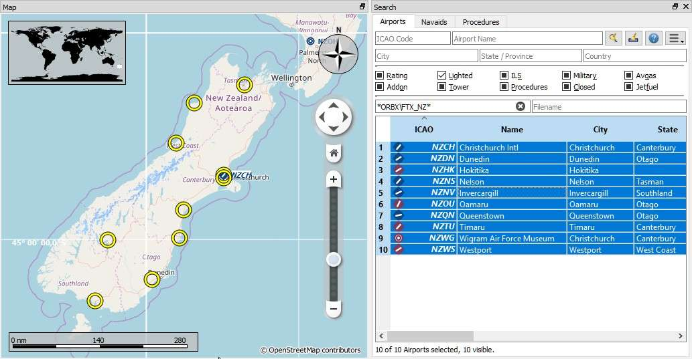
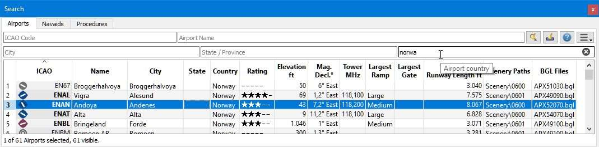
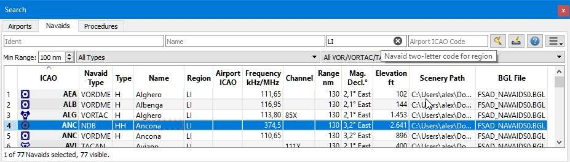

.. _search-dock-window:

|Search| Search Dock Window
---------------------------

The search dock window contains several tabs with similar functionality
that allows to search for objects by name, ident or other criteria.

Airport, navaid, userpoint and online search tabs contain multiple rows
of search filters. These rows can be switched on and off with the drop
down menu on the menu button |Menu Button| on the top right in the
airport, navaid and userpoint search tabs.

The drop down menu prefixes menu items with a change indicator ``*`` to
show that the related filter row has modifications. You can use this to
find out why a search does not give the expected results.

**If you do not get the expected results or no results at all use the
``Reset Search`` menu item, button Reset Search or press ``Ctrl+R`` to
clear all search criteria.**

Filters are defined by various controls which are mostly self
explaining. Only text filters and the tri-state checkboxes like
``Lighted``, ``Approach`` or ``Closed`` need a few extra remarks below.

All filters can be used together where all conditions have to be met
(``and`` operator). All filters except the distance search filter are
applied immediately. The distance search is applied after a short delay
for each change.

**Entering three or four characters in the ``ICAO Code`` field of the
airport search tab will trigger a quick search which ignores all other
filters and shows the airports matching that partial or full ICAO
code.**

A tooltip on the blue help button on the top right shows information
about searching.

.. _text-filters:

Text filters
~~~~~~~~~~~~

The standard is to search for entries that start with the entered text.

The placeholder ``*`` stands for any text. Once a ``*`` is included in
the term, the standard search (match start of text) is no longer used.
In that case you might have to add a ``*`` at the end of the search term
as well to get the expected result.

The search is negated (i.e. find all entries that do **not** match) if the first
character in a search box is a ``-``.

Note that all of the above does not apply to numeric fields like
``Runways: Min`` or ``Altitude: Max``.

Tri state checkboxes
~~~~~~~~~~~~~~~~~~~~

These are used to filter airports by presence of certain facilities or
properties.

Below are the states as they are shown in Windows 10:

-  **Black Box:** Condition is ignored.
-  **Checked:** Condition must match.
-  **Empty Box:** Condition must not match.

Colors and look of these checkboxes vary with theme and operation
system. So instead of gray another color might be used (red fill on
Linux or a ``-`` for macOS).

.. _distance-search:

Distance search
~~~~~~~~~~~~~~~

This function is only available in the airport and navaid search.

This function allows you to combine all other search options with a
simple spatial search.

The checkbox ``Distance`` has to be selected to enable this search. The
result will include only airports or navaids that are within the given
minimum and maximum range of nautical miles from the search center. This
allows you to quickly search for a destination that is within the range
of your aircraft and fulfills other criteria like having lighted runways
and fuel.

The center for the distance search is highlighted by a |Distance Search
Symbol| symbol.

To restrict the search further you can select a direction (North, East,
South and West).

Check the drop down menu for the change indicator ``*`` and the search
fields for any remaining text if the distance search does not give any
or unexpected results. Use ``Reset Search`` in the context menu of the
result table or press ``Ctrl+R`` to clear all search criteria.

.. figure:: ../images/complexsearch.jpg

        **Picture above A complex distance search:** Find all airports within
        a distance between 200 and 400 nautical miles from Frankfurt (EDDF).
        Airports should have a rating greater than 0 and should have at least
        one lighted runway. Military and closed airports are excluded. The
        resulting airports are highlighted on the map by selecting them in the
        search result table.

        **Picture above A complex search for scenery:** This example shows how
        to find specific add-on scenery by using the ``Scenery Path`` search
        field. This shows all airports of the Orbx New Zealand South Island
        add-on scenery that have lighted runways.

Search Result Table View
~~~~~~~~~~~~~~~~~~~~~~~~

All selected elements in the table view will be highlighted on the map
using a black/yellow circle. See
:ref:`highlights` for more information.

Use ``Shift+Click`` or ``Ctrl+Click`` to select two or more elements
(multi-selection).

.. _table-view:

Header
^^^^^^

The header of all table views allows the following manipulation:

-  **Click on the top left corner of the column header:** Select all
   result rows.
-  **Click on a column header:** Sort ascending or descending (only for
   search result tables - not for flight plan table).
-  **Click and drag on the column header:** Change column order.
-  **Double-click on column border:** Automatically fit column size to
   content.
-  **Click and drag on column border:** Change column width.
-  **Click into the empty space below all rows:** Deselect all entries
   and remove highlights on the map.

The above applies to all table views in the program and partially also
to the tree view of the procedure search.

The program saves the sort order, column widths and positions until
``Reset View`` is selected in the context menu.

          Airport search result table. All additional search
          options are hidden by using the drop down menu of the menu button on the
          top right.

         Navaid search limited to ICAO region ``LI`` (Italy)
         and VOR, VORTAC and TACAN stations that have a range of 100 or more nautical miles.

.. _mouse-clicks-0:

Mouse Clicks
^^^^^^^^^^^^

A double-click on an entry in the table view shows either an airport
diagram or zooms to the navaid or other feature. Additionally, details
are shown in the ``Information`` dock window. Single click selects an
object and highlights it on the map using a black/yellow circle.

Top Buttons
~~~~~~~~~~~

Available buttons and menu items depend on search tab.

.. _reset-search-button:

|Reset Search| Reset Search
^^^^^^^^^^^^^^^^^^^^^^^^^^^

Clear search filters and show all entries again in the search result
table view.

.. _clear-selection-button:

|Clear Selection| Clear Selection
^^^^^^^^^^^^^^^^^^^^^^^^^^^^^^^^^

Deselect all entries in the table and remove any highlight circles from
the map.

.. _help:

|Help| Help
^^^^^^^^^^^

Display a quick help in the tooltip. Click to open this chapter of the
manual in the default browser.

.. _menu:

|Menu Button| Menu Button
^^^^^^^^^^^^^^^^^^^^^^^^^

Drop down menu button that allows to hide or show search options.

The drop down menu prefixes menu items with a change indicator ``*`` to
show that the related filter row has modifications. You can use this to
find out why a search does not give the expected results.

.. _search-result-table-view-context-menu:

Search Result Table View Context Menu
~~~~~~~~~~~~~~~~~~~~~~~~~~~~~~~~~~~~~

Available menu items depend on search tab.

.. _show-information-0:

|Show Information| Show Information
^^^^^^^^^^^^^^^^^^^^^^^^^^^^^^^^^^^

Same as the :ref:`map-context-menu`.

.. _show-procedures:

|Show Procedures| Show Procedures
^^^^^^^^^^^^^^^^^^^^^^^^^^^^^^^^^

Open the procedure search tab of the search dock window and display all
procedures for the airport. Only available in the airport search tab.

See :doc:`SEARCHPROCS` for more information.

.. _show-approach-custom:

|Create Approach| Create Approach
^^^^^^^^^^^^^^^^^^^^^^^^^^^^^^^^^

Opens a dialog which allows to create a simple user defined final
approach. Only available in the airport search tab.

See :doc:`CUSTOMPROCEDURE` for more information.

.. _show-on-map:

|Show on Map| Show on Map
^^^^^^^^^^^^^^^^^^^^^^^^^

Show either the airport diagram or zooms to the navaid, userpoint or
other features on the map.

Follow Selection
^^^^^^^^^^^^^^^^

The map view will be centered - not zoomed in - on the selected feature
when this function is enabled.

.. _filter-by-entries-including-excluding:

|Filter by Entries including| |Filter by Entries excluding| Filter by Entries including/excluding
^^^^^^^^^^^^^^^^^^^^^^^^^^^^^^^^^^^^^^^^^^^^^^^^^^^^^^^^^^^^^^^^^^^^^^^^^^^^^^^^^^^^^^^^^^^^^^^^^^

Use the field under the cursor to set a search filter that includes or
excludes the text of the field. This is only enabled for text columns.

.. _reset-search:

|Reset Search| Reset Search
^^^^^^^^^^^^^^^^^^^^^^^^^^^

Clear search filters and revert to showing all entries in the search
result table view.

.. _show-all:

|Show All| Show All
^^^^^^^^^^^^^^^^^^^

The table view does not show all entries initially for performance
reasons. This menu item allows to load and show the whole search result.
The view switches back to the limited number of entries after a search
filter is modified or the sort order is changed. The number of all,
visible and selected entries is shown at the bottom of the tab.

Be aware that showing all navaids and airports can take some time
especially if they are highlighted on the map when selecting all entries
in the search result. The program does not crash but needs a few seconds
to highlight all the objects on the map.

.. _show-range-rings-0:

|Show Range Rings| Show Range Rings
^^^^^^^^^^^^^^^^^^^^^^^^^^^^^^^^^^^

.. _show-navaid-range-0:

|Show Navaid range| Show Navaid range
^^^^^^^^^^^^^^^^^^^^^^^^^^^^^^^^^^^^^

.. _show-traffic-pattern:

|Display Airport Traffic Pattern| Display Airport Traffic Pattern
^^^^^^^^^^^^^^^^^^^^^^^^^^^^^^^^^^^^^^^^^^^^^^^^^^^^^^^^^^^^^^^^^

.. _show-holdings:

|Display Holdings| Display Holdings
^^^^^^^^^^^^^^^^^^^^^^^^^^^^^^^^^^^

Same as the :ref:`map-context-menu`.

Note that the menu item is disabled if the respective user feature is
hidden on the map (menu ``View`` -> ``User Features``). The menu item is
suffixed with the text ``hidden on map`` if this is the case.

.. _set-as-flight-plan-departure-0:

|Set as Flight Plan Departure| Set as Flight Plan Departure
^^^^^^^^^^^^^^^^^^^^^^^^^^^^^^^^^^^^^^^^^^^^^^^^^^^^^^^^^^^

.. _set-as-flight-plan-destination-0:

|Set as Flight Plan Destination| Set as Flight Plan Destination
^^^^^^^^^^^^^^^^^^^^^^^^^^^^^^^^^^^^^^^^^^^^^^^^^^^^^^^^^^^^^^^

.. _set-as-flight-plan-alt-0:

|Set as Flight Plan Alternate| Set as Flight Plan Alternate
^^^^^^^^^^^^^^^^^^^^^^^^^^^^^^^^^^^^^^^^^^^^^^^^^^^^^^^^^^^

.. _add-position-to-flight-plan-0:

|Add Position to Flight Plan| Add Position to Flight Plan
^^^^^^^^^^^^^^^^^^^^^^^^^^^^^^^^^^^^^^^^^^^^^^^^^^^^^^^^^

.. _append-position-to-flight-plan-0:

|Append Position to Flight Plan| Append Position to Flight Plan
^^^^^^^^^^^^^^^^^^^^^^^^^^^^^^^^^^^^^^^^^^^^^^^^^^^^^^^^^^^^^^^

Same as the :ref:`map-context-menu`.

.. _copy:

|Copy| Copy
^^^^^^^^^^^

Copy the selected entries in CSV format to the clipboard. This will
observe changes to the table view like column order and sort order. The
CSV includes a header line.

Select All
^^^^^^^^^^

Select all visible entries. To select all available entries the function
``Show All`` has to be used first.

.. _clear-selection:

|Clear Selection| Clear Selection
^^^^^^^^^^^^^^^^^^^^^^^^^^^^^^^^^

Deselect all entries in the table and remove any highlight circles from
the map.

.. _reset-view:

|Reset View| Reset View
^^^^^^^^^^^^^^^^^^^^^^^

Reset sort order, column order and column widths to default.

.. _set-center-for-distance-search-0:

|Set Center for Distance Search| Set Center for Distance Search
^^^^^^^^^^^^^^^^^^^^^^^^^^^^^^^^^^^^^^^^^^^^^^^^^^^^^^^^^^^^^^^

Same as the :ref:`map-context-menu`.

.. |Search| image:: ../images/icon_searchdock.png

.. |Distance Search Symbol| image:: ../images/icon_distancemark.png
.. |Reset Search| image:: ../images/icon_clear.png
.. |Clear Selection| image:: ../images/icon_clearselection.png
.. |Help| image:: ../images/icon_help.png
.. |Show Information| image:: ../images/icon_globals.png

.. |Create Approach| image:: ../images/icon_approachcustom.png
.. |Show on Map| image:: ../images/icon_showonmap.png

.. |Filter by Entries excluding| image:: ../images/icon_filter-remove.png

.. |Set as Flight Plan Departure| image:: ../images/icon_airportroutedest.png

.. |Add Position to Flight Plan| image:: ../images/icon_routeadd.png
.. |Append Position to Flight Plan| image:: ../images/icon_routeadd.png

.. |Reset View| image:: ../images/icon_cleartable.png

