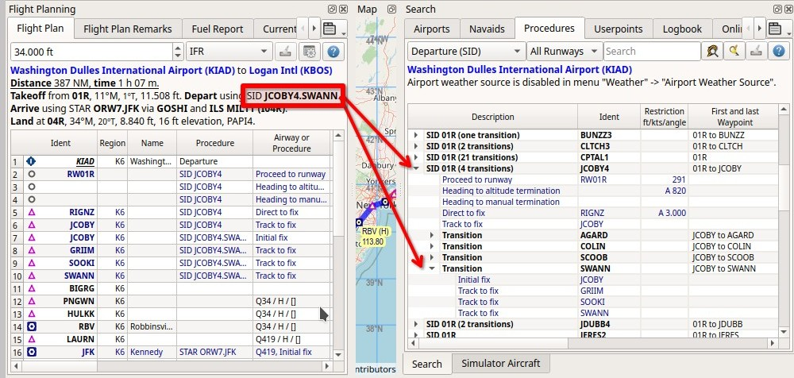
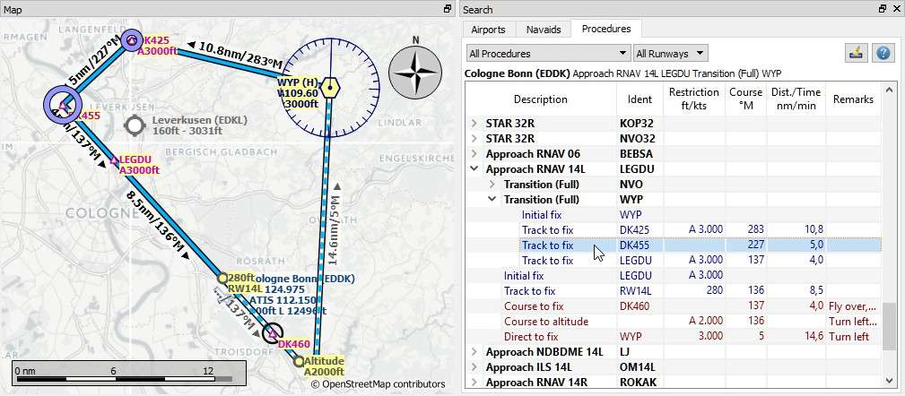
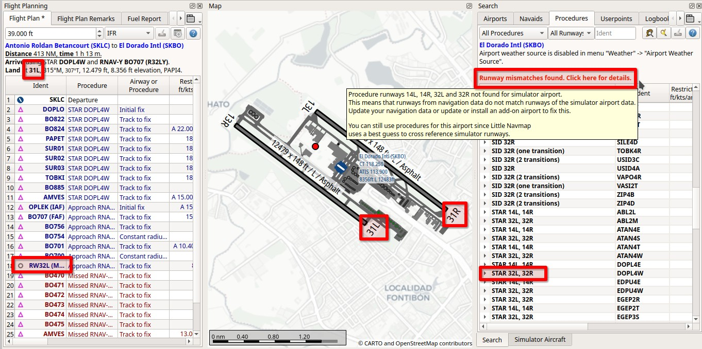
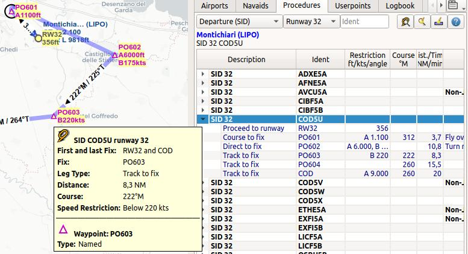
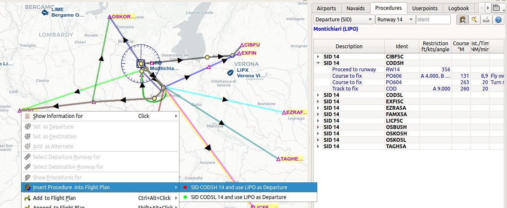
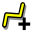
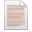

|Search| Search Procedures
----------------------------------------

The tab ``Procedures`` allows previewing and adding approach, arrival (STAR) and
departure procedures (SID) to the flight plan. Procedures of a selected
airport are arranged in a tree which indicates the dependency between
procedure and transition.

The dialog uses a tree element. See :ref:`ui-tree` for more information about this type of input element.

See :doc:`APPROACHES` for general information about SID,
STAR, approaches and transitions.

Procedure legs are shown when a procedure node is expanded in the tree.
Procedures can be filtered by runway, name and type.

Right-click on a procedure or a procedure leg to show a context menu.

Use the context menu item :ref:`delete-selected-legs` of the flight plan table or the map context menu
item :ref:`delete-from-flight-plan` to remove procedures from a flight plan.

Procedure legs are highlighted in red if one or more navaids could not
be resolved. A warning dialog will be shown if you try to add this
procedure to a flight plan.

Note that the SID and STAR names are limited to 5 characters in FSX and
P3D due to a limitation in the BGL file format. Therefore procedure
names are slightly modified. However, this does not apply to procedures
from a Navigraph or X-Plane scenery database.

All information in the procedure search tab reloaded on startup if the setting ``Restore information window content``
is enabled on the page :ref:`options-startup-and-updates` in options. The information is also kept when
switching between simulators in the :ref:`scenery-library-menu`, provided the airport exists and has procedures
in the selected simulator database.

The procedure search tab expands procedure branches that are already present in the flight plan. This means that procedures and/or their respective transitions are expanded when showing procedures for departure or destination airport.

  Expanding the tree elements for SID JCOBY4 via SWANN after selecting :ref:`show-procedures-map`
  from the context menu when right-clicking on KIAD on the map or in the flight plan table.
  *Click image to enlarge.*

.. tip::

  You can use the cursor key ``Down`` to jump from the input fields into the result tree and navigate there using
  the keyboard shorcuts shown in the :ref:`procedure-context-menu`.

.. note::

  Note that the shown runway numbers might differ compared to airport runways.
  This happens when an add-on airport and the navigation data have different runway numbers which is a result of renumbered
  runways due to changes in magnetic declination (magnetic pole drift).

  *Little Navmap* resolves these mismatches internally and still allows to work with procedures.
  You might expect issues when loading flight plans containing such discrepancies into add-on aircraft or simulators.

.. important::

  It is up to the user to combine the correct procedures with the flight plan.

  *Little Navmap* will not keep you from choosing north bound procedures for a route going south, for example.
  Also check the resulting route to avoid accidental zig-zag routing which can happen if you combine the wrong
  approach/transition with a STAR, for example.

  Always check the flight plan for reversals, zig-zag guidance, too close waypoints or other issues.
  Delete waypoints manually or change procedures if you find such cases.

  Showing a transition and a RNAV approach. Start and
  endpoint of a transition leg are highlighted on the map. Screenshot based on *Little Navmap* 2.6.
  *Click image to enlarge.*

.. _procedure-runways:

Runways
~~~~~~~~~~~~~~~~~~~~~~~~~~~~

Runways are assigned automatically for STAR and approaches if possible to avoid error messages about runway
mismatches. This means that a selected STAR runway changes automatically to the one used by a
newly selected approach if the STAR allows multiple runways.

The runway of a multi-runway STAR will also be automatically selected for an approach runway
already inserted avoiding the runway selection dialog.

.. _procedure-header:

Header
~~~~~~~~~~~~~~~~~~~~~~~~~~~~

The header shows various information like the airport, warning messages and information for the selected procedure or transition.

.. _procedure-preferred-runways:

Preferred Runways
^^^^^^^^^^^^^^^^^^^^^^

A preferred runway indication is shown in the header label if available.

The indication is based on the selection in menu ``Weather`` -> :ref:`airport-weather-source` and shows the best
runways for the airport METAR based on station or interpolated weather.

Head and crosswind for each runway is also shown in the selection table.

See :doc:`WEATHER` for more information about weather reports.

.. _procedure-waypoints:

First and last Waypoint
^^^^^^^^^^^^^^^^^^^^^^^^^^

The header shows the entry and exit waypoints for a procedure and its transition, if selected.
This helps to find matching procedures for an airway waypoint or to find an approch matching a STAR and vice versa.

**Examples:**

STAR selected in tree:
  ``STAR 21R VARI3A. From VARIX to KRO.``

The transition ``PELAG`` of the approach ``D03RY`` is selected in the tree. The header shows the entry and exit for the full flight path including procedure and transition:
  ``Approach VORDME-Y 03R FD03R (D03RY) via transition PELAG. From PELAG to 03R.``

.. _procedure-warning:

Runway Mismatches between Simulator and Navigation Data
^^^^^^^^^^^^^^^^^^^^^^^^^^^^^^^^^^^^^^^^^^^^^^^^^^^^^^^^^^^

A warning message is shown if procedure runways from the navdata cannot be not found for simulator airport. This means
that runways from navigation data do not match runways of the simulator airport data.

You can update the navigation data or update or install an add-on airport to fix this.

Procedures can still
be used for such airports since Little Navmap uses a best guess to cross reference simulator
runways. As a result, you will see slightly differing runway numbers in portions of the program.

Issues with add-ons or simulators using exported flight plans might show up, though.

See chapter :doc:`NAVDATA` for more information on simulator and navigation databases.

  This image shows place where runway mismatches show up in *Little Navmap*.
  In December 2022 the runways of El Dorado Intl (SKBO) were renamed due to
  magnetic heading drift. This can occasionally happen at airports.
  The airport SKBO has the runways 13L, 13R, 31R and 31L in the simulator
  while the latest navigation data refers to 14L, 14R, 32L and 32R.
  *Click image to enlarge.*

.. _procedure-preview:

Preview and Highlights
~~~~~~~~~~~~~~~~~~~~~~~~~~~~

*Little Navmap* displays a preview of the selected procedure or transition.

-  Click on a procedure in the procedure tree to see the preview of the procedure.
-  Click on a transition in the procedure tree to see the preview of the transition and its related procedure.
-  Click on a procedure or transition leg to see additional highlighted navaids.

Tooltips give information about navaids in the preview.

The preview of missed approaches can be changed by toggling :ref:`show-missed-approaches` in the menu ``View``.

Procedures can be added to the flight plan by either using :ref:`insert-procedure-map` on the
preview from the map context menu (right click on a navaid) or the :ref:`procedure-context-menu`.

Note that labels of procedure waypoints have a ``…`` appended if additional labels texts like restrictions
are suppressed due to higher zoom distances or lower detail levels.

Click into the empty space in the procedure tree to clear all highlights and previews.
You can also click the button :ref:`clear-selection-button-procs` |Clear Selection|, the related context menu item or
:ref:`remove-highlights` in the main menu ``Map``. This also clears the :ref:`button-preview-all-procs` highlights.

  Previewing a SID at LIPO with tooltip information on procedure and related waypoint.
  The preview also uses the ``Transparent line`` setting for flight plans in the options dialog
  on page :ref:`options-map-flight-plan`. *Click image to enlarge.*

.. _procedure-tree:

Procedure Tree
~~~~~~~~~~~~~~

Legs are shown in dark blue while missed approach legs are shown in dark
red color.

Bold red text indicates an error in the leg. The procedure is incomplete
and should not be used in a flight plan. *Little Navmap* might refuse to use the procedure
depending on the error since inconsistencies can result in crashes.

- ``Description``: Description, type and number of available transitions.
  Parallel runways are indicated by a list of runways like ``STAR 07L, 07R, 07C``.
  The suffix ``All`` is added if a procedure applies to all runways of an airport.
- ``Ident``: Ident of the initial fix and ARINC code in brackets or name of SID or STAR.
  See :ref:`procedure-tree-arinc` for an explanation of the ARINC type codes.
  Otherwise ident name of a procedure leg, if expanded.
- ``Course °M``: Magnetic course for a leg if expanded.
- ``Restriction``: Either procedure altitude restriction, procedure speed limit or a required vertical path angle.
  The following altitude restrictions exist for procedures:

    - **Number only:** Fly at altitude or speed. Example: ``5,400`` or ``210``.
    - **Prefix** ``A``: Fly at or above altitude or speed. Example: ``A 1,800``.
    - **Prefix** ``B``: Fly at or below altitude or speed. Example: ``B 10,000`` or ``B 220``.
    - **Range:** Fly at or above altitude one and at or below altitude two. Example: ``A 8,000, B 10,000``.
    - **Altitude, optional speed limit and optional path angle:** List of values. Example: ``A 8,000, B 10,000, B220, -3.5°``.

- ``First and last Waypoint``: The entry and exit waypoint of a procedure or transition.
  The exit for approaches is usually the runway number like ``21R`` or the airport in case of a circle-to-land approach.
- ``Dist./Time``: Distance of flying time for a leg. Holds can have a leg time in minutes or a leg distance in NM.
- ``Remarks``: Shows number of transitions, fly-over, turn direction, related navaid,
  RNP indicator and allowed aircraft categories for a procedure.

.. _procedure-tree-arinc:

ARINC Approach Types
^^^^^^^^^^^^^^^^^^^^^^^^^^^^

The ARINC procedure type is shown in *Little Navmap* in brackets after the approach name/fix.

The first letter of the ARINC approach type defines the type and the following two digits define the runway
plus the optional runway designators ``L``, ``C`` or ``R``.

An opional suffix like ``X``, ``Y`` or ``Z`` separated by a dash
can be used to have approaches of the same type unique for airport and runway.

**Types:**

- ``B``: Localizer backcourse
- ``D``: VORDME
- ``F``: Flight management system (FMS)
- ``G``: Instrument guidance system (IGS). Similar to ILS, but not aligned with the runway. Requires a visual turn at the end.
- ``H``: RNP approach. Based on GPS.
- ``I``: Instrument landing system (ILS). Precision approach.
- ``J``: GNSS landing system (GLS). GBAS landing system, combining GPS with a ground station enhancing precision.
- ``L``: Localizer only (LOC)
- ``M``: Microwave landing system (MLS). Obsolete.
- ``N``: Nondirectional beacon (NDB)
- ``P``: Global positioning system (GPS)
- ``Q``: Nondirectional beacon and DME (NDBDME)
- ``R``: Area navigation (RNAV)
- ``S``: VOR using a VORDME or VORTAC
- ``T``: TACAN. Military only.
- ``U``: Simplified directional facility (SDF). Less precise than a localizer
- ``V``: VOR
- ``W``: Microwave landing system (MLS), type A. Obsolete.
- ``X``: Localizer directional aid (LDA). Like a localizer but not aligned with the runway. Requires a visual turn.
- ``Y``: Microwave landing system (MLS), type B and C. Obsolete.

**Examples:**

- ``I20-Z``: ILS approach Z to runway 20.
- ``D18C``: VORDME approach to runway 18C.
- ``R02`` RNAV approach to runway 02.
- ``L03-Y`` Localizer approach Y to into runway 03.

Top Buttons
~~~~~~~~~~~

.. _procedure-filter-type:

Type Filter (All Procedures)
^^^^^^^^^^^^^^^^^^^^^^^^^^^^

The type filter is not available for an FSX or P3D stock database.

This filter is always available for X-Plane or MSFS databases which contain
SIDs and STARs already in the stock data.

The type filter allows the selections below:

- ``All Procedures``: SID, STAR and approaches
- ``Departure (SID)``: Only SID
- ``Arrival (STAR)``: Only STAR
- ``Arrival and Approaches``: STAR and approaches
- ``Approaches``: Approaches prefixed with type like ``RNAV Approaches``.

The respective transitions are always shown.

.. _procedure-filter-runway:

Runway Filter (All Runways)
^^^^^^^^^^^^^^^^^^^^^^^^^^^

This filter is always available and helps to find procedures for a
certain departure or arrival runway.

The selection ``No Runway`` allows to find circle-to-land approaches which have no runway assigned.

.. _filter-ident-procs:

Ident, Type and Waypoint Filter
^^^^^^^^^^^^^^^^^^^^^^^^^^^^^^^^^^^^^^^^^^^^^^^^^

Filter result by approach, SID, STAR or approach ARINC name as well as entry and exit waypoints
beginning with the entered text.

The approach ``DACNA (R06)`` will be found when entering ``DAC`` or ``R06``, for example.

The search function also looks for the first and the last waypoint of procedures as shown in the tree.
Procedures and and transitions are hidden if no criteria matches the text search.

Procedures are shown and expanded if a transition name or waypoint matches the search text. For example, you can find a matching STAR for a selected approach and vice versa.

.. _button-preview-all-procs:

|Preview all Procedures| Preview all Procedures
^^^^^^^^^^^^^^^^^^^^^^^^^^^^^^^^^^^^^^^^^^^^^^^^^

Same as :ref:`preview-all-procs` in context menu.

.. _clear-selection-button-procs:

|Clear Selection| Clear Selection
^^^^^^^^^^^^^^^^^^^^^^^^^^^^^^^^^

Same as :ref:`clear-selection-procs` in context menu.

.. _help-procs:

|Help| Help
^^^^^^^^^^^

Opens this chapter of the manual in the default browser.

.. _procedure-context-menu:

Context Menu Procedures
~~~~~~~~~~~~~~~~~~~~~~~~~~~

.. _procedure-show-on-map:

|Show on Map| Show on Map
^^^^^^^^^^^^^^^^^^^^^^^^^

Center the map on the selected procedure.

.. _procedure-insert:

|Insert into Flight Plan / Use as Destination / Use as Departure| Insert into Flight Plan, Use as Destination and Use as Departure
^^^^^^^^^^^^^^^^^^^^^^^^^^^^^^^^^^^^^^^^^^^^^^^^^^^^^^^^^^^^^^^^^^^^^^^^^^^^^^^^^^^^^^^^^^^^^^^^^^^^^^^^^^^^^^^^^^^^^^^^^^^^^^^^^^^^

Text and functionality of this menu item depends on the selected
procedure type and whether the procedure's airport is already the
departure or destination airport of the current flight plan.

A :doc:`RUNWAYSELECTION` dialog might pop up for SID or STAR procedures which are applicable for more than one runway.

Use the context menu of the flight plan table or the map to remove procedures. See
:ref:`delete-selected-legs` and :ref:`delete-from-flight-plan`.

If a transition is selected, the corresponding procedure (approach, SID
or STAR) is added or replaced as well.

``Insert ... into Flight Plan``:

This menu item will add the selected procedure to the current flight
plan. A procedure of the same type (SID, STAR or approach with or
without transition) will be replaced if already present in the flight
plan.

``Use ... as Destination`` or ``Use ... as Departure``:

This will add or replace the destination or departure airport and add
the selected procedure.

If the flight plan is empty, the departure or destination airport is
added to the flight plan as well.

A leg entry will drawn red if a navaid was not resolved during the
scenery database loading process. This happens only when the source data
is not valid or incomplete. In this case, the resulting procedure is not
usable and a warning dialog will be shown if essential navaids are
missing.

*Little Navmap* might refuse to use the procedure depending on error.

.. _show-information-procs:

|Show Information for Airport| Show Information for Airport
^^^^^^^^^^^^^^^^^^^^^^^^^^^^^^^^^^^^^^^^^^^^^^^^^^^^^^^^^^^

Show detailed information in the ``Information`` dock window for the
airport.

See the :doc:`INFO` for details.

Same as :ref:`show-information-map` in map context menu.

.. _show-on-map-procs:

|Show Airport on Map| Show Airport on Map
^^^^^^^^^^^^^^^^^^^^^^^^^^^^^^^^^^^^^^^^^

Show the airport on the map. The zoom distance can be changed in the options
dialog on the page :ref:`options-map-navigation`.

.. _show-in-search-procs:

|Show Airport in Search| Show Airport in Search
^^^^^^^^^^^^^^^^^^^^^^^^^^^^^^^^^^^^^^^^^^^^^^^

Shows the airport in the airport search tab. Same as :ref:`show-in-search-map` in map context menu.

.. _preview-all-procs:

|Preview all Procedures| Preview all Procedures
^^^^^^^^^^^^^^^^^^^^^^^^^^^^^^^^^^^^^^^^^^^^^^^

This highlights all procedures and their transitions currently shown in the procedure tree on the map.
Note that the map display is updated automatically when changing filters.

Tooltips give information about navaids in the preview.

Note that missed approaches are not shown when previewing all procedures.

Procedures can be added to the flight plan by either using :ref:`insert-procedure-map` on the
preview from the map context menu (right click on a navaid) or the :ref:`procedure-context-menu`.

  Previewing all SID at LIPO from runway 14. Context menu open to add SID and airport as departures.
  The preview also uses the ``Transparent line`` setting for flight plans in
  the options dialog on page :ref:`options-map-flight-plan`. *Click image to enlarge.*

Follow Selection
^^^^^^^^^^^^^^^^

The map view will be zoomed on the selected procedure or procedure leg if this function
is enabled.

Expand All / Collapse All
^^^^^^^^^^^^^^^^^^^^^^^^^

Expand all procedures so that their legs and transitions are shown or
collapse the tree.

.. _reset-search-procs:

|Reset Search| Reset Search
^^^^^^^^^^^^^^^^^^^^^^^^^^^

Clear search filters and revert to showing all procedures in the tree.

.. _clear-selection-procs:

|Clear Selection| Clear Selection
^^^^^^^^^^^^^^^^^^^^^^^^^^^^^^^^^

Deselect the currently selected procedure and remove the preview from
the map.

Also clears the procedure preview enabled with :ref:`preview-all-procs`.

.. _reset-view-procs:

|Reset View| Reset View
^^^^^^^^^^^^^^^^^^^^^^^

Reset column order and column widths to default.

.. |Help| image:: ../images/icon_help.png

