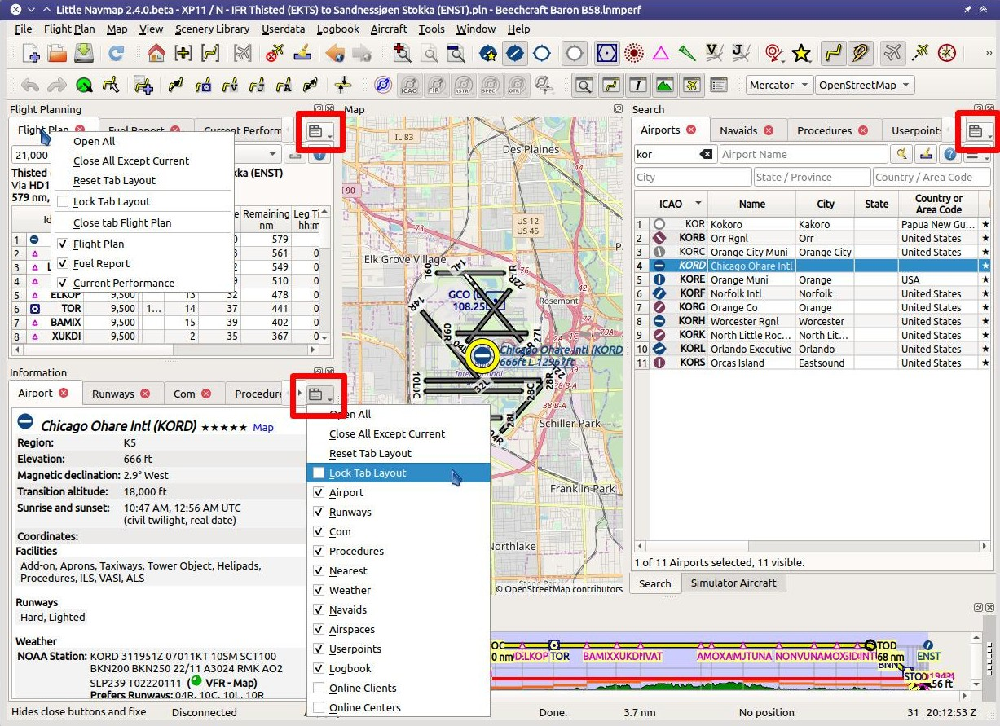

Tabs
----

The dock windows ``Flight Planning``, ``Information``,
``Simulator Aircraft`` and ``Search`` have tab bars that allow to close,
open and move tabs.

Tooltips give more information about the function of a tab.

Note that you cannot move a tab to another window.

Context Menu Tabbar
~~~~~~~~~~~~~~~~~~~~

The context menu above the tab bar (right click on one of the tabs) and
the tab button |Tab Button| have the following menu items:

-  ``Open All``: Opens all tabs. All closed tabs are opened again and
   added to the right side of the tab bar.
-  ``Close all Except Current``: All tabs are closed except the
   currently active.
-  ``Reset Tab Layout``: Opens all closed tabs again and restores the
   default order.
-  ``Lock Tab Layout``: Hides the close buttons to avoid accidental
   closing. Moving by click and drag as well as closing by double click
   are disabled. A locked tab bar also occupies less space. You can
   still close and open tabs using the context menu or menu button.
-  ``Close Tab``: Only visible in the context menu. Closes the tab below
   the click spot.
-  One menu item for each tab: Toggles tab visibility. A tab is always
   opened to the right of the current one.

Mouse actions
~~~~~~~~~~~~~

-  Click and drag a tab to move it.
-  Double click a tab to close it.
-  Right click a tab to open the context menu.
-  Use the mouse wheel above a tab bar to cycle between tabs.

Stacked Dock Window Tabs
~~~~~~~~~~~~~~~~~~~~~~~~

Tabs at the bottom of a window appear when you drop dock windows on each
other. Grab a window title bar to move a window out of the stacked
display. You can also change the order of these tabs by dragging them
around.

See :doc:`DOCKWINDOWS` for more information about stacked
dock windows.

      Drop down button menus and context menus on tab bars marked red.

