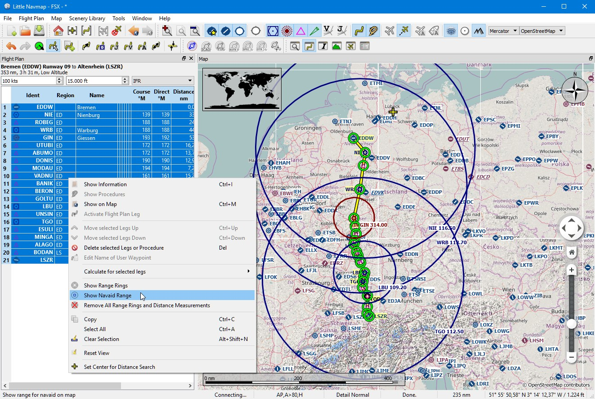
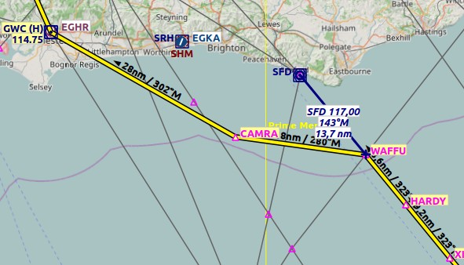

Tips and Tricks
---------------

.. _tips-and-tricks-navaid-range:

Show all Navaid Ranges of a Flight Plan
~~~~~~~~~~~~~~~~~~~~~~~~~~~~~~~~~~~~~~~

Select all legs in the flight plan table, then right-click on any leg
and select ``Show Navaid Range`` |Show Navaid Range|. This will place a
range ring around every radio navaid in the flight plan.

See also :ref:`show-navaid-range`.

Remove the range rings by right clicking onto the center and select
``Remove Range Ring`` from the context menu.

  Radio navaid range rings along a flight plan. *Click image to enlarge.*

.. _tips-and-tricks-vor-radials:

Use the measurement lines to get a VOR Radial Intersection
~~~~~~~~~~~~~~~~~~~~~~~~~~~~~~~~~~~~~~~~~~~~~~~~~~~~~~~~~~

Measurement lines can start at airports or navaids where they use the
magnetic declination if available. You can use them to find an airport by
radial and distance if you like to navigate the old fashioned way.

See also :ref:`measure-gc-distance-from-here`.

.. figure:: ../images/tutorial_tipvor.jpg
  :scale: 50%

  Example that gets radial and distance from two VORs for
  ``ETUO``. Measurement lines can also start at NDBs or waypoints. Note
  the suffix ``°M`` which indicates magnetic course. *Click image to enlarge.*

  The same can be used when flying airways without GPS. In the example
  below fly 323 degrees magnetic to VOR ``SFD`` (radial 143). You are at
  ``WAFFU`` when the DME shows 13.7 NM. Then turn left to
  280°M until you intercept 302° to ``GWC``. *Click image to enlarge.*

.. _tips-and-tricks-addon-airports:

Search for Add-On Airports
~~~~~~~~~~~~~~~~~~~~~~~~~~

You can use the scenery path to look for add-on airports of a certain
developer. Click on one of the add-on airports and copy the relevant
part of the path from the information window. Insert this path fragment
into the ``Scenery Path`` input field in the airports tab of the search
dock window.

See also :ref:`text-filters`.

.. figure:: ../images/tutorial_tipscenery.jpg
  :scale: 40%

  Select all in the result table to get all airports highlighted on the map. *Click image to enlarge.*

.. _tips-and-tricks-rtw:

Use the Search Function to plan a Round the World Trip
~~~~~~~~~~~~~~~~~~~~~~~~~~~~~~~~~~~~~~~~~~~~~~~~~~~~~~

The spatial search function is useful to plan a round the world tour.
Assume you'd like to go east:

#. Go to the dock window ``Search``, right-click into the result table
   and select ``Reset Search`` |Reset Search| to remove all search
   criteria that may affect the query.
#. Set your departure airport.
#. Right-click on your departure airport in the search or on the map and
   select ``Set Center for Distance Search`` |Set Center for Distance
   Search|. This is the center point for the spatial search.
#. Add any additional criteria in the search like lighted runways,
   procedures, fuel, minimum runway length and more.
#. Click the checkbox before ``Distance``, adjust the minimum and maximum
   distance and set direction to ``East``.
#. Select all in the result table to see the airports on the map.
#. Choose your next destination airport.
#. Add as destination.
#. Calculate plan.
#. Fly.
#. Back to 2. until you are done around the world.

.. figure:: ../images/tutorial_tiprtw.jpg
  :scale: 40%

  The image above shows a query result for airports in the east. Note that
  the black/yellow highlight circles have tooltips too no matter if the
  airport is visible or not. *Click image to enlarge.*

.. |Show Navaid Range| image:: ../images/icon_navrange.png

.. |Reset Search| image:: ../images/icon_clear.png
.. |Set Center for Distance Search| image:: ../images/icon_mark.png
.. |Approach Guidance RTW| image:: ../images/tutorial_tiprtw.jpg

