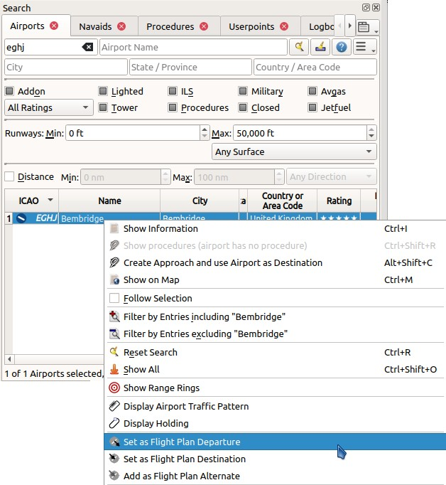
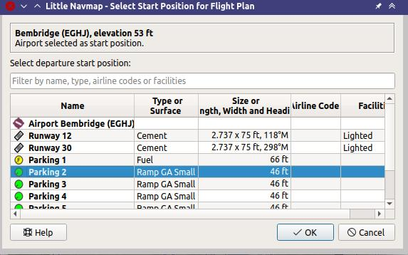
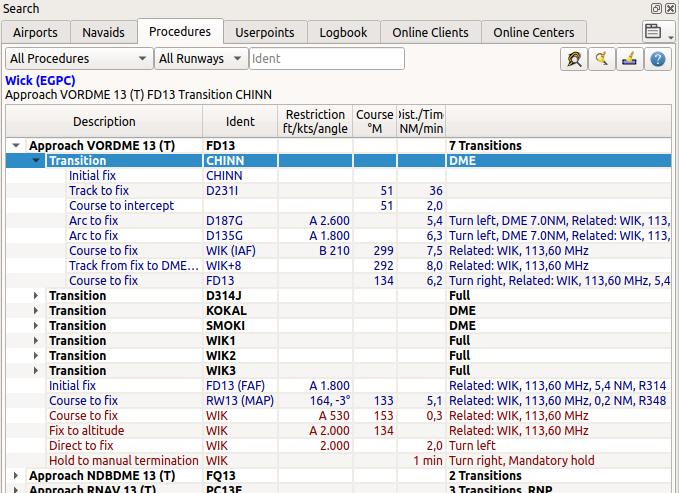
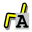
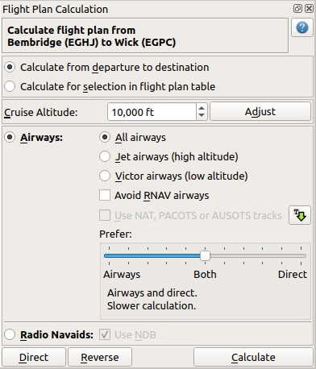
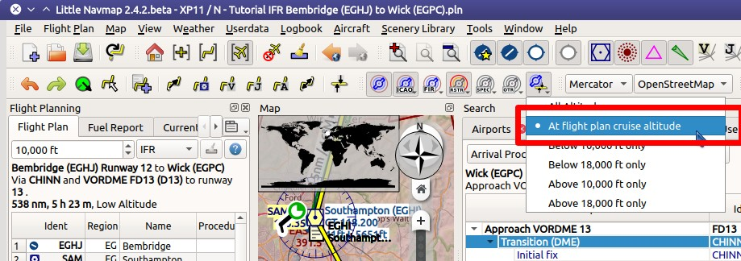
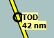
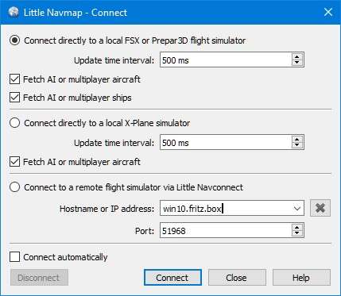

Tutorial - Building an IFR Flight Plan with Approach Procedures
-------------------------------------------------------------------

TODO

This tutorial will show you how to create a more complex IFR flight plan
including approach procedures. It introduces the advanced airport search
functionality and the automatic flight plan calculation.

The flight plan included in the *Little Navmap* installation directory:
``.../Little Navmap/etc/Tutorial IFR Bembridge (EGHJ) to Wick (EGPC).pln``.

While this tutorial looks quite lengthy it is normally a matter of half
a minute to get a flight plan if you know where to go. The planning
effort shown here is bigger to highlight some of the more advanced
features of the program.

You should at least read through :doc:`TUTORIALVFR` before doing this one.

The flight plan will go across the UK using an IFR capable aircraft. Its
maximum range should be more than 600 NM including reserves
and a cruise altitude of 10,000 ft.

Note that Bembridge has a relatively short runway of 2,729 ft. You probably need
a small turboprop or a powerful twin. Do not try to fly this trip with an airliner.

The tutorial assumes the following preconditions:

-  You left your aircraft at ``Bembridge (EGHJ)`` at the end of the last
   flight or think of it as you home base.
-  You don't know where you want to fly today.
-  You know the requirements for your aircraft:

   -  Maximum range
   -  Minimum runway length
   -  Hard runways
   -  Needs a parking spot at the destination
   -  Fuel for return trip

Prepare Flight
~~~~~~~~~~~~~~

Use ``Flight`` -> :ref:`reset-for-new-flight`
|Reset all for a new Flight| before each flight to get a clean base for
fuel calculation and other functions. Uncheck
``Create a new and empty flight plan`` in the dialog if the flight plan is
already loaded.

Default Aircraft Performance
~~~~~~~~~~~~~~~~~~~~~~~~~~~~

This tutorial does not cover creating or collecting aircraft performance
files. See :doc:`TUTORIALPERF` if you like to do this.

Therefore, we will simply use a slightly modified aircraft performance
profile which gives a three degree climb and descent angle.

-  Select ``Aircraft`` -> :ref:`aircraft-menu-new` |New Aircraft
   Performance ...|.
-  Optional: Select :ref:`aircraft-menu-edit` from the same menu as above and
   change the value for
   ``Cruise speed at typical cruise altitude`` to roughly match your
   chosen aircraft. This helps to get an accurate estimate for the
   traveling time. Fill the other fields too if you know the performance values.
-  Optional: Adjust descent and/or climb values as needed.
-  Accept by pressing ``OK`` in the dialog.

You will see several warnings in the fuel report. Ignore these for now
since the aircraft performance is sufficient to calculate the top of
descent and top of climb for the elevation profile.

|Aircraft Performance|

.. _tutorial-ifr-cleanup:

Cleanup Search
~~~~~~~~~~~~~~

Go to the dock window ``Search`` and follow the steps below:

-  Right-click into the result table and select :ref:`reset-search` |Reset
   Search| to remove of all search criteria that may affect the query.
-  Click the menu button |Menu Button| and make sure that the search
   groups ``Facilities``, ``Runway`` and ``Distance from Mark`` are
   checked. Deselect all others you do not need.

|Prepare Search|

.. _tutorial-ifr-assign-departure:

Assign Departure
~~~~~~~~~~~~~~~~

Now look for the departure airport:

-  Enter ``EGHJ`` in the ``ICAO Code`` search field on the top left
   (case does not matter).
-  Right-click on the airport in the result table.
-  Choose ``Set as Departure`` |Set as Flight Plan
   Departure|. This will assign the airport as a start position.

|Assign Departure|

Your flight plan has one entry now. This is already sufficient if you
want to fly a pattern and like to see distance, speed and time
information to the airport.

Now select a parking position:

-  Go to ``Flight Plan`` -> :ref:`select-a-start-position-for-departure`
   |Select a Start Position for Departure|.
-  Choose one of the GA small ramp positions.
-  Click ``OK`` and the position will be highlighted on the map.

|Assign Parking|

You can also select the start position directly on the
map's context menu as described in :doc:`TUTORIALVFR`.
See also :ref:`set-as-flight-plan-departure`.

.. _tutorial-ifr-search-dest:

Search for Destination
~~~~~~~~~~~~~~~~~~~~~~

Now look for a suitable destination airport:

-  Right-click on ``EGHJ`` in the search result again.
-  Select ``Set Center for Distance Search`` |Set Center for Distance
   Search|. You can also do this in the map. This is the center point
   for the spatial search.
-  Clear the ``ICAO Code`` search field now. It is a common mistake to
   leave the text fields filled when doing distance searches which will
   give you an empty result table.

We will now look for airports that are in range of the aircraft but not
too close. Also, certain criteria have to be fulfilled, like a runway
which is long enough and has the right surface.

You can also find airports in aircraft range by using the range rings
where you can right-click into the map on your departure airport and
select :ref:`show-range-rings` |Show Range Rings|.

We will use the spatial search instead of range rings since we'd like to
see only suitable airports for out aircraft.

Check the following in the airport search tab:

#. ``Rating``: We'd like to get airports that are either add-ons or have
   basic scenery requirements as taxiways, parking spots and more.
   Select the one with at least four stars.
   You can also select ``3D`` if you fly X-Plane.
#. ``Procedures``: Show only airports that have procedures.
#. Deselect ``Military`` and ``Closed`` (click the checkboxes twice):
   This will return only civilian airports and avoid airports that have
   all runways closed.
#. Select ``Any is Hard`` in the button ``Any Surface``  to avoid
   airports having only soft surfaced runways.
#. Select a minimum runway length of 2,500 ft or whatever you chosen
   aircraft needs in the field ``Runways:`` ``Min:``.

See also :doc:`SEARCH`.

You can also limit the maximum runway length if you are looking for a
short landing challenge.

The search result changes on the fly while doing all these adjustments,
though we are not there yet:

-  Check ``Distance:`` to activate the spatial search.
-  Change the maximum distance to 600 NM and the minimum to 400 NM
   (to avoid short hops). The result table will now update with a
   small delay since the distance search is more complex.
-  To find only airports north of your position select ``North`` in the
   button ``Any Direction``. Note that the search result is sorted by
   distance with the closest airport first per default.
-  Choose an airport for your trip. Use ``Wick (EGPC)`` for this
   tutorial.

   |Search for Destination|
-  Right-click on Wick in the result table and select
   ``Show Information`` |Show Information|. This will fill the
   tabs in the dock window ``Information``.
-  Select the tab ``Airport`` and below this one the tab ``Weather``. Look for the section
   ``Best runways for wind`` to get an idea of the expected landing
   runway. Start any third party weather programs before if you use these.

For this tutorial we assume that the winds favor runway 13.

See also :doc:`WEATHER`.

.. _tutorial-ifr-select-approach:

Select an Approach Procedure
~~~~~~~~~~~~~~~~~~~~~~~~~~~~

We'll select an approach procedure now:

-  Go back to the search result.
-  Right-click on the airport Wick again. Select ``Show Procedures for``
   |Show Procedures|. This will pop up the procedure search tab.
-  Choose ``Runway 13`` in the ``All Runways`` combo box to see only
   approaches for 13.
-  Select ``Expand All`` in the context menu to see also the transitions
   for each approach.
-  Choose ``Approach VORDME 13 FD13`` using ``Transition (Full) CHINN``
   since we expect to land on runway 13. You can also use any other approach for this runway
   if VORDME 13 is not available.

The top label in the procedure search shows
``Wick (EGPC) Approach VORDME 13 FD13 Transition (Full) CHINN`` for the
selected approach and/or transition. You can also see a preview on the
map.

|Procedure Search Tree|

Right-click on the transition and select
:ref:`procedure-show-on-map` (text might be different depending on selection)
|Show Approach and Transition on Map|. This will center the procedure on the map. You can click on the
legs in the procedure tree to see the start and end points of a leg.

|Procedure Preview|

See also :doc:`SEARCHPROCS` and :doc:`APPROACHES`.

If you like what you see right-click again on the transition and select
:ref:`procedure-insert` (text might be different depending on selection) |Use EGPC and
Approach and Transition as Destination|.

This will do two things:

#. Add Wick as the destination airport to the flight plan. Any previous
   destination in the flight plan will be replaced.
#. Add the approach and its transition to the flight plan. The procedure
   legs use a dark blue color and the missed approach legs use a dark
   red color in the flight plan table. Flight plan en-route legs are
   black. Again, any previous procedure is replaced with this new one.

**About adding transition and approaches:** Approaches and transitions
are closely related which is already indicated by the tree structure in
the procedure search tab. You can add an approach alone but a transition
always belongs to an approach.

You have to select the transition to add or show both, approach and
transition.

.. _tutorial-ifr-calculate-flight-plan:

Calculate a Flight Plan
~~~~~~~~~~~~~~~~~~~~~~~

Now we have the departure airport, an approach procedure and the
destination all connected by a straight line. Next is the en-route part
of the flight plan:

-  Set ``IFR`` as the flight plan type in the dock window
   ``Flight Planning`` on tab ``Flight Plan``.
   This allows the automatic flight plan
   calculation to adjust the cruise altitude.
-  Click ``Flight Plan`` -> :ref:`calculate-flight-plan` |Calculate Flight Plan|
   to open the flight plan calculation floating window.

   |Calculate Flight Plan Window|

   The flight plan cruise altitude is automatically adjusted according to
   the hemispherical rule (the rule can be changed in ``Tools`` ->
   ``Options`` |Options| on the page :ref:`flight-plan`), the altitude
   restrictions of the airways and the flight plan type (``VFR`` or
   ``IFR``). You can see the minimum altitude for each airway segment in
   the flight plan table in the column ``Restriction`` (see :ref:`flight-plan-table-columns`).

   The altitude can be changed according to the hemispherical rule by
   clicking the :ref:`routecalc-adjust` button.
-  Change all settings in the floating window as shown in the screenshot above.
-  Click the button :ref:`routecalc-calculate`.

Use this flight plan for now.

Save the plan using ``File`` -> :ref:`save-flight-plan-as` |Save Flight Plan|.
The program usually finds the right directory for the flight plans and
gives a sensible name by default.

The top label in the flight planning dock window reads now::

      Bembridge (EGHJ) Runway 12 to Wick (EGPC)
      Via CHINN and VORDME FD13 (D13) to runway 13 .
      538 nm, 5 h 23 m, Low Altitude

The plan looks like shown below.

|Flight Plan|

Airspaces
~~~~~~~~~~~~~~~~~

Now you can check if you pass through any airspaces:

-  Enable airspaces by selecting ``View`` -> ``Airspaces`` ->
   ``Show Airspaces`` |Show Airspaces| if not already done.
-  Check ``View`` -> ``Airspaces`` -> ``At flight plan cruise altitude``
   |At flight plan cruise altitude| in the menu or the toolbar menu
   button.

|Select Airspaces|

This will display only airspaces on the map that are relevant for your
cruise altitude. You can also select ``Below 10,000 ft only`` to see all
relevant airspaces in the climb or descent phase. Use the tooltips on
the map to get information about airspaces like type, minimum and
maximum altitude.

|Airspaces|

Saving
~~~~~~~~~~~~~~

Save the plan in the *Little Navmap* format LNMPLN using ``File`` ->
:ref:`save-flight-plan` |Save Flight Plan|.
The program usually finds the right directory for the flight plans suggests a name
based on departure and destination.

The format LNMPLN is only understood by *Little Navmap*. You cannot load these files
into another program. Therefore, we have to export the flight plan.

Now open the multiexport options dialog by selecting ``File`` -> :ref:`multiexport-flight-plan-options`.

Right click on the simulator format you'd like to export and select :ref:`multiexport-export-now` |Export Flight Plan now|.
Save the file to the right place. The default path is based on best guess.

See here :ref:`multiexport-quick-setup` for information how to quickly configure the multiexport.

.. _tutorial-ifr-flying:

Flying
~~~~~~

Follow the steps below to get a moving map and see your aircraft in
*Little Navmap*:

-  Open the dialog ``Connect`` using ``Tools`` ->
   :ref:`flight-simulator-connection` |Flight Simulator Connection| and
   check if ``Connect automatically`` is selected. Enable it if not.
   *Little Navmap* will find the simulator no matter if it is already
   started or will be started later.
-  Click on the tab which corresponds to your simulator.
   Image below shows the tab for FSX, P3D or MSFS on the left
   and the tab for X-Plane on the right.

   |Connect Dialog|
-  Click ``Connect`` which will close the dialog.
-  Enable ``Map`` -> ``Center Aircraft`` |Center Aircraft|. The map will
   jump to the simulator aircraft and keep it centered if an active flight
   is loaded, i.e. the simulator is not in the opening screen.
-  Start the simulator if not already done, load the flight plan and go flying.

See also :doc:`CONNECT`.

.. _tutorial-ifr-top-of-descent:

Top of Descent
~~~~~~~~~~~~~~

A top of descent indication is displayed on the map and in the elevation
profile which also shows the distance from top of descent to the
destination. This number includes the distance of approach procedures
(excluding holds).

Altitude restrictions in procedures are considered in the top of descent
calculation.

|Top of Descent Indicator|

The tab ``Progress`` in the dock window ``Simulator Aircraft`` will show
the distance to the top of descent in the ``Flight Plan Progress``
section.

The section ``Altitude`` will show the vertical path deviation after
passing the top of descent.

.. _tutorial-ifr-changing-procedures:

Changing Procedures
~~~~~~~~~~~~~~~~~~~

Now the weather has changed requiring an approach to runway 31:

-  Right-click on the destination airport at the bottom of the flight
   plan table.
-  Choose ``Show Procedures for`` |Show Procedures|.
-  Then change the runway filter to ``Runway 31``.
-  Expand the approach ``VORDME 31`` to see the transition.
-  Select the transition.

The label on top of the window shows now
``Approach VORDME 31 FD31 Transition (Full) CHINN``.

-  Right-click on the selected transition.
-  Choose ``Use EGPC and Approach and Transition as Destination`` |Use
   EGPC and Approach and Transition as Destination| from the context
   menu which will replace the current procedure in your flight plan
   with the new one.

The top label in the flight planning dock window reads now::

     Bembridge (EGHJ) Parking 1, Ramp GA Small to Wick (EGPC)
     Via CHINN and VORDME FD31 to runway 31
     526 nm, 5 h 15 m, Low Altitude

To completely delete a procedure:

-  Select any leg of the procedure in the flight plan table.
-  Right-click and choose :ref:`delete-selected-legs` |Delete
   selected Leg or Procedure| or press the ``Del`` key to remove the
   whole procedure.

If ATC clears you to the initial fix of the procedure:

#. Delete any intermediate waypoints between your current aircraft
   position and the initial fix of the procedure: Right-click in the
   flight plan table and select :ref:`delete-selected-legs`
   |Delete selected Leg or Procedure| for all waypoints between your
   current aircraft position and the initial fix or start of the
   procedure. Avoid deleting your approach (you can also right-click on
   a flight plan waypoint on the map and delete it from the context
   menu).
#. Then right-click on your aircraft on the map and select
   :ref:`add-position-to-flight-plan` |Add Position to Flight Plan|.

This will give a direct connection from your current aircraft position
to the start of the procedure which you can use to get course and
distance to the initial fix.

**Below:** After changing the approach procedure and adding an user defined
waypoint at the aircraft position to the flight plan. Now we get course
and altitude indications for a direct leg to the start of the transition
(43 NM and 314 degrees magnetic course).

|Changed Approach|

.. _tutorial-ifr-going-missed:

Going Missed
~~~~~~~~~~~~

I recommend hiding the missed approaches on the map by unchecking
``View`` -> :ref:`show-missed-approaches` |Show Missed Approaches|. This
helps uncluttering the map display.

-  **If the missed approach is not shown:** The progress window shows
   distance and time to destination. Activating the next leg (shown in
   magenta color) will stop if the destination (i.e. the runway
   threshold) is reached, even when passing the threshold.
-  **If the missed is shown and the aircraft passes the runway
   threshold:** The first leg of the missed approach is activated and
   simulator aircraft progress will display the remaining distance to
   the end of the missed procedure.

.. |Aircraft Performance| image:: ../images/tutorial_ifrperf.jpg
.. |Reset Search| image:: ../images/icon_clear.png
.. |Menu Button| image:: ../images/icon_menubutton.png
.. |Prepare Search| image:: ../images/tutorial_ifrsearchprep.jpg
.. |Set as Flight Plan Departure| image:: ../images/icon_airportroutedest.png

.. |Select a Start Position for Departure| image:: ../images/icon_parkingstartset.png

.. |Set Center for Distance Search| image:: ../images/icon_mark.png
.. |Show Range Rings| image:: ../images/icon_rangerings.png
.. |Search for Destination| image:: ../images/tutorial_ifrsearchdest.jpg
.. |Show Information| image:: ../images/icon_globals.png
.. |Show Procedures| image:: ../images/icon_approach.png

.. |Show Approach and Transition on Map| image:: ../images/icon_showonmap.png
.. |Procedure Preview| image:: ../images/tutorial_ifrprocpreview.jpg
.. |Use EGPC and Approach and Transition as Destination| image:: ../images/icon_routeadd.png
.. |Calculate low Altitude| image:: ../images/icon_routelow.png
.. |Options| image:: ../images/icon_settings.png

.. |Calculate Flight Plan Result| image:: ../images/tutorial_ifrcalcalt.jpg

.. |Save Flight Plan| image:: ../images/icon_filesave.png
.. |Flight Plan| image:: ../images/tutorial_ifrflightplan.jpg

.. |Airspaces| image:: ../images/tutorial_ifrairspaces.jpg

.. |New Flight Plan| image:: ../images/icon_centeraircraft.png

.. |Add Position to Flight Plan| image:: ../images/icon_routeadd.png
.. |Changed Approach| image:: ../images/tutorial_ifrapproach.jpg

.. |Export Flight Plan now| image:: ../images/icon_filesaveas.png
.. |Center Aircraft| image:: ../images/icon_centeraircraft.png

