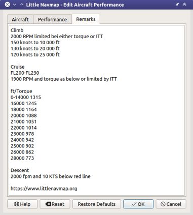

Tutorial - Creating an Aircraft Performance Profile
------------------------------------------------------

TODO

This tutorial shows how to automatically collect aircraft performance
while flying and how to create, merge and fine tune the result.

You should be already familiar with the flight planning features of
*Little Navmap*.

Flight Plan
~~~~~~~~~~~

You can use the flight plan from the IFR tutorial is included in the
*Little Navmap* directory:
``.../Little Navmap/etc/Tutorial IFR Bembridge (EGHJ) to Wick (EGPC).pln``.

Use main menu ``File`` -> :ref:`open-flight-plan` |Open Flight Plan| to
load the flight plan.

The plan should cover the typical cruise altitude and travel distance
for your aircraft. A short hop of a few miles at low altitude does not
suffice.

You can also fly and collect performance without a flight plan. Set the
intended cruise altitude in the window :doc:`FLIGHTPLAN` to allow *Little
Navmap* to detect the cruise phase.

Aircraft Performance
~~~~~~~~~~~~~~~~~~~~

First start by creating a new and empty performance profile by selecting
``Aircraft`` -> :ref:`aircraft-menu-new` |New Aircraft Performance Icon|
in the main menu.

Leave all as is in the dialog and click ``OK``.

|New Aircraft Performance|

Ignore the various warnings and error messages in the fuel report for
now. This performance profile is good enough to calculate top of climb
and top of descent with a three degree flight path angle.

Also ignore the zero values in the :ref:`aircraft-performance-fuelplan`.
Fuel flow data has to be
entered in the performance profile to get a valid fuel prediction.

Start and load a flight with aircraft engines running or not. Connect
*Little Navmap* to the simulator.

Select ``Flight`` -> :ref:`reset-for-new-flight` |Reset all for a new
Flight Icon| in the menu. Remove the check mark from
``Create a new and empty flight plan`` since a plan is already loaded.
Click ``OK`` to get a clean base for fuel calculation, logbook and other
functions.

|Reset all for a new Flight|

Fly and use typical climb and cruise performance settings in the
aircraft. Time compression is no issue if you stay a few minutes at
cruise to allow *Little Navmap* collecting cruise fuel data.

You can see the detected aircraft type, detected flight phase (climb,
cruise and more) as well as all current values collected and averaged by
*Little Navmap* in the tab ``Current Performance``.

See chapter :doc:`AIRCRAFTPERFCOLL` for details.

|Current Performance Start|

New flight phases are added when detected. Note that the cruise phase is
only detected when flying at flight plan cruise altitude. Set the cruise
altitude in the flight plan tab at least if you wish to collect
performance without a flight plan.

|Current Performance Cruise|

After landing and shutting off engines you can see the text
``Current flight segment: Destination Parking, Finished.`` in the tab
``Current Performance``.

|Current Performance Finished|

You have a complete aircraft performance collection once the text
``Finished.`` is shown which is right after touchdown at the
destination.

Now select ``Aircraft`` -> :ref:`aircraft-menu-merge`
|Merge collected Aircraft Performance| in the main menu to fill the
empty performance profile with the collected values.

Note the header ``New Value`` (collected data) and ``Current Value``
(currently loaded or created profile default values) with the values
below.

|Current Performance Merge|

We'd like to use all values for the new profile. Therefore, set all
operations to ``Copy`` in the dialog and click ``OK``.

You can also change the operations for each field individually or use
the operation ``Merge`` which will use the average of the new and
current value. You can do a merge at any flight phase. For example, if
you'd like to fine tune the values during flight.
See :doc:`AIRCRAFTPERFMERGE` for more.

Adjust the performance using ``Merge`` when doing more flights after the first one.

.. warning::

       Do not forget to add at least sufficient reserve fuel. Otherwise you
       will run out of fuel at destination if you rely on this plan.

You should change the usable fuel and values for alternate after
merging. Do this by selecting ``Aircraft`` ->
:ref:`aircraft-menu-edit` |Edit Aircraft Performance|. Note that
required values have **bold** labels in the edit dialog.

It is also helpful to add notes like engine power settings in the
description file of a performance profile.

Example below for a Beech King Air C-90:

|Aircraft Performance Remarks|

The chapter :doc:`AIRCRAFTPERFEDIT` explains
details about editing.

.. tip::

      Use performance files for different cruise altitude ranges to get more
      precise results for large or complex aircraft. For example, one file for
      FL300-FL350 and one for FL350-FL400.

Use ``Aircraft`` -> :ref:`aircraft-menu-save` |Save Aircraft
Performance| and save the new performance file to any place like
``Documents\Little Navmap\Performance``, for example.

Think about sharing this file with others or send it to me so I can add
it to the `download section of
littlenavmap.org <https://www.littlenavmap.org/downloads/Aircraft%20Performance/>`__.

.. |Open Flight Plan| image:: ../images/icon_fileopen.png
.. |New Aircraft Performance Icon| image:: ../images/icon_aircraftperfnew.png
.. |New Aircraft Performance| image:: ../images/tutorial_perfnew.jpg
.. |Reset all for a new Flight Icon| image:: ../images/icon_reload.png
.. |Reset all for a new Flight| image:: ../images/tutorial_perfreset.jpg
.. |Current Performance Start| image:: ../images/tutorial_perfstart.jpg
.. |Current Performance Cruise| image:: ../images/tutorial_perfcruise.jpg
.. |Current Performance Finished| image:: ../images/tutorial_perffinished.jpg
.. |Merge collected Aircraft Performance| image:: ../images/icon_aircraftperfmerge.png
.. |Current Performance Merge| image:: ../images/tutorial_perfmerge.jpg
.. |Edit Aircraft Performance| image:: ../images/icon_aircraftperfedit.png
.. |Save Aircraft Performance| image:: ../images/icon_aircraftperfsave.png

