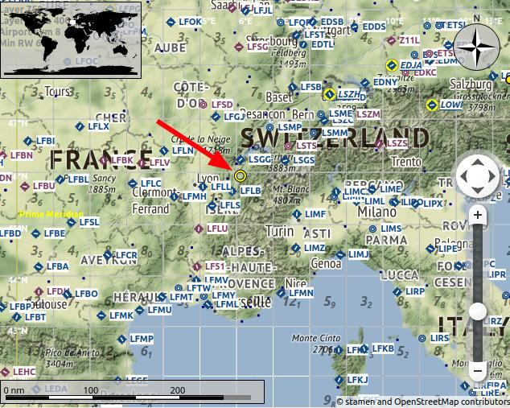
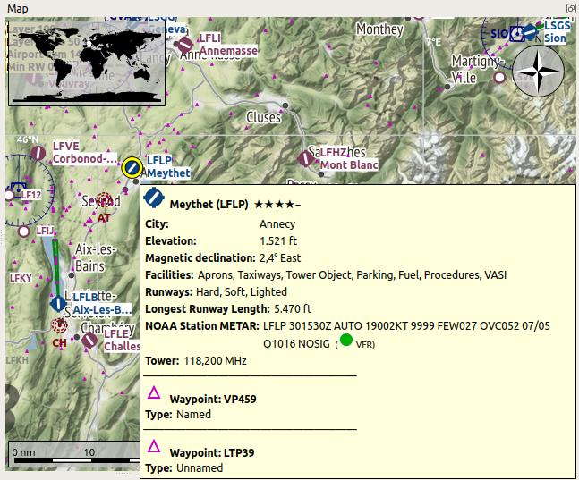
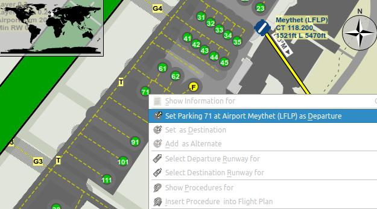
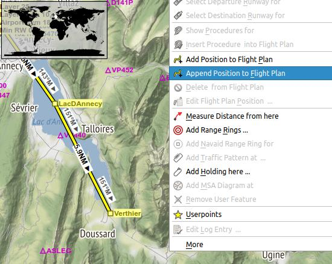
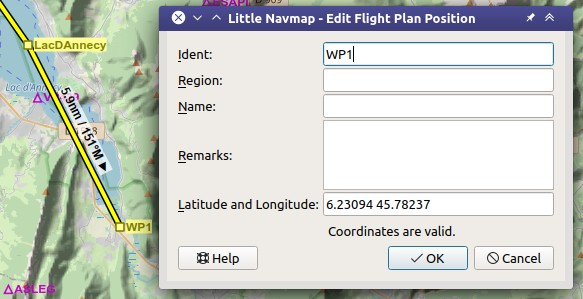
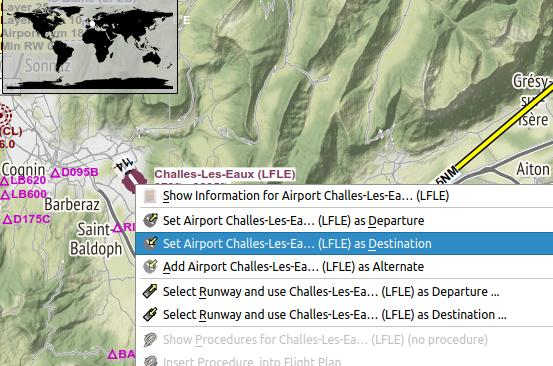
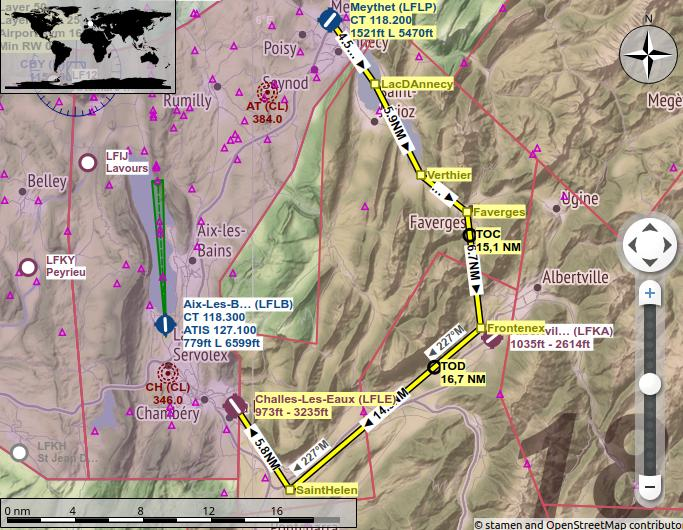
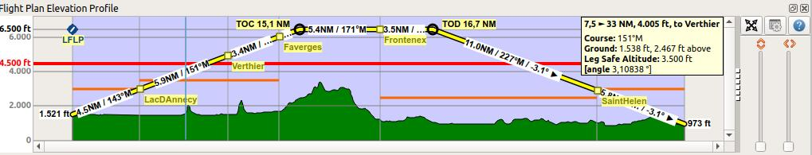
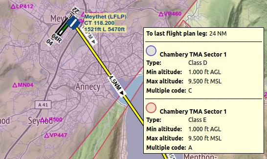

Tutorial - Building a VFR Flight Plan
-------------------------------------

General
~~~~~~~

This tutorial shows how to create a simple flight plan based on the
map and its context menus.

The flight plan is included in the *Little Navmap* installation directory:
``.../Little Navmap/etc/Tutorial VFR Meythet (LFLP) to Challes-les-Eaux (LFLE).lnmpln``.

The airport names might differ depending on simulator.

Use the map theme ``OpenTopoMap`` or any other map theme in menu ``View`` -> :ref:`theme-menu` to see the mountains.
The flight will only go through Class E airspace. There is no need to contact ATC.
Disable airspace display in menu ``View`` -> :ref:`show-airspaces` for now.

The flight takes us through the valleys of the French alps. You can
use this flight plan for any small aircraft like the default Cessna C172 which is available for all simulators.

The flight plan is: *Meythet (LFLP) / Runway 04 to Challes-Les-Eaux (LFLE) Distance 41 NM, time 0 h 24 m.*

Prepare Flight
~~~~~~~~~~~~~~

I'd recommend to get use ``Flight`` -> :ref:`reset-for-new-flight`
|Reset all for a new Flight| before each flight to get a clean base for
fuel calculation and other functions. Deselect
``Create an empty flight plan`` in the dialog if your plan is
already loaded.

Default Aircraft Performance
~~~~~~~~~~~~~~~~~~~~~~~~~~~~

This tutorial does not cover creating or collecting aircraft performance
files. See :doc:`TUTORIALPERF`
if you like to do this.

Therefore, we will simply use the default example performance profile based on a Cessna C172.

Select ``Aircraft`` -> :ref:`aircraft-menu-new` |New Aircraft
Performance ...|. Accept the default values by pressing ``OK`` in the
dialog.

Departure Airport
~~~~~~~~~~~~~~~~~

Find the departure airport: Click into the map and zoom to the French
Alps. You can use the following functions to navigate:

- The map overlay on the right (:ref:`overlays-map`).
- The mouse (click and drag) to move and the mouse wheel to zoom (:ref:`mouse-clicks-legend`).
- The cursor keys to move and the keys ``+`` and ``-`` for zooming in
  and out (click into the map window or press ``F2`` to activate it before using the keys).
  See :ref:`key-commands-legend` about keyboard navigation.

Use the back |Back| and forward |Forward| buttons to jump in the
position history like in a web browser.

See also :doc:`MAPDISPLAY`.

Look for the departure airport ``Meythet (LFLP)`` around here:

|Meythet (LFLP)|

Closer with tooltip:

|Meythet (LFLP) Tooltip|

Now:

- Zoom in until you see the airport diagram showing taxiways, runway details, parking positions and more.
- Zoom in further until you see the white parking numbers.
- Right-click on the center of one of the green ramp parking spots (11 is used here).
- Choose ``Set Parking 11 at Meythet (LFLP) as Departure``
  |Select Airport / Parking as Flight Plan Departure| (:ref:`set-as-flight-plan-departure`) in the context menu.

The airport layout and parking spot will be different depending on used simulator.

|Meythet (LFLP) Parking|

This will select your departure parking position which will be
highlighted by a black/yellow circle. The airport will be added to the
flight plan as departure too.

You can also click on the airport icon and select it for departure.
The airport center will be automatically assigned as departure position.

En-Route Waypoints
~~~~~~~~~~~~~~~~~~

Add the waypoints now:

- Scroll along the valley to the south east across the lake Lac d'Annecy.
- Click :ref:`append-position-to-flight-plan` |Append Position to Flight Plan|.
  The clicked position will be added as a user defined waypoint (green rectangle) to the end of your plan.

Click undo |Undo| or redo |Redo| in the toolbar if you don't like what you just added.

|Append Waypoint|

Another function is :ref:`add-position-to-flight-plan` |Add Position to
Flight Plan| which will insert the clicked position to the nearest
flight plan leg. You can use this to add user defined positions,
airports or navaids in the middle of a flight plan. The nearest leg will
be chosen automatically by *Little Navmap* for inserting the new position.

*Little Navmap* will automatically assign names to the user defined
waypoints. You can leave these as they are or replace them with a more
meaningful name.

Waypoints using the default format ``WP`` plus number (e.g. ``WP1`` or ``WP99``) are automatically
renumbered to reflect the flying order in the flight plan.

Right-click on the user waypoint and select
``Edit Flight Plan Position WP1`` |Edit Flight Plan Position| (:ref:`edit-name-of-user-waypoint`) to change
a waypoint ident, name, remarks or its coordinates. Use nearby villages, mountains,
lakes or other points of interest. Do not change the coordinates now.

|Edit Waypoint Name|

Keep adding points and stay away from the mountains until you're at
``Challes-les-Eaux (LFLE)``.

Destination Airport
~~~~~~~~~~~~~~~~~~~

To add the destination:

-  Right-click on ``Challes-les-Eaux (LFLE)``
-  Select ``Set Airport Challes-les-Eaux (LFLE) as Destination`` |Set Airport as Flight Plan Destination| (:ref:`set-as-flight-plan-destination`).

|Select Destination|

Now there is a flight plan. Yours might look a bit different.

|VFR Flight Plan|

You can also use the click-and-drag feature to move points or add new
ones. Enable it by checking ``Flight Plan`` ->
:ref:`edit-flight-plan-on-map` |Edit Flight Plan on Map|   and click on a
flight plan waypoint to move it. Click on a flight plan leg to add a new
waypoint into this leg. See :doc:`MAPFPEDIT` for information on this function.

Cruise Altitude
~~~~~~~~~~~~~~~

Change the flight plan type to ``VFR`` if not already done.

|Flight Plan Type|

Now check the cruise altitude:

- Look at the flight plan elevation profile. There is a red line indicating the minimum safe altitude.
- Adjust the flight plan cruise altitude until you're above the red line.
- Select ``Flight Plan`` -> :ref:`adjust-flight-plan-alt` |Adjust Flight Plan Altitude| to get the correct altitude adjusted by the
  hemispherical rule.

Note that the default hemispherical rule is not correct for France until
you change it in the options dialog, but avoid this for the sake of
simplicity now.

|Elevation Profile|

You probably noticed that you will get close to ground near the
destination. Be prepared to circumvent some mountains there.

Airspaces
~~~~~~~~~

Now look if your flight plan touches any airspaces.

Click into one of the airspaces nearby start and destination and have a
look at the information dock window. There are several airspaces:

- ``Geneva TMA Sector 8`` which starts at 9,500 ft above mean sea level (MSL). This is higher than our cruise altitude and won't affect us.
- Two Class E airspaces. The information window notes for these: ``Controlled, IFR and VFR, ATC clearance required for IFR only``. No
  problem because we will fly using VFR.

The situation is similar at the destination.

Note that you might find different airspaces depending if you use the
latest navdata or stock airspace data.

|Airspaces|

Saving
~~~~~~~~~~~~~~

Save the plan in the *Little Navmap* format LNMPLN using ``File`` ->
:ref:`save-flight-plan` |Save Flight Plan|.
The program usually finds the right directory for the flight plans and
gives a meaningful name by default.

The format LNMPLN is only understood by *Little Navmap*. You cannot load these files
into another program. Therefore, we have to export the flight plan.

Now open the multiexport options dialog by selecting ``File`` -> :ref:`multiexport-flight-plan-options`.

Right click on the simulator format you'd like to export and select :ref:`multiexport-export-now` |Export Flight Plan now|.
Save the file to the right place. The default path is based on best guess. Adjust it as needed.

See :ref:`multiexport-quick-setup` for information how to quickly configure the multiexport.

Flying
~~~~~~

Follow the steps below to get a moving map and see your aircraft in
*Little Navmap*:

- Open the dialog ``Connect`` using ``Tools`` ->
  :ref:`flight-simulator-connection` |Flight Simulator Connection| and
  check if ``Connect automatically`` is selected. Enable it if not.
  *Little Navmap* will find the simulator no matter if it is already
  started or will be started later.
- Click on the tab which corresponds to your simulator.
  Image below shows the tab for FSX, P3D or MSFS on the left
  and the tab for X-Plane on the right. Tab titles will look different
  depending on whether you are using the 32-bit (FSX and P3D) or the 64-bit (MSFS and X-Plane)
  build of *Little Navmap*. Tab titles will look different
  depending on whether you are using the 32-bit (FSX and P3D) or the 64-bit (MSFS and X-Plane)
  build of *Little Navmap*.

  |Connect Dialog|
- Click ``Connect`` which will close the dialog.
- Enable ``Map`` -> :ref:`center-aircraft` |Center Aircraft|. The map will
  jump to the simulator aircraft and keep it centered if an active flight
  is loaded, i.e. the simulator is not in the opening screen.
- Start the simulator if not already done, load the flight plan and go flying.

.. important::

  Make sure you use the right build of *Little Navmap*.
  The 64-bit version shows only ``MSFS`` in the connection tab while the 32-bit version shows ``FSX and P3D``.

See also :doc:`CONNECT`.

Looking at Places while Flying
~~~~~~~~~~~~~~~~~~~~~~~~~~~~~~

*Little Navmap* will keep your aircraft centered on the screen as a default setting. You can configure
this function in the options dialog on page :ref:`options-simulator-aircraft`.

The program will stop following your aircraft for 10 seconds if you
start any action that zooms in to an airport or navaid (double-click,
toolbar button or link in the information window) or just simply move or
zoom around in the map.

See :doc:`AIRCRAFTCENTER` for more information about aircraft centering while flying.

Double-click on the destination airport to zoom to the airport diagram,
for example. Leave *Little Navmap* alone and the map will jump back to the aircraft
and next flight plan waypoint after the timeout.

.. |Reset all for a new Flight| image:: ../images/icon_reload.png
.. |New Aircraft Performance ...| image:: ../images/icon_aircraftperfnew.png

.. |Select Airport / Parking as Flight Plan Departure| image:: ../images/icon_airportroutedest.png

.. |Append Position to Flight Plan| image:: ../images/icon_routeadd.png

.. |Add Position to Flight Plan| image:: ../images/icon_routeadd.png

.. |Set Airport as Flight Plan Destination| image:: ../images/icon_airportroutestart.png

.. |Flight Plan Type| image:: ../images/tutorial_vfrtype.jpg
.. |Adjust Flight Plan Altitude| image:: ../images/icon_routeadjustalt.png

.. |Save Flight Plan| image:: ../images/icon_filesave.png
.. |Flight Simulator Connection| image:: ../images/icon_network.png
.. |Connect Dialog| image:: ../images/connectlocal.jpg
.. |Center Aircraft| image:: ../images/icon_centeraircraft.png

.. |Export Flight Plan now| image:: ../images/icon_filesaveas.png

