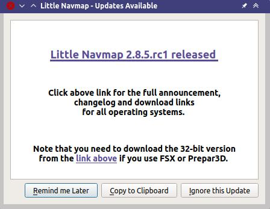

|Checking for Updates| Checking for Updates
-------------------------------------------

*Little Navmap* will automatically check its `home
page <https://albar965.github.io/>`__ for available updates on startup.
Frequency and update channels are configurable. See below for
configuration options.

You can always check manually for updates by selecting ``Help`` ->
``Check for Updates`` in the main menu.

Note that the installation still has to be done manually.

Notification Dialog
~~~~~~~~~~~~~~~~~~~~~

The dialog showing available updates contains a change log, various
other messages and one or more download links.

Buttons
^^^^^^^^^^^^^^^^^^^^^^^

Download in Web Browser
''''''''''''''''''''''''''''''

Opens your default web browser and start the download or shows a
download page. You might not necessarily see a web page if the download
starts in the background.

The update dialog stays to allow reading the release notes.

Remind me Later
''''''''''''''''''''''''''''''

Dismiss the dialog. You will be notified again on next startup depending
on selected frequency. You can also press the escape key to trigger this
action.

This button is not visible when checking manually.

Copy to Clipboard
''''''''''''''''''''''''''''''

Copy the contents of the window as formatted text into the clipboard for
later reading. This allows to paste the release notes into *LibreOffice
Writer* or *MS Word*.

Ignore this Update
''''''''''''''''''''''''''''''

Pressing this button will close the dialog and ignore the shown
version in the future. You will not see any reminders for this version again but
only for newer versions.

This button is not visible when checking manually.

Note that a manual check for updates supersedes the ignored versions.

     Update notification dialog showing an available beta version including change log and download link.

Options
~~~~~~~

Update check settings can be changed in the options dialog on the page
``Startup and Update``.

Check for Updates
^^^^^^^^^^^^^^^^^

You can set the interval for update checks. Default is ``Daily``.
Choices ``Daily``, ``Weekly`` or ``Manual`` where the latter one will
never check automatically.

Select ``Help`` -> ``Check for Updates`` in the main menu to search
manually for new versions.

Note that the daily or weekly check is only done when starting the
program.

Update Channels
^^^^^^^^^^^^^^^

``Stable Versions only``: This will show only notifications for tested
and stable versions with a complete manual.

``Stable and Beta Versions``: Will additionally check for beta/test
versions. Beta versions are program releases that already contain all
planned features for a stable release but are still not tested
carefully. The manual might be incomplete.

``Stable, Beta and Development Versions``: *Little Navmap* will also
show notifications for development releases. These are neither complete
nor well tested. Features might change over time and the manual is not
updated for new functionality.

A backup of all settings is recommended before running a development
version.

Check for Updates now
^^^^^^^^^^^^^^^^^^^^^

Checks for updates immediately. This will use the current settings as
shown in the dialog. It will also show notifications for updates that
were ignored by pressing the ``Ignore this Update`` on the notification
dialog.

.. figure:: ../images/updateoptions.jpg

        Update notification settings in dialog ``Options``.

