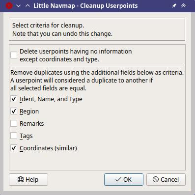

Userpoints
----------------------

User defined waypoints (or userpoints) allow for adding, editing,
searching, exporting, and importing bookmarks, points of interest,
waypoints and more. You can pick freely which types you want to see as
icons on the map.

.. figure:: ../images/userpoint_overview.jpg
       :scale: 50%

       An overview of userpoint functionality showing
       information on the left dock window, highlighted userpoints on the map,
       userpoints selected in the search window on the right, and the drop down
       menu opened by clicking the userpoint icon in the dock window.
       Screenshot based on *Little Navmap* 2.4.  *Click image to enlarge.*

.. _userpoints-search:

Userpoint Search
~~~~~~~~~~~~~~~~~~~~~~~~~~~~~~~~~~~~~

The functionality of the search filters and the result table is similar
to the airport and navaid search. See :doc:`SEARCH`
for information about search filters and buttons.

Additional context menu items and buttons allow adding, editing, and
deleting of userpoints.

.. _userpoints-top-buttons:

Top Buttons and additional Menu Items
^^^^^^^^^^^^^^^^^^^^^^^^^^^^^^^^^^^^^^^^^^^^

See :ref:`search-result-table-view-context-menu` for a
description of common context menu items across all search dialogs. All
buttons have an equivalent in the result table context menu.

.. _undo-userpoint-search:

|Undo| |Redo| Undo and Redo Userpoint
''''''''''''''''''''''''''''''''''''''''''''''''''''''''''''''''''''''''''''''''

Allows undo and redo of all userpoint changes. The last action is shown in the menu item like
``Undo deleting of tow Userpoints``, for example.
The undo information is kept when restarting *Little Navmap* and only deleted if a certain amount of
undo steps is exceeded.

Also in main menu ``Userpoint`` -> :ref:`undo-userpoint`.

.. _userpoints-add:

|Add Userpoint| Add Userpoint
''''''''''''''''''''''''''''''''''''''''

Add an user-defined waypoint to the userpoint database.

Some fields of the new userpoint dialog are populated automatically
depending on a selected userpoint or, if nothing is selected in the
search result table, based on previous additions. This allows to quickly
add similar userpoints to the database without the need to re-enter all
the information.

Note that you have to add the coordinates manually if the dialogs starts
empty i.e. nothing was selected in the result table. Add userpoints with
the map context menu (:ref:`add-userpoint`) to
avoid this and have the coordinates set automatically.

See below for more information about the add dialog: :ref:`userpoints-dialog-add`.

.. _userpoints-edit:

|Edit Userpoint| Edit Userpoint
''''''''''''''''''''''''''''''''''''''''

Open the edit dialog for one or more userpoints.

The edit dialog shows a column of checkboxes on the right side if more
than one userpoint is selected. These allow to choose the fields to
change for a bulk edit.

See below for more information about the add dialog.

.. _userpoints-delete:

|Delete Userpoint| Delete Userpoint
''''''''''''''''''''''''''''''''''''''''

Remove the selected userpoints. The action can be undone in the main menu ``Userpoint``.

.. _userpoint-cleanup:

Cleanup Userpoints
''''''''''''''''''''''''''''''''''''''''

Opens a dialog window where the userpoint database can be cleaned up.
The dialog contains the following options:

Delete userpoints having no information except coordinates and type
  Removes empty userpoints without any information.

Remove duplicates using additional fields as criteria.
  A userpoint will considered a duplicate to another if all selected fields are equal. The following fields can be checked:

  -  Ident, Name, and Type
  -  Region
  -  Remarks
  -  Tags
  -  Coordinates

Show a preview before deleting userpoints
    Shows a table with the userpoints to remove before deleting. You can cancel the operation in the preview.

    Cleanup up userpoints dialog. Empty userpoints will not be deleted.
    Duplicates are removed if ident, region, name, type and coordinates are the same.

.. _userpoints-menu:

|Menu Button| Menu Button
''''''''''''''''''''''''''''''''''''''''

See :ref:`menu-button-search`.

.. _userpoints-dialog-add:

Add Userpoints
~~~~~~~~~~~~~~~~~~~~~

The dialog is shown when selecting :ref:`add-userpoint` |Add Userpoint| in the map
context menu, using the top button in the userpoint search tab, or
selecting ``Add Userpoint`` from the context menu in the search result
table.

The dialog will be populated automatically depending on the selected map
context, the selection in the search result table or previous additions.

``Type`` can be selected from a drop down list or entered freely.

``Name`` and ``Tags`` can be selected freely. Note that some of these fields have a special meaning for X-Plane import and export. See below for more information.

The field ``Description`` allows multi line text and special characters.
Formatting like italic or bold is not supported. See :doc:`REMARKS` for more information about using web links in this field.

The field ``Visible from`` allows to define visibility on the map
depending on zoom distance. The zoom distance (viewpoint distance to
earth surface) for the current map view is shown in the
:doc:`STATUSBAR`. The userpoint will be visible for
all zoom distances smaller than the value in ``Visible from``. Maximum
value is 3,000 NM and minimum value is 1 NM.

Valid coordinates are required to confirm the dialog. See :doc:`COORDINATES` for a detailed
description of the recognized coordinate formats. A label below the
coordinates displays the parsed coordinates or an error message in case
the coordinates are invalid.

The userpoint is removed on next startup of *Little Navmap* when
``Temporary userpoint. Delete on next startup.`` is checked.

The button ``Reset`` clears all fields with exception of the coordinates
and sets the type of the userpoint to ``Bookmark``.

Note that all fields are optional. Only coordinates are required.

.. figure:: ../images/userpoint_add.jpg

       Add dialog that has been populated automatically by
       context. The user right-clicked on an airport and selected
       ``Add Userpoint Airport Frankfurt am Main (EDDF)``.

.. _userpoints-dialog-edit:

Edit Userpoints
~~~~~~~~~~~~~~~~~~~~~~

A single Userpoint
^^^^^^^^^^^^^^^^^^

The edit dialog shows the same edit fields as the dialog used to add
userpoints above.

Additional metadata shown at the bottom:

-  **Last Change:** Date and time of import, creation or change.
-  **Imported from file:** File and path of source file from CSV,
   X-Plane or Garmin import. You can filter the userpoint search for
   this name.
-  **Temporary userpoint - will be deleted on next startup.** This
   indicates a temporary userpoint.

The button ``Reset`` undoes all manual changes and reverts all fields to
their original state.

.. figure:: ../images/userpoint_edit.jpg

    Edit dialog for a single userpoint.

Multiple Userpoints
^^^^^^^^^^^^^^^^^^^

If more than one userpoint was selected for editing, the edit dialog
shows a column of checkboxes on the right side.

If checked, the field to the left is unlocked and any text entered will
be assigned to the respective field in all selected userpoints.
Unchecked fields will not be altered for any of the userpoints.

In combination with the search function, this allows for bulk
changes like fixing an invalid region and simultaneously changing the
visibility range for the affected userpoints:

#. Search for all userpoints with the invalid region.
#. Select all the resulting userpoints, e.g. by clicking on one of the
   userpoints among the search results and pressing ``Ctrl+A`` or by
   clicking on the top left corner of the column header.
#. Right-click one of the highlighted userpoints and select
   ``Edit Userpoints`` from the context menu.
#. Click the checkbox to the right of the ``Region:`` field and change
   the region.
#. Click the checkbox to the right of the ``Visible from:`` field and
   adjust the value.
#. Click ``OK``.

.. figure:: ../images/userpoint_edit_bulk.jpg

     Edit dialog for more than one userpoint. The fields
     ``Region`` and ``Visible from`` will be changed for all selected points.
     All other fields remain unchanged.

.. _userpoints-types:

Types
~~~~~

The userpoint type can be any text string. If the text matches an entry
from the list below, the appropriate icon is used. Otherwise, the icon
for ``Unknown`` |Unknown| is used.

Types and icons can be customized and new types can be added. See
:ref:`customize-userpoint-icons`
for information on how to do this.

Some types are used as defaults when adding new userpoints. This depends
on the context, i.e. what was below the cursor when right-clicking on
the map.

Note that the userpoint types cannot be translated to other languages for now.

Below a list of the most important userpoint types.

Addon
^^^^^^^^

The userpoint type ``Addon`` and all other user defined type names starting with ``Addon`` are used to highlight add-on airports.
The built-in type ``Addon`` can be added using :ref:`mark-airport-addon-map` from the map and other context menus.
You can add you own userpoint type names starting with ``Addon`` to create more add-on categories. See :ref:`customize-icons` for more information.

Airports
^^^^^^^^

-  |Addon| **Addon**: Can be used to mark airports manually as addon. Does not show labels to avoid overlap with marked airport.
-  |Airport| **Airport**: Default when creating an userpoint on top of an airport.
-  |Airstrip| **Airstrip**
-  |Closed| **Closed airport**
-  |Helipad| **Helipad**
-  |Seaport| **Seaport**

Navaids
^^^^^^^

-  |DME| **DME**: Distance measuring equipment. Default when creating an userpoint on top of a DME.
-  |NDB| **NDB**: Non-directional beacon. Default when creating an userpoint on top of a NDB.
-  |Radio Range| **Radio Range**: Old radio range navigation aid.
-  |TACAN| **TACAN**: Tactical air navigation system. Default when creating an userpoint on top of a DME.
-  |VORDME| **VORDME**: VHF omnidirectional range and DME. Default when creating an userpoint on top of a VORDME.
-  |VORTAC| **VORTAC**: VOR and TACAN. Default when creating an userpoint on top of a VORTAC.
-  |VOR| **VOR**: VHF omnidirectional range. Default when creating an userpoint on top of a VOR.
-  |VRP| **VRP**: Visual reporting point.
-  |Waypoint| **Waypoint**: Default when creating an userpoint on top of a navaid. Default when creating an userpoint on top of a waypoint.

Points of Interest
^^^^^^^^^^^^^^^^^^

-  |Bookmark| **Bookmark**: Default type for new userpoints.
-  |Cabin| **Cabin**
-  |Error| **Error**
-  |Flag| **Flag**
-  |Lighthouse| **Lighthouse**
-  |Location| **Location**
-  |Logbook| **Logbook**. Also legacy logbook entry.
-  |Marker| **Marker**
-  |Mountain| **Mountain**
-  |Obstacle| **Obstacle**
-  |Oil Platform| **Oil Platform**
-  |POI| **POI**
-  |Pin| **Pin**

|Unknown| **Unknown**: Type named ``Unknown`` and all types which do not
match the default types in this list.

.. _userpoints-csv:

CSV Data Format
~~~~~~~~~~~~~~~

The CSV data format is aligned to the format already used around the
flight simulator community and other applications.

Each row in the file represents an user defined waypoint.

The recommended minimum fields for import are ``Type``, ``Name``, ``Ident``,
``Latitude`` and ``Longitude``.

Only ``Latitude`` and ``Longitude`` are required.

All twelve fields are saved when exporting userpoints as CSV. Also, the
multi line field ``Remarks`` is enclosed in quotes if needed and
preserves line breaks.

English number format (dot ``.`` as decimal separator) is used in import
and export to allow exchange of files on computers with different
language and locale settings.

*Little Navmap* uses `UTF-8 <https://en.wikipedia.org/wiki/UTF-8>`__
encoding when reading and writing files. This is only relevant if you
use special characters like umlauts, accents or others. Otherwise
encoding does not matter.

If an application fails to load a CSV file exported by *Little Navmap*,
use `LibreOffice Calc <https://www.libreoffice.org>`__, *Microsoft
Excel* or any other spreadsheet software capable of reading and writing
CSV files to adapt the exported file to the format expected by that
application.

See `Comma-separated
values <https://en.wikipedia.org/wiki/Comma-separated_values>`__ in the
Wikipedia for detailed information on the format.

Examples
^^^^^^^^^^^^^

Example for an absolute minimal userpoint consisting of coordinates only:

.. code-block:: none

   ,,,49.0219993591,7.8840069771

``Visible from`` will be set to the
default of 250 NM and the userpoint will be shown using the ``Unknown``
|Unknown| icon after import.

Example for a minimal userpoint record with type ``Mountain`` , ident and name for import:

.. code-block:: none

    Mountain,My Point of Interest,MYPOI,49.0219993591,7.8840069771

``Visible from`` will be set to the default of 250 NM after import.

Example for an exported userpoint with type ``Mountain`` and all fields set:

.. code-block:: none

   Mountain,My Point of Interest,MYPOI,49.0219993591,7.8840069771,1200,2.0085027218,"View,Interesting,Point","Interesting point ""Eselsberg"" - nice view",ED,250,2018-05-17T17:44:26.864

Note of the following when parsing the CSV files:

In the
field ``Tags``, the list ``"View,Interesting,Point"`` is enclosed in
double quotes since it contains commas. The field description
``"Interesting point ""Eselsberg"" - nice view"`` is enclosed in double
quotes since the text itself contains a pair of double quotes
(``"Eselsberg"``) which are, in turn, escaped by another double quote
each.

CSV Fields
^^^^^^^^^^

The full header if enabled on export is:

``Type,Name,Ident,Latitude,Longitude,Elevation,Magnetic Declination,Tags,Description,Region,Visible From,Last Edit,Import Filename``

========   =====================   ========   =============   ================================================================================================================================================================================
Position   Name                    Required   Empty Allowed   Comment
========   =====================   ========   =============   ================================================================================================================================================================================
1          Type                    Yes        Yes             One of the predefined or user defined types. The icon for `Unknown` is used if the type does not match one of the known types.
2          Name                    Yes        Yes             Free to use field. Used for Garmin export.
3          Ident                   Yes        Yes             Required only for Garmin and X-Plane export. Has to be an unique valid identifier with maximum of five characters for these exports.
4          Latitude                Yes        No              Range from -90 to 90 degrees using dot ``.`` as decimal separator
5          Longitude               Yes        No              Range from -180 to 180 degrees using dot ``.`` as decimal separator.
6          Elevation               No         Yes             Must be a valid number when used. A suffix ``f`` indicates an elevation unit feet and ``m`` indicates meter. The default unit with no suffix given is feet.
7          Magnetic declination    No         Yes             Ignored on import and set to a valid calculated value on export.
8          Tags                    No         Yes             Free to use field. GUI has no special tag search.
9          Description             No         Yes             Free to use field which allows line breaks.
10         Region                  No         Yes             Two letter ICAO region of an userpoint or waypoint. Used for X-Plane export. Replaced with default value `ZZ` on X-Plane export if empty.
11         Visible From            No         Yes             Defines from what zoom distance in NM (shown on :doc:`STATUSBAR`) the userpoint is visible. Set to 250 NM if empty on import.
12         Last Edit               No         Yes             ISO date and time of last change. Format is independent of system date format settings. Format: `YYYY-MM-DDTHH:mm:ss`. Example: `2018-03-28T22:06:16.763`. Not editable in the user interface.
13         Import Filename         No         Yes             Full path and file name the userpoint was imported from. Not editable in the user interface.
========   =====================   ========   =============   ================================================================================================================================================================================

.. _userpoints-xplane:

X-Plane user_fix.dat Data Format
~~~~~~~~~~~~~~~~~~~~~~~~~~~~~~~~

This allows to read and write the X-Plane ``user_fix.dat`` file for
user defined waypoints. The file does not exist by default and has to be
saved to ``XPLANE/Custom Data/user_fix.dat``.

The format is described by *Laminar Research* in a PDF file which can be downloaded for X-Plane 11 `XP-FIX1101-Spec.pdf <https://developer.x-plane.com/wp-content/uploads/2019/01/XP-FIX1101-Spec.pdf>`__ and X-Plane 12 `XP-FIX1200-Spec.pdf <https://developer.x-plane.com/wp-content/uploads/2021/09/XP-FIX1200-Spec.pdf>`__.

The file consists of a header and a number of rows for the user fixes.
Each row has five columns which are separated by space or tab
characters.

There are five columns of data in the file which are mapped to the userpoint data as shown below:
    #. Latitude: From and to userpoint field ``Latitude``.
    #. Longitude: From and to userpoint field ``Longitude``.
    #. Ident: From and to userpoint field ``Ident``.
    #. Airport ident: From and to first space separated entry of userpoint field ``Tags``. Optional.
    #. Region: From and to userpoint field ``Region``.
    #. Waypoint type as defined by the 3 columns of ARINC 424.18 field definition.
       From and to second space separated entry of userpoint field ``Tags``. See remarks below. Optional.
    #. Name (only X-Plane 12): From and to userpoint field ``Name``.

Field decoding for X-Plane 11 and 12:
   The *Little Navmap* userpoint tags field is used to load and save the ID of the airport terminal area as well as the waypoint type.

   The waypoint type is based on ARINC 424 field type definition 5.42.
   Spaces from this field are replaced by underscores ``_`` for userpoint tags. Alternatively double quotes and
   spaces can be used. *Little Navmap* decodes and encodes the field when exporting and importing ``user_fix.dat``.

   Example tags in *Little Navmap*: ``EDDF V__`` is a VFR Waypoint at airport EDDF, ``ENRT "I  "`` is an en-route unnamed
   charted intersection and ``ENRT R__`` is an en-route named intersection. These tags are encoded to the numeric values on export.

The user defined waypoints are shown on the
X-Plane map if the correct type (VFR or other) matches the X-Plane map type.
Waypoints can be selected and used to build flight plans in the X-Plane stock GPS and FMS.

**Example for** ``user_fix.dat`` **:**

.. code-block:: none

   I
   1101 Version - data cycle 1704, build 20170411, metadata FixXP1101. NoCopyright (c) 2017 useruser

    50.88166689    12.58666711   PACEC ENRT ZZ
   -36.29987200   174.71089013   N0008 NZNI ZZ
     6.000000000  159.000000000  06E59 ENRT ZZ 2115159
     6.000000000  160.000000000  06E60 ENRT ZZ 2115159
    51.801667      -8.573889     VP001 ENRT EI 2105430 HALFWAY ROUTE
    51.816389      -8.390833     VP002 ENRT EI 2105430 CARRIGALINE
   99

.. important::

     Keep in mind that waypoints are loaded from the Navigraph database if the
     default mode :ref:`navigraph-navaid-proc` is enabled in *Little Navmap*.
     Therefore, user defined waypoints from the file ``user_fix.dat`` are not
     shown in *Little Navmap* after loading the scenery library from X-Plane.

Import
^^^^^^

**Example line from** ``user_fix.dat`` **above:**

``50.88166700  12.58666700 PACEC ENRT ZZ``

-  The coordinates are read into the *Little Navmap* userpoint
   coordinates.
-  The fix ident ``PACEC`` is read into the **Ident** field in *Little
   Navmap*.
-  The fix airport ``ENRT`` (en-route: no airport here) is read into the
   **Tags** field in *Little Navmap*.
-  The region ``ZZ`` (invalid or no region) is read into the **Region**
   field in *Little Navmap*.
-  **Type** will be set to ``Waypoint`` |Waypoint| for all imported
   fixes.

Export
^^^^^^

The mapping is the same as for the import.

See :ref:`userpoints-xplane` above for waypoint type mapping.

All other fields are ignored.

The ident is adjusted to match an up to five digit and letter
combination. A generated ident is used if that is not possible or the
ident is empty.

Fix airport is always ``ENRT`` when exporting.

The region is adjusted for a two letter digit and letter combination.
``ZZ`` is used if that is not possible or the region is empty.

.. note::

   The ident has to be unique in the ``user_fix.dat``. Therefore
   it is recommended to set an unique ident for each waypoint manually or
   leave the field empty so *Little Navmap* can generate an ident
   during export.

.. _userpoints-garmin:

Garmin user.wpt Data Format
~~~~~~~~~~~~~~~~~~~~~~~~~~~

The Garmin user waypoint file is a CSV file. Each row in the file
represents an unique user waypoint.

There must be four columns of data in the file:

#. Waypoint ident
#. Waypoint name or description
#. Latitude
#. Longitude

**Example of a** ``user.wpt`` **file:**

.. code-block:: none

    MTHOOD,MT HOOD PEAK,45.3723,-121.69783
    CRTRLK,CRATER LAKE,42.94683,-122.11083
    2WTER,2NM WEST TERRACINA,41.28140000,13.20110000
    1NSAL,1NM NORTH SALERNO TOWN,40.69640000,14.78500000

The waypoint ident can be up to 10 numbers or capital letters but the
GTN will shorten the name to the first 6 characters. No special
characters or symbols can be used. *Little Navmap* adjusts the ident
accordingly.

The waypoint name can be up to 25 numbers, capital letters, spaces, or
forward slash ``/`` characters. The name is displayed when selecting
waypoints to provide additional context to the pilot. *Little Navmap*
adjusts the name according to limitations.

Import
^^^^^^

**Example line from** ``user.wpt`` **above:**

``MTHOOD,MT HOOD PEAK,45.3723,-121.69783``

-  The ident ``MTHOOD`` is read into the **Ident** field in *Little
   Navmap*.
-  The name ``MT HOOD PEAK`` is read into the **Name** field in *Little
   Navmap*.
-  The coordinates are read into the *Little Navmap* userpoint
   coordinates.
-  **Type** will be set to ``Waypoint`` |Waypoint| for all imported
   waypoints.

Export
^^^^^^

Mapping of fields is same as import but all fields are adjusted to
limitations.

.. note::

       If an imported waypoint ends up being within 0.001° latitude and
       longitude of an existing user waypoint in the GTN, the existing waypoint
       and name will be reused.

.. _userpoints-bgl:

Export XML for FSX/P3D BGL Compiler
^^^^^^^^^^^^^^^^^^^^^^^^^^^^^^^^^^^

This export option creates an XML file which can be compiled into an BGL
file containing waypoints.

The region and ident fields are required for this export option. If
region is empty or otherwise invalid ``ZZ`` is used. All waypoints are
of type ``NAMED``.

See Prepar3D SDK documentation for information on how to compile and add
the BGL to the simulator.

**Example:**

.. code-block:: xml

    <?xml version="1.0" encoding="UTF-8"?>
    <FSData version="9.0" xmlns:xsi="http://www.w3.org/2001/XMLSchema-instance" xsi:noNamespaceSchemaLocation="bglcomp.xsd">
        <!--Created by Little Navmap Version 2.0.1.beta (revision 2b14e14) on 2018 05 17T12:24:36-->
       <Waypoint lat="47.40833282" lon="15.21500015" waypointType="NAMED" waypointRegion="ZZ" magvar="4.02111530" waypointIdent="WHISK"/>
       <Waypoint lat="47.39666748" lon="15.29833317" waypointType="NAMED" waypointRegion="ZZ" magvar="4.01835251" waypointIdent="SIERR"/>
    </FSData>

.. _userpoints-data-format:

Database Backup Files
~~~~~~~~~~~~~~~~~~~~~

*Little Navmap* creates a full database backup on every start since undo
functionality is not available for userpoints.

You can also use the CSV export to create backups manually since CSV
allows to export the full dataset.

See Files - :ref:`files-userdata` for information about database
backup files.

.. |Add Userpoint| image:: ../images/icon_userdata_add.png

.. |Airport| image:: ../images/icon_userpoint_Airport.png
.. |Airstrip| image:: ../images/icon_userpoint_Airstrip.png
.. |Bookmark| image:: ../images/icon_userpoint_Bookmark.png
.. |Cabin| image:: ../images/icon_userpoint_Cabin.png
.. |Clear Selection| image:: ../images/icon_clearselection.png
.. |Closed| image:: ../images/icon_userpoint_Closed.png
.. |DME| image:: ../images/icon_userpoint_DME.png
.. |Delete Userpoint| image:: ../images/icon_userdata_delete.png
.. |Edit Userpoint| image:: ../images/icon_userdata_edit.png
.. |Error| image:: ../images/icon_userpoint_Error.png
.. |Flag| image:: ../images/icon_userpoint_Flag.png
.. |Helipad| image:: ../images/icon_userpoint_Helipad.png
.. |Help| image:: ../images/icon_help.png
.. |Lighthouse| image:: ../images/icon_userpoint_Lighthouse.png
.. |Location| image:: ../images/icon_userpoint_Location.png
.. |Logbook| image:: ../images/icon_userpoint_Logbook.png
.. |Marker| image:: ../images/icon_userpoint_Marker.png
.. |Menu Button| image:: ../images/icon_menubutton.png
.. |Mountain| image:: ../images/icon_userpoint_Mountain.png
.. |NDB| image:: ../images/icon_userpoint_NDB.png
.. |Obstacle| image:: ../images/icon_userpoint_Obstacle.png
.. |Oil Platform| image:: ../images/icon_userpoint_Oil\ Platform.png
.. |POI| image:: ../images/icon_userpoint_POI.png
.. |Pin| image:: ../images/icon_userpoint_Pin.png
.. |Radio Range| image:: ../images/icon_userpoint_Radio\ Range.png
.. |Redo| image:: ../images/icon_redo.png
.. |Reset Search| image:: ../images/icon_clear.png
.. |Seaport| image:: ../images/icon_userpoint_Seaport.png
.. |TACAN| image:: ../images/icon_userpoint_TACAN.png
.. |Undo| image:: ../images/icon_undo.png
.. |Unknown| image:: ../images/icon_userpoint_Unknown.png
.. |VORDME| image:: ../images/icon_userpoint_VORDME.png
.. |VORTAC| image:: ../images/icon_userpoint_VORTAC.png
.. |VOR| image:: ../images/icon_userpoint_VOR.png
.. |VRP| image:: ../images/icon_userpoint_VRP.png
.. |Waypoint| image:: ../images/icon_userpoint_Waypoint.png

