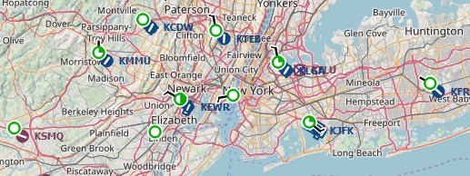
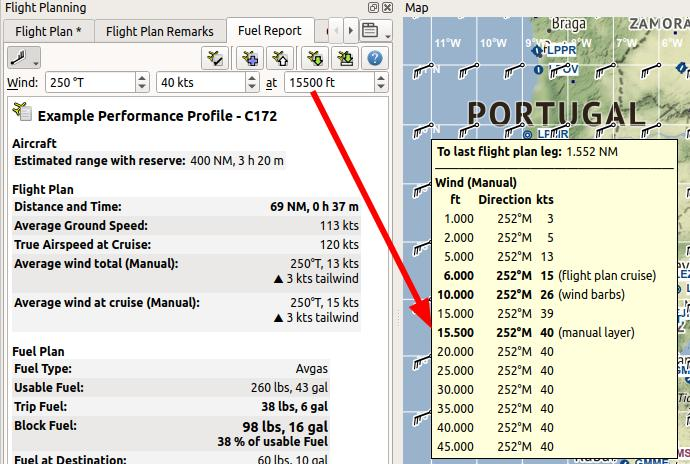
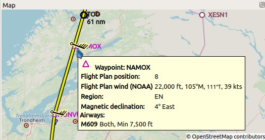

Weather
-------

*Little Navmap* can display weather as METARs and decoded weather in the
information window and tooltips as well as weather symbols on the map.

**Weather can be taken from the following sources:**

-  FSX or P3D if connected. This also applies to network setups.
-  X-Plane 11 and 12 real time weather from weather files. You have to share files and directories across computers and adjust loading path in ``Options`` on page :ref:`cache` for remote setups.
-  `NOAA <https://www.weather.gov>`__ online weather service
-  `VATSIM <https://www.vatsim.net>`__ network online weather service
-  `IVAO <https://www.ivao.aero>`__ network online weather service
-  `HiFi Simulation Technologies <https://www.hifisimtech.com>`__:

   -  *Active Sky Next* (ASN)
   -  *AS16*
   -  *Active Sky for Prepar3D v4* (ASP4)
   -  *ASX* for X-Plane

Weather files are accessed or downloaded on demand when an option in menu :ref:`show-airport-weather` or :ref:`weather-menu` is selected.

.. important::

   The base path to the simulator has to be correct for *Little Navmap* to find the X-Plane weather files.
   Click ``Reset Paths`` in the :ref:`load-scenery-library` to ensure a correct path.

   Furthermore you have to select the right simulator in the :ref:`scenery-library-menu`.
   *Little Navmap* otherwise reads the wrong weather files.

   Features like regions of manually created weather for X-Plane are not supported in *Little Navmap*.

**Weather display and information can be selected in the following locations:**

-  Options dialog on page :ref:`weather`: There you define what source is shown in the information
   window and in the map tooltip. This is based on the airport METAR reports and does not affect
   anything else besides the information window and the map tooltip.
-  Main menu ``Weather`` -> :ref:`airport-weather-source`: This is for the airport weather icons on
   the map. Based on METAR of the airport and only affects the weather symbols on the map.
-  Main menu ``Weather`` -> :ref:`wind-source`: This source is used for all winds aloft functions:
   Map display wind grid symbols, map tooltip, flight plan table, elevation profile (hover tooltip),
   top of descent and top of climb point calculation, fuel planning,
   arrival time calculation and trip time calculation. Note that this
   download has nothing to do with the METAR functions above and is fetched from another source
   (`NOAA/NOMADS <https://nomads.ncep.noaa.gov>`__).

METARs are shown in the airport tooltips and on the tab ``Airport`` -> ``Overview``
tab. Decoded weather information for all sources is available in the tab
``Airport`` -> ``Weather``.

The date and time information of the decoded weather display is
highlighted in red if the METAR information is older than six hours.

.. note::

      About X-Plane weather: The
      program cannot read custom weather situations from X-Plane. If you use
      custom weather, *Little Navmap* only has access to the local weather
      around the aircraft in the ``Simulator Aircraft`` window on the
      :ref:`progress-info`. Be aware that *Little Navmap* might display
      information from an obsolete or inactive downloaded weather file in this case.

      Also, weather and nearest weather in X-Plane might be inaccurate. This
      is due to interpolation between weather stations.

.. figure:: ../images/weather.jpg

        Decoded weather information from X-Plane and NOAA.
        The weather symbols on the map use NOAA as source (suffix ``- Map``
        after the flight rules). X-Plane weather is older than six hours and
        therefore highlighted red.

Weather Sources
~~~~~~~~~~~~~~~

Flight Simulator
^^^^^^^^^^^^^^^^

Weather information from a flight simulator or the X-Plane weather files
falls in one of three categories, depending on the selected airport:

-  ``Station``: The airport has a weather station. This is the most
   precise weather indication.
-  ``Nearest``: The selected airport has no weather station and the
   report from the closest existing weather station was fetched. The
   ident of the closest station as well as distance and elevation are
   shown in the METAR and on the decoded weather tab. Note that the this
   weather station is not necessarily an airport.
-  ``Interpolated`` (not for X-Plane): The weather is interpolated by
   the flight simulator using three stations closest to the selected
   airport. FSX and P3D only provide non-interpolated weather for
   airports close to the user aircraft. The weather for other airports
   is always interpolated. The ident of the selected airport is used in
   the METAR report for this kind of weather report.

The flight simulator weather is updated every 15 seconds to catch manual
changes or changes in the weather theme.

*Little Navmap* watches the X-Plane 11 ``METAR.rwx`` and ``global_winds.grib`` files as well as the X-Plane 12 ``Output/real weather`` directory for changes and
applies updates immediately.

Online - NOAA, VATSIM and IVAO
^^^^^^^^^^^^^^^^^^^^^^^^^^^^^^

Online weather from both sources is updated every 10 minutes.

Active Sky
^^^^^^^^^^

All *Active Sky* programs are recognized automatically on startup for
each simulator. The ``current_wx_snapshot.txt`` and
``activeflightplanwx.txt`` files are loaded and monitored for changes.
Weather will be reloaded and updated in the information display if
necessary.

You can also select the ``current_wx_snapshot.txt`` file manually. In
that case the METARs from this file are displayed for all installed
flight simulators. The ``activeflightplanwx.txt`` will be loaded from
the same directory.

Manual file selection can also be useful if a new *Active Sky* version
is not supported by *Little Navmap* yet.

Departure and destination weather will be displayed if a flight plan is
loaded in one of the *Active Sky* programs. A suffix ``Destination`` or
``Departure`` will indicate the usage of Active Sky flight plan weather
on the tab ``Weather``. This gives *Active Sky* users the most precise
weather indication for departure and destination.

Note that the indication of ``Departure`` or ``Destination`` depends
entirely on the flight plan loaded in *Active Sky* and not the flight
plan in *Little Navmap*.

.. _airport-weather:

Airport Weather
~~~~~~~~~~~~~~~

*Little Navmap* can show weather symbols for airports having a weather
station for all available weather sources. Select sources for display
with :ref:`airport-weather-source`.

Note that airport weather is only displayed for stations and not
interpolated. Stations which are not airports are not supported.

Weather is also shown for hidden airports if these provide a weather report.

A suffix ``- Map`` is added to the flight rules in the METAR and decoded
weather display of the information window as well as in tooltips to indicate which
source is shown on the map.

See :ref:`airport-weather-legend` in the map legend for an explanation of the symbols.

      Weather situation around New York. All airports are VFR and low winds.

.. _wind:

Winds Aloft
~~~~~~~~~~~

*Little Navmap* can download and display winds aloft based on either
X-Plane or the `National Oceanic and Atmospheric
Administration <https://www.noaa.gov/>`__ data.

The latter ones are winds aloft forecasts which are updated four times a
day and are used by most simulators and weather programs as data source.
The wind speed and direction is arranged in an one-degree grid.

*Little Navmap* can display a wind barb grid for a selected wind layer
or at flight plan waypoints. Tooltips at the wind barbs show wind
details for several layers at the position.

Hovering the mouse over the elevation profile shows the wind at the
flight plan position. See :ref:`tooltip-label`.

Winds are used to calculate flight time, trip fuel, top of
descent and top of climb.

A manual wind setting for cruise altitude can also be used. See
:ref:`aircraft-performance-buttons`.

See :ref:`high-alt-wind` for an
explanation of the wind symbols and :ref:`weather` for more configuration options.

Select wind data source for display with :ref:`wind-source`.

.. _wind-levels-button:

|Wind Levels Button| Wind Levels Button
^^^^^^^^^^^^^^^^^^^^^^^^^^^^^^^^^^^^^^^

Same as :ref:`wind-levels-menu`.

The menu button enables or disables wind aloft display by a wind barb
grid at different layers as well as at flight plan waypoints.

The drop down menu has the following items:

-  ``At Flight Plan Waypoints``: Toggles wind barbs with a yellow border
   at flight plan waypoints on and off. Wind barbs below 4000 ft above
   mean sea level are omitted. This function is independent of the
   selection below.
-  ``No Wind Barbs``: Do not show the wind barb grid. Wind data is still
   downloaded and processed until the source is set to ``Disabled``.
-  ``Wind at Ground (only NOAA)``: Show the wind barb grid for winds near ground
   (about 260 ft). Only available if the NOAA wind source is selected.
-  ``Wind at Flight Plan Cruise Altitude``: Show the wind barb grid for winds
   at the current flight plan cruise altitude.
-  ``Wind for Selected Altitude``: Enables the slider button below and allows to change the wind barb altitude in 500 feet steps.

.. _wind-tooltips:

Tooltips
~~~~~~~~

The wind barbs show an optional tooltip with wind direction, speed and
wind source if you hover the mouse over them. The same applies to wind barbs at flight plan waypoints with
option ``At Flight Plan Waypoints`` enabled.

Direction is magnetic per default but can be changed in the options
dialog on page :ref:`units`.
These tooltips show the wind for all layers with flight plan cruise altitude, selected wind barb altitude and manual layer altitude highlighted.

      Winds aloft set manually, display with tooltip at wind barbs in grid and wind drop down menu.
      Indicators in tooltip show flight plan cruise altitude, wind barb altitude and manual layer altitude.
      Notice the decreasing wind speed as interpolated from manual layer altitude to ground.

    Wind barbs shown at flight plan waypoints and wind data in tooltip.

.. |Wind Levels Button| image:: ../images/icon_wind.png

