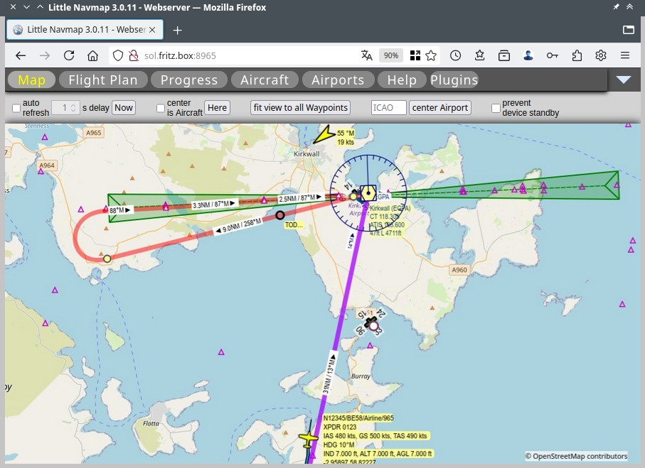
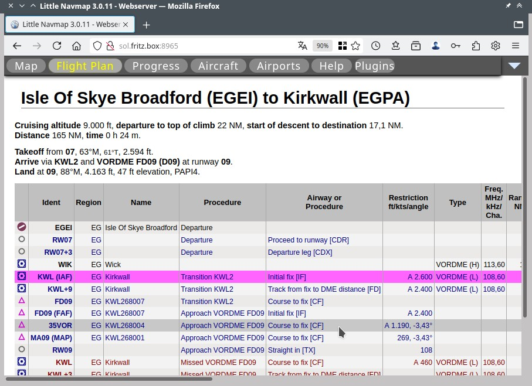
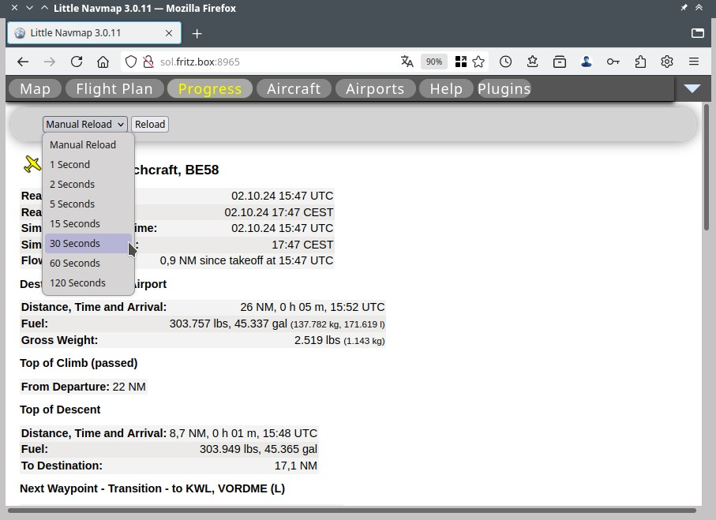
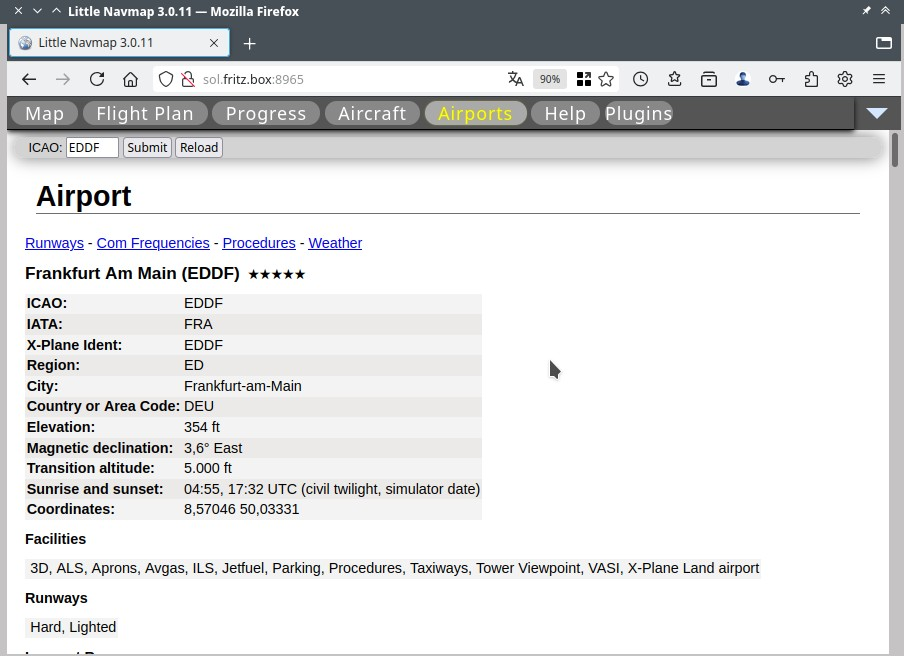

Web Server
---------------------

*Little Navmap* includes a web interface showing the map,
aircraft progress and airport information with an optional automatic
refresh in a web browser. The page can be accessed from any computer,
tablet or smartphone in your local network.

The web interface is served by the web server which is not started per default.
You can start it in the menu ``Tools`` -> :ref:`run-webserver` and then open its
page by selecting :ref:`open-webserver` in the same menu.

Note that the functionality of the web interface is limited compared to the program.
You cannot change map display settings or calculate a flight plan, for example.

The used port and other settings can be changed in options on page :ref:`options-web-server`.

Normally you can access the *Little Navmap* web interface using `http://localhost:8965 <http://localhost:8965>`__.

.. note::

  You browser may give you a warning that the address is not secure or not encrypted.
  You can safely ignore this if you access the *Little Navmap* web server in your local network.

  The web interface of *Little Navmap* does not track you and does not connect to any external services.

.. tip::

  Note that you have to do a hard reload in the web browser if you see an
  incomplete map or other layout issues. Press ``Ctrl+Shift+R`` or ``Ctrl+F5`` on
  most browsers to do a hard reload bypassing the browser cache.

  If this does no help delete all cookies related to the *Little Navmap* web interface.

Buttons
~~~~~~~~~~~~~~~~~~~~~~~~~~~

The following buttons are in the top row:

- ``Map``, ``Flight Plan``, ``Progress``, ``Aircraft`` and ``Airports``:
  These buttons open the respective pages. See below for more information on the pages.
- ``Help``: Opens this user manual page in a new browser tab.
- ``Plugins``: Shows the plugin menu. Currently there are two plugins available:

  - ``Autozoom``: Zooms dynamically to the user aircraft while flying. This plugin provides a more advanced
    functionality compared to the functionality on the page ``Map``.
    Having this enabled will disable all map interaction functions like scrolling and zooming.
  - ``Dynamic Touch and Drag Map``: This is an experimental and more dynamically usable map that allows to move smoothly by
    dragging the mouse and zooming using the mouse wheel. Note that this map has limitations and
    cannot show the user aircraft trail or AI/multiplayer aircraft and show oversized icons in some cases.

Pages
~~~~~~~~~~~~~~~~~~~~~~~~~~~

Pages are not updated automatically unless you enable one of the related auto refresh options.

Map
^^^^^^^^^^^^^^^^^^^^^^^^^^^^^^

The map will mirror all map display settings of the
program. All changes in menu ``View`` are reflected on the web page. Note that the map projection is always ``Mercator``.

The map is not updated automatically unless you enable one of the auto refresh options.

Only map position and zoom distance can be changed in the web page which allows to use it for
flight following or to use it as an additional map display.

Information clicks and tooltips are not available.

Map Navigation
''''''''''''''

Click to center a position on the map.
Use the mouse wheel to zoom in and out.

Use the two-finger-pinch gesture to zoom on tablets or smartphones.

Top bar
'''''''''''''''''''''

- ``auto refresh`` and ``delay``: Triggers a reload of the map image for the given time interval.
- ``Now``: Reload the map immediately to see updates from the program.
- ``center is aircraft``: Keeps the user aircraft centered on the map.
  You have to enable ``auto refresh`` too for this to work.
  Having both options enabled will disable all map interaction functions like scrolling and zooming.
- ``Here``: Jump to the user aircraft keeping the current zoom distance.
- ``fit view to all waypoints``: Centers the flight plan on the map.
- ``ICAO`` and ``center airport``: Jumps the airport which ICAO ident is given in the
  input field to the left of this button. This keeps the current zoom distance.
  Use the mouse wheel to zoom in.
  Press the ``Return`` key or ``center airport`` to jump to the airport.
- ``prevent device standby``: Disables the screensaver on the display device.

  The map display in the *Little Navmap* web interface showing the
  flight plan, an approach procedure and the user aircraft. *Click image to enlarge.*

Flight Plan
^^^^^^^^^^^^^^^^^^^^^^^^^^^^^^

Shows the flight plan with columns visible and ordered as in the
application. See :ref:`flight-plan-table` and :ref:`flight-plan-table-columns-select`
for configuration options.

The active leg is highligted in magenta.

  Flight plan with the active leg approaching VOR KWL as shown in above map screenshot.
  *Click image to enlarge.*

Progress
^^^^^^^^^^^^^^^^^^^^^^^^^^^^^^

This page shows aircraft progress information as :ref:`progress-info`. The visible data fields can
be configured using :ref:`progress-configuration`.

- ``Manual Reload`` or ``N Seconds``: Switch to one of ``1 Second`` to ``120 Seconds`` to enable automatic updates.
- ``Reload``: Reload the page manually if ``Manual Reload`` is selected.

  Progress page showing flight information with the update drop-down box ``Manual Reload`` clicked. *Click image to enlarge.*

Aircraft
^^^^^^^^^^^^^^^^^^^^^^^^^^^^^^

Shows aircraft information. The visible information is the same as shown in :ref:`aircraft`.

Airport
^^^^^^^^^^^^^^^^^^^^^^^^^^^^^^

Displays the same information as the :ref:`airport` on one page.

- ``ICAO``: Enter a valid ICAO identifier like KJFK or EDDF.
  IATA, local and other identifiers are not supported. Press enter to show the airport information.
- ``Submit``: Same as pressing enter in the ``ICAO`` input field.
- ``Reload``: Reload the airport information manually to catch weather updates.

The links ``Runways``, ``Com Frequencies``, ``Procedures`` and
``Weather`` jump to the respective sections below. Click the link
``▲ Top`` in a section to go back to top.

  Airport information in the *Little Navmap* web interface. *Click image to enlarge.*

Web Developers
~~~~~~~~~~~~~~

*Little Navmap* can deliver map images, the flight plan table and more for
HTTP requests.

See directory ``.../Little Navmap/web/test.html`` or
``http://localhost:8965/test.html`` while running the web server for
examples.

WebAPI
^^^^^^^^^^^^^^^^^^^^^^^^^^^^^^

A REST interface is available to get feature information and map images in JSON format.
See the documentation here
`GitHub - littlenavmap/web/webapi.yaml <https://github.com/albar965/littlenavmap/blob/release/3.0/web/webapi.yaml>`__
for more information.

**Examples:**

You have to run the *Little Navmap* web server for these examples to work. See :ref:`run-webserver`.

-  Get airport information about EDDM: `http://localhost:8965/api/airport/info?ident=eddm <http://localhost:8965/api/airport/info?ident=eddm>`__.
-  Get all map features in the given rectangle: `http://localhost:8965/api/map/features?toplat=50&bottomlat=49&leftlon=8&rightlon=9 <http://localhost:8965/api/map/features?toplat=50&bottomlat=49&leftlon=8&rightlon=9>`__.

OpenLayers
^^^^^^^^^^^^^^^^^^^^^^^^^^^^^^

See
`GitHub - KOKAProduktion - littlenavmap-openlayers <https://github.com/KOKAProduktion/littlenavmap-openlayers>`__ for information about using *Little Navmap*
as a map tile server.

See `http://localhost:8965/ol/index.html <http://localhost:8965/ol/index.html>`__
(``Dynamic Touch and Drag Map``) for an example application while running the web server.

Access from the Internet
~~~~~~~~~~~~~~~~~~~~~~~~~~~~~

The configuration for public access or access from the Internet to the *Little Navmap* web interface
is a more advanced task that also depends on your router or Internet provider.
Therefore, this chapter only provides an overview.

You need to adjust your router settings to access the *Little Navmap* web server from the internet
outside your local network. Check out your router manual how to do this.

In general, you have to change the firewall settings to forward the port
8965 from the router to the computer running *Little Navmap*.

Then you have to find out your public IP address which is used by your router to connect to the internet.
Note that this address will most likely change every time you connect to the internet.

You can look at your internet router to find out this address or use a dynamic
DNS service like `no-ip <https://www.noip.com>`__ or `Duck DNS <https://www.duckdns.org>`__.
Dynamic DNS services give you a name that you can use to access your router from the Internet, even if your address changes.

.. caution::

  Never open the firewall completely to all computers in your home network. This is a security risk.

  Also keep in mind that *Little Navmap* was not intended to run as a public available server.
  Malicious users may inject code and take over your system.
