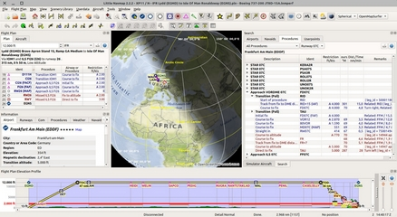
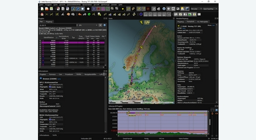

.. meta::
   :description: Little Navmap User Manual
   :keywords: Navigation, Flight Simulator, Map, Flightplan, FSX, MSFS, Prepar3D, X-Plane, Flightplanner

.. warning::

    **This user manual is work in progress until the stable release of Little Navmap 2.8 is released.**

Little Navmap User Manual
================================

*Little Navmap* is a free open source flight planner, navigation tool, moving map, airport search
and airport information system for Flight Simulator X, Flight Simulator - Steam Edition, Prepar3D
v2 to v5, Microsoft Flight Simulator 2020, X-Plane 11 and X-Plane 12.

   More about my projects at `www.littlenavmap.org <https://www.littlenavmap.org>`__.
   Support forum at `AVSIM <https://www.avsim.com/forums/forum/780-little-navmap-little-navconnect-little-logbook-support-forum/>`__.

**You can get the latest version of this manual in different formats from here:**
`User Manuals <https://albar965.github.io/manuals.html>`__

**Do not use this program for real world navigation.**

This user manual is for *Little Navmap* versions |version|.

=========== ===========
|Sunshadow| |Spherical|
=========== ===========

Table of Contents
------------------------------

.. toctree::
   :maxdepth: 2
   :numbered:

   ACKNOWLEDGMENTS
   DONATIONS
   INSTALLATION
   QUICKOVERVIEW
   START
   INTRO

   DOCKWINDOWS
   TABS
   MENUS
   STATUSBAR

   FOLDERS

   MAPDISPLAY
   LEGEND
   TRAFFICPATTERN
   HOLD
   COMPASSROSE
   SUNSHADOW
   IMAGEEXPORT

   PROFILE

   SEARCH
   SEARCHPROCS
   USERPOINT
   LOGBOOK
   ONLINENETWORKS

   INFO

   FLIGHTPLAN
   MAPFPEDIT
   APPROACHES
   CUSTOMPROCEDURE
   TRACKS
   EDITFPPOSITION
   EDITFPREMARKS
   ROUTECALC
   ROUTEDESCR
   FLIGHTPLANFMT
   ROUTEEXPORTALL
   ROUTEEXPORT

   AIRCRAFTPERF
   AIRCRAFTPERFEDIT
   AIRCRAFTPERFCOLL
   AIRCRAFTPERFMERGE

   SCENERY
   NAVDATA

   CONNECT
   OPTIONS
   LAYOUT
   WEATHER
   PRINT
   RESET
   UPDATE
   RUNNOSIM
   WEBSERVER

   TUTORIALS
   TUTORIALVFR
   TUTORIALIFR
   TUTORIALPERF

   COORDINATES
   REMARKS
   SHORTCUTS
   NETWORK
   CUSTOMIZE
   MAPTHEMES
   FILES
   TIPS
   APPENDIX
   GLOSSARY
   LICENSE

--------------------------

This manual was created using `Sphinx <https://www.sphinx-doc.org/>`__ and the
`Read the Docs Sphinx Theme <https://sphinx-rtd-theme.readthedocs.io/en/latest/index.html>`__.
PDF and MOBI formats converted using `Calibre <https://calibre-ebook.com/>`__

The sources of this manual are available on `Github <https://github.com/albar965/littlenavmap-manual>`__.

--------------------------

Version |release|. Last updated on |today|.

