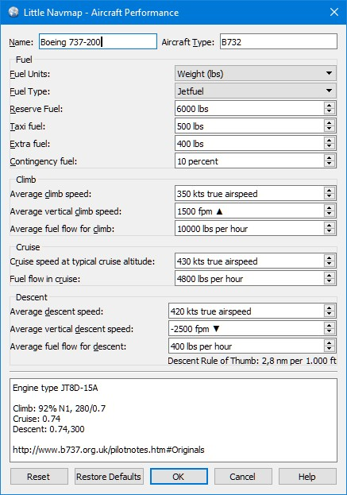

.. _aircraft-performance:

|Edit Aircraft Performance| Editar las prestaciones de la aeronave
------------------------------------------------------------------

Todas las velocidades se introducen en velocidad verdadera. Esto hace
que los valores sean independientes de la influencia del viento, como
sería el caso de la velocidad sobre el suelo. También hace que los
valores sean independientes de la altitud de crucero y la desviación de
las condiciones atmosféricas ISA, lo que sería el caso cuando se usa el
número de Mach o la velocidad indicada.

.. _buttons:

Botones
~~~~~~~

-  ``OK``: Toma todos los cambios realizados en el cuadro de diálogo
   pero no guarda el perfil. El informe de combustible, la cima de
   ascenso (TOC) y el inicio del descenso (TOD) `Ventana del Perfíl del
   Plan de Vuelo <PROFILE.html>`__ se ajustarán inmediatamente.
-  ``Cancelar``: Ignora todos los cambios y cierra el diálogo.
-  ``Restablecer``: Restablece todos los cambios realizados desde la
   apertura del diálogo de edición.
-  ``Restaurar valores por defecto``: Se restablece al perfíl
   predeterminado de 3 nm por 1000 pies para las reglas de descenso y
   ascenso y sin consumo de combustible.
-  ``Ayuda``: Abre la ayuda en el navegador web predeterminado.

.. _input-fields:

Campos de Entrada
~~~~~~~~~~~~~~~~~

-  ``Nombre``: Puede ser utilizado libremente. Determinado a partir del
   nombre de la aeronave al recopilar datos para un perfil de
   prestaciones.
-  ``Tipo de aeronave``: Utilice este complemento del designador de tipo
   de aeronave de la OACI. Esto puede permitir futuras versiones o
   *Little Navmap* para seleccionar el perfil de performance
   automáticamente. Consulte `Lista de designadores ICAO según tipo de
   aeronave <https://en.wikipedia.org/wiki/List_of_ICAO_aircraft_type_designators>`__
   (Wikipedia).

.. _fuel:

Combustible
^^^^^^^^^^^

-  ``Unidades de Combustible``: Ya sea ``Volumen`` (galones o litros) o
   ``Peso`` (libras o kilogramos). Los números del diálogo se
   convertirán utilizando el peso del ``Tipo de Combustible``
   seleccionado, cuando se cambie la unidad. Pueden ocurrir errores de
   redondeo cuando se seleccionan hacia adelante o hacia atrás.
-  ``Tipo de Combustible``: ``Avgas`` (por defecto) o ``Jetfuel``.
   Necesario para convertir valores de combustible entre peso y volumen.
   Esto se detecta automáticamente al recopilar las prestaciones de la
   aeronave.

Consulte `Combustible - Definiciones del Plan de
Vuelo <https://www.skybrary.aero/index.php/Fuel_-_Flight_Planning_Definitions>`__
(SKYbrary) para más información sobre los tipos de combustible.

.. _reserve-fuel:

Combustible de Reserva
^^^^^^^^^^^^^^^^^^^^^^

La reserva final de combustible es el combustible mínimo requerido para
volar durante 30 minutos a 1500 pies sobre el aeropuerto alternativo o
al aeropuerto de destino a velocidad de espera si no se requiere un
aeropuerto alternativo. Algunas autoridades requieren suficiente
combustible para 45 minutos de tiempo de espera.

El combustible alternativo es la cantidad de combustible requerido para
volar una frustrada en el aeropuerto de destino hacia el aeropuerto
alternativo.

``Combustible de Reserva`` Es la suma del combustible alternativo y del
combustible de reserva final.

Debe establecer este valor para evitar quedarse sin combustible en el
destino cuando confíe en este perfíl.

.. _taxi-fuel:

Combustible para Taxi
^^^^^^^^^^^^^^^^^^^^^

``Combustible para Taxi`` es el combustible usado antes del despegue e
incluye el consumo de APU, arranque del motor y combustible de rodaje.

.. _extra-fuel:

Combustible Extra
^^^^^^^^^^^^^^^^^

Combustible que se agrega a juicio del comandante o el coordinador de
vuelo.

.. _contingency-fuel:

Combustible de Contingencia
^^^^^^^^^^^^^^^^^^^^^^^^^^^

El combustible de contingencia se carga para tener en cuenta el consumo
adicional de combustible en ruta causado por el viento, los cambios de
ruta o las restricciones de gestión del tráfico.

El valor se da en porcentaje de combustible de viaje.

.. _climb:

Ascenso
^^^^^^^

-  ``Velocidad media de ascenso``: Promedio de velocidad verdadera desde
   el despegue hasta la altitud de crucero.
-  ``Velocidad media de ascenso vertical``: Velocidad vertical en fase
   de ascenso. Ya sea pies por minuto (``fpm``) o metros por segundo
   (``m/s``).
-  ``Flujo medio de combustible en subida``: Flujo de combustible en
   fase de ascenso. Ya sea en ``galones``, ``libras``, ``litros`` o
   ``kg``.

.. _cruise:

Crucero
^^^^^^^

-  ``Velocidad a la altitud típica de crucero``: Velocidad verdadera de
   crucero.
-  ``Flujo de combustible en crucero``: Flujo de combustible en la fase
   de crucero.

.. _descent:

Descenso
^^^^^^^^

-  ``Velocidad promedio de descenso``: Velocidad verdadera en la fase de
   descenso.
-  ``Velocidad vertical promedio de descenso``: Velocidad vertical
   promedio.
-  ``Flujo de combustible promedio en el descenso``: Flujo medio de
   combustible en descenso.

Una etiqueta muestra la regla general calculada para el descenso. El
valor predeterminado es 3 nm por 1000 pies.

.. _description:

Descripción o Comentarios
^^^^^^^^^^^^^^^^^^^^^^^^^

Este es un campo de texto sin formato para notas y enlaces.

Los enlaces que se agregan aquí se reconocen y se pueden abrir en el
informe de performance de la aeronave.

Enlaces web habituales como ``http://www.example.com`` o
``https://www.example.com`` se reconocen además de enlaces de
directorios o archivos como ``file:///C:/Projekte/atools`` en Windows o
``file:///home/alex/Aircraft_Notes.txt`` en macOS o Linux.

|Aircraft Performance Edit|

**Imagen Superior:**\ *Cuadro de diálogo de edición de las prestaciones
de la aeronave.*

.. |Edit Aircraft Performance| image:: ../images/icon_aircraftperfedit.png

