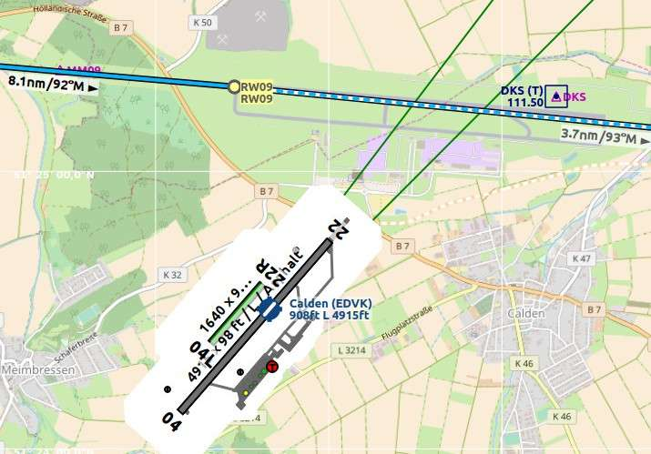

Bases de datos de Navegación
============================

*Little Navmap* puede usar hasta dos bases de datos en paralelo:

#. \*\* Base de datos del simulador:*\* Se crea el leer la librería de
   escenario de FSX, P3D ó X-Plane.
#. **Base de datos de navegación:** Provista por Navigraph. No puede ser
   compilada y tiene que actualizarse a través del *FMS Data Manager* de
   Navigraph.

*Little Navmap* trae adjunta una base de datos de navegación de un ciclo
AIRAC reciente , activada por defecto.

**Ver**\ `Instalar Actualizaciones de
Navigraph <https://albar965.github.io/littlenavmap_navigraph.html>`__\ **en
mi página de inicio para saber cómo actualizar datos de navegación en
Little Navmap.**

**No permita que el Gestor de la Base de Datos de Navigraph FMS
actualice la base de datos mientras**\ \_Little Navmap_*\* esté
funcionando. **Little Navmap** puede fallar , y la actualización puede
fallar o quedar incompleta.*\*

Desde el menú ``Librería de Escenario`` se pueden seleccionar tres modos
de pantalla, como se muestra debajo.

.. _navigraph-all:

Usar Navigraph para todas las prestaciones
------------------------------------------

Usa únicamente información de la base de datos de Navigraph.

Recuerde que en este modo la información de aeropuerto está limitada.
Esto significa que no hay detalles disponibles sobre áreas de tráfico ,
calles de rodaje , posiciones de estacionamiento, superficie de la pista
y disponibilidad de combustible. Por otra parte hay aeropuertos pequeños
que pueden no aparecer.

Si utiliza escenarios antiguos de aeropuertos puede que el plano de las
pistas no coincida con el actual de la base de datos del simulador.

Una ventaja de este modo es que los procedimientos de aproximación
siempre coinciden con el plano de la pista del aeropuerto.

|Airport from Simulator Scenery|

**Imagen superior:**\ *Diagrama del aeropuerto ``EDDN`` del escenario
del simulador (X-Plane) tal como se muestra en los
modos*\ ``No usar base de datos Navigraph``\ \_ ó
*``Usar Navigraph para ayudas y procedimientos``*.\_

|Airport from Navdatabase|

**Imagen superior:**\ *Aeropuerto ``EDDN`` de la base de datos Navigraph
con*\ ``Uso de Navigraph para todas las prestaciones``\ \_ . Note la
pérdida de información sobre superficie de la pista ,áreas , calles y
posiciones de estacionamiento.\_

.. _navigraph-none:

No usar la base de datos Navigraph
----------------------------------

En este modo se ignora completamente la base de datos de Navigraph , y
se muestra únicamente información extraída del escenario del simulador.

.. _navigraph-navaid-proc:

Usar Navigraph para Ayudas y Procedimientos
-------------------------------------------

Modo por defecto tras la instalación ó actualización de *Little Navmap*.

Este modo mezcla ayudas y otras prestaciones de Navigraph con la base de
datos del simulador. Esto afecta a la vista del mapa y a todas las
ventanas de información y búsqueda.

Las siguientes prestaciones se toman de la base de datos del simulador
cuando se usa este modo:

-  Aeropuertos (también ventana de ``Búsqueda`` , pestaña
   ``Aeropuerto``)
-  Areas de tráfico
-  Calles de Rodaje
-  Posiciones de estacionamiento
-  Frecuencias COM
-  ILS

Las siguientes prestaciones se toman de la base de datos de Navigraph:

-  Ayudas a la Navegación (fijos/intersecciones, VOR, NDB, marcadores),
   que afecta a:
-  Ventana de ``Búsqueda`` , pestaña ``Ayudas a la Navegación``
-  Cálculo del plan de vuelo
-  Descripción de la ruta
-  Procedimientos (aproximaciones , SIDs y STARs), que afecta a:
-  Ventana de ``Búsqueda`` , pestaña ``Procedimiento``
-  Carga y muestra de procedimientos del plan de vuelo.
-  Aerovías.
-  Espacios aéreos.

Limitaciones de este modo
~~~~~~~~~~~~~~~~~~~~~~~~~

-  *Little Navmap* ignora cualquier discordancia entre procedimientos y
   pistas debida a la actualización de aeropuertos , y no muestra
   avisos. Actualice un aeropuerto con software gratuito o de pago, si
   ve que un procedimiento de partida o una aproximación no comienza en
   el extremo de la pista.
-  Los procedimientos no son reconocidos al seleccionar
   ``Mostrar Procedimientos`` si el aeropuerto ha cambiado su código
   ICAO (ejemplo ``Kulik Lake``: de ``LKK`` a ``PAKL``). Si sospecha
   ésto , use el modo ``Usar Navigraph para todas las prestaciones``
   para acceder a los procedimientos del aeropuerto.
-  La búsqueda ``Procedimientos`` toma en cuenta únicamente los
   disponibles en el simulador. Cambie al modo
   ``Usar Navigraph para todas las prestaciones`` para ver aeropuertos
   que tengan procedimientos de la base de datos de Navigraph.
-  El emplazamiento o presencia de un ILS puede no coincidir con un
   procedimiento de aproximación si el aeropuerto tiene un ILS nuevo que
   no esté en el escenario guardado , o si se trata de un escenario
   añadido antiguo. Si encuentra una aproximación ILS sin estación ILS ,
   cambie a ``Usar Navigraph para todas las Prestaciones`` para salvar
   esta limitación.

Usando la actualización de datos de *fsAerodata* puede mitigar o
subsanar completamente las limitaciones descritas, ya que sincroniza el
escenario del simulador con la base de datos de Navigraph.

|Approach Procedure Mismatch|

**Imagen Superior :**\ *Ejemplo extremo de discordancia
pista/aproximación. La aproximación de Navigraph AIRAC 1707 termina en
una pista 09 no visible, mientras el escenario antiguo de FSX muestra el
aeropuerto en posición errónea. EDVK fue reconstruido al norte de Calden
en 2013. OpenStreetMap muestra el nuevo aeropuerto.*

.. |Airport from Simulator Scenery| image:: ../images/airport_simulator_scenery.jpg
.. |Airport from Navdatabase| image:: ../images/airport_navigraph_only.jpg

