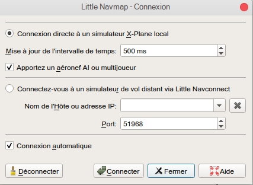

.. _connecting-to-a-flight-simulator:

|Flight Simulator Connection| Connexion à un Simulateur de Vol
--------------------------------------------------------------

La procédure de configuration est différente pour les connexions
distantes et les connexions locales à un simulateur de vol

*Little Navmap* peut se connecter directement si tous les programmes
sont exécutés sur le même ordinateur. L'agent *Little Navconnect* est
nécessaire si *Little Navmap* est exécuté sur un ordinateur distant.

.. _local-connection:

Connexion Locale
~~~~~~~~~~~~~~~~

Tous les Simulateurs
^^^^^^^^^^^^^^^^^^^^

Ouvrez la boîte de dialogue de connexion dans *Little Navmap* en
sélectionnant Menu principal ``Menu Principal`` -> ``Outils`` ->
``Connexion au Simulateur de Vol`` et choisissez le simulateur auquel la
connexion doit être établie.

|Little Navmap Connect Dialog|

**Image ci-dessus:**\ *Boîte de dialogue de connexion Little Navmap
configurée pour une connexion locale à FSX ou P3D. La connexion sera
établie manuellement..*

Sélectionner ``Connexion directe à Flight Simulator local``.

Cliquer ensuite sur ``Connecter``. La boîte de dialogue se ferme et
*Little Navmap* essaie d'établir une connexion en arrière-plan.

Cliquer sur ``Fermer`` pour conserver toutes les modifications et fermer
le dialogue sans établir de connexion.

Activer ``Connexion automatique`` si vous ne souhaitez pas vous
connecter manuellement. L'orde de démarrage des programmes n'a pas
d'importance si cette case est cochée et *Little Navmap* trouvera le
simulateur une fois qu'il est démarré ou lorsqu'il est déjà en cours
d'exécution. Cest le réglage recommandé.

Désélectionner ``Aéronef AI ou multiplayer`` ou
``Navire AI ou multiplayer`` pour désactiver le transfert de ces
informations vers l'interface. Ceci peut être utile pour des raisons de
performance si vous utilisez de grandes quantités d'AI mais que vous ne
voulez pas voir dans *Little Navmap*.

X-Plane
^^^^^^^

|Little Navmap Connect Dialog|

**Image ci-dessus:**\ *Boîte de dialogue Little Navmap connexion
configurée pour une connexion locale à X-Plane. La connexion sera
établie manuellement.*

Vous devez installer le plugin *Little Xpconnect* inclus pour utiliser
*Little Navmap* comme une carte mobile avec X-Plane.

Le plugin est fourni avec Little Navmap et peut également être
téléchargé séparément.

Copiez le répertoire entier du plugin ``Little Xpconnect`` dans
``Resources/plugins`` du répertoire source de X-Plane. Le chemin complet
devrait ressembler
à\ ``... /X-Plane 11/Resources/plugins/Little Xpconnect``.

Vous pouvez vérifier le gestionnaire de plugins X-Plane pour voir s'il
est chargé correctement.

Lorsque vous vous connectez à Little Navmap, choisissez l'option
``Connexion directe à un simulateur X-Plane local`` .

.. _remote-connection:

Connexion à Distance
~~~~~~~~~~~~~~~~~~~~

Les informations météorologiques et aéronautiques de l'utilisateur sont
transférées vers *Little Navmap* sur un ordinateur distant en utilisant
l'agent *Little Navconnect* sur l'ordinateur de vol, ce qui permet
d'éviter l'installation fastidieuse et sujette aux erreurs d'une
connexion SimConnect distante.

Notez que les informations météorologiques ne peuvent pas être
transférées via une connexion à distance depuis X-Plane.

Vous devez extraire l'archive ZIP qui contient les fichiers
``littlenavmap.exe`` et ``littlenavconnect.exe`` sur les deux
ordinateurs. Ensuite, chargez la base de données de scènes sur
l'ordinateur distant et copiez la base de données sur l'ordinateur
distant. Reportez-vous à la section `Exécution sans installation du
simulateur de vol <RUNNOSIM.html>`__ pour plus de détails.

Assurez-vous que les versions majeures de *Little Navmap* et *Little
Navconnect* correspondent sinon vous pourriez recevoir un message
d'erreur. *Little Navmap* 1.0.5 est compatible avec *Little Navconnect*
1.0.2 mais pas avec 1.2 par exemple.

Pour X-Plane, vous devez également installer le plugin *Little
Xpconnect*. Voir le fichier ``LISEZMOI.txt`` dans le répertoire
``Little Xpconnect`` pour les instructions d'installation.

.. _connect-start-navconnect:

Démarrer *Little Navconnect* sur / Ordinateur Maître
^^^^^^^^^^^^^^^^^^^^^^^^^^^^^^^^^^^^^^^^^^^^^^^^^^^^

*Little Navconnect* est fourni avec l'archive de téléchargement *Little
NavmapStart*, *Little Navconnect* (``littlenavconnect.exe``) sur
l'ordinateur de vol et prenez note du message imprimé dans la fenêtre de
journalisation. Vous n'avez besoin que des valeurs colorées qui vous
indiquent le nom et l'adresse de l'ordinateur volant. Vous pouvez
utiliser l'adresse IP ou le nom d'hôte.

*Little Navconnect* peut imprimer plusieurs adresses IP ou noms d'hôtes
selon la configuration de votre réseau Cela peut se produire si vous
avez branché Ethernet et que vous êtes également connecté via un réseau
local sans fil, par exemple. Vous devez essayer si vous n'êtes pas sûr
de savoir lequel utiliser Assurez-vous également de configurer
correctement le pare-feu Windows pour permettre la communication entre
``littlenavmap.exe`` et ``littlenavconnect.exe`` sur les deux
ordinateurs.

|Little Navconnect|

**Image ci-dessus:**\ `Little
Navconnect <https://albar965.github.io/littlenavconnect.html>`__\ \_
fonctionne et attend un simulateur de vol. Il tourne sur
l'ordinateur\_\ ``win10.fritz.box``\ \_ avec l'adresse IP
*``192.168.2.13``*.\_

Modifier le port dans_Little Navconnect\_ ``Options`` si vous voyez un
message d'erreur comme illustré ci-dessous:

``[2016-07-27 16:45:35]  Impossible de démarrer le serveur: l'adresse liée est déjà utilisée.``

.. _connect-start-navmap:

Démarrer Little Navmap sur le Client / Ordinateur Distant
^^^^^^^^^^^^^^^^^^^^^^^^^^^^^^^^^^^^^^^^^^^^^^^^^^^^^^^^^

Ouvrez la boîte de dialogue de connexion dans *Little Navmap* en
sélectionnant ``Menu Principal`` -> ``Outils`` ->
``Connexion au Simulateur de Vol``. |Little Navmap Connect Dialog|

**Image ci-dessus:**\ *Connecter le dialogue avec les valeurs correctes
pour accéder à l'ordinateur distant utilisant Little Navconnect comme
illustré ci-dessus.*

Maintenant faites ce qui suit après avoir ouvert la boîte de dialogue:

#. Sélectionnez ``Connecter à un simulateur de vol distant``.
#. Ajoutez la valeur du nom d'hôte. Il peut s'agir du nom d'hôte ou de
   l'adresse IP imprimé par *Little Navconnect*.
#. Vérifiez la valeur du port.\ ``51968`` est la valeur par défaut et n'
   a pas besoin d'être changée habituellement.
#. Cliquez sur Connecter. La boîte de dialogue se ferme et *Little
   Navmap* essaie d'établir une connexion en arrière-plan.

L'établissement d'une connexion peut prendre un certain temps selon
votre réseau L'aéronef apparaîtra sur la carte et sur la fenêtre
flottante de l’\ ``Aéronef Simulateur`` une fois qu'un vol est mis en
place et chargé sur le simulateur. Vous verrez le message
``Connecté. En attente de mise à jour.`` dans la fenêtre de
l’\ ``Aéronef Simulateur`` si aucun vol n'est encore chargé (c. -à-d. si
le simulateur affiche toujours l'écran d'ouverture).

Notez que cela peut parfois prendre un certain temps avant quune erreur
ne saffiche si vous avez utilisé les mauvaises valeurs pour le nom
d'hôte ou le port.

Il est recommandé de sélectionner ``Connexion automatiquement``. L'ordre
de démarrage des trois programmes (simulateur, *Little Navconnect* et
*Little Navmap*) n' a pas d'importance si cette case est cochée et que
les programmes se trouvent.

Désélectionnez ``Aéronef AI ou multiplayer`` ou
``Navire AI ou multiplayer`` dans ``Outils`` -> ``Options`` de *Little
Navconnect* pour désactiver le transfert de ces informations à travers
le réseau. Ceci peut être utile pour des raisons de performance si vous
utilisez de grandes quantités d'AI mais que vous ne voulez pas le voir
dans_Little Navmap_.

.. _options:

Options du Dialogue de Connexion
~~~~~~~~~~~~~~~~~~~~~~~~~~~~~~~~

-  ``Déconnexion``: Déconnecte la session en cours et arrête la
   reconnexion automatique.
-  ``Connexion``: Essaie de se connecter. Une boîte de dialogue d'erreur
   s'affiche si aucune connexion ne peut être établie. *Little Navmap*
   réessaiera constamment si ``Connexion automatiquement`` est activé.
-  ``Fermer``: Ferme la boîte de dialogue sans modifier l'état actuel de
   la connexion.
-  ``Connexion automatiquement``: *Little Navmap* essaiera de se
   connecter en permanence si cela est activé. C'est le réglage
   recommandé.

   -  Toutes les tentatives de connexion s'arrêteront immédiatement si
      vous désélectionnez ce bouton.
   -  Vous devez cliquer sur ``Connecter`` pour lancer les tentatives de
      connexion automatique après avoir coché ce bouton.

-  ``Intervalle de temps de mise à jour``: La plage autorisée est de 50
   millisecondes jusqu' à 1 seconde. *Little Navmap* récupère les
   données d'un simulateur en utilisant cet intervalle de temps.
   Augmentez cette valeur si vous rencontrez des stutters ou du retard
   dans le simulateur. Une valeur inférieure se traduira par des mises à
   jour de cartes plus fluides dans *Little Navmap*.
-  ``Aéronef AI ou multiplayer`` et ``Navire AI ou multiplayer``:
   Désactive la récupération des véhicules AI. Ces réglages sont
   appliqué immédiatement. Notez que le trafic maritime nest pas
   disponible pour X-Plane.

.. |Flight Simulator Connection| image:: ../images/icon_network.png
.. |Little Navmap Connect Dialog| image:: ../images/connectlocal.jpg

.. |Little Navconnect| image:: ../images/littlenavconnect_fr.jpg
.. |Little Navmap Connect Dialog| image:: ../images/connect.jpg

