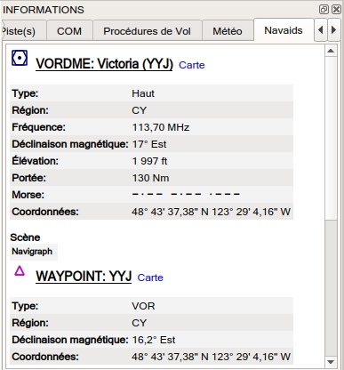
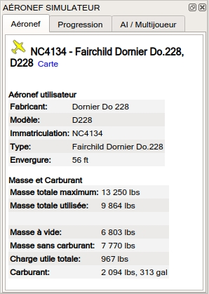

.. _information-dock-window:

|Information| Fenêtre d'Informations
------------------------------------

Cette fenêtre contient des informations textuelles sur les aérodromes
dans plusieurs onglets, ainsi que des informations sur une ou plusieurs
navaids, les voies aériennes dans un autre onglet et un onglet
supplémentaire affichant des informations sur l'espace aérien.

Un onglet ``Météo`` comprend également des informations météorologiques
décodées pour l'aérodrome sélectionné.

Toutes les informations peuvent être copiées dans le presse-papiers sous
forme de texte formaté. Utilisez le menu contextuel des champs de texte
ou utilisez ``Ctrl+A`` pour tout sélectionner et ``Ctrl+C`` pour copier
le contenu dans le presse-papiers.

Les informations d'un aérodrome, d'un navaid ou d'un point d'utilisateur
sont affichées lorsque vous sélectionnez l'un des éléments du menu
contextuel ``Afficher les informations pour ...`` dans la carte, dans la
fenêtre du plan de vol ou dans le tableau des résultats de la recherche.

Tous les onglets sont remplis pour les aérodromes, toutes les navaids,
tous les points d'utilisateurs ou tous les espaces aériens situés à
proximité du curseur pour un clic gauche dans la carte.

*Little Navmap* shows tabs based on priorities and selected objects and
tries minimize tab changes.

Un lien bleu ``Carte`` dans l'information permet de sauter à et/ou de
mettre en évidence l'objet montré sur la carte.

Le relèvement et la distance (ligne rhumb) par rapport à l'aéronef
utilisateur sont indiqués pour les aérodromes et les navaids s'ils sont
connectés à un simulateur et que la distance est inférieure à 500 NM

.. _scenery:

Informations sur la Scène
~~~~~~~~~~~~~~~~~~~~~~~~~

Toutes les informations sur les aérodomes et les navaids comprennent un
ou plusieurs liens au bas de l'information de l'objet dans la section
``Scènes``. Ces liens pointent vers les fichiers ``BGL`` (FSX, P3D) ou
``DAT`` (X-Plane) correspondants qui contiennent des informations sur
l'aérodrome ou la balise. Cliquez sur les liens pour ouvrir le dossier
contenant dans votre gestionnaire de fichiers (ex. Windows Explorer). Si
possible, le fichier correspondant sera sélectionné automatiquement.

Plusieurs liens peuvent apparaître pour les aérodromes car ceux-ci
peuvent être mis à jour par plusieurs fichiers provenant de différentes
scènes d'add-on ou de mises à jour de données de navigation.

.. _airport:

Onglet Aérodrome, Pistes, Communications, Procédures et conditions Météorologiques
~~~~~~~~~~~~~~~~~~~~~~~~~~~~~~~~~~~~~~~~~~~~~~~~~~~~~~~~~~~~~~~~~~~~~~~~~~~~~~~~~~

Ces cinq onglets affichent des informations pour un aérodrome
sélectionné.

Le lever et le coucher du soleil sont calculés sur la base de la date
réelle actuelle si aucun simulateur n'est connecté. Sinon, la date du
simulateur est utilisée. Ceci est indiqué par le texte
``(crépuscule civil, date réelle)`` ou
``(crépuscule civil, date du simulateur)``.

Un onglet ``Météo`` contient également des informations météorologiques
décodées pour l'aérodrome sélectionné. L'icône des règles de vol
(`Légende - Météo de l'aérodrome <LEGEND.html#airport-weather>`__) a un
suffixe ``- Carte`` si la source météo affichée est la source des icônes
météo des aérodromes sur la carte.

Des liens supplémentaires pour les héliports sont disponibles dans
l'onglet ``Pistes``.

|Airport Information|

**Image ci-dessus:**\ *Aperçu des informations sur l'aérodrome. Des
onglets supplémentaires donnent des informations sur les pistes, les
fréquences COM, les approches et la météo. Les symboles météo utilisent
la météo de la NOAA comme source. Le coucher et le lever du soleil sont
basés sur la date du simulateur. Roulement et distance par rapport à
l'aéronef de l'utilisateur indiqués sur le dessus.*

.. _navaids:

Onglet Navaids
~~~~~~~~~~~~~~

Plus d'une ou plusieurs navaids, points d'utilisateur ou voies aériennes
peuvent être chargés dans cet onglet sur un clic gauche.

Une voie aérienne est toujours affichée avec tous ses repères de
balisage (waypoints). Cliquez sur n'importe quel lien de waypoint bleu
pour centrer la carte autour du waypoint.

+-----------------------------------+-----------------------------------+
| |Navaid Information|              | |Airway Information|              |
+-----------------------------------+-----------------------------------+
| **Image                           | **Image                           |
| ci-dessus:**\ *Informations sur   | ci-dessus:**\ *Informations sur   |
| les navaids. Deux navaids se      | les navaids. Affichage de         |
| trouvaient près du curseur        | plusieurs voies aériennes avec    |
| lorsqu'on a cliqué dessus.*       | restrictions d'altitude et liste  |
|                                   | des waypoints cliquables.*        |
+-----------------------------------+-----------------------------------+

.. _airspaces:

Onglet Espaces Aériens
~~~~~~~~~~~~~~~~~~~~~~

Les espaces aériens sont mis en évidence sur la carte avec leur limite
et une étiquette de texte en cliquant sur le lien ``Carte`` dans la
fenêtre d'informations.

Cliquez sur le lien
``Supprimer les points mis en évidences de la carte`` dans la fenêtre
d'information pour supprimer les zones claires de la carte.

|Airspace Information|

**Image ci-dessus:**\ *Deux espaces aériens qui sont affichés dans
l'onglet informations après avoir cliqué sur la carte. Deux espaces
aériens sont mis en évidence sur la carte après avoir cliqué sur le
lien*\ ``Carte``\ \_ dans l'onglet informations.\_

.. _simulator-aircraft-dock-window:

|Simulator Aircraft| Fenêtre Aéronef Simulateur
-----------------------------------------------

Cette fenêtre affiche des informations sur l'aéronef utilisateur et sur
l'IA ou l'aéronef multijoueur dans plusieurs onglets. *Little Navmap*
doit être connecté au simulateur pour activer cette fonction. Voir
`Connexion à un simulateur de
vol <CONNECT.html#connecting-to-a-flight-simulator>`__ pour plus
d'informations à ce sujet.

.. _aircraft:

Onglet Aéronef
~~~~~~~~~~~~~~

Donne une vue d'ensemble de l'aéronef utilisateur et affiche des
informations sur le type, la masse et le carburant.

|Aircraft Information|

**Image ci-dessus:**\ *Informations sur l'aéronef lorsqu'il est connecté
à un simulateur de vol.*

.. _progress:

Onglet Progression
~~~~~~~~~~~~~~~~~~

Affiche des informations similaires à celles d'un ordinateur de gestion
de vol sur l'aéronef utilisateur. Il s'agit de la progression du plan de
vol, de l'altitude, de la vitesse, des paramètres ambiants et de
l'environnement.

Les informations textuelles dans l'onglet ont un lien ``Plus Moins`` en
haut à gauche. Vous pouvez l'utiliser pour basculer entre des
informations plus détaillées et moins détaillées.

**Notez que les estimations de carburant et de temps dans cet onglet
sont basées sur la consommation de carburant et la vitesse réelles. Ils
ne sont pas affectés par le profil de performances de l'aéronef
(**\ `Performances aéronef <AIRCRAFTPERF.html>`__\ **).**

+-----------------------------------+-----------------------------------+
| |Aircraft Progress Information|   | |Aircraft Progress Information    |
|                                   | Less|                             |
+-----------------------------------+-----------------------------------+
| **Image                           | **Image                           |
| ci-dessus:**\ *Informations sur   | ci-dessus:**\ *Informations de    |
| l'état d'avancement et            | progression pliées aux valeurs    |
| l'environnement de la situation   | les plus importantes en utilisant |
| de vol actuelle. Certains champs  | le lien*\ ``Plus Moins``\ *.*     |
| ou tableaux                       |                                   |
| comme*\ ``Waypoint suivant``\ \_  |                                   |
| ne sont disponibles que lorsqu'un |                                   |
| plan de vol est chargé.\_         |                                   |
+-----------------------------------+-----------------------------------+

Onglet AI / Multijoueur
~~~~~~~~~~~~~~~~~~~~~~~

Les informations sur un aéronef AI ou multijoueur du simulateur (pas de
réseaux en ligne) ou du navire sont affichées dans cet onglet si un
véhicule est cliqué sur la carte.

Ceci inclut également les aérodromes de départ et de destination de
l'aéronef qui peuvent être affichés sur la carte en cliquant sur les
liens bleus (seulement pour FSX ou P3D et si un plan de vol est déposé).

Notez que l'information sur les aéronefs AI est limitée sur X-Plane.
Seules la position, l'altitude et le cap peuvent être affichés.

|AI Aircraft Information|

**Image ci-dessus:**\ *Informations sur un aéronef AI.*

.. _legend-dock-window:

|Legend| Fenêtre Légende
------------------------

Contient deux onglets: Un onglet ``Navmap`` expliquant les différents
symboles d'aérodrome et navaid et un onglet ``Carte`` qui affiche la
légende générale pour le fond de carte comme *OpenStreetMap* par
exemple.

Le contenu de la légende ``Navmap`` est également disponible dans le
manuel en ligne: `Légende NavMap <LEGEND.html>`__.

Notez que la légende générale de la carte n'est pas disponible pour tous
les thèmes de carte.

.. |Information| image:: ../images/icon_infodock.png
.. |Airport Information| image:: ../images/infoairport_fr.jpg

.. |Airway Information| image:: ../images/infoairway.jpg
.. |Airspace Information| image:: ../images/infoairspace_fr.jpg
.. |Simulator Aircraft| image:: ../images/icon_aircraftdock.png

.. |Aircraft Progress Information| image:: ../images/infoacprogress_fr.jpg
.. |Aircraft Progress Information Less| image:: ../images/infoacprogressless_fr.jpg
.. |AI Aircraft Information| image:: ../images/infoacai.jpg
.. |Legend| image:: ../images/icon_legenddock.png

