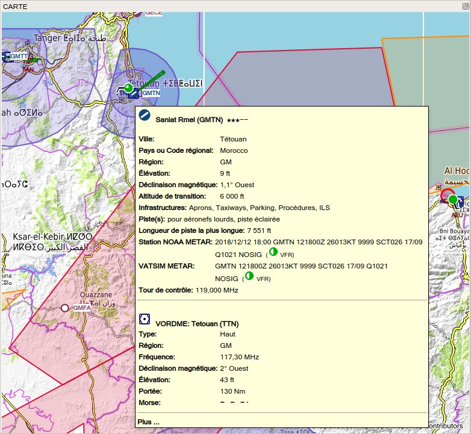

.. _map-display:

Afficher la Carte
-----------------

Voir la `Légende NavMap <LEGEND.html>`__ pour plus de détails sur les
différents symboles représentés par la carte.

.. _moving:

Déplacements
~~~~~~~~~~~~

Utilisez la souris pour déplacer la carte et la molette de la souris
pour effectuer un zoom avant ou arrière. Vous pouvez également utiliser
les boutons de superposition sur le côté droit de la carte.

Vous pouvez également utiliser le clavier pour vous déplacer sur la
carte :

-  Touches curseur : Faites défiler la carte
-  ``+`` et ``-``: Zoom avant et arrière
-  ``Alt+Left`` et ``Alt+Right``: Avancer ou reculer dans l'historique
   des positions de la carte
-  ``Ctrl++`` et ``Ctrl+-``: Augmenter ou diminuer les détails
-  ``Ctrl+Home``: Retour postion d'origine
-  ``Ctrl+End``: Aller au centre pour la recherche à distance

N'oubliez pas d'activer la fenêtre de la carte en cliquant dessus avant
d'utiliser n'importe quelle combinaison de mouvement.

.. _mouse-clicks:

Clics de Souris
~~~~~~~~~~~~~~~

Un simple clic sur un aérodrome, un navaid, une ligne aérienne ou un
espace aérien affiche les détails dans la fenêtre ``Informations``.

Un simple clic sur un aéronef utilisateur, un aéronef AI ou un aéronef
multijoueur affiche les détails dans la fenêtre ``Aéronef Simulateur``.

Un double clic permet d'agrandir l'affichage du diagramme de l'aérodrome
ou du navaid et d'afficher les détails dans la fenêtre ``Informations``.
Il en va de même pour tous les aéronefs ou navires multijoueurs.

La fonctionnalité du double clic et du simple clic ne fonctionne pas
pour les waypoints du plan de vol ou les aérodromes si le mode d'édition
du plan de vol est activé. Le mode édition peut être désactivé à l'aide
de la barre d'outils du ``Menu Principal`` -> ``Plan de Vol`` ->
``Editer le Plan de Vol sur la Carte``.

La sensibilité au clic de la souris peut être ajustée dans la boîte de
dialogue ``Options`` de l'onglet ``Afficher la Carte``.

Mouse Click Hotspots
~~~~~~~~~~~~~~~~~~~~

Map marks like range rings or measurement lines have hotspots to
indicate that a modifier-click can remove them or an action is available
in the context menu. The same applies to the flight plan drag and drop
editing mode.

The mouse cursor changes into a hand |Hand Cursor| to indicate a click
spot.

Click spots are: \* Center of range rings (small circle). \* End of a
measurement line (cross). \* Runway threshold point (small circle) for
airport traffic patterns.

.. _mouse-clicks-modifiers:

Clics de Souris et Modificateurs
~~~~~~~~~~~~~~~~~~~~~~~~~~~~~~~~

Vous pouvez utiliser le clavier et le clic de souris pour accéder
rapidement aux fonctions suivantes :

-  ``Shift+Click``: Ajoutez ou enlevez les anneaux de portée ou les
   anneaux de portée navaid.
-  ``Ctrl+Click``: Lancer la mesure de la ligne de rhumb ou supprimer
   une ligne de mesure.
-  ``Alt+Click``: Démarrer la mesure d'un grand cercle ou effacer une
   ligne de mesure.
-  ``Ctrl+Shift+Click``: Ajouter ou modifier le point utilisateur
-  ``Ctrl+Alt+Click``: Insérez l'aérodrome, le navaid, le point
   utilisateur ou la position dans le segment du plan de vol le plus
   proche.
-  ``Shift+Alt+Click``: Joindre l'aérodrome, navaid, le point
   utilisateur ou la position au plan de vol.

Cliquer à nouveau sur le point actif supprime les marques, les lignes de
mesure ou les waypoints du plan de vol.

.. _aircraft:

Aéronef
~~~~~~~

Les aéronefs utilisateurs et les aéronefs AI ou multijoueurs ou navires
seront affichés sur la carte si le programme est connecté à un
simulateur de vol. La couleur indique l'utilisateur ou l'AI ou le
véhicule multijoueur et la forme du symbole indique si l'aéronef est un
piston/turbopropulseur, un jet, un hélicoptère ou un navire. Le contour
du symbole devient gris si un aéronef est au sol.

Little Navmap limite l'affichage des véhicules AI en fonction de leur
taille. Zoom avant pour voir les petits aéronef ou les navires.

L'AI et les aéronef multijoueurs au sol sont montrés uniquement sur de
petites distances de zoom pour éviter les aérodromes encombrés. Cela
signifie qu'un aéronef AI peut disparaître de la carte lors d'un
atterrissage sur un aérodrome.

Sur la distance de zoom la plus faible, tous les aéronefs sont dessinés
à l'échelle ainsi que les places de parking, ce qui signifie que vous
pouvez facilement vérifier si votre aéronef tient sur un tablier, une
place de parking ou une voie de circulation.

Une flèche de vent jaune et des étiquettes pour la situation autour de
l'aéronef utilisateur peuvent être affichées en haut au centre de la
carte. Les étiquettes affichées pour les aéronefs peuvent être
configurées dans la boîte de dialogue ``Options`` de l'onglet
``Afficher la Carte``. Aucune étiquette n'est affichée pour le trafic
maritime.

Voir la `Légende NavMap <LEGEND.html#aircraft>`__ pour plus de détails sur
le type d'aéronef..

.. _tooltips:

Boite à Outils
~~~~~~~~~~~~~~

En passant la souris sur la carte, vous obtiendrez des infobulles pour
tous les objets de la carte, y compris les aérodromes, VOR, NDB, les
voies aériennes, le parking, la réserve à carburant, les tours, les
aéronefs et les navires. L'infobulle est tronquée et affiche un message
``Plus...`` si elle devient trop longue. Dans ce cas, réduisez les
détails ou faites un zoom avant.

La sensibilité de l'affichage de l'infobulle peut être réglée dans la
boîte de dialogue ``Options`` de l'onglet ``Carte``.

|Tooltip| |Tooltip Airspace|

**Image ci-dessus:**\ *Infobulle avec des informations sur un aérodrome
et un VOR et un Infobulle avec des informations sur les espaces
aériens..*

.. _highlights:

Points en Surbrillance
~~~~~~~~~~~~~~~~~~~~~~

Les aérodromes ou navaids qui sont sélectionnés dans le tableau du plan
de vol ou dans le tableau des résultats de recherche sont mis en
surbrillance sur la carte avec un anneau vert/noir ou jaune/noir
respectivement.

Les waypoints sélectionnés dans l'aperçu de la procédure sont mis en
surbrillance par un anneau bleu/noir.

Ces anneaux en surbrillance fournissent toutes les fonctionnalités des
objets cartographiques visibles, même si les objets ne sont pas affichés
à la distance de zoom actuelle (l'anneau est vide). Cela permet un
double clic pour zoomer, un simple clic pour la fenêtre d'informations
et toutes les entrées du menu contextuel.

Vous pouvez utiliser le bouton ``Effacer Sélection`` |Clear Selection|
en haut du plan de vol et des fenêtres de recherche pour supprimer les
points en surbrillance de la carte.

.. _airport-diagram:

Diagramme Aérodrome
~~~~~~~~~~~~~~~~~~~

L'affichage passera d'une simple icône à un diagramme d'aérodrome si
vous effectuez un zoom suffisamment profond pour atteindre un aérodrome.
Le diagramme montre toutes les voies de circulation, les positions de
parking, les portes, les pistes et plus encore.

Le diagramme de l'aérodrome fournit plus d'informations grâce à des
infobulles pour les positions de parking et de tour de contrôle. Un clic
droit sur une position de parking ouvre le menu contextuel et permet de
sélectionner la position de départ du plan de vol.

Voir la `Légende NavMap <LEGEND.html#airport-diagram>`__ pour plus de
détails sur le diagramme de l'aérodrome.

|Diagramme de l'Aérodrome|

**Image ci-dessus:**\ *Vue de haut niveau du diagramme de l'aérodrome
EDDH.*

|Diagramme de l'Aérodrome|

**Image ci-dessus:**\ *Vue détaillée du diagramme de l'aérodrome.
Affiche des portes bleues à droite et quelques rampes de stationnement
vertes de l'aviation générale à gauche. Le long seuil déplacé de la
piste 33 est visible. Les lignes en pointillés jaunes indiquent les
trajets en taxi.*

.. _map-context-menu:

Menu Contextuel de la Carte
~~~~~~~~~~~~~~~~~~~~~~~~~~~

Le menu contextuel de la carte peut être activé en utilisant le clic
droit ou la touche menu. Les éléments de menu sont activés ou désactivés
en fonction de l'objet sélectionné et certains éléments de menu
contiennent le nom de l'objet de la carte sélectionné pour plus de
clarté.

Le menu contextuel de la carte contient les entrées de menu suivantes.

.. _show-information:

|Show Information| Afficher Informations
^^^^^^^^^^^^^^^^^^^^^^^^^^^^^^^^^^^^^^^^

Affiche des informations détaillées dans la fenêtre ancrée " Information
" pour l'aérodrome le plus proche, une ou plusieurs voies aériennes, un
ou plusieurs espaces aériens ou tous les navaids à proximité du curseur.

Voir la `Fenêtre Informations <INFO.html#information-dock-window>`__ pour
plus de détails.

.. _show-procedures:

|Show Procedures| Afficher Procédures
^^^^^^^^^^^^^^^^^^^^^^^^^^^^^^^^^^^^^

Ouvre l'onglet de recherche de procédure de la fenêtre ancrée de
recherche et affiche toutes les procédures pour l'aérodrome.

Voir `Recherche de Procédure <SEARCHPROCS.html>`__ pour plus
d'informations.

.. _measure-gc-distance-from-here:

|Measure GC Distance from here| Mesurer la Distance GC à partir d'ici
^^^^^^^^^^^^^^^^^^^^^^^^^^^^^^^^^^^^^^^^^^^^^^^^^^^^^^^^^^^^^^^^^^^^^

Démarre une ligne de mesure au premier clic. Le deuxième clic termine la
mesure et conserve la ligne. Toutes les lignes de mesure sont
sauvegardées et seront restaurées au prochain démarrage.

Vous pouvez utiliser le clavier, la molette de la souris ou les
superpositions de carte pour faire défiler et zoomer tout en faisant
glisser une ligne.

Un clic droit, une pression sur la touche d'échappement ou n'importe
quel clic en dehors de la fenêtre de la carte annule l'édition de la
ligne de mesure.

Les lignes de mesure utilisent les miles nautiques, les kilomètres ou
les miles statue comme unité. Les pieds ou le mètre seront ajoutés en
tant qu'unité si les lignes sont suffisamment courtes. Ceci permet de
mesurer par exemple la distance de décollage pour les décollages aux
croisements.

Un grand cercle donne la distance la plus courte d'un point à un autre
sur terre, mais n'utilise pas un parcours constant. Pour cette raison,
la ligne de mesure affichera deux valeurs de cap. Un pour le début et un
pour la fin de course.

Le cours est toujours indiqué en degrés vrais, ce qui est indiqué par le
suffixe ``°T``. Des informations supplémentaires comme l'identification
ou la fréquence seront ajoutées à la ligne si la mesure commence à un
navaid ou à un aérodrome.

La largeur des lignes de mesure de distance peut être modifiée dans la
boîte de dialogue ``Options`` de l'onglet ``Affichage des Cartes``.

Voir la `Légende NavMap <LEGEND.html#map-marks>`__ pour plus de détails
sur les lignes de mesure.

.. _measure-rhumb-distance-from-here:

|Measure Rhumb Distance from here| Mesurer la Distance Rhumb à partir d'ici
^^^^^^^^^^^^^^^^^^^^^^^^^^^^^^^^^^^^^^^^^^^^^^^^^^^^^^^^^^^^^^^^^^^^^^^^^^^

Une ligne de rhumb est une ligne de route constante et utilisée entre
les points de cheminement d'une voie aérienne ou à l'approche d'une
station VOR ou NDB. La distance entre les points est légèrement plus
longue que le grand cercle.

Le cours d'une ligne de rhumb est indiqué en degrés magnétique et vrai
(``°M``, ``°T`` ou ``°M/T`` si les valeurs bot h sont égales).

La déclinaison magnétique pour calculer le cap magnétique sera tirée du
fichier global ``magdec.bgl`` à l'origine de la mesure.

La déclinaison magnétique d'un aérodrome ou dun navaid sera utilisée si
la mesure commence à un tel point. Dans ce cas également, des
informations supplémentaires telles que l'identifiant et la fréquence
seront ajoutées à la ligne.

Voir `Déclination Magnétique <INTRO.html#magnetic-declination>`__ pour des
remarques à ce sujet.

.. _remove-distance-measurement:

|Remove Distance measurement| Supprimer la Mesure de Distance
^^^^^^^^^^^^^^^^^^^^^^^^^^^^^^^^^^^^^^^^^^^^^^^^^^^^^^^^^^^^^

Cet élément de menu est actif si vous faites un clic droit à la fin
d'une ligne de mesure de distance (petite croix). Supprime uniquement la
ligne sélectionnée.

.. _show-traffic-pattern:

|Display Airport Traffic Pattern| Afficher la Circulation du Trafic Aérien
^^^^^^^^^^^^^^^^^^^^^^^^^^^^^^^^^^^^^^^^^^^^^^^^^^^^^^^^^^^^^^^^^^^^^^^^^^

Cet élément de menu est activé si vous cliquez sur un aérodrome. Affiche
une boîte de dialogue qui permet de personnaliser et d'afficher une
circulation de trafic aérien sur la carte.

Voir `Circulation du trafic <TRAFFICPATTERN.html>`__.

.. _remove-traffic-pattern:

|Remove Airport Traffic Pattern| Supprimer la Circulation du Trafic Aérien
^^^^^^^^^^^^^^^^^^^^^^^^^^^^^^^^^^^^^^^^^^^^^^^^^^^^^^^^^^^^^^^^^^^^^^^^^^

Activé si vous cliquez sur le point en surbrillance de la circulation de
trafic de l'aérodrome (cercle au seuil de la piste) qui est indiqué par
un curseur à la main.

Voir `Circulation du trafic <TRAFFICPATTERN.html>`__.

.. _show-range-rings:

|Show Range Rings| Afficher Anneaux de Portée
^^^^^^^^^^^^^^^^^^^^^^^^^^^^^^^^^^^^^^^^^^^^^

Affiche plusieurs anneaux de portée rouge autour de la position cliquée.
Le nombre et la distance des anneaux de plage peuvent être modifiés dans
la boîte de dialogue ``Options`` de l'onglet ``Affichage des Cartes``.
Une étiquette indique le rayon de chaque anneau en milles nautiques.

La largeur de tous les anneaux de gamme peut être modifiée dans la boîte
de dialogue ``Options`` de l'onglet ``Affichage des Cartes``.

.. _show-navaid-range:

|Show Navaid range| Afficher Portée Navaid
^^^^^^^^^^^^^^^^^^^^^^^^^^^^^^^^^^^^^^^^^^

Affiche un anneau autour de l'aide radio navaid (VOR ou NDB) indiquant
la portée du navaid. Une étiquette indique l'identité et la fréquence et
la couleur de la bague indique le type de navaid.

.. _remove-range-ring:

|Remove Range Ring| Supprimer Anneau de Portée
^^^^^^^^^^^^^^^^^^^^^^^^^^^^^^^^^^^^^^^^^^^^^^

L'élément de menu est actif si vous faites un clic droit au centre d'un
anneau de portée (petit cercle). Supprime les anneaux de la carte.

.. _remove-all-range-rings-and-distance-measurements:

|Remove all Range Rings and Distance measurements| Supprimer tous les Anneaux de Portée et les Mesures de Distance.
^^^^^^^^^^^^^^^^^^^^^^^^^^^^^^^^^^^^^^^^^^^^^^^^^^^^^^^^^^^^^^^^^^^^^^^^^^^^^^^^^^^^^^^^^^^^^^^^^^^^^^^^^^^^^^^^^^^

Supprime tous les anneaux et les lignes de mesure de distance de la
carte.

.. _set-as-flight-plan-departure:

|Set as Flight Plan Departure| Définir comme Départ Plan de Vol
^^^^^^^^^^^^^^^^^^^^^^^^^^^^^^^^^^^^^^^^^^^^^^^^^^^^^^^^^^^^^^^

Ceci est actif si le clic est à un aérodrome, une position de parking
d'aérodrome ou un dépôt de carburant. Il remplacera le départ du plan de
vol actuel ou ajoutera un nouveau départ si le plan de vol est vide.

La piste par défaut sera utilisée comme position de départ si l'objet
cliqué est un aérodrome. L'aérodrome et la position de parking
remplaceront les positions de départ et de départ actuelles si une
position de parking est cliquée dans un diagramme d'aérodrome.

.. _set-as-flight-plan-destination:

|Set as Flight Plan Destination| Définir comme Destination du Plan de Vol
^^^^^^^^^^^^^^^^^^^^^^^^^^^^^^^^^^^^^^^^^^^^^^^^^^^^^^^^^^^^^^^^^^^^^^^^^

Cet élément de menu est actif si le clic est à un aérodrome. Il
remplacera la destination du plan de vol ou ajoutera l'aérodrome si le
plan de vol est vide.

.. _add-position-to-flight-plan:

|Add Position to Flight Plan| Ajouter Position au Plan de Vol
^^^^^^^^^^^^^^^^^^^^^^^^^^^^^^^^^^^^^^^^^^^^^^^^^^^^^^^^^^^^^

Insère l'objet cliqué dans le segment de plan de vol le plus proche.
L'objet sera ajouté avant le départ ou après la destination si la
position cliquée est proche des points de fin de plan de vol.

Le texte ``Position`` est remplacé par un nom d'objet si un aérodrome,
une navaid ou un point d'utilisateur se trouve à la position cliquée.

Une position de plan de vol définie par l'utilisateur est ajoutée au
plan si aucun aérodrome ou navaid n'est proche du point cliqué.

Un point d'utilisateur est converti en une position de plan de vol
définie par l'utilisateur s'il est ajouté au plan.

.. _append-position-to-flight-plan:

|Append Position to Flight Plan| Joindre Position au Plan de Vol
^^^^^^^^^^^^^^^^^^^^^^^^^^^^^^^^^^^^^^^^^^^^^^^^^^^^^^^^^^^^^^^^

Même chose que ``Ajouter une Position au Plan de Vol`` mais ajoutera
toujours l'objet ou la position sélectionnée après la destination ou le
dernier waypoint du plan de vol.

.. _delete-from-flight-plan:

|Delete from Flight Plan| Supprimer du Plan de Vol
^^^^^^^^^^^^^^^^^^^^^^^^^^^^^^^^^^^^^^^^^^^^^^^^^^

Supprimer du plan de vol de l'aérodrome, du navaid ou du plan de vol de
l'utilisateur sélectionné.

.. _edit-name-of-user-waypoint:

|Edit Flight Plan Position| Modifier Position du Plan de Vol
^^^^^^^^^^^^^^^^^^^^^^^^^^^^^^^^^^^^^^^^^^^^^^^^^^^^^^^^^^^^

Modifier le nom ou la position d'un waypoint défini par l'utilisateur.
Voir `Modifier la Position du Plan de Vol <EDITFPPOSITION.html>`__.

La longueur du nom est limitée à 10 caractères lors de l'enregistrement
dans un fichier PLN. D'autres formats de plan de vol ont des limites
plus strictes sur la longueur et les caractères autorisés.

Vous pouvez également éditer les coordonnées directement au lieu de
faire glisser la position du plan de vol. (`Modifier Plan de
Vol <MAPFPEDIT.html#map-flight-plan-editing>`__).

Voir `Formats des Coordonnées <COORDINATES.html>`__ pour obtenir la liste
des formats reconnus par la boîte de dialogue d'édition.

.. _add-userpoint:

|Add Userpoint| Ajouter Point Utilisateur
^^^^^^^^^^^^^^^^^^^^^^^^^^^^^^^^^^^^^^^^^

Ajoutez un waypoint défini par l'utilisateur aux données utilisateur.
Certains champs de la boîte de dialogue du point utilisateur sont
remplis automatiquement en fonction de l'objet de la carte sélectionné.

Les coordonnées sont toujours renseignées. Si l'objet sélectionné est un
aéroport ou un navaid, un point utilisateur de type ``Aérodrome`` ou
``Waypoint`` est créé et les champs Identifiant, Région, Nom et Altitude
sont remplis.

Si la position sélectionnée est un espace cartographique vide, un point
utilisateur de type ``Bookmark`` est créé à cette position. L'altitude
est renseignée si des données altimétriques hors ligne GLOBE sont
installées. Voir `Profil d'Élévation du Plan de
Vol <OPTIONS.html#cache-elevation>`__.

Voir `Ajouter Point Utilisateur <USERPOINT.html#userpoints-dialog-add>`__
pour plus d'informations.

.. _edit-userpoint:

|Edit Userpoint| Modifier Point Utilisateur
^^^^^^^^^^^^^^^^^^^^^^^^^^^^^^^^^^^^^^^^^^^

Ouvrez la boîte de dialogue d'édition d'un point utilisateur. Activé
uniquement si l'objet sélectionné est un point utilisateur. Voir
`Modifier Point Utilisateur <USERPOINT.html#userpoints-dialog-edit>`__.

.. _move-userpoint:

|Move Userpoint| Déplacer Point Utilisateur
^^^^^^^^^^^^^^^^^^^^^^^^^^^^^^^^^^^^^^^^^^^

Déplacez le point d'utilisateur vers une nouvelle position sur la carte.
Activé uniquement si l'objet sélectionné est un point utilisateur.

Cliquez avec le bouton gauche de la souris pour placer le point
utilisateur à la nouvelle position. Cliquez avec le bouton droit de la
souris ou appuyez sur la touche d'échappement pour annuler l'opération
et ramener le point utilisateur à sa position initiale.

.. _delete-userpoint:

|Delete Userpoint| Supprimer Point Utilisateur
^^^^^^^^^^^^^^^^^^^^^^^^^^^^^^^^^^^^^^^^^^^^^^

Supprimez le repère de balisage défini par l'utilisateur des données
utilisateur après confirmation. Activé uniquement si l'objet sélectionné
est un point utilisateur.

.. _show-in-search:

|Show in Search| Afficher dans la Recherche
^^^^^^^^^^^^^^^^^^^^^^^^^^^^^^^^^^^^^^^^^^^

Afficher l'aérodrome, navaid, le point utilisateur, le client connecté
ou le centre connecté le plus proche dans la boîte de dialogue de
recherche. Les paramètres de recherche actuels sont réinitialisés.

.. _set-center-for-distance-search:

|Set Center for Distance Search| Définir le Centre pour la Recherche à Distance
^^^^^^^^^^^^^^^^^^^^^^^^^^^^^^^^^^^^^^^^^^^^^^^^^^^^^^^^^^^^^^^^^^^^^^^^^^^^^^^

Définisser le point central de la fonction de recherche de distance.
Voir `Recherche de distance <SEARCH.html#distance-search>`__. Le centre de
la recherche de distance est mis en surbrillance par le symbole
|Distance Search Symbol| .

.. _set-home:

|Set Home| Définir Origine
^^^^^^^^^^^^^^^^^^^^^^^^^^

Définissez la vue de carte actuellement visible comme votre vue
d'origine. Le centre de la zone d'origine est mis en surbrillance par un
symbole |Home Symbol| .

.. |Hand Cursor| image:: ../images/cursorhand.jpg

.. |Tooltip Airspace| image:: ../images/tooltipairspace_fr.jpg
.. |Clear Selection| image:: ../images/icon_clearselection.png
.. |Diagramme de l'Aérodrome| image:: ../images/airportdiagram1.jpg
.. |Diagramme de l'Aérodrome| image:: ../images/airportdiagram2.jpg
.. |Show Information| image:: ../images/icon_globals.png
.. |Show Procedures| image:: ../images/icon_approach.png
.. |Measure GC Distance from here| image:: ../images/icon_distancemeasure.png
.. |Measure Rhumb Distance from here| image:: ../images/icon_distancemeasurerhumb.png
.. |Remove Distance measurement| image:: ../images/icon_distancemeasureoff.png
.. |Display Airport Traffic Pattern| image:: ../images/icon_trafficpattern.png
.. |Remove Airport Traffic Pattern| image:: ../images/icon_trafficpatternoff.png
.. |Show Range Rings| image:: ../images/icon_rangerings.png
.. |Show Navaid range| image:: ../images/icon_navrange.png
.. |Remove Range Ring| image:: ../images/icon_rangeringoff.png
.. |Remove all Range Rings and Distance measurements| image:: ../images/icon_rangeringsoff.png
.. |Set as Flight Plan Departure| image:: ../images/icon_airportroutedest.png
.. |Set as Flight Plan Destination| image:: ../images/icon_airportroutestart.png
.. |Add Position to Flight Plan| image:: ../images/icon_routeadd.png
.. |Append Position to Flight Plan| image:: ../images/icon_routeadd.png
.. |Delete from Flight Plan| image:: ../images/icon_routedeleteleg.png
.. |Edit Flight Plan Position| image:: ../images/icon_routestring.png
.. |Add Userpoint| image:: ../images/icon_userdata_add.png
.. |Edit Userpoint| image:: ../images/icon_userdata_edit.png
.. |Move Userpoint| image:: ../images/icon_userdata_move.png
.. |Delete Userpoint| image:: ../images/icon_userdata_delete.png
.. |Show in Search| image:: ../images/icon_search.png
.. |Set Center for Distance Search| image:: ../images/icon_mark.png
.. |Distance Search Symbol| image:: ../images/icon_distancemark.png
.. |Set Home| image:: ../images/icon_home.png
.. |Home Symbol| image:: ../images/icon_homesymbol.png

