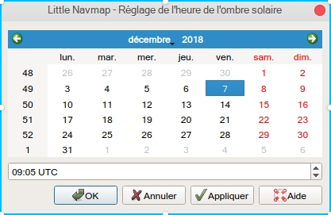

.. _sun-shadow:

|Sun Shadow| Ombre Solaire
--------------------------

*Little Navmap* permet d'afficher l'ombre du soleil sur le globe. Cela
fonctionne à la fois dans les projections ``Mercator`` et ``Spherical``.

Activer l'ombre dans le menu ``Vue`` -> `Afficher l'ombre
solaire <MENUS.html#show-sun-shading>`__.

Vous pouvez changer la source de l'heure de l'ombre du soleil dans
``Vue`` -> `Heure de l'ombre
solaire <MENUS.html#show-sun-shading-time>`__.

L'obscurité de l'ombre peut être modifiée dans la boîte de dialogue
``Options`` de l'onglet ``Affichage de la carte``,
``Obscurité de l'ombre du soleil`` en bas de la boîte de dialogue.

|Sun Shadow|

**Image ci-dessus:**\ *Ombre du soleil sur l'hémisphère nord..*

.. _sun-shadow-time-sources:

Sources Horaire
~~~~~~~~~~~~~~~

Vous pouvez choisir entre trois sources de temps pour l'ombre du soleil.
L'heure n'est pas fixe et avancera pour toutes les sources ou sera mise
à jour à partir de l'heure du simulateur.

-  ``Simulateur``: Utilise l'heure du simulateur de vol connecté.
   Retourne en temps réel s'il n'est pas connecté à un simulateur. Mise
   à jour automatique de l'ombre en cas de modification de l'heure du
   simulateur.
-  ``Heure UTC réelle``: Utilisez toujours en temps réel.
-  ``Heure défini par l'utilisateur``: Permet d'utiliser le temps défini
   par l'utilisateur tel que modifié par
   ``Définir l'heure définie par l'utilisateur`` ci-dessous.

.. _sun-shadow-user-defined:

Définir Heure définie par l'Utilisateur
~~~~~~~~~~~~~~~~~~~~~~~~~~~~~~~~~~~~~~~

Le menu ``Vue`` -> ``Heure d'ombrage du soleil`` ->
``Définir l'heure définie par l'utilisateur`` ouvre une boîte de
dialogue pour définir une heure définie par l'utilisateur en UTC comme
source de l'ombre solaire.

Vous pouvez déplacer la boîte de dialogue hors de la fenêtre de carte et
voir les résultats immédiatement en cliquant sur le bouton
``Appliquer``.

**N'oubliez pas de cliquer sur une date lorsque vous changez de mois ou
d'années. Sinon, l'ancienne date sera utilisée.**

Notez que l'heure définie par l'utilisateur est réinitialisée à l'heure
actuelle en temps réel au redémarrage. *Little Navmap*.

|Date and Time for Sun Shadow|

**Image ci-dessus:**\ *Date et heure de l'ombre du soleil le 8 novembre
à 22h42, heure de Zoulou.*

.. |Sun Shadow| image:: ../images/icon_mapshadow.png
.. |Sun Shadow| image:: ../images/sunshadow.jpg

