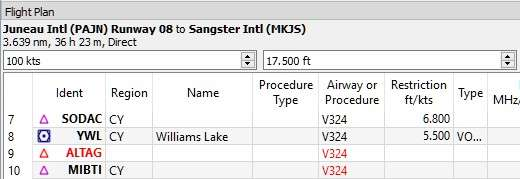

.. _flight-plan-dock-window:

|Flight Plan| Flight Plan Dock Window
-------------------------------------

Upper Part
~~~~~~~~~~

The top shows a label that contains departure, departure position
(parking, runway or helipad), destination, flight plan distance,
traveling time, used procedures and flight plan type.

Besides the label there are three input fields on top of this dock
window:

-  **Speed (kts):** Ground speed. The value of this field is used only
   for calculating traveling times in the table view: ``Leg Time`` and
   ``ETA`` (estimated time of arrival at a waypoint given 0:00 as start
   time). It is saved as an annotation with the flight plan and not used
   for simulator user aircraft calculations.
-  **Cruise altitude (ft):** This value is saved with the flight plan
   and is also used to calculate an airway flight plan based on given
   altitude. This field receives the minimum altitude for a flight plan
   if a plan along Victor or Jet airways is calculated and altitude
   restrictions were found. See `Calculate based on given
   Altitude <MENUS.html#calculate-based-on-given-altitude>`__.
-  **Flight Plan Type (IFR or VFR):** This is saved with the flight
   plan.

Flight Plan Table
~~~~~~~~~~~~~~~~~

The table view allows the same operations as the search table view
except sorting. See `here <SEARCH.html#table-view>`__ for more
information.

All selected elements in the flight plan table view will be highlighted
on the map using a black/green circle. See
`Highlights <MAPDISPLAY.html#highlights>`__ for more information. Multi
selection using ``Shift-Click`` or ``Ctrl+Click`` is possible.

The active flight plan leg is highlighted in magenta when *Little
Navmap* is connected to a simulator.

Procedure legs have dark blue color and legs of a missed approach have a
dark red color.

If a waypoint of a flight plan cannot be found in the database it will
be displayed in red. This can happen if the used AIRAC cycles do no
match. The same applies to airways. The position on the map is still
correct.

|Waypoint not found|

**Picture above:**\ *The waypoint*\ ``ALTAG``\ \_ and parts of the
airway \_\ ``V324``\ *could not be found in the database.*

.. _flight-plan-table-columns:

Table Columns
^^^^^^^^^^^^^

-  ``Ident``: ICAO ident of the navaid or airport.
-  ``Region``: Two letter region code of a navaid.
-  ``Name``: Name of airport or radio navaid.
-  ``Procedure Type``: The type of this leg's procedure. ``SID``,
   ``SID Transition``, ``STAR``, ``STAR Transition``, ``Transition``,
   ``Approach`` or ``Missed``.
-  ``Airway or Procedure``: Contains the airway name for en route legs
   or procedure instruction.
-  ``Restriction``: Either minimum altitude for en route airway segment,
   procedure altitude restriction or procedure speed limit. A ``/``
   separates altitude and speed restriction. The following altitude
   restrictions exist for procedures:

   -  **Number only:** Fly at altitude or speed. Example: ``5.400`` or
      ``210``.
   -  **Prefix** ``A``: Fly at or above altitude or speed. Example:
      ``A 1.800``.
   -  **Prefix** ``B``: Fly at or below altitude or speed. Example:
      ``B 10.000`` or ``B 220``.
   -  **Range:** Fly at or above altitude one and at or below altitude
      two. Example: ``A 8.000, B 10.000``.
   -  **Altitude and speed limit:** Values separated by ``/``. Example:
      ``A 8.000, B 10.000/B220``.
   -  **Speed limit only:** A prefixed ``/`` indicates no altitude but a
      speed restriction. Example: ``/B250``.

-  ``Type``: Type of a radio navaid.
-  ``Freq.``: Frequency or channel of a radio navaid.
-  ``Range``: Range of a radio navaid.
-  ``Course °M:``\ \*\* This is the start course of the great circle
   route connecting the two waypoints of the leg. Use this course at
   departure if you travel long distances without navaids. Be aware that
   you have to change you course constantly when traveling along a great
   circle line.
-  ``Direct °M:``\ \*\* This is the constant course of the rhumb line
   connecting two waypoints of a leg. Depending on route and distance it
   can differ from the course of the great circle line. Use this course
   if you travel along airways or towards VOR or NDB stations. Opposed
   to the course shown by the flight simulator GPS unit this will give
   you the precise radial when approaching a VOR or NDB on a flight
   plan.
-  ``Distance``: Distance of the flight plan leg.
-  ``Remaining``: Remaining distance to destination airport or procedure
   end point (usually the runway).
-  ``Leg Time``: Flying time for this leg. Calculated based on the given
   ground speed.
-  ``ETA``: Estimated time of arrival. This is a static value and not
   updated while flying.
-  ``Remarks``: Turn instructions, flyover or related navaid for
   procedure legs.

|Flight Plan|

**Picture above:**\ *The*\ ``Flight Plan``\ \_ dock window. The flight
plan uses a SID for departure and a STAR, transition and an approach for
arrival.\_

Mouse Clicks
~~~~~~~~~~~~

A double click on an entry in the table view shows either an airport
diagram or zooms to the navaid. Additionally, details are shown in the
``Information`` dock window. Single click selects an object and
highlights it on the map using a black/green circle.

Top Button
~~~~~~~~~~

.. _clear-selection:

|Clear Selection| Clear Selection
^^^^^^^^^^^^^^^^^^^^^^^^^^^^^^^^^

Deselects all entries in the table and also removes any highlight rings
from the map.

Flight Plan Table View Context Menu
~~~~~~~~~~~~~~~~~~~~~~~~~~~~~~~~~~~

.. _show-information-1:

|Show Information| Show Information
^^^^^^^^^^^^^^^^^^^^^^^^^^^^^^^^^^^

Same as the `Map Context Menu <MAPDISPLAY.html#map-context-menu>`__.

.. _show-on-map:

|Show on Map| Show on Map
^^^^^^^^^^^^^^^^^^^^^^^^^

Shows either the airport diagram or zooms to the navaid on the map. The
zoom distance can be changed in the dialog ``Options`` on the tab
``Map``.

.. _move-selected-legs-up-down:

|Move Selected Legs up|\ |Move Selected Legs down| Move Selected Legs up/down
^^^^^^^^^^^^^^^^^^^^^^^^^^^^^^^^^^^^^^^^^^^^^^^^^^^^^^^^^^^^^^^^^^^^^^^^^^^^^

Moves all selected flight plan legs up or down in the list. This works
also if multiple legs are selected.

Airway names will be removed when waypoints in the flight plan are moved
or deleted because the new flight plan legs will not follow any airway
but rather use direct connections.

Procedures or procedure legs cannot be moved and waypoints cannot be
moved into or across procedures.

.. _delete-selected-legs:

|Delete Selected Legs or Procedure| Delete Selected Legs or Procedure
^^^^^^^^^^^^^^^^^^^^^^^^^^^^^^^^^^^^^^^^^^^^^^^^^^^^^^^^^^^^^^^^^^^^^

Deletes all selected flight plan legs. Use ``Undo`` if you delete legs
accidentally.

The whole procedure is deleted if the selected flight plan leg is a part
of a procedure. Deleting a procedure deletes its transition too.

.. _edit-name-of-user-waypoint:

|Edit Name of User Waypoint| Edit Name of User Waypoint
^^^^^^^^^^^^^^^^^^^^^^^^^^^^^^^^^^^^^^^^^^^^^^^^^^^^^^^

Allows to change the name of a user defined waypoint. The length of the
name is limited to 10 characters.

Calculate for selected Legs
^^^^^^^^^^^^^^^^^^^^^^^^^^^

This is a submenu containing entries for flight plan calculation methods
as described here:

|Calculate Radionav|\ `Calculate
Radionav <MENUS.html#calculate-radionav>`__, |Calculate high
Altitude|\ `Calculate high
Altitude <MENUS.html#calculate-high-altitude>`__, |Calculate low
Altitude|\ `Calculate low Altitude <MENUS.html#calculate-low-altitude>`__
and |Calculate based on given Altitude|\ `Calculate based on given
Altitude <MENUS.html#calculate-based-on-given-altitude>`__.

This menu is only active when more than one flight plan leg is selected
and neither the first nor the last selected row is a procedure.

It will calculate a flight plan fragment between the first and last
waypoint in the selected flight plan legs. All legs between the first
and last selected one will be deleted and replaced with the calculated
flight plan fragment.

You can either select the first and the last leg (``Ctrl+Click``) and
start the calculation or you can select a whole range of legs
(``Shift+Click`` and drag) before calculation.

This function can be useful if you have to cross oceanic legs that are
void of airways:

#. Set departure and destination.
#. Find the last waypoint on an airway before entering the ocean. Choose
   the closest to the flight plan line. Add the waypoint to the flight
   plan.
#. Select departure and this waypoint and calculate the flight plan
   fragment.
#. Same as above the the first waypoint on an airway before or when
   entering the landmass again.
#. Select this waypoint and the destination and calculate the flight
   plan fragment.

While not entirely realistic, this is a sufficient solution until NAT or
PACOT tracks are available.

.. _show-range-rings-1:

|Show Range Rings| Show Range Rings
^^^^^^^^^^^^^^^^^^^^^^^^^^^^^^^^^^^

Same as the `Map Context Menu <MAPDISPLAY.html#map-context-menu>`__.

.. _show-navaid-range-1:

|Show Navaid range| Show Navaid range
^^^^^^^^^^^^^^^^^^^^^^^^^^^^^^^^^^^^^

Will show the range rings for all selected radio navaids in the flight
plan. You will get a range circle for each radio navaid on the flight
plan if you simply select all legs of the flight plan and use this
function.

Otherwise, the same as the `Map Context
Menu <MAPDISPLAY.html#map-context-menu>`__.

.. _remove-all-range-rings-and-distance-measurements-1:

|Remove all Range Rings and Distance measurements| Remove all Range Rings and Distance measurements
^^^^^^^^^^^^^^^^^^^^^^^^^^^^^^^^^^^^^^^^^^^^^^^^^^^^^^^^^^^^^^^^^^^^^^^^^^^^^^^^^^^^^^^^^^^^^^^^^^^

Same as the `Map Context Menu <MAPDISPLAY.html#map-context-menu>`__.

.. _copy-0:

|Copy| Copy
^^^^^^^^^^^

Copies the selected entries in CSV format into the clipboard. The CSV
will include a header. This will consider changes to the table view like
column order.

.. _select-all-0:

Select All
^^^^^^^^^^

Selects all flight plan legs.

.. _clear-selection:

|Clear Selection| Clear Selection
'''''''''''''''''''''''''''''''''

Deselects the currently selected flight plan leg and removes the
highlight circles from the map.

.. _reset-view-0:

|Reset View| Reset View
^^^^^^^^^^^^^^^^^^^^^^^

Resets the column order and column widths back to the default view.

.. _set-center-for-distance-search-1:

|Set Center for Distance Search| Set Center for Distance Search
^^^^^^^^^^^^^^^^^^^^^^^^^^^^^^^^^^^^^^^^^^^^^^^^^^^^^^^^^^^^^^^

Same as the `Map Context Menu <MAPDISPLAY.html#map-context-menu>`__.

.. |Flight Plan| image:: ../images/icon_routedock.png

.. |Flight Plan| image:: ../images/flightplan.jpg
.. |Clear Selection| image:: ../images/icon_clearselection.png
.. |Show Information| image:: ../images/icon_globals.png
.. |Show on Map| image:: ../images/icon_showonmap.png
.. |Move Selected Legs up| image:: ../images/icon_routelegup.png
.. |Move Selected Legs down| image:: ../images/icon_routelegdown.png
.. |Delete Selected Legs or Procedure| image:: ../images/icon_routedeleteleg.png
.. |Edit Name of User Waypoint| image:: ../images/icon_routestring.png
.. |Calculate Radionav| image:: ../images/icon_routeradio.png
.. |Calculate high Altitude| image:: ../images/icon_routehigh.png
.. |Calculate low Altitude| image:: ../images/icon_routelow.png
.. |Calculate based on given Altitude| image:: ../images/icon_routealt.png
.. |Show Range Rings| image:: ../images/icon_rangerings.png
.. |Show Navaid range| image:: ../images/icon_navrange.png
.. |Remove all Range Rings and Distance measurements| image:: ../images/icon_rangeringsoff.png
.. |Copy| image:: ../images/icon_copy.png
.. |Reset View| image:: ../images/icon_cleartable.png
.. |Set Center for Distance Search| image:: ../images/icon_mark.png

