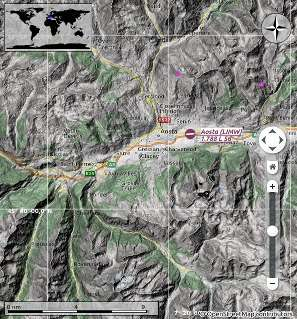

Menus and Toolbars
------------------

This chapter describes all the menu items of *Little Navmap*. You will
find most of this functionality on the toolbars as well which are not be
described separately. Key combinations can be seen on the menu items and
are not listed in this manual.

|Little Navmap Menu and Toolbars|

**Picture above:**\ *Menu and toolbars docked in default positions.*

File Menu
~~~~~~~~~

.. _new-flight-plan:

|New Flight Plan| New Flight Plan
^^^^^^^^^^^^^^^^^^^^^^^^^^^^^^^^^

Erases the current flight plan.

You have to use the `Search Result Table View Context
Menu <SEARCH.html#search-result-table-view-context-menu>`__, the `Map
Context Menu <MAPDISPLAY.html#map-context-menu>`__ or the `Flight Plan
Route Description <ROUTEDESCR.html>`__ dialog to create a flight plan.

.. _open-flight-plan:

|Open Flight Plan| Open Flight Plan
^^^^^^^^^^^^^^^^^^^^^^^^^^^^^^^^^^^

Opens a FSX PLN, a FS9 PLN, a X-Plane FMS or a FLP flight plan file. The
type of file is determined by content and not file extension. See
`Flight Plan Formats <FLIGHTPLANFMT.html>`__ for more information.

An opened flight plan file will be reloaded on start up (reload and
centering can be switched off in the ``Options`` dialog on the
``Startup`` and ``User Interface`` tab).

Procedure information and ground speed will be added to the flight plan
if a PLN file is saved by *Little Navmap*. The additional information
will be ignored by FSX or P3D but allows to reload all information by
*Little Navmap*.

.. _append-flight-plan:

|Append flight plan| Append Flight Plan
^^^^^^^^^^^^^^^^^^^^^^^^^^^^^^^^^^^^^^^

Adds departure, destination and all waypoints to the current flight
plan.

Using ``Append Flight Plan`` allows to load or merge complete flight
plans or flight plan snippets into a new plan. All waypoints are added
at the end of the current flight plan. Then you can use the
``Delete selected Legs`` and ``Move selected Legs up/down`` context menu
items to arrange the waypoints and airports as required. See `Flight
Plan Table View Context
Menu <FLIGHTPLAN.html#flight-plan-table-view-context-menu>`__.

All arrival procedures will be removed when appending a flight plan.

.. _save-flight-plan:

|Save Flight Plan| Save Flight Plan
^^^^^^^^^^^^^^^^^^^^^^^^^^^^^^^^^^^

.. _save-flight-plan-as:

|Save Flight Plan as PLN| Save Flight Plan as PLN
^^^^^^^^^^^^^^^^^^^^^^^^^^^^^^^^^^^^^^^^^^^^^^^^^

Saves the flight plan to a FSX/P3D PLN file (XML format). This annotated
format allows to save all flight plan attributes of *Little Navmap*.

``Save Flight Plan as PLN`` changes the current file type and name in
*Little Navmap* which means that all further saves will go into the new
PLN file.

It is recommended to save all flight plans in this format to keep all
information of a plan. Even when using the limited FMS format for
X-Plane. See `Flight Plan Formats <FLIGHTPLANFMT.html>`__ for more
information.

*Little Navmap* will allow flight plans to be created that may be useful
as a flight plan snippet but are unusable by the flight simulator. This
occurs if a flight plan does not have a departure or destination
airport. A warning dialog will be shown when saving a incomplete flight
plan.

A warning dialog will also be shown if the departure airport has parking
positions but none is assigned in the flight plan.

Procedures will be saved as an annotation in the flight plan file if the
flight plan contains any. This causes no problem for the simulators and
most other programs. Use `Export clean Flight
Plan <MENUS.html#export-clean-flight-plan>`__ if a program has problems
reading the PLN files saved by *Little Navmap*.

Note that the waypoints of a procedure are not saved with the flight
plan. This is not supported by FSX or P3D. Use the GPS, FMC or other
ways to select a procedure in your aircraft.

The set ground speed is also saved with the flight plan.

.. _save-flight-plan-as-fms11:

|Save Flight Plan as X-Plane FMS 11| Save Flight Plan as X-Plane FMS 11
^^^^^^^^^^^^^^^^^^^^^^^^^^^^^^^^^^^^^^^^^^^^^^^^^^^^^^^^^^^^^^^^^^^^^^^

Saves the flight plan using the new X-Plane FMS 11 format. **This format
can only be used in X-Plane 11.10 and above. Do not try to load it into
the FMS or GPS of X-Plane 11.05. It might crash the simulator.**

A warning dialog will be shown with the warning above when saving.

See `Flight Plan Formats <FLIGHTPLANFMT.html>`__ for more information on
limitations.

This function changes the current file type and name which means that
all further saves will go into the new FMS file and the file will be
reloaded on next start.

Store FMS files into the ``Output/FMS plans`` directory inside the
X-Plane directory if you would like to use the flight plan in the
X-Plane GPS, the G1000 or the FMS.

.. _save-flight-plan-as-flp:

|Save Flight Plan FLP| Save Flight Plan as FLP
^^^^^^^^^^^^^^^^^^^^^^^^^^^^^^^^^^^^^^^^^^^^^^

Exports the current flight plan as a FLP file usable by the X-Plane FMS,
Aerosoft Airbus and other add-on aircraft. This format is limited so a
dialog is shown if any unsupported features are detected in the current
flight plan.

See `Flight Plan Formats <FLIGHTPLANFMT.html>`__ for more information on
limitations.

This function changes the current file type and name which means that
all further saves will go into the new FLP file and the file will be
reloaded on next start.

Store FLP files into the ``Output/FMS plans`` directory inside the
X-Plane directory if you want to load it into the FMS.

.. _export-clean-flight-plan:

|Export as Clean PLN| Export as Clean PLN
^^^^^^^^^^^^^^^^^^^^^^^^^^^^^^^^^^^^^^^^^

Saves a flight plan without any procedure or speed annotations if
programs have problems reading the PLN files saved by *Little Navmap*.
This is rarely needed.

Like any other export function this does not change the current file
name and type. Further saves will still use the same file name and
format as before.

See also `Flight Plan Formats <FLIGHTPLANFMT.html>`__.

.. _export-flight-plan-as-fms3:

|Export Flight Plan as X-Plane FMS 3| Export Flight Plan as X-Plane FMS 3
^^^^^^^^^^^^^^^^^^^^^^^^^^^^^^^^^^^^^^^^^^^^^^^^^^^^^^^^^^^^^^^^^^^^^^^^^

Saves the flight plan using the older X-Plane FMS 3 format which is
limited but can be loaded by X-Plane 10 and X-Plane 11.05. A warning
dialog is shown if any unsupported features are detected in the current
flight plan.

See `Flight Plan Formats <FLIGHTPLANFMT.html>`__ for more information on
limitations.

This export function this does not change the current file name and
type. Further saves will still use the same file name and format as
before.

Store FMS files into the ``Output/FMS plans`` directory inside the
X-Plane directory if you would like to use the flight plan in the
X-Plane GPS or FMS.

.. _export-submenu:

Export Sub-Menu
^^^^^^^^^^^^^^^

See `Flight Plan Formats <FLIGHTPLANFMT.html>`__ for more detailed
information on the available export formats.

Export functions do not change the current file name and type. Further
saves will still use the same file name and format as before.

.. _save-flight-plan-as-rxpgns:

Export Flight Plan to FPL for the Reality XP GNS
''''''''''''''''''''''''''''''''''''''''''''''''

Save flight plan as FPL file usable by the *Reality XP GNS 530W/430W
V2*.

Procedures or their respective waypoints are not included in the
exported file.

The default directory to save the flight plans for the GNS units is
``C:\ProgramData\Garmin\GNS Trainer Data\GNS\FPL`` for all simulators.
The directory will be created automatically by *Little Navmap* on first
export if it does not exist.

See also `Notes about the Garmin Formats GFP and
FPL <FLIGHTPLANFMT.html#garmin-notes>`__.

.. _save-flight-plan-as-rxpgtn:

Export Flight Plan as GFP for Reality XP GTN
''''''''''''''''''''''''''''''''''''''''''''

Save flight plan as GFP file usable by the *Reality XP GTN 750/650
Touch*. This format allows to save procedures and airways.

See also `Notes about the Garmin Formats GFP and
FPL <FLIGHTPLANFMT.html#garmin-notes>`__ for information about paths and
other remarks.

.. _save-flight-plan-as-gfp:

Export Flight Plan as Garmin GTN GFP
''''''''''''''''''''''''''''''''''''

Exports the flight plan in GFP format used by the *Flight1 GTN 650/750*.

Procedures or their respective waypoints are not included in the
exported file.

See `Flight Plan Formats <FLIGHTPLANFMT.html#flight-plan-formats-gfp>`__
for more information about this export format and how to work around
locked waypoints.

.. _export-flight-plan-as-rte:

Export Flight Plan as PMDG RTE
''''''''''''''''''''''''''''''

Exports the current flight plan as a PMDG RTE file.

Procedures or their respective waypoints are not included in the
exported file.

Export Flight Plan as TXT
'''''''''''''''''''''''''

Exports the current flight plan as a TXT file usable by JARDesign or
Rotate Simulations aircraft

Neither procedures nor their respective waypoints are included in the
exported file.

.. _export-flight-plan-as-fpr:

Export Flight Plan as Majestic Dash FPR
'''''''''''''''''''''''''''''''''''''''

Exports the current flight plan for the Majestic Software MJC8 Q400.
Note that the export is currently limited to a list of waypoints.

The flight plan has to be saved to
``YOURSIMULATOR\SimObjects\Airplanes\mjc8q400\nav\routes``.

.. _export-flight-plan-as-fpl:

Export Flight Plan as IXEG FPL
''''''''''''''''''''''''''''''

Exports the current flight plan as a FPL file usable by the IXEG Boeing
737 classic.

SIDs, STARs or approach procedures are not exported.

The file should be saved to
``XPLANE\Aircraft\X-Aviation\IXEG 737 Classic\coroutes``. You might have
to create the directory manually if it does not exist.

.. _export-flight-plan-as-fpl:

Export Flight Plan to corte.in for Flight Factor Airbus
'''''''''''''''''''''''''''''''''''''''''''''''''''''''

Appends the the flight plan to a new or already present ``corte.in``
company routes file for the Flight Factor Airbus aircraft.

The file will be automatically created if it does not exist. Otherwise
the flight plan will be appended to the file. You have to remove the
flight plan manually from the ``corte.in`` file with a simple text
editor if you wish to get rid of it.

Location of the file depends on aircraft type.

Export Flight Plan as GPX
'''''''''''''''''''''''''

Exports the current flight plan into a GPS Exchange Format file which
can be read by Google Earth and most other GIS applications.

The flight plan is exported as a route and the flown aircraft trail as a
track including simulator time and altitude.

The route has departure and destination elevation and cruise altitude
set for all waypoints. Waypoints of all procedures are included in the
exported file. Note that the waypoints will not allow to reproduce all
parts of a procedure like holds or procedure turns.

**Do not forget to clear the aircraft trail (**\ `Delete Aircraft
Trail <MENUS.html#delete-aircraft-trail>`__\ **) before flight to avoid
old trail segments in the exported GPX file. Or, disable the reloading
of the trail in the options dialog on page**\ ``Startup``\ **.**

.. _add-google-earth-kml:

|Add Google Earth KML| Add Google Earth KML
^^^^^^^^^^^^^^^^^^^^^^^^^^^^^^^^^^^^^^^^^^^

Allows addition of one or more Google Earth KML or KMZ files to the map
display. All added KML or KMZ files will be reloaded on start up. Reload
and centering can be switched off in the ``Options`` dialog on the
``Startup`` and ``User Interface`` tab.

Due to the variety of KML files it is not guaranteed that all files will
show up properly on the map.

.. _clear-google-earth-kml-from-map:

|Clear Google Earth KML from Map| Clear Google Earth KML from Map
^^^^^^^^^^^^^^^^^^^^^^^^^^^^^^^^^^^^^^^^^^^^^^^^^^^^^^^^^^^^^^^^^

Removes all loaded KML files from the map.

.. _work-offline:

|Offline| Work Offline
^^^^^^^^^^^^^^^^^^^^^^

Stops loading of map data from the Internet. This affects the
*OpenStreetMap*, *OpenTopoMap* and all the other online map themes as
well as the elevation data. A red ``Offline.`` indication is shown in
the status bar if this mode is enabled.

You should restart the application after going online again.

.. _save-map-as-image:

|Save Map as Image| Save Map as Image
~~~~~~~~~~~~~~~~~~~~~~~~~~~~~~~~~~~~~

Saves the current map view as an image file. Allowed formats are JPEG,
PNG and BMP.

.. _print-map:

|Print Map| Print Map
~~~~~~~~~~~~~~~~~~~~~

Allows to print the current map view. See `Printing the
Map <PRINT.html#printing-the-map>`__ for more information.

.. _print-flight-plan:

|Print Flight Plan| Print Flight Plan
~~~~~~~~~~~~~~~~~~~~~~~~~~~~~~~~~~~~~

Opens a print dialog that allows you to select flight plan related
information to be printed. See `Map Flight Plan
Printing <PRINT.html#printing-the-flight-plan>`__ for more information.

.. _file-quit:

|Quit| Quit
~~~~~~~~~~~

Exits the application. Will ask for confirmation if there is a changed
flight plan.

Flight Plan Menu
~~~~~~~~~~~~~~~~

.. _undo-redo:

|Undo|\ |Redo| Undo/Redo
^^^^^^^^^^^^^^^^^^^^^^^^

Allows undo and redo of all flight plan changes.

.. _select-a-start-position-for-departure:

|Select a Start Position for Departure| Select a Start Position for Departure
^^^^^^^^^^^^^^^^^^^^^^^^^^^^^^^^^^^^^^^^^^^^^^^^^^^^^^^^^^^^^^^^^^^^^^^^^^^^^

A parking spot (gate, ramp or fuel box), runway or helipad can be
selected as a start position at the departure airport. A parking
position can also be selected in the map context menu item `Set as
Flight Plan Departure <MAPDISPLAY.html#set-as-flight-plan-departure>`__
when right clicking on a parking position. If no position is selected
the longest primary runway end is selected automatically as start.

|Select Start Position Dialog|

**Picture above:**\ *The start position selection dialog for EDDN.*

.. _edit-flight-plan-on-map:

|Edit Flight Plan on Map| Edit Flight Plan on Map
^^^^^^^^^^^^^^^^^^^^^^^^^^^^^^^^^^^^^^^^^^^^^^^^^

Toggles the flight plan drag and drop edit mode on the map. See `Flight
Plan Editing <MAPFPEDIT.html#map-flight-plan-editing>`__.

.. _new-flight-plan-from-description:

|New Flight Plan from Route Description| New Flight Plan from Route Description
^^^^^^^^^^^^^^^^^^^^^^^^^^^^^^^^^^^^^^^^^^^^^^^^^^^^^^^^^^^^^^^^^^^^^^^^^^^^^^^

Opens a dialog with the route description of the current flight plan
that also allows to modify the current flight plan or enter a new one.
`Flight Plan from Route Description <ROUTEDESCR.html>`__ gives more
information about this topic.

.. _flight-plan-route-clipboard:

|Copy Flight Plan Route to Clipboard| Copy Flight Plan Route to Clipboard
^^^^^^^^^^^^^^^^^^^^^^^^^^^^^^^^^^^^^^^^^^^^^^^^^^^^^^^^^^^^^^^^^^^^^^^^^

Copies the route description of the current flight plan to the clipboard
using the settings from the `Flight Plan from Route
Description <ROUTEDESCR.html#flight-plan-from-route-description>`__
dialog.

.. _calculate-direct:

|Calculate Direct| Calculate Direct
^^^^^^^^^^^^^^^^^^^^^^^^^^^^^^^^^^^

Deletes all intermediate waypoints and connects departure and
destination using a great circle line.

You can calculate a flight plan between any kind of waypoints, even user
defined waypoints (right click on the map and select
``Add Position to Flight plan`` to create one). This allows the creation
of snippets that can be merged into flight plans. For example you can
use this feature for crossing the North Atlantic with varying departures
and destinations. This applies to all flight plan calculation modes.

.. _calculate-radionav:

|Calculate Radionav| Calculate Radionav
^^^^^^^^^^^^^^^^^^^^^^^^^^^^^^^^^^^^^^^

Creates a flight plan that uses only VOR and NDB stations as waypoints
and tries to ensure reception of at least one station along the whole
flight plan. Note that VOR stations are preferred before NDB and DME
only stations are avoided if possible. Calculation will fail if not
enough radio navaids can be found between departure and destination.
Build the flight plan manually if this is the case.

This calculation can also be used to create a flight plan snippet
between any kind of waypoint.

.. _calculate-high-altitude:

|Calculate high Altitude| Calculate high Altitude
^^^^^^^^^^^^^^^^^^^^^^^^^^^^^^^^^^^^^^^^^^^^^^^^^

Uses Jet airways to create a flight plan.

Calculated flight plans along airways will obey all airway restrictions
like minimum and altitude. The program will also adhere to one-way and
maximum altitude restrictions for X-Plane based navdata.

The resulting minimum altitude is set into the flight plan altitude
field. The flight plan altitude field is not changed if no altitude
restrictions were found along the flight plan.

A simplified east/west rule is used to adjust the cruise altitude to
odd/even values (this can be switched off in the ``Options`` dialog on
the ``Flight Plan`` tab).

The default behavior is to jump from the departure airport to the next
waypoint of a suitable airway and vice versa for the destination. This
can be changed in ``Options`` dialog on the ``Flight Plan`` tab if VOR
or NDB stations are preferred as transition points to airways.

The airway network of Flight Simulator is not complete (the north
Atlantic tracks are missing for example - these change daily), therefore
calculation across large ocean areas can fail.

Create the airway manually as a workaround or use an online planning
tool to obtain a route string and use the
``New Flight Plan from String`` option to create the flight plan.

This calculation can also be used to create a flight plan snippet
between any kind of waypoint.

.. _calculate-low-altitude:

|Calculate low Altitude| Calculate low Altitude
^^^^^^^^^^^^^^^^^^^^^^^^^^^^^^^^^^^^^^^^^^^^^^^

Uses Victor airways to create a flight plan. Everything else is the same
as in ``Calculate high Altitude``.

.. _calculate-based-on-given-altitude:

|Calculate based on given Altitude| Calculate based on given Altitude
^^^^^^^^^^^^^^^^^^^^^^^^^^^^^^^^^^^^^^^^^^^^^^^^^^^^^^^^^^^^^^^^^^^^^

Use the value in the altitude field of the flight plan to find a flight
plan along Victor and/or Jet airways. Calculation will fail if the
altitude value is too low. Everything else is the same as in
``Calculate high Altitude``.

.. _reverse-flight-plan:

|Reverse Flight Plan| Reverse Flight Plan
^^^^^^^^^^^^^^^^^^^^^^^^^^^^^^^^^^^^^^^^^

Swaps departure and destination and reverses order of all intermediate
waypoints. A default runway is assigned for the new departure start
position.

Note that this function does not consider one-way airways in the X-Plane
database and might result in an invalid flight plan.

.. _adjust-flight-plan-alt:

|Adjust Flight Plan Altitude| Adjust Flight Plan Altitude
^^^^^^^^^^^^^^^^^^^^^^^^^^^^^^^^^^^^^^^^^^^^^^^^^^^^^^^^^

Changes the flight plan altitude according to a simplified East/West
rule and the current route type (IFR or VFR). Rounds the altitude up to
the nearest even 1000 feet (or meter) for westerly flight plans or odd
1000 feet (or meter) for easterly flight plans. Adds 500 feet for VFR
flight plans.

Map Menu
~~~~~~~~

.. _goto-home:

|Goto Home| Goto Home
^^^^^^^^^^^^^^^^^^^^^

Goes to the home area that was set using `Set
Home <MAPDISPLAY.html#set-home>`__ using the saved position and zoom
distance. The center of the home area is highlighted by a |Home Symbol|
symbol.

.. _go-to-center-for-distance-search:

|Go to Center for Distance Search| Go to Center for Distance Search
^^^^^^^^^^^^^^^^^^^^^^^^^^^^^^^^^^^^^^^^^^^^^^^^^^^^^^^^^^^^^^^^^^^

Go to the center point used for distance searches. See `Set Center for
Distance Search <MAPDISPLAY.html#set-center-for-distance-search>`__.The
center for the distance search is highlighted by a |Distance Search
Symbol| symbol.

.. _center-flight-plan:

|Center Flight Plan| Center Flight Plan
^^^^^^^^^^^^^^^^^^^^^^^^^^^^^^^^^^^^^^^

Zooms out the map (if required) to display the whole flight plan on the
map.

.. _center-aircraft:

|Center Aircraft| Center Aircraft
^^^^^^^^^^^^^^^^^^^^^^^^^^^^^^^^^

Zooms to the user aircraft if directly connected to a flight simulator
or remotely connected using `Little
Navconnect <https://albar965.github.io/littlenavconnect.html>`__ and
keeps the aircraft centered on the map.

The centering of the aircraft can be changed in the ``Options`` dialog
on the ``Simulator Aircraft`` tab.

.. _reset-display-settings:

|Reset Display Settings| Reset Display Settings
^^^^^^^^^^^^^^^^^^^^^^^^^^^^^^^^^^^^^^^^^^^^^^^

Resets all map display settings back to default.

|By Reset Affected Settings|

**Picture above:**\ *All setting tool buttons highlighted that are
affected by*\ ``Reset Display Settings``\ *.*

.. _delete-aircraft-trail:

|Delete Aircraft Trail| Delete Aircraft Trail
^^^^^^^^^^^^^^^^^^^^^^^^^^^^^^^^^^^^^^^^^^^^^

Removes the user aircraft trail. It is also deleted when connecting to a
flight simulator. The trail is saved and will be reloaded on program
startup.

.. _map-position-back-forward:

|Map Position Back| |Map Position Forward| Map Position Back/Forward
^^^^^^^^^^^^^^^^^^^^^^^^^^^^^^^^^^^^^^^^^^^^^^^^^^^^^^^^^^^^^^^^^^^^

Jumps forward or backward in the map position history. The complete
history is saved and restored when starting *Little Navmap*.

Details
^^^^^^^

.. _more-details:

|More Details| More Details
'''''''''''''''''''''''''''

.. _default-details:

|Default Details| Default Details
'''''''''''''''''''''''''''''''''

.. _less-details:

|Less Details| Less Details
'''''''''''''''''''''''''''

Increases or decreases details on the map. More details means more
airports, more navaids, more text information and bigger icons.

Note that map information will be truncated if too much detail is
chosen. A red warning message will be shown in the statusbar if this is
the case.

The detail level is shown in the statusbar. Range is -5 for few details
to +5 for most details.

Projection
^^^^^^^^^^

Mercator
''''''''

A flat projection that gives the most fluid movement and the sharpest
map when using picture tile based online maps themes like
*OpenStreetMap* or *OpenTopoMap*.

Spherical
'''''''''

Shows earth as a globe which is the most natural projection. Movement
can stutter slightly when using the picture tile based online maps
themes like *OpenStreetMap* or *OpenTopoMap*. Use the ``Simple``,
``Plain`` or ``Atlas`` map themes to prevent this.

Online maps can appear slightly blurred when using this projection. This
is a result from converting the flat image tiles to the spherical
display.

|Little Navmap Spherical projection and Simple Map Theme|

**Picture above:**\ *Spherical map projection with*\ ``Simple``\ \_
offline map theme selected.\_

Theme
^^^^^

Please note that all the online maps are delivered from free services
therefore fast download speeds and high availability cannot be
guaranteed. In any case it is easy to deliver and install a new online
map source without creating a new *Little Navmap* release. See `Creating
or adding Map Themes <MAPTHEMES.html>`__ for more information.

OpenStreetMap
'''''''''''''

This is an online raster (i.e. based on images) map that includes a hill
shading option. Note that the *OpenStreetMap* hill shading does not
cover the whole globe.

|OpenStreetMap and Hill shading|

**Picture above:**\ *View at an Italian airport using OpenStreetMap
theme and hill shading.*

OpenMapSurfer
'''''''''''''

The `OSM Roads <http://korona.geog.uni-heidelberg.de>`__ layer provided
by `Heidelberg University <http://giscience.uni-hd.de>`__. This theme
includes optional hill shading which is available worldwide.

Note that the hill shading option of this map is marked experimental.

Map data for this map is provided by ©
`OpenStreetMap <http://osm.org>`__ contributors, rendering by `GIScience
Research Group @ Heidelberg University <http://giscience.uni-hd.de>`__
and map styling by Maxim Rylov.

`SRTM <http://srtm.csi.cgiar.org>`__; ASTER GDEM is a product of
`METI <http://www.meti.go.jp/english/index.html>`__ and
`NASA <https://lpdaac.usgs.gov/dataset_discovery/aster/aster_policies>`__.

|OSM Roads and Hill shading|

**Picture above:**\ *View at an Italian airport using the OpenMapSurfer
theme and hill shading.*

OpenTopoMap
'''''''''''

An online raster map that mimics a topographic map. Includes hill
shading and elevation contour lines at lower zoom distances.

The tiles for this map are provided by
`OpenTopoMap <http://www.opentopomap.org>`__.

|OpenTopoMap|

**Picture above:**\ *View at the eastern Alps using OpenTopoMap theme. A
flight plan is shown north of the Alps.*

Stamen Terrain
''''''''''''''

A terrain map featuring hill shading and natural vegetation colors. The
hill shading is available worldwide.

Map tiles by `Stamen Design <http://stamen.com>`__, under `CC BY
3.0 <http://creativecommons.org/licenses/by/3.0>`__. Data by
`OpenStreetMap <http://openstreetmap.org>`__, under
`ODbL <http://www.openstreetmap.org/copyright>`__.

|Stamen Terrain|

**Picture above:**\ *View showing Stamen Terrain theme.*

CARTO Light {#carto-light} (New in version 1.4.4)
'''''''''''''''''''''''''''''''''''''''''''''''''

A very bright map called *Positron* which allows to concentrate on the
aviation features on the map display. The map includes the same hill
shading option as the *OpenStreetMap*.

Map tiles and style by `CARTO <https://carto.com/>`__. Data by
`OpenStreetMap <http://openstreetmap.org>`__, under
`ODbL <http://www.openstreetmap.org/copyright>`__.

CARTO Dark {#carto-light} (New in version 1.4.4)
''''''''''''''''''''''''''''''''''''''''''''''''

A dark map called *Dark Matter*. The map includes the same hill shading
option as the *OpenStreetMap*.

Map tiles and style by `CARTO <https://carto.com/>`__. Data by
`OpenStreetMap <http://openstreetmap.org>`__, under
`ODbL <http://www.openstreetmap.org/copyright>`__.

Simple (Offline)
''''''''''''''''

This is a political map using colored country polygons. Boundaries and
water bodies are depicted coarse. The map included in *Little Navmap*
has an option to display city and country names.

Plain (Offline)
'''''''''''''''

A very simple map. The map is included in *Little Navmap* and has an
option to display city and country names. Boundaries and water bodies
are depicted coarse.

Atlas (Offline)
'''''''''''''''

A very simple map including coarse hill shading and land colors. The map
is included in *Little Navmap* and has an option to display city and
country names. Boundaries and water bodies are depicted coarse.

Airspaces
^^^^^^^^^

.. _show-airspaces:

|Show Airspaces| Show Airspaces
'''''''''''''''''''''''''''''''

Allows to enable or disable the display of all airspaces with one click.
Use the menu items below this one or the toolbar buttons to display or
hide the various airspace types.

The airspaces toolbar contains buttons each having a drop down menu that
allows to configure the airspace display like showing or hiding certain
airspace types. Each drop down menu also has a ``All`` and ``None``
entry to check or deselect all types in the menu.

.. _icao-airspaces:

|ICAO Airspaces| ICAO Airspaces
'''''''''''''''''''''''''''''''

Allows selection of Class A to Class E airspaces.

.. _fir-airspaces:

|FIR Airspaces| FIR Airspaces
'''''''''''''''''''''''''''''

Allows selection of the Class F and Class G airspaces or flight
information regions.

.. _restricted-airspaces:

|Restricted Airspaces| Restricted Airspaces
'''''''''''''''''''''''''''''''''''''''''''

Show or hide MOA (military operations area), restricted, prohibited and
danger airspaces.

.. _special-airspaces:

|Special Airspaces| Special Airspaces
'''''''''''''''''''''''''''''''''''''

Show or hide warning, alert and training airspaces.

.. _other-airspaces:

|Other Airspaces| Other Airspaces
'''''''''''''''''''''''''''''''''

Show or hide center, tower, mode C and other airspaces.

.. _airspace-altitude-limitations:

|Airspace Altitude Limitations| Airspace Altitude Limitations
'''''''''''''''''''''''''''''''''''''''''''''''''''''''''''''

Allows filtering of the airspace display by altitude. Either below or
above 10,000 ft or 18,000 ft or only airspaces intersecting with the
flight plan altitude.

.. _force-show-addon-airports:

|Force Show Addon Airports| Force Show Addon Airports
^^^^^^^^^^^^^^^^^^^^^^^^^^^^^^^^^^^^^^^^^^^^^^^^^^^^^

Add-on airports are always shown independent of the other airport map
settings if this option is selected. This allows viewing only add-on
airports by checking this option and disabling the display of hard, soft
and empty airports.

.. _show-airports-with-hard-runways:

|Show Airports with hard Runways| Show Airports with hard Runways
^^^^^^^^^^^^^^^^^^^^^^^^^^^^^^^^^^^^^^^^^^^^^^^^^^^^^^^^^^^^^^^^^

Show airports that have at least one runway with a hard surface.

.. _show-airports-with-soft-runways:

|Show Airports with soft Runways| Show Airports with soft Runways
^^^^^^^^^^^^^^^^^^^^^^^^^^^^^^^^^^^^^^^^^^^^^^^^^^^^^^^^^^^^^^^^^

Show airports that have only soft surfaced runways or only water
runways. This type of airport might be hidden on the map depending on
zoom distance.

.. _show-empty-airports:

|Show empty Airports| Show empty Airports
^^^^^^^^^^^^^^^^^^^^^^^^^^^^^^^^^^^^^^^^^

Shows empty airports. This button or menu item might not be visible
depending on settings in the ``Options`` dialog on the ``Map Display``
tab. The status of this button is combined with the other airport
buttons. This means, for example: You have to enable soft surfaced
airport display and empty airports to see empty airports having only
soft runways.

An empty airport is defined as one which has neither parking nor
taxiways nor aprons and is not an add-on. These airports are treated
differently in *Little Navmap* since they are the most boring of all
default airports. Empty airports are drawn gray and behind all other
airports on the map.

Airports having only water runways are excluded from this definition to
avoid unintentional hiding.

.. _show-vor-stations:

|Show VOR Stations| Show VOR Stations
^^^^^^^^^^^^^^^^^^^^^^^^^^^^^^^^^^^^^

.. _show-ndb-stations:

|Show NDB Stations| Show NDB Stations
^^^^^^^^^^^^^^^^^^^^^^^^^^^^^^^^^^^^^

.. _show-waypoints:

|Show Waypoints| Show Waypoints
^^^^^^^^^^^^^^^^^^^^^^^^^^^^^^^

.. _show-ils-feathers:

|Show ILS Feathers| Show ILS Feathers
^^^^^^^^^^^^^^^^^^^^^^^^^^^^^^^^^^^^^

.. _show-jet-airways:

|Show Jet Airways| Show Jet Airways
^^^^^^^^^^^^^^^^^^^^^^^^^^^^^^^^^^^

.. _show-victor-airways:

|Show Victor Airways| Show Victor Airways
^^^^^^^^^^^^^^^^^^^^^^^^^^^^^^^^^^^^^^^^^

Shows or hides these facilities or navaids on the map. Navaids might be
hidden on the map depending on zoom distance.

.. _show-flight-plan:

|Show Flight Plan| Show Flight Plan
^^^^^^^^^^^^^^^^^^^^^^^^^^^^^^^^^^^

Shows or hides the flight plan. The flight plan is shown independent of
the zoom distance.

.. _show-missed-approaches:

|Show Missed Approaches| Show Missed Approaches
^^^^^^^^^^^^^^^^^^^^^^^^^^^^^^^^^^^^^^^^^^^^^^^

Shows of hides the missed approaches of the current flight plan. This
does not affect the preview in the search tab ``Procedures``.

**Note that this function changes the active flight plan leg
sequencing:** Sequencing the active leg will stop if the destination is
reached and missed approaches are not displayed. Otherwise sequencing
will continue with the missed approach and the simulator aircraft
progress will show the remaining distance to the end of the missed
instead.

.. _show-aircraft:

|Show Aircraft| Show Aircraft
^^^^^^^^^^^^^^^^^^^^^^^^^^^^^

Shows the user aircraft and keeps it centered on them map if connected
to the simulator. The user aircraft is always shown independent of the
zoom distance.

A click on the user aircraft shows more information in the
``Simulator Aircraft`` dock window.

The aircraft centering will be switched off when using one of the
following functions:

-  Double click into a table view or map display to zoom to an airport
   or a navaid.
-  Context menu item ``Show on map``.
-  ``Goto Home`` or ``Goto Center for Distance Search``.
-  ``Map`` link in ``Information`` dock window.
-  ``Show Flight Plan``. Either manually in a menu item or after
   loading.
-  Centering a Google Earth KML/KMZ file after loading

This allows a quick inspection of an airport or navaid during flight. To
display the aircraft again use ``Map Position Back`` and enable
``Show Aircraft`` again.

.. _show-aircraft-trail:

|Show Aircraft Trail| Show Aircraft Trail
^^^^^^^^^^^^^^^^^^^^^^^^^^^^^^^^^^^^^^^^^

Shows the user aircraft trail. The trail is always shown independent of
the zoom distance. It is saved and will be reloaded on program startup.

The trail is deleted when connecting to a flight simulator or it can be
deleted manually by selecting ``Main Menu`` -> ``Map`` ->
``Delete Aircraft Trail``. The trail is also deleted when the user
aircraft jumps over large distance when assigning a new airport, for
example.

The size of the trail is limited for performance reasons. Points will be
removed from the beginning when it gets too long.

.. _show-map-ai-aircraft:

|Show AI and Multiplayer Aircraft| |Show AI and Multiplayer Ships| Show AI and Multiplayer Aircraft or Ships
^^^^^^^^^^^^^^^^^^^^^^^^^^^^^^^^^^^^^^^^^^^^^^^^^^^^^^^^^^^^^^^^^^^^^^^^^^^^^^^^^^^^^^^^^^^^^^^^^^^^^^^^^^^^

Shows AI and multiplayer aircraft or ships on the map. Multiplayer
vehicles can be displayed from e.g. FSCloud, VATSIM or Steam sessions.

Note that ship traffic is not available and AI aircraft information is
limited in X-Plane.

A click on the AI aircraft or ship shows more information in the
``Simulator Aircraft`` dock window in the tab ``AI / Multiplayer``.

The displayed vehicles are limited by the used multiplayer system.
Multiplayer aircraft will disappear depending on distance to user
aircraft. For AI in FSX or P3D this is currently about 100 nautical
miles or around 200 kilometers.

Smaller ships are only generated by the simulator within a small radius
around the user aircraft.

*Little Navmap* limits the display of AI vehicles depending on size.
Zoom close to see small aircraft or boats.

On the lowest zoom distance all aircraft and ships are drawn to scale on
the map.

.. _show-map-grid:

|Show Map Grid| Show Map Grid
^^^^^^^^^^^^^^^^^^^^^^^^^^^^^

Shows a latitude/longitude grid as well as the
`meridian <https://en.wikipedia.org/wiki/Prime_meridian>`__ and `anti
meridian <http://en.wikipedia.org/wiki/180th_meridian>`__ (near the date
line) on the map.

.. _show-country-and-city-names:

|Show Country and City Names| Show Country and City Names
^^^^^^^^^^^^^^^^^^^^^^^^^^^^^^^^^^^^^^^^^^^^^^^^^^^^^^^^^

Show county, city and other points of interest. Availability of these
options depends on the selected map theme. See
`Theme <MENUS.html#theme>`__.

.. _show-hillshading:

|Show Hillshading| Show Hillshading
^^^^^^^^^^^^^^^^^^^^^^^^^^^^^^^^^^^

Shows hill shading on the map. Availability of these options depends on
the selected map theme. See `Theme <MENUS.html#theme>`__.

Scenery Library Menu
~~~~~~~~~~~~~~~~~~~~

Flight Simulators
^^^^^^^^^^^^^^^^^

One menu item is created for each Flight Simulator installation or
database found. These menu items allow switching of databases on the
fly. The menu item is disabled if only one Flight Simulator was found.

The loaded AIRAC cycle is displayed only for X-Plane since the
information is not available for FSX or P3D simulators.

**You have to set the base path to the X-Plane directory in
the**\ ``Load Scenery Library Dialog``\ \*\* first to enable the X-Plane
menu item.*\*

This menu is synchronized with simulator selection in the `Load Scenery
Library Dialog <SCENERY.html#load-scenery-library-dialog>`__. Once a
database is successfully loaded, the display, flight plan and search
will switch over to the newly loaded simulator data.

**Note that the program does not keep you from using a X-Plane scenery
database while being connected to FSX/Prepar3D or vice versa. You will
get unwanted effects like wrong weather information if using such a
setup.**

The program might change a loaded flight plan if you switch between
different databases. This can happen if a departure position is set in
the plan which does not exist in the other database. Click
``New Flight Plan`` before switching to avoid this.

Navigraph
^^^^^^^^^

This sub menu also indicating the AIRAC cycle is added if a Navigraph
database is found in the database directory.

See the chapter `Navigation Databases <NAVDATA.html>`__ for more
information about these databases and the three different display modes
shown below.

.. _navigraph-all:

Use Navigraph for all Features
''''''''''''''''''''''''''''''

Completely ignores the simulator database and takes all information from
the Navigraph database.

.. _navigraph-navaid-proc:

Use Navigraph for Navaids and Procedures
''''''''''''''''''''''''''''''''''''''''

This mode blends navaids and more from the Navigraph database with the
simulator database. This affects the map display, all information and
and all search windows.

.. _navigraph-none:

Do not use Navigraph Database
'''''''''''''''''''''''''''''

Ignores the Navigraph database and shows only information read from the
simulator scenery.

Show Database Files
^^^^^^^^^^^^^^^^^^^

This opens *Little Navmap*'s database directory in a file manager. See
`Running without Flight Simulator
Installation <RUNNOSIM.html#running-without-flight-simulator-installation>`__
for more information on copying database files between different
computers. This allows *Little Navmap* to be run on a remote computer
(e.g. Windows, Mac or Linux) using the same database that was created on
the computer running the flight simulator.

.. _load-scenery-library:

|Load Scenery Library| Load Scenery Library
^^^^^^^^^^^^^^^^^^^^^^^^^^^^^^^^^^^^^^^^^^^

Opens the ``Load Scenery Library`` dialog. See `Load Scenery Library
Dialog <SCENERY.html#load-scenery-library-dialog>`__ for more information.
This menu item is disabled if no flight simulator installations are
found.

.. _copy-airspaces-to-xplane:

|Copy Airspaces to X-Plane Database| Copy Airspaces to X-Plane Database
^^^^^^^^^^^^^^^^^^^^^^^^^^^^^^^^^^^^^^^^^^^^^^^^^^^^^^^^^^^^^^^^^^^^^^^

This allows to copy airspace information from a FSX or P3D database to a
X-Plane database. This is needed since X-Plane comes with limited
airspace information.

All airspaces already loaded from X-Plane are deleted before copying.
See `X-Plane
Airspaces <SCENERY.html#load-scenery-library-dialog-xp-airspaces>`__ for
more information.

You have to switch to a FSX or P3D simulator database first to enable
this menu item.

The airspace information is deleted when reloading the X-Plane database.
Therefore you have to copy the airspaces again after reloading.

Tools Menu
~~~~~~~~~~

.. _flight-simulator-connection:

|Flight Simulator Connection| Flight Simulator Connection
^^^^^^^^^^^^^^^^^^^^^^^^^^^^^^^^^^^^^^^^^^^^^^^^^^^^^^^^^

Opens the ``Connect`` dialog allowing *Little Navmap* to connect
directly to a Flight Simulator, the *Little Xpconnect* X-Plane plugin,
or remotely using the `Little
Navconnect <https://albar965.github.io/littlenavconnect.html>`__ agent.
See `Connecting to a Flight
Simulator <CONNECT.html#connecting-to-a-flight-simulator>`__ for more
information.

Reset all Messages
^^^^^^^^^^^^^^^^^^

This will re-enable all dialogs that were disabled by selecting
``Do not show this dialog again`` or similar messages.

.. _options:

|Options| Options
^^^^^^^^^^^^^^^^^

Opens the `Options dialog <OPTIONS.html#options-dialog>`__.

Window Menu
~~~~~~~~~~~

Map Overlays
^^^^^^^^^^^^

Allows hiding of the floating map overlays, like the overview on the top
left or the compass on the top right corner of the map window.

.. _search:

|Search| Search
^^^^^^^^^^^^^^^

.. _flight-plan:

|Flight Plan| Flight Plan
^^^^^^^^^^^^^^^^^^^^^^^^^

.. _information:

|Information| Information
^^^^^^^^^^^^^^^^^^^^^^^^^

.. _flight-plan-elevation-profile:

|Flight Plan Elevation Profile| Flight Plan Elevation Profile
^^^^^^^^^^^^^^^^^^^^^^^^^^^^^^^^^^^^^^^^^^^^^^^^^^^^^^^^^^^^^

.. _simulator-aircraft:

|Simulator Aircraft| Simulator Aircraft
^^^^^^^^^^^^^^^^^^^^^^^^^^^^^^^^^^^^^^^

.. _legend:

|Legend| Legend
^^^^^^^^^^^^^^^

Opens or closes these dock windows. The map dock window cannot be
closed.

.. _main-toolbar-options:

Main Toolbar, Map Toolbar, Map Airspaces Toolbar, Map Options Toolbar, Flight Plan Toolbar, Dock Window Toolbar, Statusbar
^^^^^^^^^^^^^^^^^^^^^^^^^^^^^^^^^^^^^^^^^^^^^^^^^^^^^^^^^^^^^^^^^^^^^^^^^^^^^^^^^^^^^^^^^^^^^^^^^^^^^^^^^^^^^^^^^^^^^^^^^^

Shows or hides these toolbars and the statusbar.

.. _reset-layout:

Reset Window Layout
^^^^^^^^^^^^^^^^^^^

Resets the main window layout back to default. This involves visibility,
position and state of all dock windows as well as the toolbars. This
function can be helpful if a dock window gets lost on multi monitor
setups.

Help Menu
~~~~~~~~~

.. _help-contents:

|Contents (Online)| Contents (Online)
^^^^^^^^^^^^^^^^^^^^^^^^^^^^^^^^^^^^^

Shows the online user manual in the default web browser.

.. _help-contents-offline:

|Contents (Offline, PDF)| Contents (Offline, PDF)
^^^^^^^^^^^^^^^^^^^^^^^^^^^^^^^^^^^^^^^^^^^^^^^^^

Shows the included PDF user manual in the default PDF viewer.

.. _navmap-legend-map-legend:

|NavMap Legend| NavMap Legend
^^^^^^^^^^^^^^^^^^^^^^^^^^^^^

Shows the navigation related map legend in the ``Legend`` dock window.
You can also access the legend here: `Navmap Legend <LEGEND.html>`__.

.. _navmap-legend-map-legend:

|Map Legend for current Map Theme| Map Legend for current Map Theme
^^^^^^^^^^^^^^^^^^^^^^^^^^^^^^^^^^^^^^^^^^^^^^^^^^^^^^^^^^^^^^^^^^^

Shows the map theme dependent base legend in the ``Legend`` dock window.
Note that the legend is not available for all map themes.

.. _about-little-navmap:

|About Little Navmap| About Little Navmap
^^^^^^^^^^^^^^^^^^^^^^^^^^^^^^^^^^^^^^^^^

Shows version and revision number for *Little Navmap*, also contains
links to the database directory, configuration file, log file and the
author's e-mail address.

.. _about-marble:

|About Marble| About Marble
^^^^^^^^^^^^^^^^^^^^^^^^^^^

Information about the `Marble widget <https://marble.kde.org>`__ that is
used to download and show the maps.

.. _about-qt:

|About Qt| About Qt
^^^^^^^^^^^^^^^^^^^

Information about the `Qt application framework <https://www.qt.io>`__
that is used by *Little Navmap*.

.. _donate:

|Dontate for this Program| Dontate for this Program
^^^^^^^^^^^^^^^^^^^^^^^^^^^^^^^^^^^^^^^^^^^^^^^^^^^

Opens the donation web page in your default browser.

If you would like to show your appreciation you can donate there using
PayPal.

Donations are purely optional but greatly appreciated.

.. _check-updates:

|Check for Updates| Check for Updates
^^^^^^^^^^^^^^^^^^^^^^^^^^^^^^^^^^^^^

Allows to manually check for updates. This will also show updates that
were recently ignored by pressing the ``Ignore this Update`` on the
notification dialog.

See `Checking for Updates <UPDATE.html>`__ for more information.

Statusbar
---------

The statusbar shows various indications (from left to right):

-  Last action or short help to explain a menu item or toolbar button.
-  Indicator that shows airport types, airspaces, navaids or AI vehicles
   currently visible on the map. The tooltip gives more details.

   -  A red warning message ``Too many objects`` will be shown if too
      many objects are displayed on the map due to too high a detail
      level. The map display will be incomplete if this happens.
   -  A red ``Database empty`` message will be shown if the currently
      selected database has no content and needs to be loaded.

-  Connection status for a local or remote connection. The tooltip gives
   more details about the status like the hostname for remote
   connections.

   -  ``Connecting...``: The program is trying to establish a connection
      which was initiated either manually or automatically.
   -  ``Connected``: A connection was established.
   -  ``Disconnected``: The simulator or *Little Navconnect* exited.

-  Map detail level. Range is -5 for few details to +5 for most details.
-  Online map download progress indicator. This shows the state of the
   current map download. The text is prefixed with a red ``Offline.``
   indication if offline mode is enabled.

   -  ``Done.``: All map data loaded successfully.
   -  ``Waiting for Data ...``: Map data is missing in the cache and was
      requested. Now waiting for reply.
   -  ``Waiting for Update ...``: Map data is already loaded but expired
      after two weeks. Waiting for new data after requesting an update.
   -  ``Incomplete.``: Download failed. Note that the progress indicator
      can look like it is stuck in the message ``Waiting for Data ...``
      if no hill shading is available for a *OpenStreetMap* region or if
      you zoom in too close when using certain online maps.

-  Zoom distance (viewpoint to earth surface) in nautical miles or
   kilometers.
-  Cursor position on map in degrees/minutes/seconds or decimal degrees
   latitude and longitude depending on selected unit in the dialog
   ``Options``. Also shows the ground elevation below the cursor after a
   short delay if the
   `GLOBE <https://ngdc.noaa.gov/mgg/topo/globe.html>`__ offline
   elevation data is selected.

|Statusbar|

**Picture above:**\ *Status bar with message about the last action on
the left side (*\ ``Options changed.``\ *), the connection status and a
tooltip that indicates what is currently shown on the map. All map
features are shown. The map detail level is unchanged and the map
coordinates are shown on the bottom right. Altitude at cursor is shown
too since offline elevation data is installed. The online map download
progress indicator shows*\ ``Done.``\ \_ indicating all map tiles were
downloaded. Zoom distance is 7.8 nautical miles.\_

.. |Little Navmap Menu and Toolbars| image:: ../images/menutoolbar.jpg
.. |New Flight Plan| image:: ../images/icon_filenew.png
.. |Open Flight Plan| image:: ../images/icon_fileopen.png
.. |Append flight plan| image:: ../images/icon_fileappend.png
.. |Save Flight Plan| image:: ../images/icon_filesave.png
.. |Save Flight Plan as PLN| image:: ../images/icon_filesaveas.png
.. |Save Flight Plan as X-Plane FMS 11| image:: ../images/icon_saveasfms.png
.. |Save Flight Plan FLP| image:: ../images/icon_saveasflp.png
.. |Export as Clean PLN| image:: ../images/icon_filesaveclean.png
.. |Export Flight Plan as X-Plane FMS 3| image:: ../images/icon_saveasfms.png
.. |Add Google Earth KML| image:: ../images/icon_kmlfileopen.png
.. |Clear Google Earth KML from Map| image:: ../images/icon_cancel.png
.. |Offline| image:: ../images/icon_offline.png
.. |Save Map as Image| image:: ../images/icon_mapsaveasimage.png
.. |Print Map| image:: ../images/icon_printmap.png
.. |Print Flight Plan| image:: ../images/icon_printflightplan.png
.. |Quit| image:: ../images/icon_application-exit.png
.. |Undo| image:: ../images/icon_undo.png
.. |Redo| image:: ../images/icon_redo.png
.. |Select a Start Position for Departure| image:: ../images/icon_parkingstartset.png
.. |Select Start Position Dialog| image:: ../images/selectstartposition.jpg
.. |Edit Flight Plan on Map| image:: ../images/icon_routeedit.png
.. |New Flight Plan from Route Description| image:: ../images/icon_newroutefromstring.png
.. |Copy Flight Plan Route to Clipboard| image:: ../images/icon_routestring.png
.. |Calculate Direct| image:: ../images/icon_routedirect.png
.. |Calculate Radionav| image:: ../images/icon_routeradio.png
.. |Calculate high Altitude| image:: ../images/icon_routehigh.png
.. |Calculate low Altitude| image:: ../images/icon_routelow.png
.. |Calculate based on given Altitude| image:: ../images/icon_routealt.png
.. |Reverse Flight Plan| image:: ../images/icon_routereverse.png
.. |Adjust Flight Plan Altitude| image:: ../images/icon_routeadjustalt.png
.. |Goto Home| image:: ../images/icon_home.png
.. |Home Symbol| image:: ../images/icon_homesymbol.png
.. |Go to Center for Distance Search| image:: ../images/icon_centermark.png
.. |Distance Search Symbol| image:: ../images/icon_distancemark.png
.. |Center Flight Plan| image:: ../images/icon_centerroute.png
.. |Center Aircraft| image:: ../images/icon_centeraircraft.png
.. |Reset Display Settings| image:: ../images/icon_centeraircraft.png
.. |By Reset Affected Settings| image:: ../images/resetdisplaysettings.jpg
.. |Delete Aircraft Trail| image:: ../images/icon_aircrafttraildelete.png
.. |Map Position Back| image:: ../images/icon_back.png
.. |Map Position Forward| image:: ../images/icon_next.png
.. |More Details| image:: ../images/icon_detailmore.png
.. |Default Details| image:: ../images/icon_detaildefault.png
.. |Less Details| image:: ../images/icon_detailless.png
.. |Little Navmap Spherical projection and Simple Map Theme| image:: ../images/sphericalpolitical.jpg
.. |OpenStreetMap and Hill shading| image:: ../images/osmhillshading.jpg

.. |OpenTopoMap| image:: ../images/otm.jpg
.. |Stamen Terrain| image:: ../images/stamenterrain.jpg
.. |Show Airspaces| image:: ../images/icon_airspace.png
.. |ICAO Airspaces| image:: ../images/icon_airspaceicao.png
.. |FIR Airspaces| image:: ../images/icon_airspacefir.png
.. |Restricted Airspaces| image:: ../images/icon_airspacerestr.png
.. |Special Airspaces| image:: ../images/icon_airspacespec.png
.. |Other Airspaces| image:: ../images/icon_airspaceother.png
.. |Airspace Altitude Limitations| image:: ../images/icon_airspacealt.png
.. |Force Show Addon Airports| image:: ../images/icon_airportaddon.png
.. |Show Airports with hard Runways| image:: ../images/icon_airport.png
.. |Show Airports with soft Runways| image:: ../images/icon_airportsoft.png
.. |Show empty Airports| image:: ../images/icon_airportempty.png
.. |Show VOR Stations| image:: ../images/icon_vor.png
.. |Show NDB Stations| image:: ../images/icon_ndb.png
.. |Show Waypoints| image:: ../images/icon_waypoint.png
.. |Show ILS Feathers| image:: ../images/icon_ils.png
.. |Show Jet Airways| image:: ../images/icon_airwayjet.png
.. |Show Victor Airways| image:: ../images/icon_airwayvictor.png
.. |Show Flight Plan| image:: ../images/icon_route.png
.. |Show Missed Approaches| image:: ../images/icon_missed.png
.. |Show Aircraft| image:: ../images/icon_aircraft.png
.. |Show Aircraft Trail| image:: ../images/icon_aircrafttrail.png
.. |Show AI and Multiplayer Aircraft| image:: ../images/icon_aircraftai.png
.. |Show AI and Multiplayer Ships| image:: ../images/icon_boatai.png
.. |Show Map Grid| image:: ../images/icon_mapgrid.png
.. |Show Country and City Names| image:: ../images/icon_cities.png
.. |Show Hillshading| image:: ../images/icon_hillshading.png
.. |Load Scenery Library| image:: ../images/icon_database.png

.. |Flight Simulator Connection| image:: ../images/icon_network.png
.. |Options| image:: ../images/icon_settings.png
.. |Search| image:: ../images/icon_searchdock.png
.. |Flight Plan| image:: ../images/icon_routedock.png
.. |Information| image:: ../images/icon_infodock.png
.. |Flight Plan Elevation Profile| image:: ../images/icon_profiledock.png
.. |Simulator Aircraft| image:: ../images/icon_aircraftdock.png
.. |Legend| image:: ../images/icon_legenddock.png
.. |Contents (Online)| image:: ../images/icon_help.png
.. |Contents (Offline, PDF)| image:: ../images/icon_help.png
.. |NavMap Legend| image:: ../images/icon_help.png
.. |Map Legend for current Map Theme| image:: ../images/icon_help.png
.. |About Little Navmap| image:: ../images/icon_littlenavmap.png
.. |About Marble| image:: ../images/icon_marble.png
.. |About Qt| image:: ../images/icon_qticon.png
.. |Dontate for this Program| image:: ../images/icon_about.png
.. |Check for Updates| image:: ../images/icon_revert.png
.. |Statusbar| image:: ../images/statusbar.jpg

